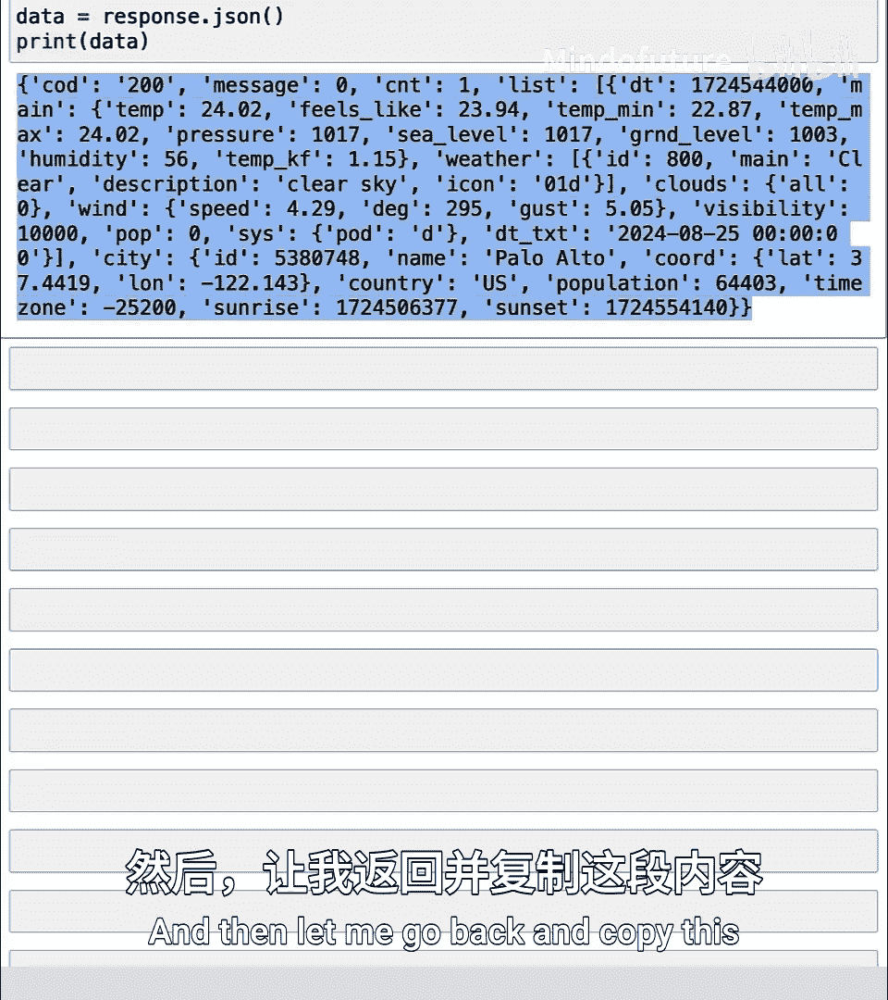
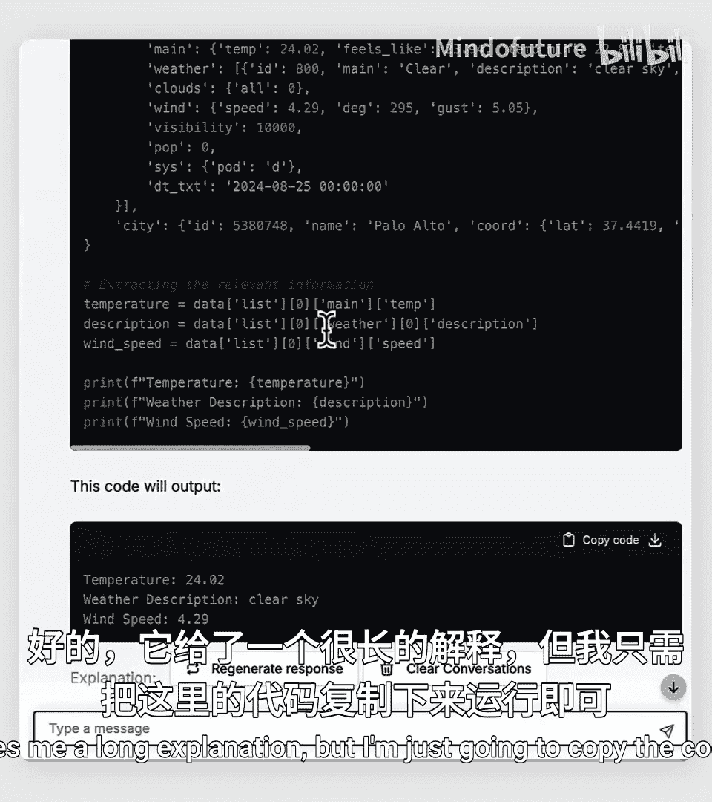
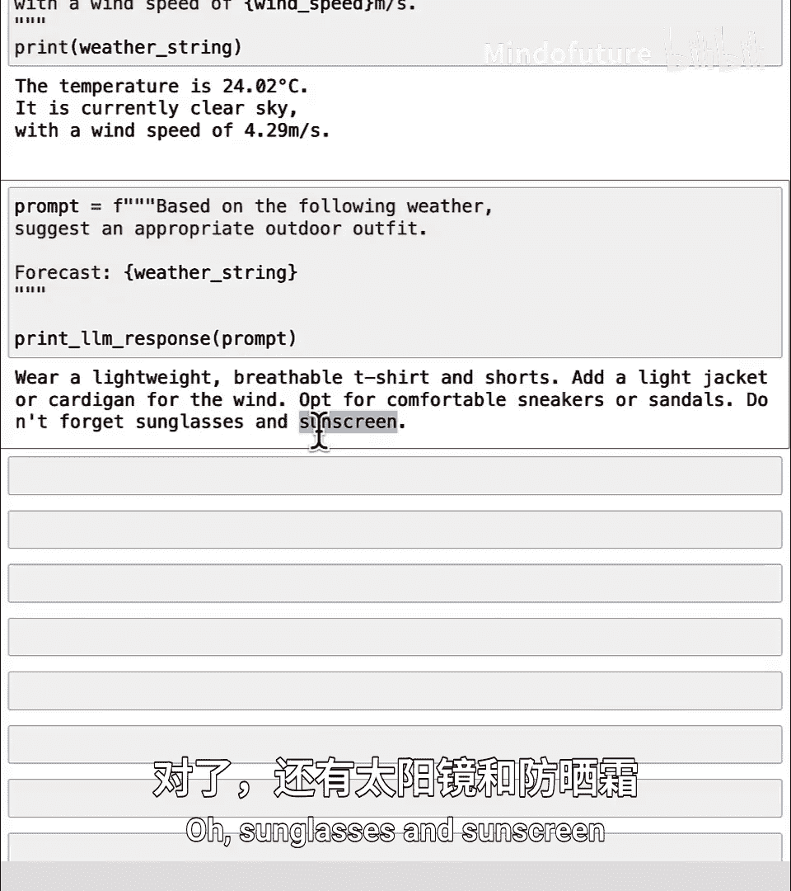

# 033：从网络获取数据的API 🌐

在本节课中，我们将学习如何使用API从互联网上获取实时数据。我们将通过一个获取天气数据来规划当日着装的趣味示例，来理解API的工作原理。

有时，你想编写代码解决的问题可能涉及实时数据。例如，使用天气数据来规划当天的着装，也许在你度假时。

为了访问诸如当前天气、股票价格、新闻，或者调用网络搜索引擎来查找相关网页等数据，你需要使用一种叫做API（应用程序编程接口）的东西。API为你的计算机提供了一种与另一台计算机对话的方式，让那台计算机为你做一些事情，例如获取一个城市的当前天气并返回给你的计算机。

互联网上有许多API，有些是免费的，许多可能需要付费，因为运行计算机和操作该API服务通常需要成本。但与下载一个软件包在你的计算机上运行不同，API允许你在获得许可的情况下，让别人的计算机为你工作，为你做一些事情。

让我们通过一个使用API获取实时天气数据来规划当日着装的趣味示例，来看看API是如何工作的。

## API的工作原理 🤖

API是一种让你的计算机能够请求另一台计算机获取数据或为你工作的方式。可以将其类比为：你坐在餐厅里，想要一些食物。你会与一位友好的服务员交谈，然后服务员会去厨房获取并递送你点的餐。服务员是你和厨房之间的中介，而API的作用就是作为你和提供数据或服务的其他计算机之间的中介。

## 获取天气数据示例 🌤️

让我们通过一个例子来具体操作。我将导入必要的包，并使用一个名为OpenWeatherMap的网站提供的API。我现在位于美国加利福尼亚州的帕洛阿尔托，此刻这里的天气是24摄氏度，相当不错。但与其使用网页界面查询天气，我将展示如何使用API让我的计算机自动从另一台计算机获取天气。

大多数API会要求一个叫做“密钥”或“API密钥”的东西。你可以将API密钥视为一个专属于你的密码。这样，处理你请求的计算机就知道请求来自谁。

以下是一段简单的代码，用于加载专属于我的API密钥。现在不必过于担心这段代码在做什么，稍后我会再详细说明。

```python
import os
import requests
from ai_se_functions import print_el_responses
import do_n  # 稍后会详细说明这个包
```

获取API密钥后，我将指定我所在位置的纬度和经度。然后，这里有一些代码来构建API的URL并获取数据。

```python
# 假设API密钥已安全加载到变量 `api_key` 中
latitude = 37.4419  # 帕洛阿尔托的纬度
longitude = -122.1430  # 帕洛阿尔托的经度

url = f"https://api.openweathermap.org/data/2.5/weather?lat={latitude}&lon={longitude}&appid={api_key}&units=metric"
response = requests.get(url)
data = response.json()
```

这段代码会向API URL发送请求，并将返回的JSON数据解析为Python字典。返回的数据是一个包含许多值的复杂字典，例如温度是24.02度，体感温度是23.98度，描述是“天空晴朗”，还有风速等信息。

## 提取关键信息 🔑

为了提取我可能想要的关键信息，比如温度、描述和风速，我可以直接请我的AI聊天机器人帮我编写代码。我会问它：“如何从这个`data`变量中获取温度、描述和风速？”



然后，我可以复制聊天机器人给出的代码并运行它。例如，它可能会提供类似以下的代码：



```python
temperature = data['main']['temp']
description = data['weather'][0]['description']
wind_speed = data['wind']['speed']
```

运行这段代码后，它会将温度提取到`temperature`变量中，描述提取到`description`变量中，风速提取到`wind_speed`变量中。如果你想生成一个漂亮的天气报告，我们可以提取这些数据并像这样打印出来：

```python
print(f"当前温度: {temperature}°C")
print(f"天气状况: {description}")
print(f"风速: {wind_speed} m/s")
```

当你运行这段代码时，可以自由查找你自己城市的纬度和经度并填入，以查询你自己城市的当前天气。

## 基于天气建议着装 👕

还有一个有趣的应用。我们可以说：“根据以下天气情况，建议合适的户外着装。”同样，如果你有特定的着装偏好，可以添加到提示词中，但为了保持通用性，可能会建议“轻便的T恤和短裤，太阳镜或防晒霜”。防晒霜实际上是个好主意。

这就是你如何通过互联网调用API，从其他计算机（如OpenWeatherMap的网络服务器）获取信息的方法。



## 关于API的更多说明 📚

对于不同类型的数据服务，会有不同的API。你可能需要在线查找文档，或者向AI聊天机器人寻求帮助，以弄清楚如何调用不同的API。AI聊天机器人更可能知道如何调用互联网上更流行的API。对于不太流行的API，你可能需要自己查看文档。

最后一点，对于许多API，你需要提供一个API密钥的值，这是一个由数字和字母组成的秘密字符串，它让网站知道是你在发出这个API请求调用。

我们已经设置好了这个Jupyter笔记本环境来使用这个API。但如果你真的想在你自己的计算机上这样做，你需要去相关网站注册账户并获取一个秘密的API密钥，然后将`API_KEY`变量设置为等于那个秘密字符串。

一种方法是写一行代码，如`API_KEY = ‘你的密钥’`，然后用实际的API密钥运行这行代码，再调用API，这样会奏效。但事实证明，尽管这可行，大多数程序员不会这样写代码，因为如果你把你的API密钥直接放在代码里，那么如果代码泄露给别人，其他人就会拥有你的秘密API密钥的访问权限。

因此，大多数程序员会使用`do_n`包。`do_n`函数经过几个额外的步骤来安全地加载和使用API密钥。如果你想了解这两行代码的作用，如果你感兴趣，可以询问AI聊天机器人如何更安全地存储API密钥。

## 总结 📝

本节课中，我们一起学习了如何获取实时数据（即天气数据）。实际上，还有许多API可以让你访问先进的人工智能模型。事实上，`print_el_responses`函数就是使用互联网上的一个API来访问OpenAI的ChatGPT大语言模型。在下一课中，我们将深入探讨`print_el_responses`函数实际的工作原理，以及你如何编写代码通过互联网访问先进的人工智能模型。

让我们在下一个视频中继续学习。