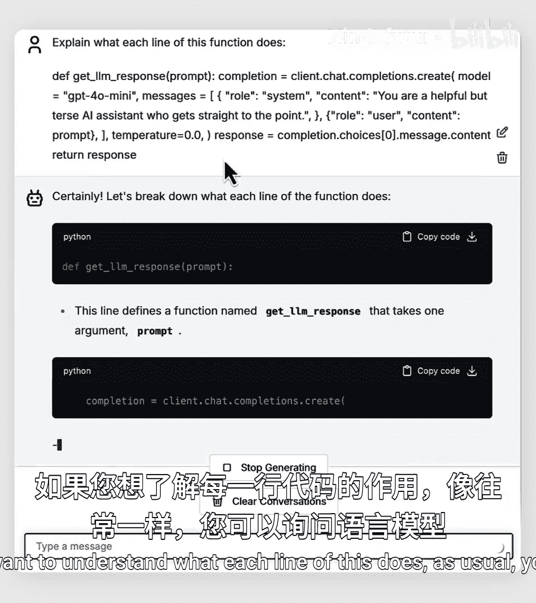
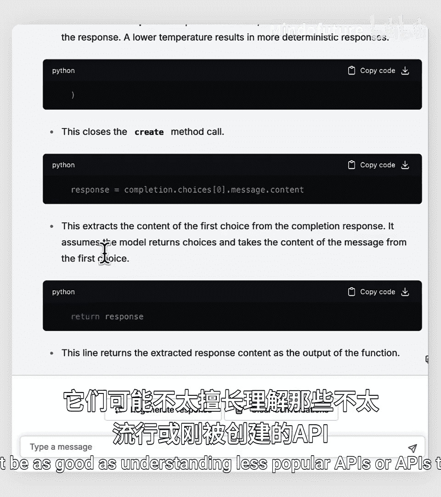
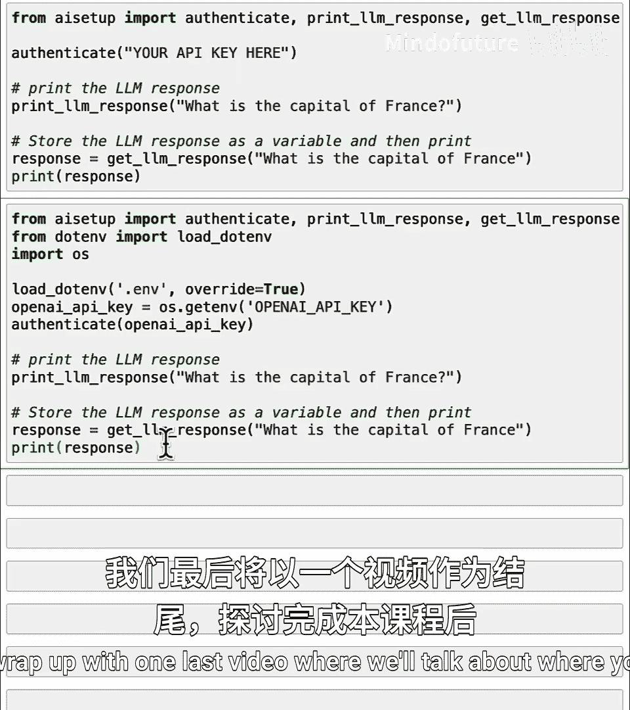

# 034：使用AI模型的API 🚀

在本节课中，我们将学习如何使用应用程序编程接口来访问在线AI模型，例如OpenAI的ChatGPT。你将了解`get_el_response`函数背后的工作原理，并学习如何配置AI模型的行为。

## 概述

上一节我们介绍了如何使用API获取实时天气数据。实际上，API的功能远不止获取数据，它还能帮助你访问各种在线AI工具，例如OpenAI的ChatGPT、Google的Gemini或Anthropic的Claude等。例如，你一直在使用的`get_el_response`函数，其背后调用的就是OpenAI的ChatGPT API。OpenAI的大型语言模型运行在互联网上的计算服务器中，你可以通过API向其提问并获得答案。本节中，我们将深入探究你在过去课程中一直使用的`get_el_response`函数的核心机制。

## 探索OpenAI API

以下是使用OpenAI API的基本方法。我已经安装了`openai`软件包。如果你的电脑上尚未安装，可能需要运行`pip install openai`命令。来自`openai`包的`openai`函数，正是驱动你一直在`helper_functions`或`ai_setup`包中使用的`get_el_response`函数的核心。

让我们来看看`get_el_response`函数具体做了什么。我知道下面的代码看起来很多，你不需要理解每一行，但我希望快速浏览一遍，让你对现代前沿API的使用方式有一个直观感受。

以下是`get_el_response`函数的核心代码结构：

```python
def get_el_response(prompt):
    client = openai.OpenAI(api_key=api_key)
    response = client.chat.completions.create(
        model="gpt-4o-mini",
        messages=[
            {"role": "system", "content": "You are a helpful AI assistant."},
            {"role": "user", "content": prompt}
        ],
        temperature=0
    )
    return response.choices[0].message.content
```

*   `client.chat.completions.create`是OpenAI提供的一个函数。
*   代码中的这一行选择了我们想要使用的大型语言模型，这里我们使用的是`gpt-4o-mini`模型。
*   当我们使用大型语言模型时，常做的一件事是告诉它如何回应，这被称为**系统消息**。我们告诉模型希望它扮演一个AI助手的角色。稍后我们将看到更改这个系统消息会发生什么。
*   然后我们指定**提示词**，它可以是一个问题，例如“法国的首都是什么？”。
*   大型语言模型有一个名为**温度**的参数，它控制着回应的随机性。在我的代码中，如果我不希望回应过于随机，通常将其设置为零，这是使用大型语言模型时可能的最低温度。
*   最上面这行代码从大型语言模型获取结果，我们有时称之为**补全**。
*   然后你提取回应的文本内容。
*   最后，返回回应的文本。

如果你不理解这段代码的每一行，请不要担心。我只是想让你了解一下，如果你要自己使用它，代码会是什么样子。你可以直接复制这段代码到自己的程序中运行。事实上，如果你访问OpenAI的网站，查看其API的在线文档，你很可能会找到看起来非常相似的代码示例。因此，你可以直接从OpenAI、Anthropic Claude、Google Gemini或其他你正在使用的服务的文档中获取代码示例，然后让它在你自己的代码中运行，而无需担心这里的每一行代码具体在做什么。




如果你想了解每一行代码的作用，像往常一样，你也可以询问一个语言模型，让它为你逐行解释。

需要注意的是，语言模型是通过阅读互联网上的文本进行学习的，因此它们更擅长理解那些更知名、在互联网上存在时间更长的API。对于不太流行的、或由他人在互联网上刚刚创建和发布的API，它们的理解可能就没那么好了。



## 配置与使用API

要使用OpenAI API，你需要从OpenAI网站获取一个秘密的API密钥。我将使用`load_dotenv`方法来安全地获取这个API密钥。以下这行代码你也可以从OpenAI文档中找到，用于初始化OpenAI服务或客户端。

运行初始化后，`get_el_response`函数就定义好了。现在，如果我发送提示词“法国的首都是什么？”，它就会生成回应。因为我在这里使用了我的API密钥，所以会向我的账户收取一小部分费用。

为了展示一些有趣的效果，如果你将系统消息改为“你是一个讽刺的AI助手”，让我重新定义它。现在运行，看看它会说什么。哦，这确实相当讽刺。是的，它回答了“巴黎”，但带着很多态度。这就是系统消息的作用，它告诉大型语言模型你希望它如何表现。

也许再展示一个有趣的现象，如果我将温度参数设置为一个更高的值，比如1.0（这是一个相当高的温度），这会使回应更加随机。每次我运行它，在这种情况下，都会得到一个不同的讽刺性回应。这个温度参数可以在0到2之间变化，它控制着你希望回应具有的随机程度。许多人使用大约0.7的值，这似乎是一个常见的选择，它会给你带来一点随机性，也许是一点创造性的表象，但又不会过于随机。

我鼓励你尝试这个参数，试试不同的温度值并多次运行，或者尝试不同的系统消息。也许尝试创建一个总是返回押韵诗句的AI系统，或者一个只说某种特定语言（如西班牙语或日语）的AI系统，看看你会得到什么结果。

## 在本地运行

最后，如果你想在自己的电脑上本地运行所有这些代码，我想分享一些关于如何将API密钥放入代码中的细节。

在通过`pip install ai_setup`安装`ai_setup`包之后，你可以从`ai_setup`导入一个名为`authenticate`的函数来打印`get_el_response`的回应。`authenticate`函数需要传入一个你可以从OpenAI网站获取的API密钥。这是一项付费服务，因此可能会要求你提供信用卡信息。其他大型语言模型提供商通常也会要求提供信用卡信息以获取访问其服务的API密钥。这样做之后，你的程序将使用你安全的API密钥向OpenAI的API服务进行身份验证，然后你就可以用它来生成大型语言模型的回应。

将API密钥直接存储在代码中并不是最安全的方式。一个更好、更推荐的方式如下：

```python
import os
from dotenv import load_dotenv
from ai_setup import authenticate

load_dotenv() # 从 .env 文件加载环境变量
api_key = os.getenv("OPENAI_API_KEY") # 安全地获取密钥
authenticate(api_key)
```

这三行新代码会将API密钥存储在一个名为`.env`的文件中。`load_dotenv()`会从该文件加载密钥，然后使用从`.env`文件中更安全加载的API密钥进行身份验证。你还需要导入`os`和`dotenv`库来运行这段代码。我现在不想深入探讨这些细节，但你可以询问AI语言模型，它能引导你完成所有步骤。如果你尝试时遇到任何错误信息，可以将错误信息复制粘贴到AI聊天机器人中，让它帮助你调试。

如果你是在自己的电脑上设置Python，而不是在DeepLearning.AI网站上通过互联网运行，那么你将使用这段代码。在本视频之后，有一个可选的阅读材料，它会向你展示如何在本地计算机上安装Python和Jupyter笔记本的几种选项。在Mac和Windows机器上操作可能略有不同，材料中列出了一些免费选项。如果你想安装这些并在自己的电脑上运行，可以完全选择性地阅读这个材料并进行安装。我个人很喜欢在我的笔记本电脑上运行Jupyter笔记本和Python，我认为你可能也会喜欢，因为即使没有网络连接（比如在飞机上），也能在自己的电脑上运行程序，这真的很酷。

无论你是否阅读那个材料，我们都将以一个总结视频结束，讨论在完成本课程后你接下来可以去哪里。

## 总结



本节课中，我们一起学习了如何使用API访问在线AI模型。我们剖析了`get_el_response`函数的核心代码，了解了如何通过**系统消息**指导AI的行为，以及如何使用**温度**参数控制回应的随机性。我们还介绍了在本地安全配置API密钥的方法。掌握这些知识，你就能开始探索和利用各种强大的AI模型来增强你的应用程序了。