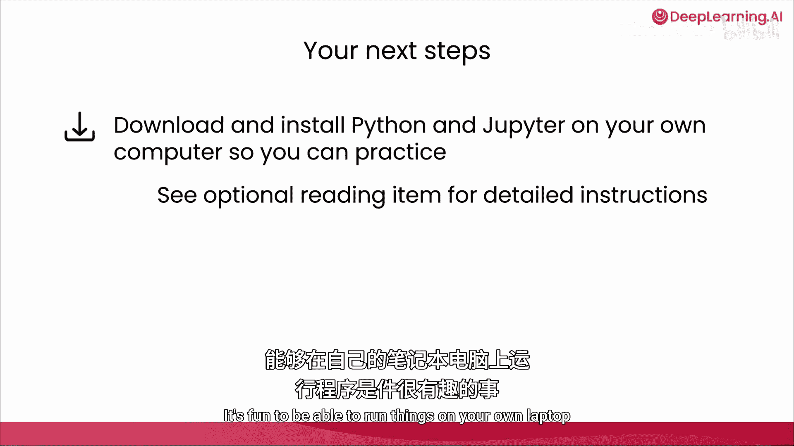
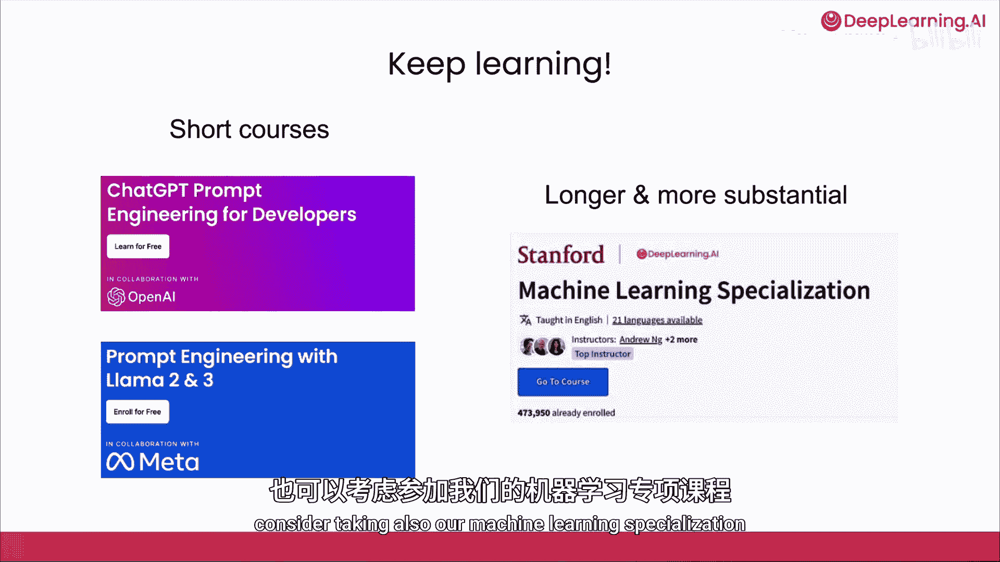
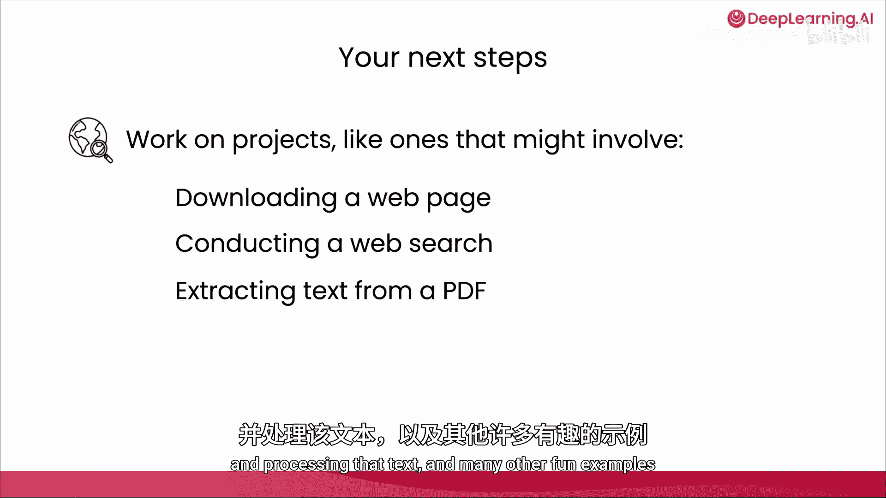

# 035：课程总结与后续步骤 🎉

在本节课中，我们将回顾整个课程的学习成果，并为你的后续学习与实践提供具体的建议。

恭喜你完成了这门课程，也完成了“AI Python for Beginners”系列的学习。在这四门课程中，你学到了很多知识。从Python的基础知识开始，例如**数据类型**、**函数**和**变量**，以及**for循环**和**if语句**等代码模式。你还学习了如何让Python读取计算机中的文件，从而能够处理你自己的文档和数据，或者使用AI来规划梦想假期。

在最后的这门课程中，你看到了如何通过使用其他程序员编写的**包**来扩展Python的能力。这些包让你可以下载和处理网页、生成大量数据、获取天气数据，甚至通过互联网调用大型语言模型。

现在，你可能想知道接下来可以做什么。有很多事情可以做。以下是一些你可以考虑的具体后续步骤。

## 后续学习建议 📚

以下是你可以考虑的几个方向。

*   **安装Jupyter**：如果你还没有这样做，可以考虑在你自己的计算机上安装Jupyter。在自己的笔记本电脑上运行代码会很有趣。
*   **继续学习课程**：我希望你能继续学习课程，不断进步。在DeepLearning.AI，你可以考虑几门短期课程，例如 **“ChatGPT Prompt Engineering for Developers”**，这门课程将教你如何以更复杂的方式提示ChatGPT；或者 **“Prompt Engineering with Llama2 and 3”**。如果你想学习更深入、更实质性的内容，也可以考虑参加我们的**机器学习专项课程**。

## 开启你的项目之旅 🚀

在你继续学习课程的同时，如果你对某个项目有想法，请大胆尝试。请务必负责任地运用你的技能，即以帮助他人的方式使用它们。我见过初学者从事的项目可能涉及下载网页并处理该页面，也许是为了总结它，或者收集与你的业务相关的见解；或者通过使用网络搜索引擎的API进行网络搜索；或者从PDF中提取文本并处理该文本，以及其他许多有趣的例子。

如果你还不知道如何做某件事，我鼓励你向AI聊天机器人寻求帮助，不一定是本网站上的那个，而是打开你的ChatGPT、Anthropic Claude、Google的Gemini或其他AI，向它们寻求帮助。也许还可以快速进行网络搜索，看看是否有任何相关的Python包或API可以使用。

许多人从做小项目开始，然后随着时间的推移逐渐发展到越来越大的项目。所以，不要觉得你的第一个项目必须是改变世界的庞然大物。如果你能做一些小而有趣的项目，那就很棒了。无论你的项目是否成功，你都可以吸取这些经验，并希望进行第二个稍大一点的项目，通过这个过程学习更多，依此类推。

## 总结与鼓励 ✨

时至今日，我仍然经常尝试编写代码，有时我做的事情就是行不通。这种情况会发生在每个人身上，这就是练习的过程。通过完成这门课程，你正在磨练你的技能。你是一名Python程序员。你才刚刚起步，但你现在已经是全球AI编码社区的一员了。我非常高兴你能加入我们，并且我乐观地认为，你会找到运用这些技能来改善你的日常生活和工作的方法。虽然我们共同的旅程暂时告一段落，这让我有点难过，但我也非常感谢你投入了所有的时间和精力来学习这些Python课程。

我希望很快能再次见到你，希望你能继续学习和实践，并用你的新技能做出美好的事情，帮助自己和他人。

---

本节课中我们一起回顾了整个课程的学习历程，从Python基础到扩展应用，并为你规划了安装工具、深入学习课程以及开启个人项目的后续路径。记住，编程是一个不断实践和探索的过程，勇敢地开始你的第一个项目吧。