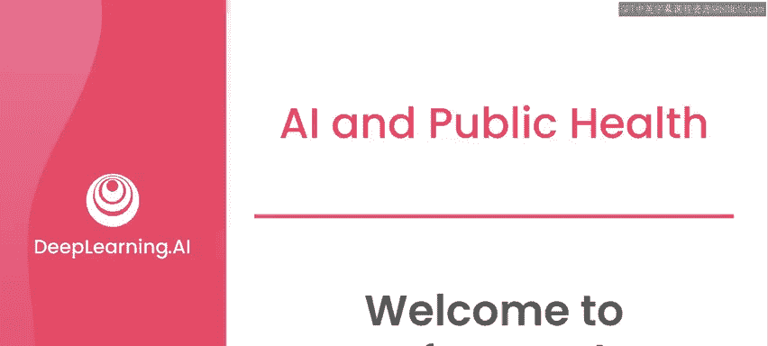
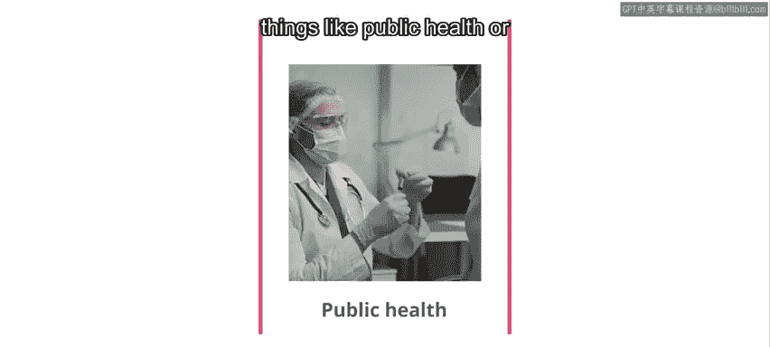
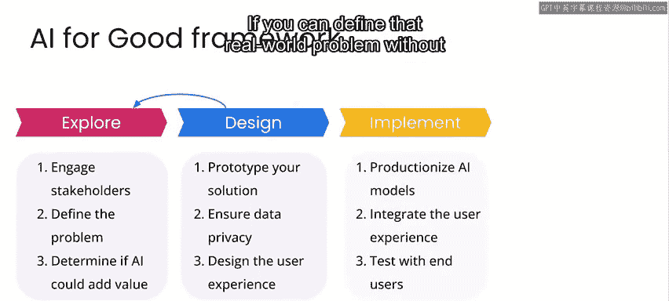
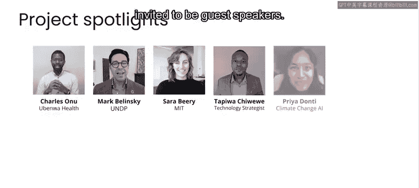

# 001：欢迎来到“AI for Good”专业课程 🎉

在本课程中，我们将介绍“AI for Good”专业课程的整体框架与目标。我们将探讨人工智能和机器学习如何成为应对公共卫生、气候变化和灾难管理等现实世界挑战的解决方案的一部分。本课程旨在提供实践经验，展示AI技术如何融入解决重大全球问题的更广泛背景中。

## 欢迎与课程介绍

欢迎来到“AI for Good”专业课程。如果你对人工智能和机器学习如何助力解决现实世界挑战感兴趣，例如公共卫生、气候变化或灾难管理，那么本专业课程将为你提供相关的知识与视角。

应对复杂的现实世界问题时，潜在的解决方案往往也非常复杂。这可能涉及许多不同的利益相关者、物流限制，有时还包括数据隐私等问题。因此，我们设计了这些课程，让你获得处理AI应用的实际操作经验，从而了解AI技术如何融入解决世界重大挑战的更广泛背景中。

## 认识你的导师

我很高兴向大家介绍本专业课程的导师——罗伯特·蒙纳克。他是构建机器学习系统以及如何将其融入人类工作流程方面的专家。他创立了自己的AI初创公司，并且曾在谷歌、亚马逊、微软、苹果等大型科技公司构建AI产品。罗伯特在将AI应用于全球灾难管理和公共卫生等关键领域方面拥有超过20年的经验。

他拥有斯坦福大学的博士学位，并且是《Human-in-the-Loop Machine Learning》一书的作者。

## 导师的跨领域经验

罗伯特，很高兴你能来教授这门专业课程。谢谢，安德鲁。我也非常兴奋能来到这里。我期待分享我在工业界和作为灾难响应者所积累的丰富经验，帮助大家思考AI可以（或在某些情况下不应该）如何用于帮助公共卫生、气候变化和灾难响应等领域。

你自称既是灾难响应者，又是AI/机器学习从业者。能分享一下你是如何在职业生涯中将这两者结合起来的吗？

当然可以。在搬到硅谷攻读博士学位之前，我曾在联合国于塞拉利昂和利比里亚从事冲突后发展工作，几乎有十年时间，我是将机器学习与灾难响应分开进行的。当时我在那里从事电力系统工作，负责在冲突后的环境发展中，为学校、诊所安装太阳能系统，并支持难民营。

在那段时间之后，我来到硅谷的斯坦福大学攻读博士学位，那是很多年前我们初次相遇的地方。我作为灾难响应者的经历让我印象深刻：在21世纪初相对较短的时间内，世界上大多数人都开始使用手机，但即使是当时我们认为理所当然的AI技术，如搜索引擎和语音识别，也无法在世界上大多数语言中正常工作。因此我认为，这不仅是在灾难响应中面临的问题，也是公共卫生和全球工业面临的一个有趣问题。世界正在联网，但为了接触和与人互动，许多支持的AI技术并不存在，对于许多语言来说，即使在近20年后的今天，情况依然如此。

在斯坦福大学期间，我继续并行从事灾难响应工作，同时研究自然语言处理，最终发现AI和灾难响应在某些领域存在重叠，从而能够将它们结合起来。

## AI在现实挑战中的应用与局限

随着手机和数据的普及，数据变得可用，既可用于企业产品业务场景，也可用于解决这些社会挑战。然而，有时即使发生灾难时手机存在，神经网络也未必是解决现实世界问题的方案。

确实如此。当然，推出新技术的时机有好有坏。通常在灾难发生后，是推出未经测试技术的最糟糕时机。因此，我认为这里存在一种协同效应：我们用来帮助灾后人民的许多技术，最好是在灾难发生前就进行构建，也许可以与行业合作伙伴一起准备，他们可以帮助我们进行路测并确保技术运行良好，以便我们在将其部署给全球一些风险最高的人群时，能够理解其行为。

## 课程核心：将AI融入项目

本专业课程最令人兴奋的一点是，在公共卫生、气候变化和灾难响应的背景下，它将逐步讲解如何将机器学习/AI融入更大的项目中。我认为这些工具和技术不仅对这些重大的社会挑战有用，对于在公司内构建产品也同样重要。

在许多情况下，我看到机器学习工程师会说：“哦，我在测试集上表现很好。”这当然很棒，恭喜你。但有时，从在测试集上表现良好，到为气候变化建模或解决具体的商业应用，这之间可能存在巨大的鸿沟。作为一名机器学习工程师，我认为我的部分工作就是帮助弥合这一鸿沟。本专业课程将深入探讨如何思考这个问题。

这是一种很好的思考方式。你可以拥有一个良好的机器学习模型，但这并不一定意味着仅仅因为其准确性提高，下游的用例也会随之改善。事实上，在本课程中，我坦率地从一个公共卫生案例开始：我们部署了一个帮助孕产妇健康的系统，可以看到离线准确率上升，但最终用户（医疗保健专业人员）并未感受到这种好处，最终我们终止了那个项目。

因此，正如你所说，我们从工业界学到的关于使机器学习对帮助人类完成任务变得重要的许多经验，与我们在关注公共卫生、灾难响应和其他更具体关注近期效益的项目中所看到的情况有很多共通之处。

## 课程的技术门槛与适用人群

需要明确的是，这是深度学习AI目前提供的最不技术化（也许是最不技术化）的核心课程之一。你不需要具备大量的编码知识，甚至不需要有意义的AI知识，就能成功完成本专业课程。但如果你了解机器学习算法，那将非常棒，你可以看到学习算法如何融入更大的项目中。当你运行我们完整提供的代码示例时（你不需要编写代码，即使你以前从未编写过代码，也可以运行提供的代码），你将看到机器学习部分如何融入解决这些非常重要的社会问题中。

正如我们在这里反复强调的，在最关键的情况下，你通常不希望机器学习方面进行过多的创新。因此，这里不过多深入技术层面与实践是相符的。我特别兴奋的是，我在灾难响应行业的许多同事可能也能学习这门课程。在灾难响应和公共卫生领域工作的人大多处理数据和电子表格，我认为这些笔记本对于一直使用电子表格的人来说，是思考如何进行更复杂的探索性数据分析，并开始在编码环境中评估机器学习模型的正确下一步。

## 解决问题的系统性框架

事实上，我很欣赏你在处理全新问题时提出的系统性框架。这个框架通常从数据可视化开始，即探索性数据分析，然后这可以引向一个深思熟虑的评估：是否应该为此使用机器学习？有时机器学习非常出色，有时则不太合适。

然后，构建模型、运行项目，但要将这些步骤放入处理复杂问题的系统性框架中。我非常喜欢我们在这里提出的框架，它也与我在工业界使用的框架相似。你首先思考要解决的实际问题是什么，并且最好能在不提及机器学习的情况下定义问题。然后查看数据，凭直觉判断机器学习是否有帮助，之后再开始坐下来实现模型。

## 特邀嘉宾与课程展望

我注意到很多人开始学习机器学习或AI时，会思考：“如果我能将其应用于气候变化或公共卫生等问题，那该多酷啊。”因此，我真正兴奋的事情之一是我们邀请了许多人作为特邀演讲嘉宾。这些人工作在公共卫生、野火监测等不同领域，他们将AI作为解决方案的一部分。这些人将毕生精力都投入于社会公益和AI应用，因此我非常高兴能在本课程中重点介绍他们。

因此，我认为我们许多人都曾有过这种愿望：利用AI让世界变得更美好，将AI用于善行。我很高兴你能加入本专业课程。在学习过程中，我希望你能学会如何构建AI项目，理解罗伯特和我讨论的流程，如何评估并使AI项目成功。希望在完成本专业课程后，你能受到启发，去使用这些算法，真正着手应对、影响并改变当今我们面临的一些最重要的社会问题。

那么，让我们开始进入专业课程的学习吧。请继续观看下一个视频。

## 总结

在本节课中，我们一起学习了“AI for Good”专业课程的引入部分。我们了解了课程的目标是探索AI如何应对公共卫生、气候变化和灾难管理等全球性挑战。我们认识了导师罗伯特·蒙纳克及其跨领域的宝贵经验。课程强调了将AI技术融入更广泛项目背景的重要性，而非仅仅关注模型本身的性能。我们还了解到本课程设计为非技术导向，适合广大初学者，并介绍了一个从定义问题、探索数据到评估是否使用机器学习的系统性框架。最后，课程承诺将通过特邀嘉宾的分享，展示AI在社会公益领域的真实应用，激励学习者利用所学知识为世界带来积极改变。