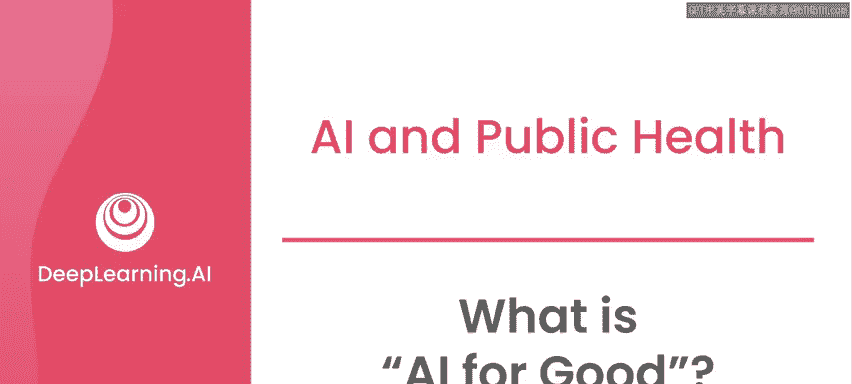
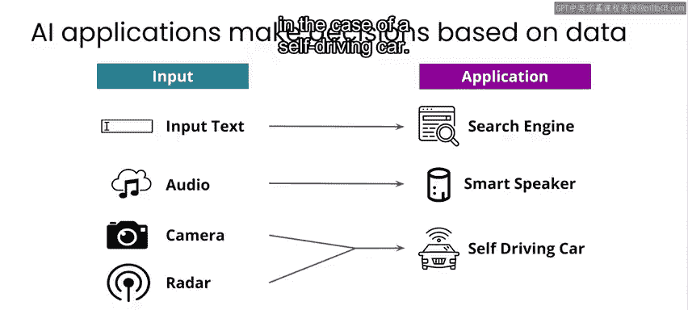
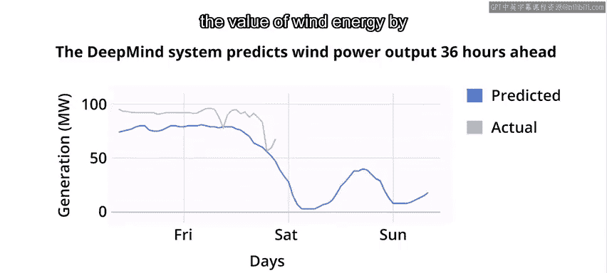
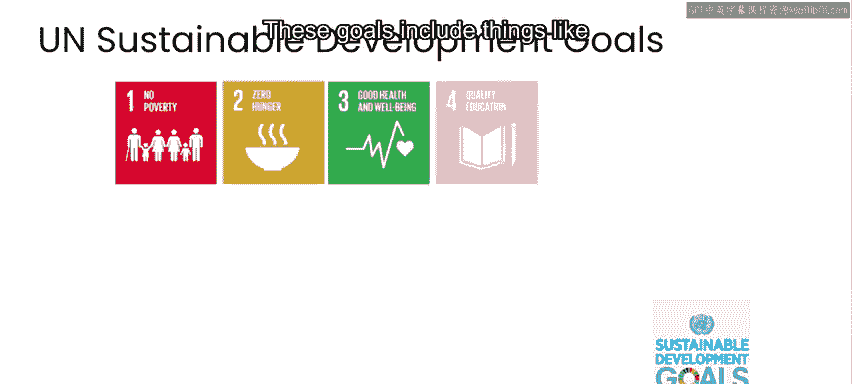
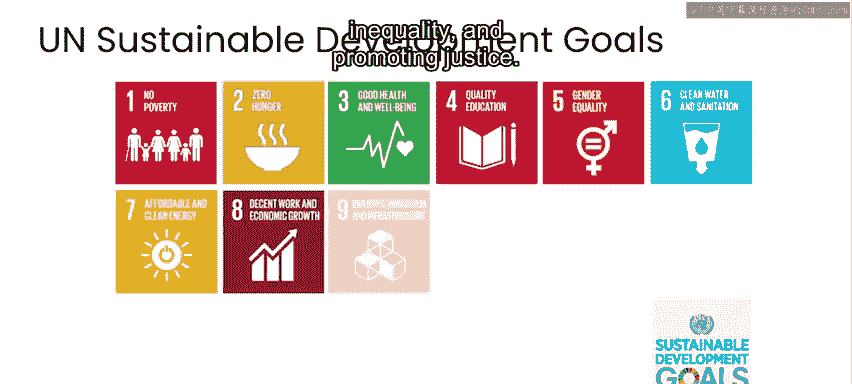

# 002：什么是“AI为善”？🤖

在本节课中，我们将要学习“AI为善”这一概念的核心含义。我们将探讨人工智能如何被应用于解决人类面临的重大挑战，并理解在追求积极目标时，为何必须谨慎评估其潜在影响。

---

这个专业课程名为“AI为善”。你可能会疑惑，我们如何区分“AI为善”与其他类型的AI应用。事实上，并不存在一个独立的“AI为善”领域。长久以来，当人们思考如何帮助改善医疗健康，或帮助人们应对和准备自然灾害与人道主义危机时，一直在探索可以利用哪些技术来实现这些目标。几个世纪以来，这包括了统计学；几十年来，这包括了更现代的数据分析和机器学习形式。因此，当我们说“AI为善”时，我们实际上谈论的是AI的应用，它可以适用于任何用例，但在本课程中，我们特意聚焦于利用AI应对当今环境和人类面临的一些最重大问题。

在我自己的工作中，我特别关注那些能为低资源语言提供更好支持的项目。所谓“低资源”，通常指那些在机器翻译应用或搜索引擎等应用中得不到充分支持的语言。你会发现，这些应用对英语和其他广泛使用的语言效果很好，但对使用人数较少的语言则不然。

当我们在当今社会背景下思考“AI为善”时，这个社会正日益依赖AI来完成越来越多的应用。例如，当你使用一个程序提供研究结果时，你正在使用AI；当你与智能设备对话时，你正在使用另一种AI；当你使用地图应用从一地导航到另一地时，你正在使用第三种AI。在这种情况下，算法会综合考虑从一个地方到另一个地方的历史旅行时间数据、道路封闭信息以及实时交通信息，以建议最佳路线。许多新型车辆现在配备了AI，可以检测你是否偏离车道或有碰撞风险，从而使驾驶更安全。

所有这些应用的共同点是，它们都使用**算法**来基于**数据**做出决策或推断。这些数据可以是输入文本（如搜索引擎的情况），可以是音频数据（如智能音箱的情况），也可以是多个数据源（如自动驾驶汽车中的摄像头、雷达和其他传感器）。

AI也被用于一些可能更具争议性的领域，例如自动人脸识别，或试图预测某人是否可能贷款违约或犯罪。有时很难区分AI是用于行善还是作恶。例如，在自然灾害后，我曾见过AI被用于监控人群，名义上是提供援助，但实际上却被用来识别异见人士。

关于“AI为善”，可以说并没有一个官方的定义，甚至理性的人们对其应如何定义也存在分歧。但在整个课程中，我们将重点关注那些最有可能支持环境、健康、正义和人道主义行动等领域取得进展的AI应用。在审视这些项目时，我们也将思考如何最大限度地减少尽管出于善意但仍可能造成的任何伤害。我们将重点介绍那些旨在预防、减轻或解决对人类生活或环境产生不利影响的问题的项目。

例如，在亚马逊雨林，非法采矿迫使当地社区流离失所，导致森林砍伐并影响动物栖息地。这些非法矿场由于其偏远位置常常能逃避检测。但现在，利用AI计算机视觉技术与卫星图像结合，可以识别非法采矿活动并通知地方当局。希望你立刻能看出，这虽然是积极的一步，但也存在非常消极的一面：许多选择偏远生活的社会群体，现在其自身也可能被监控。

再举一个例子，考虑风力发电。这是一种比化石燃料碳足迹低得多的可再生能源。问题之一在于，很难预测风何时吹来、风力有多强，以及风电场中的每个涡轮机将如何响应风和其他条件的变化。这使得很难规划在任何特定时间可用的风力发电量，从而更难有效地用风能替代化石燃料。

为了应对这一挑战，可以应用AI，利用天气预报和历史风力涡轮机数据，更准确地提前一两天预测风能可提供的能量。谷歌DeepMind的团队已经证明，使用这类方法能够将风能的价值提高约20%。在本专业的第二门课程中，你将有机会亲自尝试预测风力发电。

在这三门课程中，你将看到各种不同的案例研究，就像我们已经提到的那些，并应用一个框架来思考设计和开发针对特定问题的解决方案所需的组成部分，以及AI作为该解决方案的一部分，是否以及如何增加价值。

当今人类面临着许多紧迫问题，世界各地的各种团体都在努力解决这些问题。在这些课程中，我们只会研究少数几个案例。但如果你有兴趣思考还有哪些类型的问题值得研究，那么联合国可持续发展目标是一个非常好的参考来源。

这些目标包括减少贫困和饥饿、应对气候变化、减少不平等和促进正义等。联合国于2015年启动了这些目标，作为讨论未来15年目标的共同框架。需要明确的是，联合国的目标本身并非没有争议，并非所有人都100%同意它们。但它们通常作为不同各方讨论目标、共同致力于更美好未来的有用共同框架。考虑到这一点，你可以看到，你可能试图解决的问题涵盖了广泛的主题和考量，从气候变化到小额信贷等方方面面。

在整个课程中，我将强调，即使在最善意的驱使下，你也必须谨慎考虑AI可能产生的影响。很多时候，造成的伤害可能大于益处。我建议你采用类似于世界各地许多医生所遵循的原则，即“不伤害”原则。在学术AI领域，一个项目通常根据其对某个问题或场景的净改善来评估。但“不伤害”原则更严格地意味着，受项目影响的每个人都应变得更好，或至少不受伤害。因此，你应该问自己：这个项目是否会对项目中即使是一小部分人产生负面影响，而这些人原本不会受到伤害？我们将在整个课程中反复审视“不伤害”原则。

---

本节课中，我们一起学习了“AI为善”的基本概念。我们了解到，“AI为善”并非一个独立的技术领域，而是指将人工智能技术有意地应用于解决环境、健康、正义等重大社会挑战。我们通过案例看到了AI在监测非法采矿、预测风能等领域的积极应用，同时也认识到必须警惕其潜在的负面影响，并应始终秉持“不伤害”的伦理原则。在接下来的课程中，我们将深入更多具体案例，学习如何系统地设计和评估“为善”的AI解决方案。