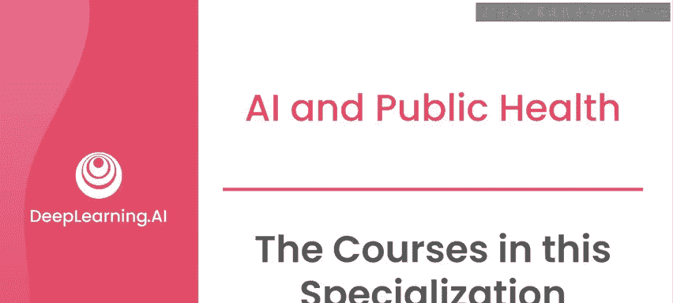
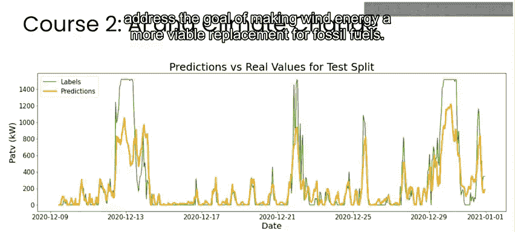

# 003：吴恩达《AI for Good专业课程》P3 🎯

在本节课中，我们将了解《AI for Good专业课程》的整体结构与核心内容。该系列课程包含三门课，分别聚焦于人工智能在公共卫生、气候变化与灾难管理三大关键领域的应用。我们将逐一探索这些课程如何通过具体案例和实践活动，展示AI技术如何为解决全球性挑战提供创新方案。

---

## 第一门课程：AI与公共卫生 🌡️

第一门课程旨在帮助你熟悉人工智能的基本概念，并了解其如何用于解决现实世界中的问题。

我将向你介绍一个用于构思“AI向善”项目的框架。实际上，这是一个适用于任何你感兴趣的、可能涉及AI的项目的通用思考框架。

首先，通过一个专注于我在尼日利亚母婴健康领域工作的案例研究，你将快速概览“AI向善”框架。你将理解AI如何帮助医疗保健提供者处理来自患者的大量文本信息。

接下来，在本课程中，你将深入一个专注于使用传感器数据监测空气污染水平的项目。空气质量监测传感器已部署在世界各地的城市，其目标是告知市民空气污染带来的公共卫生风险，并为制定改善空气质量的政策提供信息。

在本课程第二周和第三周的实验活动中，你将使用AI来改进哥伦比亚波哥大的实时空气质量估算。

---

## 第二门课程：AI与气候变化 🌍

本专业课程的第二门课程聚焦于AI与气候变化。

从化石燃料转向可再生能源有助于减少全球碳排放。而加速风能、太阳能等可再生能源采用的一种方法，是提高这些能源的可预测性。

在课程二的第一个案例研究中，你将使用AI进行风能预测，从而实现让风能成为化石燃料更可行替代品的目标。

随后，你将转向气候变化背景下的生物多样性监测。保护自然生态系统已被确定为缓解气候变化最有效的方法之一，而生物多样性可以被视为自然生态系统健康状况的衡量标准。

世界各地的团队正在使用各种技术来监测生物多样性。在实验活动中，你将使用计算机视觉技术，通过来自南非的相机陷阱数据来监测生物多样性。

---

## 第三门课程：AI与灾难管理 🚨

在第三门课程中，你将探索我个人的专业领域：灾难管理与响应。你将使用卫星图像评估美国飓风“哈维”过后的损害情况。

事实上，在2012年飓风“桑迪”过后，我曾部署过一个类似的系统，我们也会讨论这一点。

在课程三的第二个案例研究中，你将学习如何通过自动解读2010年海地地震后收集的文本信息来进行资源分配管理。地震后，人们需要帮助，并将短信作为主要的通信方式。大部分信息是海地克里奥尔语，许多救援人员并不懂这门语言。

我将向你展示我如何组织一个团队，将AI与人类志愿者相结合，创建一个自动翻译系统，帮助救援人员快速反应并提供援助。

---

## 项目聚焦与学习建议 🔍

在整个系列课程中，我们将推出一系列“项目聚焦”，你将有机会听取不同专家关于他们如何将AI应用于特定项目的分享。

下一个视频将是你的第一个“项目聚焦”，你将听到来自Ubenwa Health的Charles Onu的分享，了解他和他的团队如何通过一款手机应用程序，分析婴儿哭声中的疾病征兆，从而实现对新生儿重大健康问题的诊断。

请记住，对于这个以及其他“项目聚焦”视频，你可能会听到一些不理解的技术术语，但无需担心。这些视频的目标是让你对“AI向善”领域一些有趣的项目有一个高层次的了解，并且在整个课程学习中，你会逐渐熟悉这些术语。

---

## 总结 📝

本节课中，我们一起学习了《AI for Good专业课程》的三门核心课程：AI在公共卫生、气候变化和灾难管理中的应用。每门课程都通过真实的案例研究和动手实验，展示了AI技术如何为解决紧迫的全球性问题提供实际方案。从监测空气质量到预测风能，从保护生物多样性到灾后快速响应，本系列课程旨在为你提供一个坚实的框架和实践经验，让你能够思考并参与利用AI创造积极社会影响的项目。