# 004：利用AI识别婴儿哭声中的窒息风险 👶

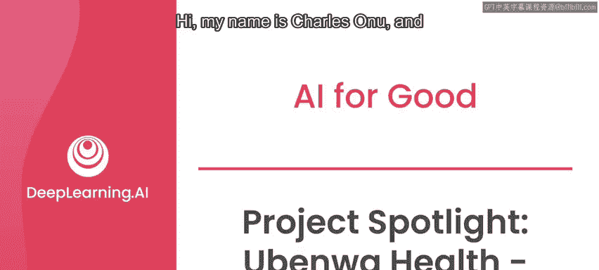

在本节课中，我们将学习如何利用人工智能技术，特别是深度学习模型，通过分析婴儿的哭声来早期识别新生儿窒息这一严重健康问题。我们将了解该问题的背景、现有解决方案的局限性，以及AI如何提供一种快速、低成本且无创的检测方法。

大家好，我是查尔斯·奥努，我是Tubanno Health的创始人兼人工智能负责人。

Uwa的使命是创造一个世界，让每个婴儿无论出生在何处，都能获得快速的医疗诊断。

我们着手解决的第一个问题是新生儿窒息。

这是导致婴儿猝死和残疾的主要原因之一。

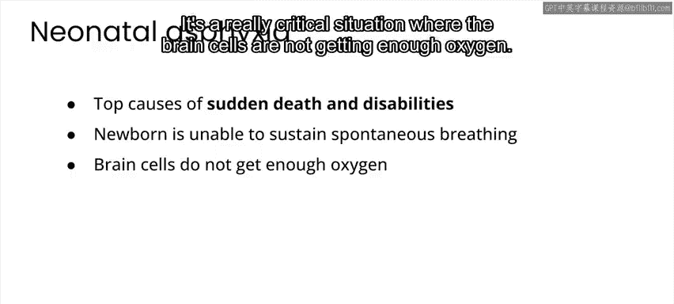

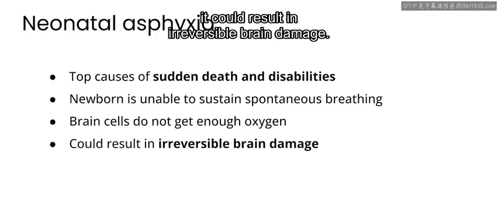

窒息基本上发生在新生儿无法维持自主呼吸时，这可能是由多种潜在原因造成的。

实际情况是，这是一种非常危急的状况，大脑细胞无法获得足够的氧气。如果这种情况持续较长时间，就可能导致不可逆的脑损伤。

目前，对窒息的医学诊断需要昂贵的设备、专业人员，通常涉及血液分析和神经学检查。

在发展中国家，常规进行此类测试对医疗中心来说是一个很大的限制。

另一方面，即使在发达国家，如果婴儿在资源充足的医院之外（例如在家中）发生窒息，也可能致命。

因此，由于这些原因，全球每年因新生儿窒息导致的伤亡数字相当高：超过100万婴儿死亡，另有120万婴儿出现听力丧失、瘫痪、学习困难等后遗症。

我本人在尼日利亚的家乡与非政府组织合作时首次接触到窒息病例，可以说情况很糟糕。这促使我开始研究关于哭声产生的生理学、声音与大脑的联系，以及像窒息这样的状况如何有效改变婴儿哭声模式的临床数据。

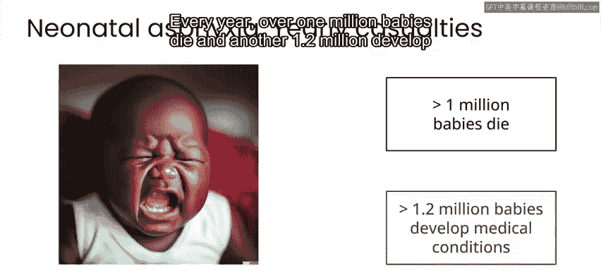

因此，今天我在Tubannoa的团队专注于通过关注婴儿哭声所携带的信息，来帮助新生儿存活并健康成长。

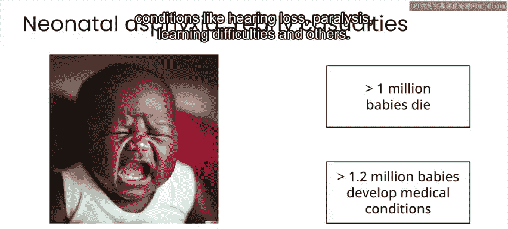

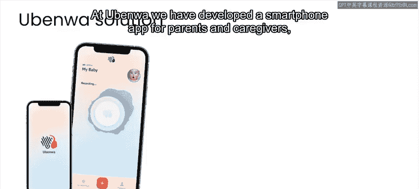

那么，我们的解决方案具体是什么？我们开发了一款智能手机应用程序，供父母和护理人员使用，通过简单的婴儿哭声录音，快速识别或检测神经异常的早期迹象。

其理念是，婴儿可以被早期识别，从而得到及时治疗。

与目前的筛查方法相比，这款应用程序至少提供了三个关键优势：第一，它快速，便于早期检测；第二，它具有成本效益，意味着全球可及性，无论经济状况如何，更多人都可以使用；第三，它是无创的，因此不会对患者造成伤害，并且可以根据需要重复测试。

在开发Uno的过程中，人工智能和机器学习发挥了非常重要的作用。这是因为新生儿窒息引起的哭声特征变化非常复杂。

因此，尽管我们知道一些特征，比如基频的高音调，但还有其他许多特征，通过手工工程提取并非易事，但对于开发一个准确的系统却很重要。

机器学习和特别是深度学习让我们能够做到的，是构建一个神经网络，自动从哭声录音中学习这些特征，然后在数学上找出应如何组合它们来进行分类。

在实践中，这通常涉及在输入音频信号的频谱图表示上训练一个卷积神经网络（CNN）。

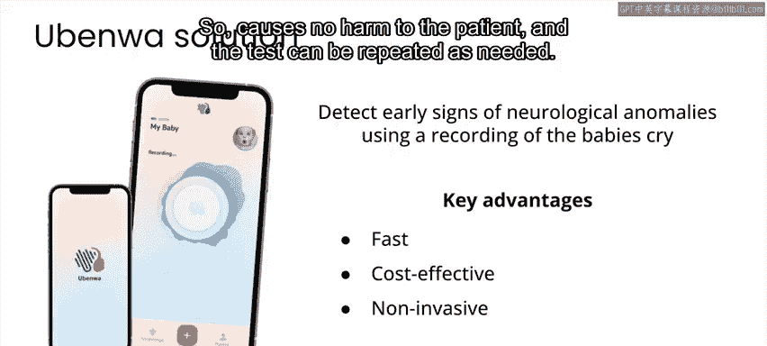

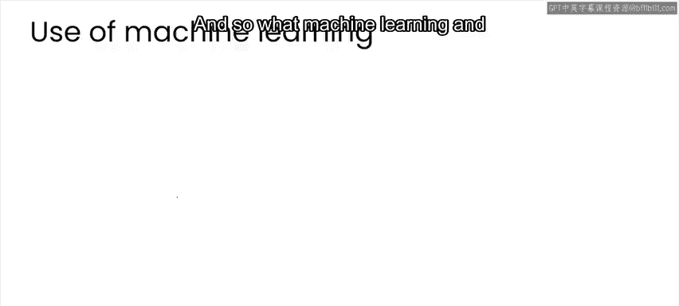

用于训练CNN的数据可能是这个设置中最重要的组成部分。它必须庞大且多样化，因为哭声模式因人而异，我们希望学习真正具有普遍性的特征。同时，数据必须有强标注，否则生成的模型可能不具备临床效用。

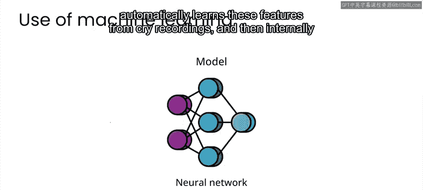

为此，我们与巴西、加拿大和尼日利亚三个国家不同医院的新生儿学家合作。与他们一起，我们现在建立了最大的临床标注婴儿哭声数据库，该数据库在机器学习和模型的开发和训练中发挥了至关重要的作用。

您已经了解了我们开发Ubeno的原因。Ubeno实际上是我母语中的一个表达，意思是“婴儿的哭声”。

我们不仅仅是在开发一个单一的移动应用程序，实际上是一个灵活的软件平台，可以部署到一系列设备上，真正将婴儿的哭声作为一种生命体征来利用。

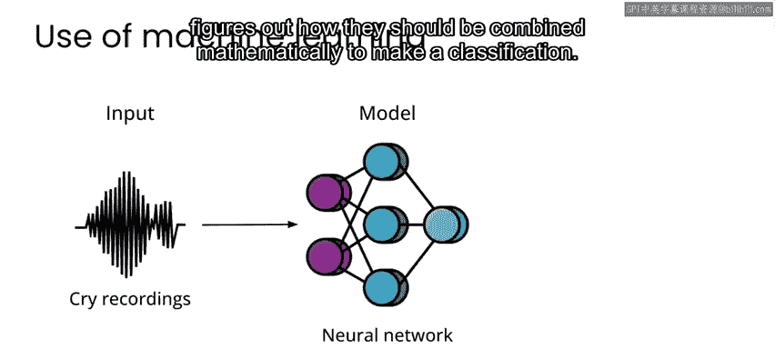

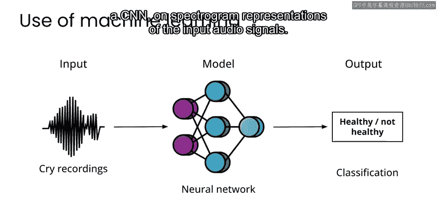

我们希望在不远的将来，能够拯救并改善全世界数百万婴儿的生命。

---

**本节课总结**

本节课中，我们一起学习了查尔斯·奥努及其团队如何利用AI应对新生儿窒息这一重大公共卫生挑战。我们了解到：

1.  **问题背景**：新生儿窒息是导致婴儿死亡和残疾的主要原因，传统诊断方法昂贵且难以普及。
2.  **AI解决方案**：通过开发智能手机应用，利用婴儿哭声录音进行早期、快速、低成本且无创的筛查。
3.  **技术核心**：使用**卷积神经网络（CNN）** 分析哭声的**频谱图**，自动学习复杂的特征模式以识别窒息迹象。
4.  **数据关键性**：成功依赖于大规模、多样化且经过临床强标注的婴儿哭声数据库。
5.  **愿景**：旨在创建一个灵活的平台，将婴儿哭声作为关键生命体征进行监测，以期在全球范围内挽救生命。

这项技术展示了AI在医疗诊断，特别是资源有限场景下的巨大潜力和人道主义价值。