# 005：4_快速概括什么是人工智能 🤖

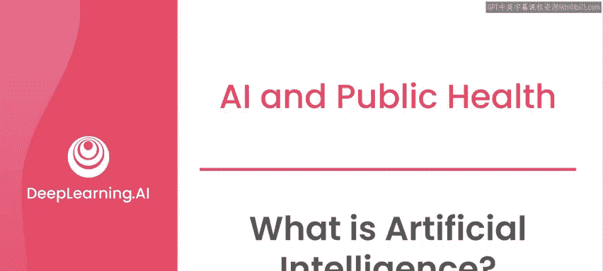

在本节课中，我们将要学习人工智能的基本概念，了解它能做什么、不能做什么，并熟悉一些常见的术语。这将帮助我们为后续课程中探讨AI在公共卫生、气候变化等领域的应用打下基础。

到目前为止，我们已经多次提及“向善的人工智能”这一短语，并开始将其与其他用途的人工智能进行区分定义。但为了确保我们理解一致，现在需要退一步，先聚焦于人工智能本身。

## 什么是人工智能？ 🧠

首先，当前的人工智能指的是**一种基于数据模式进行决策的、相对简单的智能形式**。

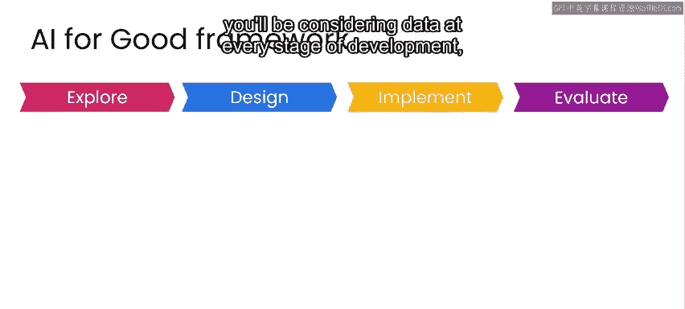

为了全面了解人工智能及其对组织的影响，我推荐你学习DeepLearning.AI的《AI for Everyone》课程。该课程为你在本系列课程中将遇到的许多概念提供了很好的基础。

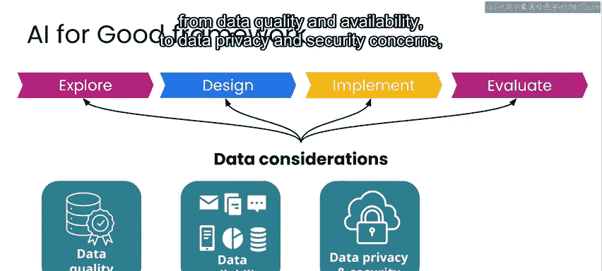

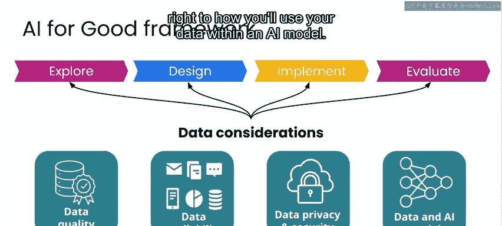

在我们即将应用于案例研究的框架中，你需要在开发的每个阶段都考虑数据——从数据质量和可用性，到数据隐私和安全问题，再到如何在AI模型中使用数据。虽然并非每个问题都需要AI作为解决方案的一部分，但如果你打算使用AI，那么几乎肯定需要**大量优质的数据**。

## 机器学习：人工智能的一个子领域 📊

就我们的目的而言，你可以将AI视为**应用一套规则或其他机制，以基于数据做出推断**。

你在新闻中听到或日常使用手机、互联网应用时遇到的许多应用，都属于**机器学习**的例子。机器学习是AI的一个子领域，其中的算法是**学习识别数据中的模式**，而不是根据一套固定的标准被明确编程来做出决策。

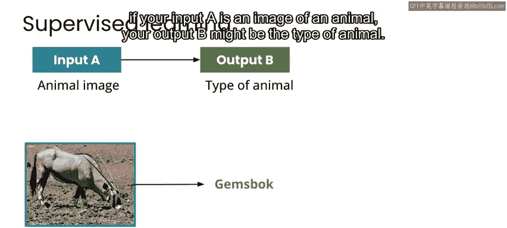

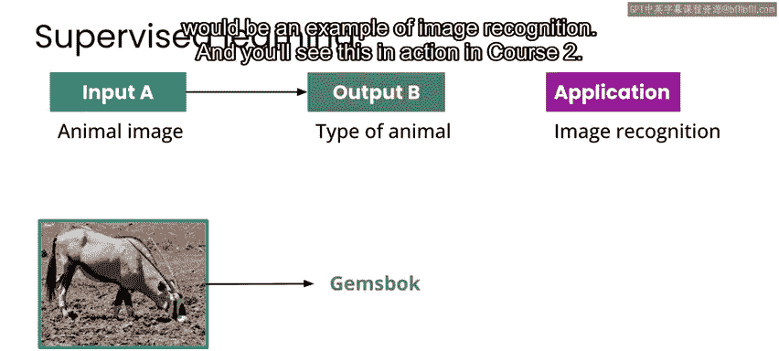

最常应用的机器学习算法是所谓的**监督式机器学习算法**，其目标是将某个输入（此处称为 **A** ）映射到某个输出（此处称为 **B** ）。

为了更具体地说明，如果你的输入 **A** 是一张动物的图片，你的输出 **B** 可能是动物的种类。像这样识别图像内容的应用程序就是**图像识别**的一个例子，你将在课程2中看到它的实际应用。

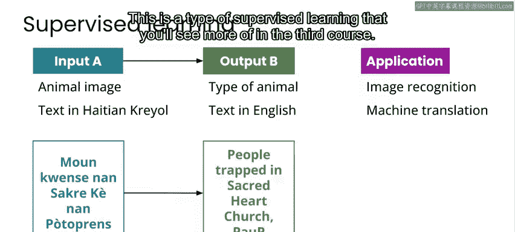

## 监督式机器学习的更多例子 🌐

监督式机器学习的另一个例子是将文本从一种语言翻译成另一种语言，比如在这个例子中，从海地克里奥尔语翻译成英语作为输出。当然，这可以在任何两种或更多语言之间进行，这就是所谓的**机器翻译**。这是你将在第三门课程中看到更多的一种监督式学习。

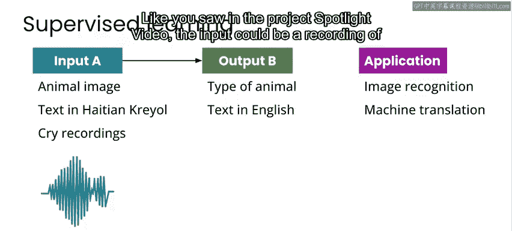

就像你在项目聚焦视频中看到的那样，输入可以是婴儿哭声的录音，输出可以是医疗诊断。因此，这实际上是一个可以被认为与**语音识别**非常相似的例子，与你对着智能手机或智能设备说话、让它为你提供餐厅推荐或天气预报时运行的应用程序是同一类型。

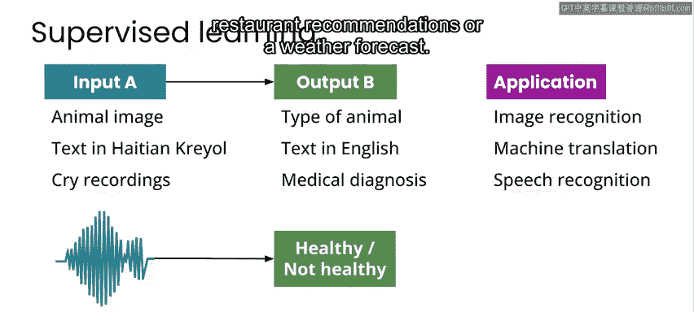

在本课程关于可再生能源的案例研究中，你将看到将预测风速和涡轮机传感器测量值作为输入 **A**，映射到风力涡轮机产生的能量作为输出 **B**。这是**基于历史数据进行预测**的一个例子。

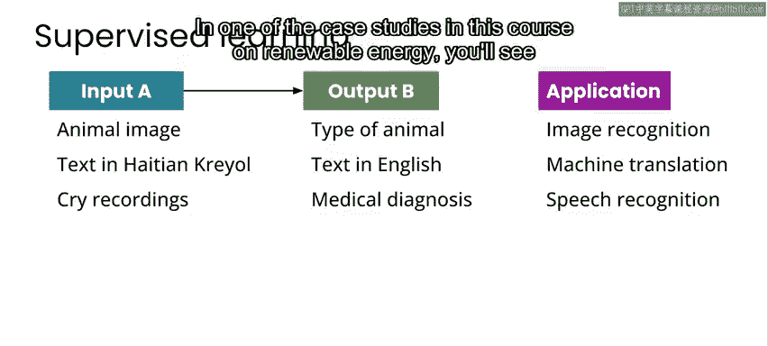

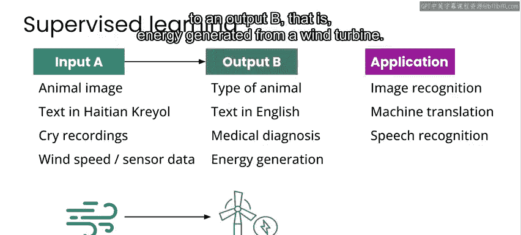

虽然这些看起来可能是截然不同的应用（它们确实是），但它们也都是应用程序使用**输入A到输出B的映射**的例子。这意味着它们都是**监督式机器学习**的潜在用例。

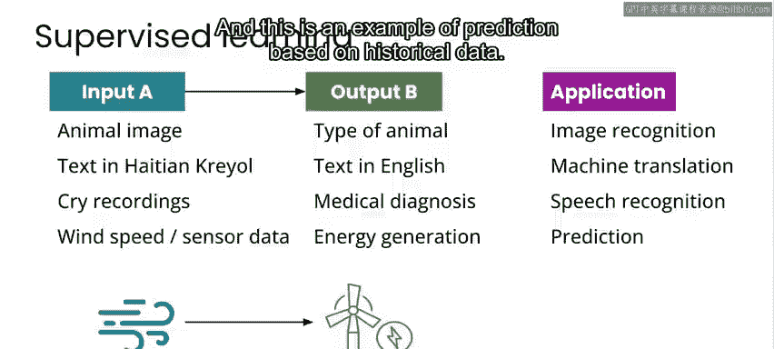

## 深度学习与人工智能的能力边界 ⚙️

除了人工智能和机器学习，在算法学习识别数据模式方面，你可能还听说过**深度学习**这个短语。深度学习指的是一种特殊的机器学习算法，称为**神经网络**。因此，从某种意义上说，深度学习是机器学习和AI的一个子领域。

在这三门课程中，你将看到许多使用监督式机器学习的例子。总的来说，这些例子说明了AI可以比人类更好地完成某项工作，或者可以改进人类单独执行的任务。

然而，重要的是要记住，这并不意味着AI代表了某种更优越的智能形式。恰恰相反，AI擅长重复性任务，例如为特定问题分析数千行数据，或者能够快速参考大量信息以进行搜索、文本生成或其他类型的统计推断。

举一个具体的例子，一个智能音箱或手机可能能够理解超过10种不同的语言，比任何人都多，但它也可能无法像另一个人那样好地理解其中任何一种语言的语音。

或者再举一个例子，一个AI算法可能能够根据症状描述提供关于数千种疾病的医疗信息，但无法提供人类医学专家在其专业领域内的深度分析和诊断。

是的，算法在某些任务上表现得几乎令人惊叹，但同样重要的是要记住，在大多数情况下，关键不在于算法本身。**任何AI应用程序的好坏，都取决于用于开发模型的数据以及运行该模型的代码背后的人**。

## 总结与预告 📝

本节课中，我们一起学习了人工智能的基本定义，了解了其核心子领域——机器学习（特别是监督式学习）的工作原理，并通过多个实例（如图像识别、机器翻译、语音识别和预测）加深了理解。我们还探讨了深度学习与AI的关系，并明确了AI当前的能力边界和局限性，强调了数据和人类在AI系统中的关键作用。

我们尚未讨论的是机器学习算法如何从数据中学习，而这正是我们接下来要做的。在下一个视频中，你将看到监督式学习如何工作的例子。请与我一起观看下一个视频。