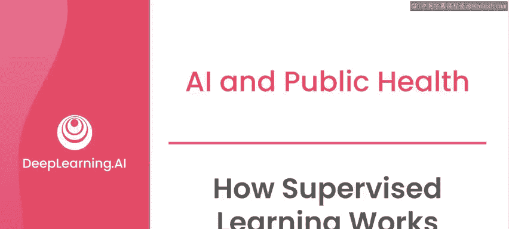
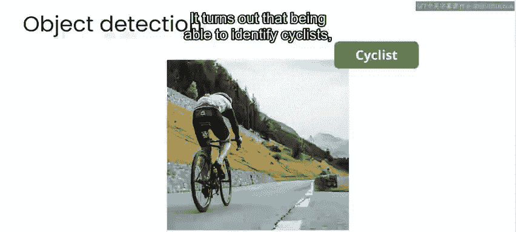
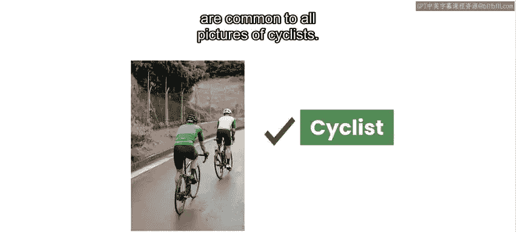
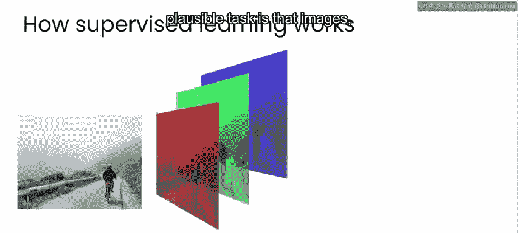
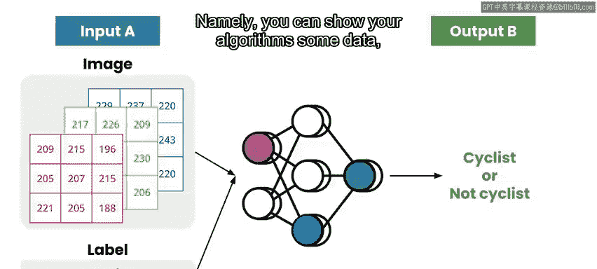
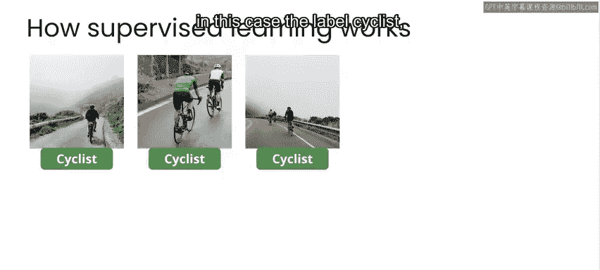
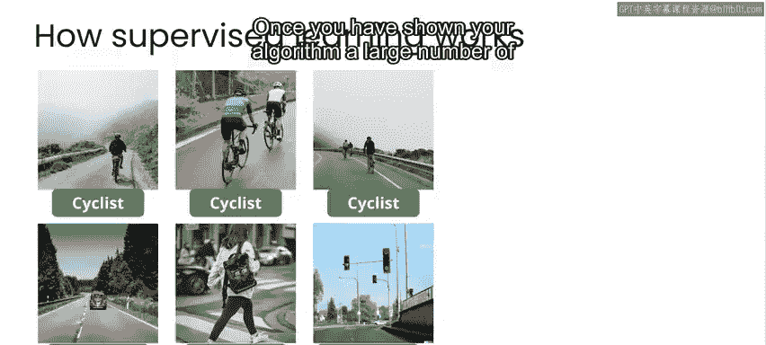
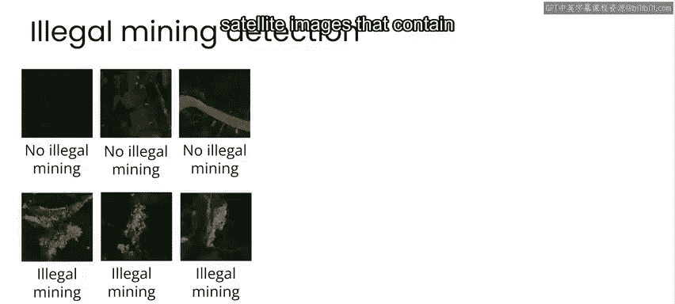
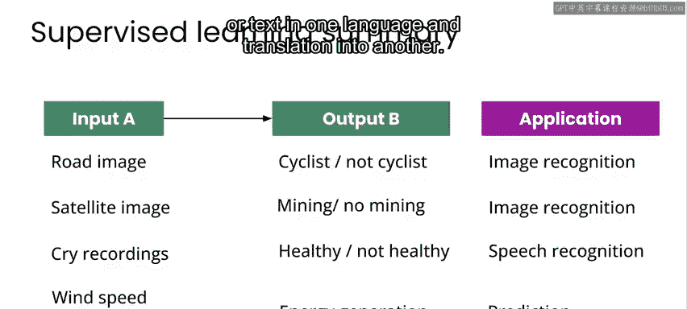

# 006：快速概括监督学习的工作原理 🚴

在本节课中，我们将通过一个图像识别的例子，来快速概括监督学习的基本工作原理。我们将了解算法如何从数据中学习，并探讨其在公共卫生、气候变化等领域的应用潜力。

---

为了更好地理解算法如何从数据中学习，我们来看一个识别图像内容的例子。

例如，当你看到这张图片时，能立刻认出这是一位骑自行车的人在路上。对于自动驾驶汽车而言，识别骑行者、行人以及道路标记是一个重要问题。那么，如何让算法做到这一点呢？

需要说明的是，人类学习的方式与机器学习的方式有很大不同，但在定性层面存在一些相似之处。这些相似之处有助于我们更直观地理解其工作原理。

你之所以能学会识别此类图像中的骑行者，很可能是因为你从小就在路上见过骑行者，或者你小时候骑过自行车，或在电视上看过自行车比赛。无论如何，你最终达到了能轻松识别图像中骑行者的水平，即使你从未见过这张图片、这位骑行者或这条道路。这是因为你掌握了所有骑行者图片共有的特征。

假设你想训练一个机器学习算法来识别图像中的骑行者。使这项任务成为可能的关键在于，图像（尤其是数字图像）本质上也是一种数据，它以大量数字集合的形式存在，这些数字代表了每个像素中每种颜色的数值。

你可以将这个数字集合连同标签“骑行者”一起输入给机器学习算法。算法会在构成图像的数字中寻找规律。

这个概念是监督机器学习的核心，即：你可以向算法展示一些数据，并同时提供一个标签（在本例中是“骑行者”）。

接着，你向算法展示其他不包含骑行者的图像，并用“非骑行者”的标签来标注它们。

一旦你向算法展示了大量“骑行者”和“非骑行者”的示例，算法将开始能够根据其在已标注示例中观察到的规律，识别出它从未见过的图像中的骑行者。

上一节我们介绍了算法如何学习识别单一类别。实际上，你可以训练算法识别更多对象。

例如，如果你致力于自动驾驶汽车，可以训练算法识别行人、路标、车道标记和其他车辆。

同样，你可以向算法展示数千张包含非法采矿活动证据的卫星图像示例，并训练它自动在未见过的图像中识别此类活动。

监督学习的原理不仅限于图像，它可以应用于各种类型的数据。

考虑另一种数据：音频录音。这正是Charles Uno在其视频中描述Bennoir Health的工作时所提到的。他们收集了来自世界不同地区的数千段婴儿哭声录音，并将其标记为“健康”或“不健康”。利用这个带标签的数据集，他们创建了一个应用程序，允许世界任何地方的父母或看护人简单地录制婴儿的哭声，并将其作为判断婴儿健康状况的一个证据。

这里的要点是，你可以拥有任何类型的数据集，其中每个示例输入A都与一个适当的输出B相关联。

这些输入和输出可以是：
*   **输入**：一张图片，**输出**：“骑行者”或“非骑行者”。
*   **输入**：一张卫星图像，**输出**：“有采矿”或“无采矿”。
*   **输入**：一段音频录音，**输出**：“健康”或“不健康”。
*   或者任何你感兴趣的其他配对，例如：
    *   风速和能量输出。
    *   一种语言的文本和其另一种语言的翻译。

如果你能创建一个包含这些输入和输出的数据集，那么至少在原则上，你可以使用该数据集来训练一个机器学习算法，并评估它是否有助于执行这项任务。

在这些课程中，你将使用各种机器学习模型。但课程的目标不是教授你机器学习算法背后的数学和代码技术细节。

如果你确实决定想更深入地了解技术方面，那很好。我可以推荐DeepLearning.AI的**机器学习专项课程**和**深度学习专项课程**，它们是关于机器学习技术方面的优秀基础课程。😊

尽管机器学习的潜力可能令人印象深刻，但必须记住，人工智能并非某种人类智能的替代品。

以下是关于AI应用的重要考量：
*   AI算法的好坏完全取决于其训练所用的数据。
*   它们本身不具备任何内置的道德观，也不会关心其决策、表现或部署所产生的影响。

因此，如果你正在从事任何涉及AI的项目，即使你非常乐观地认为你的工作可能产生积极影响，你仍有责任调查并理解你考虑部署到世界上的技术可能带来的潜在负面影响。😊

接下来，我将概述一些需要牢记于心的事项，其中首要的是：**避免造成伤害**。

---

本节课中，我们一起学习了监督学习的基本工作原理。我们了解到，通过向算法提供带有标签的示例数据（如图片与“骑行者”标签），算法可以学习识别模式，并将这种识别能力推广到新的、未见过的数据上。这种模式适用于图像、音频、文本等多种数据类型，是许多AI应用的基础。同时，我们也认识到，负责任地开发和应用AI技术至关重要。