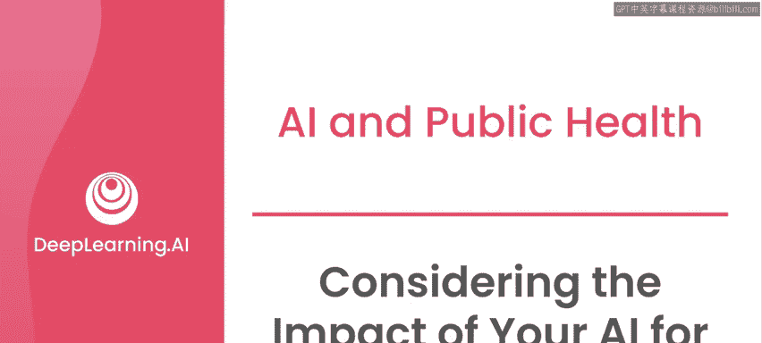
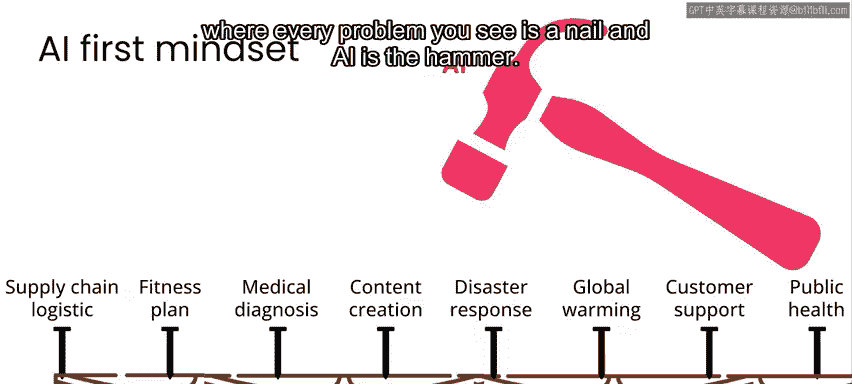
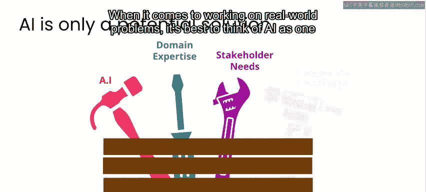
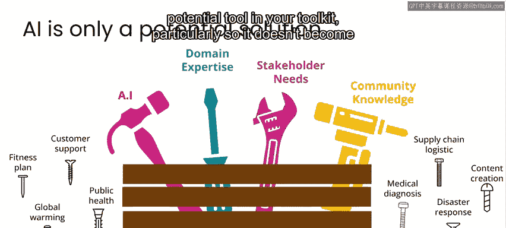
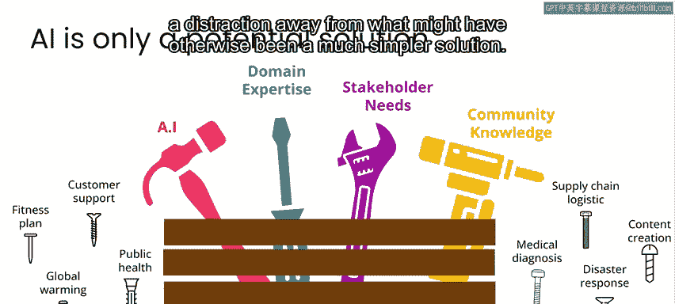
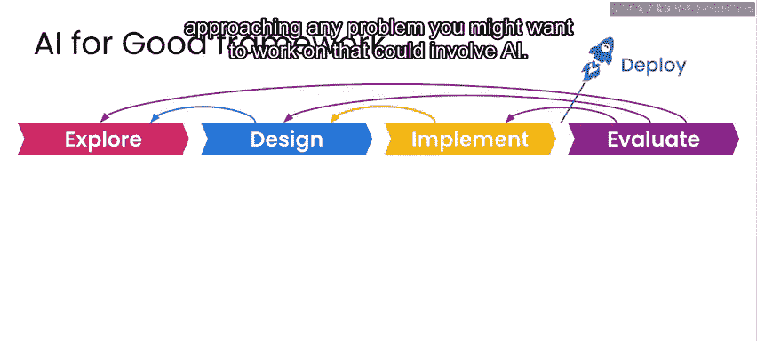
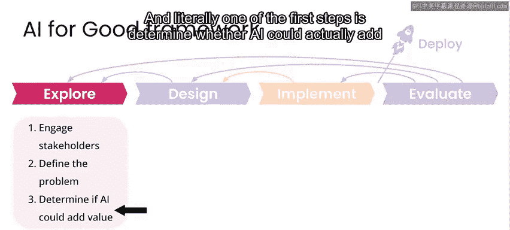
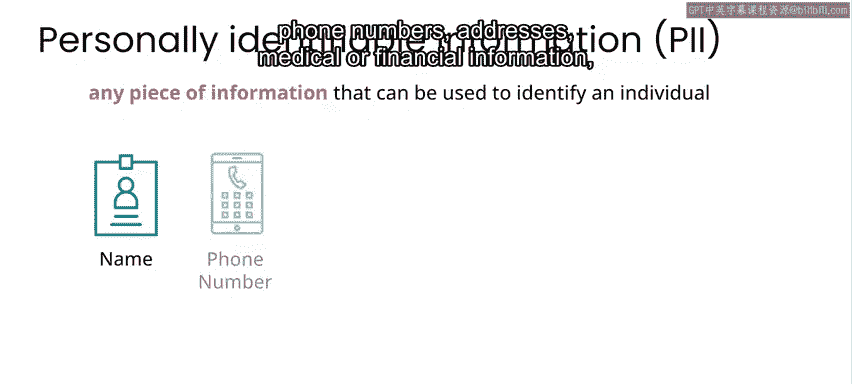
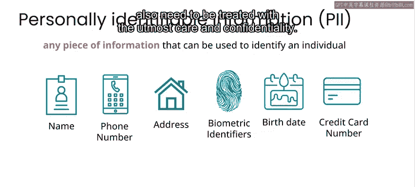
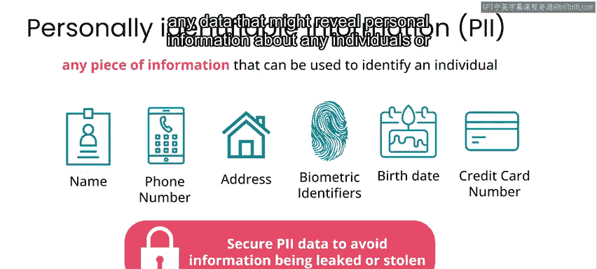

# 007：评估AI向善项目的影响 ⚖️

在本节课中，我们将学习如何评估人工智能项目可能带来的影响，包括积极和消极的方面。我们将探讨在应用AI技术时需要考虑的关键伦理问题、数据隐私以及潜在风险，确保项目遵循“不伤害”原则。

正如你在之前的视频中所见，人工智能的应用范围非常广泛。让算法可靠地执行对你我而言相对简单的任务，例如识别图像内容，实际上可以成为许多项目的强大工具。

现在，我想花点时间讨论在将AI应用于项目时需要牢记的一些潜在问题。

## 明确项目目标与潜在风险

任何AI向善项目的目标当然是对世界产生积极影响，无论是改善人们的健康、减少气候变化的影响，还是帮助社区从自然灾害中恢复。然而，你所从事的任何项目也都存在产生负面影响的风险。在本视频中，我将概述启动任何AI相关项目时需要关注的几个主要领域。

需要明确的是，自人们开始思考如何利用技术改善人类和环境以来，人们也一直关注技术对人和环境的潜在负面影响。对于AI而言也是如此。目前有大量人员专注于AI伦理、公平性、偏见和代表性的研究，并有许多优秀的论文和教育材料发表在这些主题上。这里我将提及其中一些问题，但本课程没有足够的时间深入探讨。尽管如此，我确实建议你花时间查看一些相关资源，我们在本周课程末尾提供了许多，鼓励你去查看这些资源，思考它们如何应用于本课程的用例以及你项目中正在处理的任何用例。

## AI并非万能解决方案

在考虑AI在各种项目中的影响时，首先，我想强调AI并不一定能为每个新项目增加价值。在我构建的大多数技术领域中，当我以为AI可能奏效时，大多数时候它并没有。因此，我们必须牢记，在尝试确定AI是否能提供帮助的过程中，我们不能伤害到人。鉴于围绕AI及其能力的炒作，在解决问题时很容易陷入某种“AI优先”的思维定式，即把每个问题都视为钉子，而AI是锤子。在处理现实世界的问题时，最好将AI视为你工具箱中的一个潜在工具，特别是要避免它分散你对原本可能更简单解决方案的注意力。

在本课程后续课程中，我们将介绍一个处理任何你可能想解决的、可能涉及AI的问题的框架。实际上，最初的步骤之一就是确定AI是否真的能为解决方案增加价值。对于许多现实世界的问题，AI根本不会增加价值，尽早认识到这一点非常重要，这样你就不会浪费时间和资源去尝试实施一个不必要的、过于复杂的AI解决方案。

在本课程中，我将重点介绍一些AI确实能增加良好价值的案例，以及另一些不能的案例。对于AI能增加价值的项目，正如我之前所说，拥有良好且充足的数据通常对你的项目成功至关重要。

## 数据：价值核心与伦理中心

数据也恰恰是围绕AI应用的许多伦理问题的核心。例如，在涉及图像数据的项目中，人物或财产的图像应被视为潜在的敏感信息。

当我在2012年美国飓风“桑迪”过后从事航空影像分析以进行损害评估时，虽然你无法在航拍照片中识别出个人，但如果你熟悉该地区，你可能能够推断出受损且最易遭受盗窃的具体地点。在灾难响应期结束后，我们让另一个组织分析了我们的航空损害评估有多成功，然后出于隐私和安全考虑，我们都删除了数据。

因此，尽管保留数据并允许更多人评估损害并对其进行研究有非常好的益处，但我们无法保证“不伤害”原则得到遵守，因为可能会有人根据图像中的财产被识别出来。

其他包含个人身份信息的数据形式，如姓名、电话号码、地址、医疗或财务信息，也需要以最大的谨慎和保密性对待。一方面，你需要确保在处理数据时采取适当的安全措施，以避免数据泄露或被盗；另一方面，你还需要确保不会无意中发布或共享任何可能泄露任何个人或特定群体个人信息的数据。

## 处理敏感数据的最佳实践

理想情况下，只要可能，你永远不应该存储任何个人身份信息。例如，当我在2010年海地地震后从事灾难响应工作时，虽然我们确实存储并提供了一些数据，但我们确保任何公开共享的数据都不包含任何个人身份信息，然后在响应期结束后，我们删除了所有可能包含个人身份信息的数据。

即使是看似已经公开的数据，如社交媒体上的帖子，仍应被视为潜在的敏感信息，你应该避免以不安全的方式存档或重新发布此类数据，就像对待任何其他包含个人身份信息的数据一样。

你需要极其谨慎地对待任何可被视为私人信息的数据，不仅因为这是正确的事情，还因为不这样做可能会对信息被泄露的个人的安全和福祉构成真实且可能严重的风险。不幸的是，有许多案例表明，从事初衷良好的项目的团体，他们收集、共享或发布的数据最终被专制政权用来针对那些其观点、政治立场或活动被视为对该政权延续构成威胁的个人。事实上，如今世界上许多国家的专制政权积极参与收集和分析社交媒体及其他数据的项目，表面上是为了某些公益项目，而实际上他们的目标是对持不同政见者进行画像和定位。这显然不符合大多数人对“向善”的定义，也肯定不满足“不伤害”原则。

## 评估AI解决方案的实际影响

除了与项目数据相关的伦理考虑之外，另一个需要关注的主要领域是你的AI解决方案的任何实际影响。例如，假设你部署的AI模型负责识别非法活动。它错误识别此类活动并最终给无辜者带来问题的几率有多大？

或者，一个会话模型负责提供医疗诊断，就像你在上一个视频中看到的，判断某人是否患有癌症。提供错误诊断意味着什么？如果你有时必须出现错误诊断，你更倾向于哪种错误？你更倾向于**假阳性**（即告诉某人他们患有癌症而实际上没有），还是**假阴性**（即告诉某人他们没有癌症而实际上有）？

对于你从事的每个项目，你都会有一套不同的具体考虑因素，涉及故障模式是什么样子，以及当事情出错时会发生什么。即使你构建的系统按你最初预期的方式运行，也常常会有意想不到的后果。因此，在某些情况下，设想特定的对抗性用例非常有用。我指的是其他人可能利用你构建的系统或你发布的数据来做坏事而不是好事的方式。在本课程中，我们将多次回到这一点。这是一个重要的领域，需要你与利益相关者，特别是技术的使用者和受影响者进行沟通，因为你不会自己想到所有潜在风险，你需要让那些可能受到这些潜在负面用例伤害的人参与进来。

## 与利益相关者合作

例如，假设你部署了一个用于自动追踪濒危物种（比如黑犀牛）数量的系统。如果你发布关于在哪里可以找到最多黑犀牛的确切数据，偷猎者会利用这些数据进一步威胁该物种吗？有可能，我不知道。因此，这是一个很好的例子，说明了为什么你应该与利益相关者——那些负责追踪和保护犀牛的人——交谈，并听取他们的意见，以判断这样的系统是否会遵守“不伤害”原则。

因此，无论你在做什么，都要应用“不伤害”原则。如果你花时间考虑项目的所有潜在影响，无论是积极的还是消极的，你将会最成功。同时请记住，作为从事AI向善项目的人，你不是唯一应该就如何“不伤害”做出判断的人。你需要考虑所有可能受影响人群的观点和意见。

## 课程总结与展望

我们与多位应用AI产生积极社会和环境影响的不同领域专家合作开发了这些课程。在本课程中，你将直接听到这些专家在项目聚焦中的分享。我们特别感谢微软AI向善实验室的合作伙伴在课程开发中的合作与支持。

在下一个视频中，你将听到微软AI向善实验室的首席科学家兼主任胡安·拉维斯塔·阿夫斯的分享。该实验室目前正在进行大量项目。请注意，下一个视频的风格和感觉与本课程的内容视频略有不同，我认为最好将其视为微软AI向善实验室正在进行的许多非常有趣项目的鼓舞人心的预告片，而不是本课程的实用内容。但如果你想了解更多关于胡安提到的任何项目的详细信息，可以在本周课程末尾的资源部分通过URL找到更多细节。

---

**本节课中，我们一起学习了评估AI向善项目影响的重要性。** 我们明确了AI并非适用于所有场景，探讨了数据隐私与安全的核心伦理问题，并学习了如何通过考虑潜在风险、设想对抗性用例以及与利益相关者合作来贯彻“不伤害”原则。记住，负责任的创新始于周密的思考和广泛的咨询。