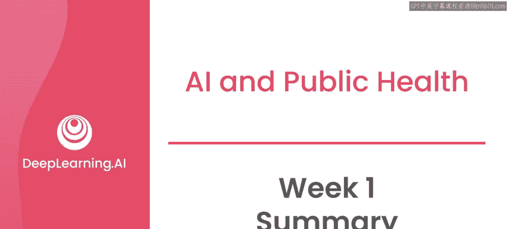
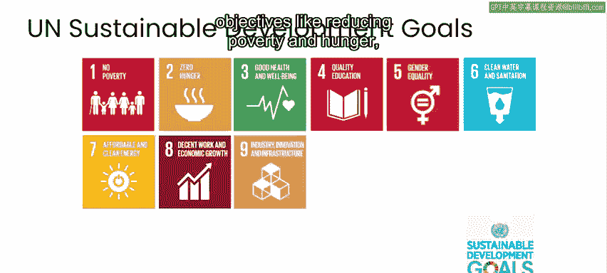
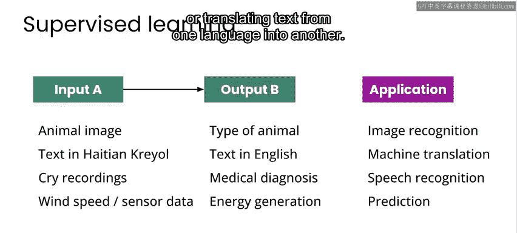
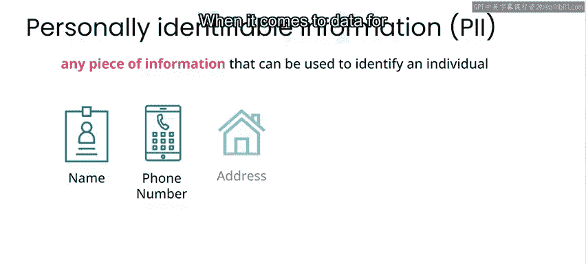

# 009：吴恩达《AI for Good专业课程》 - 第1周总结 📚

在本节课中，我们将回顾第一周学习的主要内容，包括“AI for Good”的概念、监督式机器学习的基本原理，以及在AI项目中需要考虑的社会影响。

---

恭喜你完成了本课程第一周的学习。你现在已经为参与AI相关项目打下了坚实的基础。在进入第二周，开始探索问题解决框架和第一个案例研究之前，我将简要回顾本周的主要知识点。

## 什么是“AI for Good”？ 🤔

本周我们首先讨论了“AI for Good”的含义，并看了一些应用实例。

以下是几个“AI for Good”项目的例子：
*   监测亚马逊雨林中的非法采矿活动。
*   预测风力涡轮机的发电功率。
*   根据婴儿的哭声诊断其健康状况。

总的来说，“AI for Good”项目旨在预防、减轻或解决对人类或环境产生不利影响的问题。联合国可持续发展目标是一个流行的框架，用于讨论诸如减少贫困与饥饿、应对气候变化和推广清洁能源等目标。你可以在本周末尾的资源区找到链接，以获取关于这些目标以及旨在实现这些目标的具体项目进展报告的更多信息。

## 监督式机器学习如何运作？ 🧠

上一节我们介绍了“AI for Good”的目标，本节中我们来看看AI是如何实际运作的。

你看到了一些关于最常见机器学习形式——监督式机器学习的直观例子。在监督式机器学习中，你的目标是让算法学会从输入A映射到特定的输出B。

这可以包括以下例子：
*   识别图像中的内容。
*   根据录音做出医疗诊断。
*   将文本从一种语言翻译成另一种语言。

只要你能为算法提供一个用于训练的数据集，监督式学习就可以应用于各种问题。这个数据集是指，其中每个数据输入A都标注了正确的输出B。

## 实施AI项目需考虑哪些影响？ ⚖️

最后，我们探讨了在实施AI项目时需要考虑的一些影响。首要的是，我强调必须记住，AI并不一定会为你参与的每个项目都增加价值。

因此，与其采取“AI优先”的问题解决方法，你真正应该将AI视为你工具箱中众多可能选项之一。

对于你正在进行的任何项目，在处理数据时，你需要将数据隐私和安全放在首位。世界上有许多有趣的项目并不一定涉及个人的私人信息，但对于任何涉及此类信息的项目，你都需要注意在项目的所有阶段保护个人隐私信息，存储必要的信息，并在项目完成后删除数据。

在发布结果或数据产品时，你需要确保不会无意中发布个人信息或其他可用于识别个人、进而给个人带来风险或伤害的信息。除了数据本身，你还需要仔细考虑你的AI解决方案可能产生的影响。这可能包括它在故障模式下的影响，甚至是在它按预期运行时的潜在影响。

在本周的多个节点，我都强调，为了确保将项目的任何潜在负面影响降至最低，你应该采取“不伤害”原则。务必花时间考虑你项目的所有潜在影响，无论是正面的还是负面的。请记住，要做到这一点，你需要收集所有可能受你项目影响的人的意见和观点，以确保不会造成伤害。

---

至此，你已经准备好深入学习本课程的第二周。在这里，我们将向你介绍一个可应用于任何AI产品的问题解决框架，并详细分析一个专注于母婴健康的案例研究。但在开始之前，我们还有另一个项目聚焦。本期将由来自微软AI for Good实验室的Felipe Ovido介绍他如何利用监督式机器学习协助放射科医生早期检测乳腺癌。

---

**本节课总结**：本节课中我们一起学习了“AI for Good”的核心概念与实例，理解了监督式机器学习的基本原理（从输入A到输出B的映射），并重点探讨了在AI项目中必须优先考虑的数据隐私、安全以及广泛的社会影响，强调了“不伤害”原则的重要性。