# 010：利用深度学习辅助乳腺癌MRI异常检测 🩺

在本节课中，我们将学习如何应用深度学习技术，辅助放射科医生通过磁共振成像（MRI）进行乳腺癌的早期检测。我们将了解项目背景、面临的挑战、解决方案以及最终成果。

---

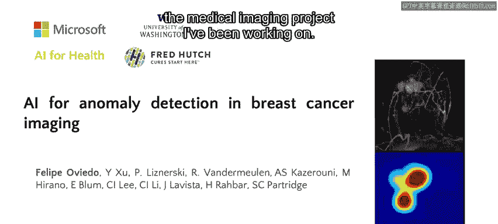

## 概述

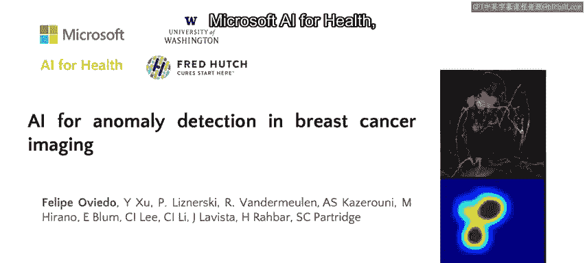

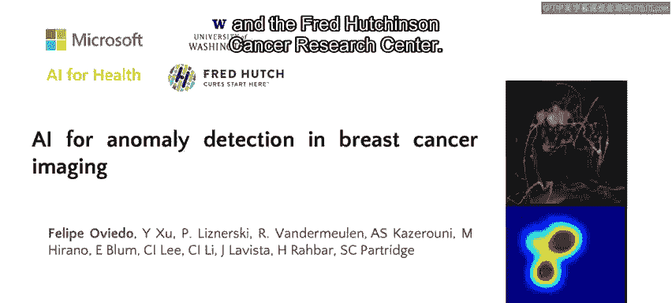

乳腺癌是全球最常见的癌症类型之一。在美国，每年约有30万新确诊病例和4万例死亡。放射科医生常使用MRI扫描对高风险女性（如有家族病史者）进行癌症筛查和早期检测。然而，即使使用MRI，小的病灶也可能被遗漏（假阴性），而良性病变可能被误判为恶性（假阳性），导致不必要的活检。人工智能可以成为一个有用的工具，为放射科医生的决策提供信息，既能减少解读时间，又能提高MRI检查的准确性。

## 项目背景与目标

本节介绍本项目的合作方与核心目标。

该项目是微软AI for Health、华盛顿大学和弗雷德·哈钦森癌症研究中心的合作项目。我们的目标是开发一个**可解释的机器学习模型**，以辅助放射科医生进行乳腺癌的早期检测。我们设想这个工具能通过减少分析MRI影像所需的工作量，并快速识别乳房中异常且需要随访的区域，从而为放射科医生提供帮助。

## 放射科医生面临的挑战

上一节我们介绍了项目目标，本节中我们来看看放射科医生在分析MRI时面临的具体问题。

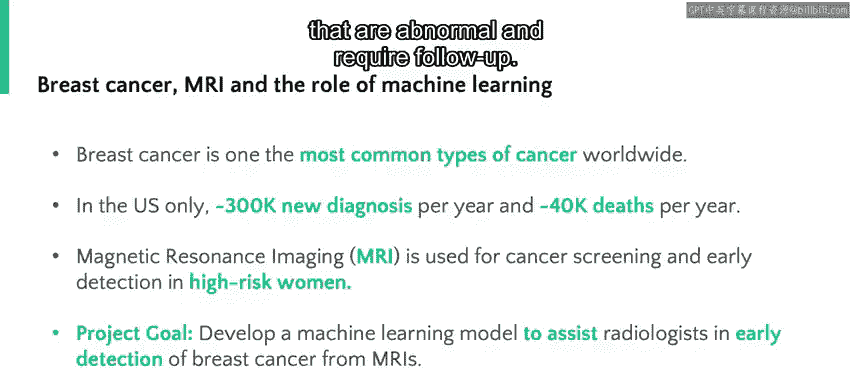

在放射学中，一个常见的问题是区分正常和异常的检查。对于乳腺癌高风险女性，建议每隔几年进行一次MRI筛查。下图展示了一张MRI扫描的2D投影。放射科医生需要分析完整的MRI扫描，试图回答几个关键问题：
*   乳房是正常还是异常？
*   图像中的异常区域在哪里？
*   如果存在异常，我们能否做出癌症诊断或风险预测？

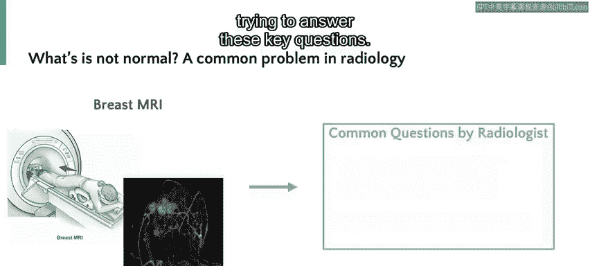

MRI扫描是复杂的三维空间测量，因此回答这些问题需要经验非常丰富的放射科医生和大量的分析时间，尤其是在异常非常细微的情况下。

## 机器学习解决方案与数据挑战

面对上述挑战，我们可以尝试用机器学习来解决。然而，将机器学习应用于此类问题会带来显著的挑战。

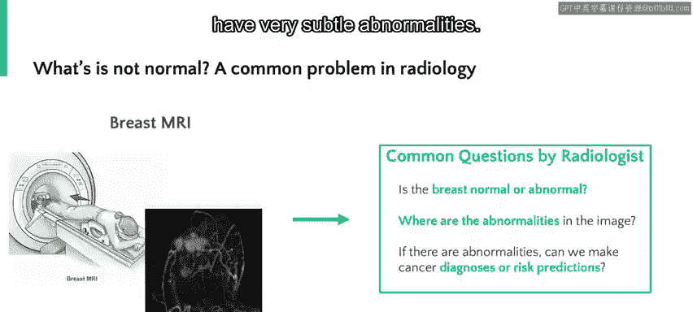

这个问题可以通过训练一个神经网络来自动识别异常的MRI扫描来解决。但主要挑战在于数据的不平衡性：**阴性病例**（即正常的乳房图像）远比**阳性病例**（存在癌症）更为常见，尤其是在癌症早期阶段。

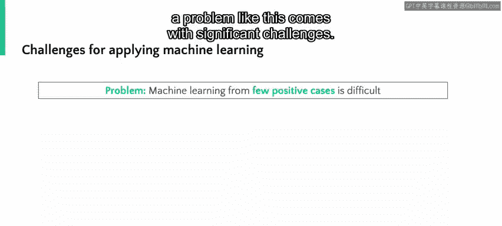

为了训练神经网络，我们获得了超过4000名患者的数据，总计超过1万次独立的MRI检查。但其中只有大约2%的患者最终罹患癌症。这在训练机器学习模型时带来的挑战是：模型可能简单地学会对每张图像都预测“无癌症”，并且能达到98%的正确率。为了有效识别那关键的2%的阳性病例，我们需要采取谨慎的方法。

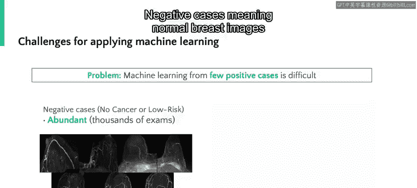

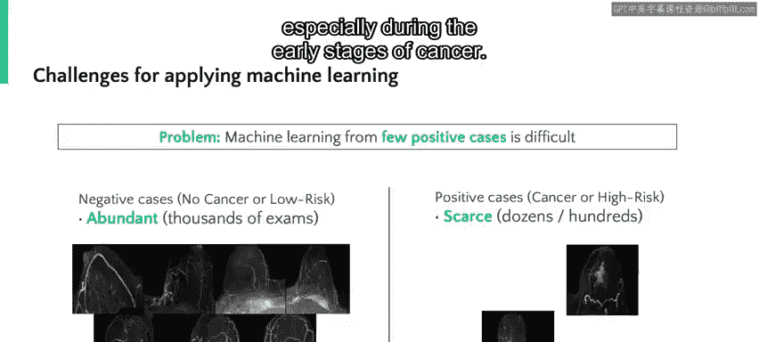

## 核心技术：单类分类

我们解决数据不平衡挑战的方法是定制一个用于**异常检测**的模型。

我们采用的方法是定制一个用于**异常检测**的模型。这意味着通过在丰富的阴性数据上进行训练，模型能非常好地识别正常或阴性图像；然后，通过寻找数据集中不存在或与数据集中正常图像不同的特征，模型能够识别异常图像。这种方法通常被称为**单类分类**。

因此，对于任何MRI扫描，该模型都能输出图像是正常还是异常的判断。

## 从分类到定位

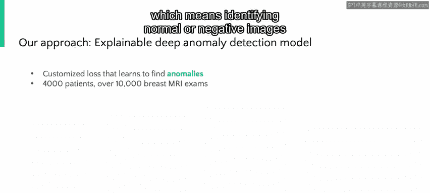

我们可以将分析更进一步，超越简单的正常与异常分类，生成异常图像中的异常区域定位图。

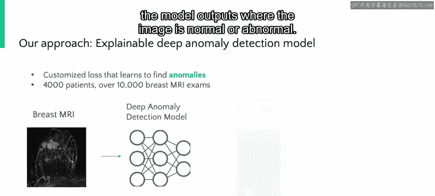

我们可以将分析更进一步，超越简单的正常与异常分类，生成异常图像中的异常区域定位图。这些定位图随后可以被放射科医生用来可视化图像中具体哪一部分被判定为异常，以便进行更详细的分析或活检。

## 模型效果与对比

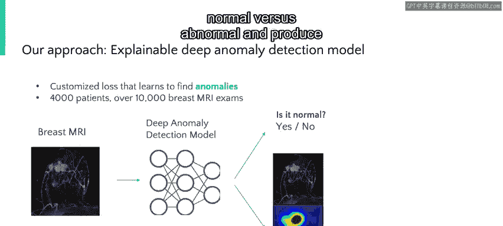

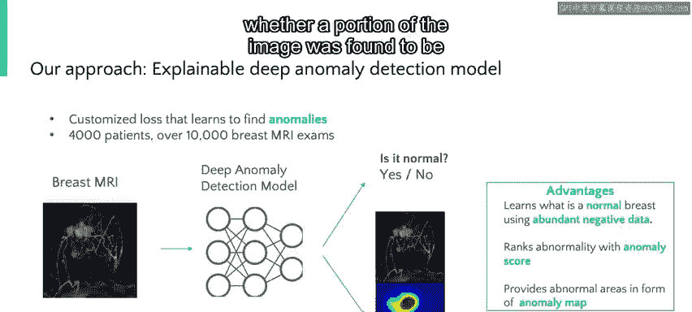

我们的最终模型在检测患者现有癌症方面表现出超过90%的准确率，在预测五年癌症风险方面超过80%的准确率。这一结果与训练有素的放射科医生在结合患者完整临床病史审阅MRI扫描时的准确性相当。

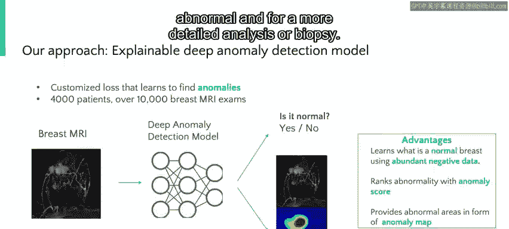

此外，通过自动分析图像，我们的系统能够将放射科医生的工作量减少80%以上。我们模型的输入和输出如下图所示，顶行是多名患者的MRI图像集合。

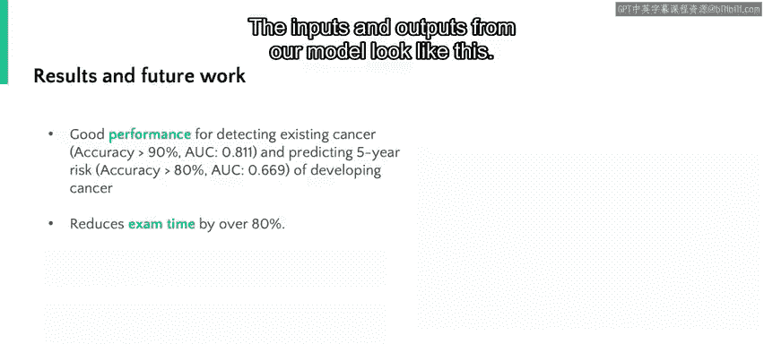

中间行图像中的红色区域是模型识别出的异常区域。

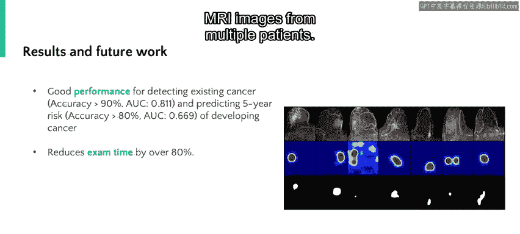

底行中的白色区域是放射科医生认为异常的区域。通过比较，我们观察到在没有任何手动标注的情况下，模型预测与放射科医生的判断有良好的匹配。

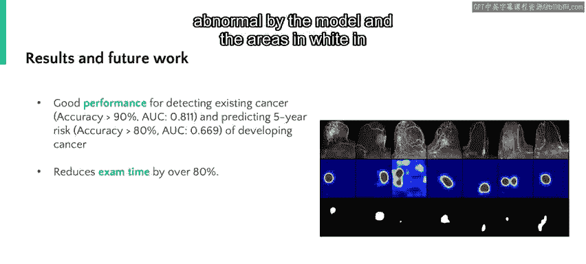

## 未来展望与总结

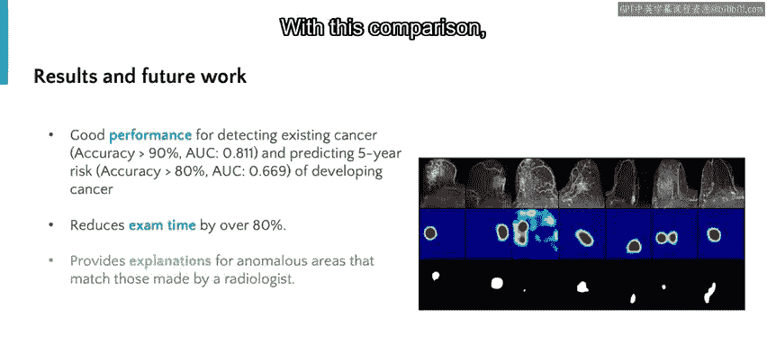

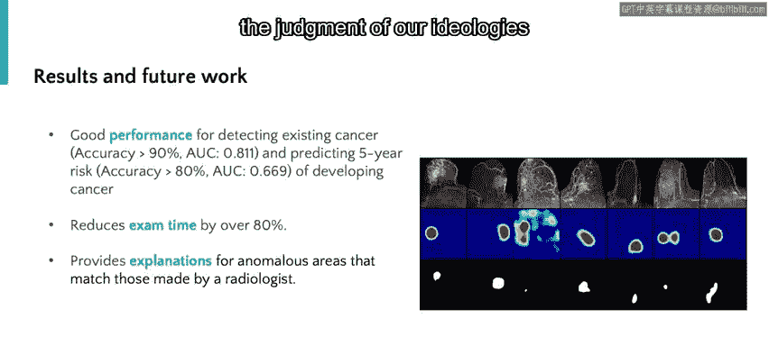

本节课中我们一起学习了如何利用单类分类的深度学习模型辅助乳腺癌MRI检测。

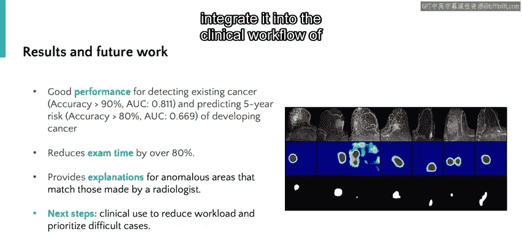

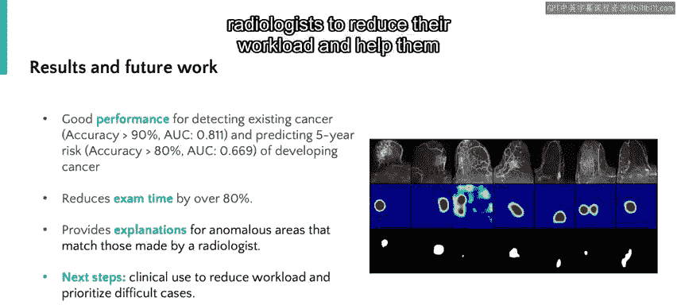

我们对该系统的下一步计划是将其整合到放射科医生的临床工作流程中，以减少他们的工作量，并帮助他们快速识别需要人类进一步分析的病例。

医学的未来无疑将包含许多像这样的AI辅助工具。但重要的是要记住，AI无法替代训练有素的医疗专业人员。相反，我们希望此类工具能够帮助减轻临床医生的日常工作负担，并帮助他们为患者提供更好的治疗结果。

**总结**：本节课中我们一起学习了如何利用**单类分类**的深度学习模型，解决医学影像数据不平衡的挑战，从而实现乳腺癌MRI图像的自动异常检测与定位，有效辅助放射科医生工作并提升诊断效率。