# 011：人工智能为善框架 🧭

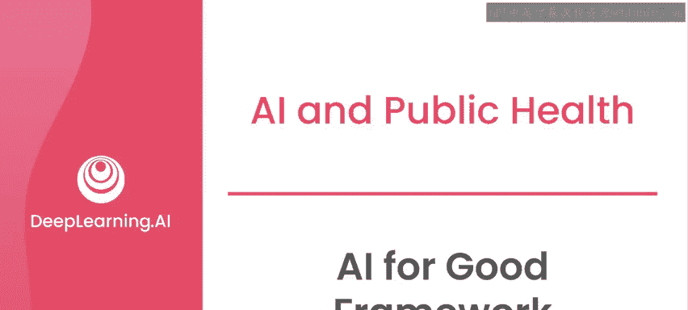

在本节课中，我们将学习一个用于构建“人工智能为善”项目的方法框架。这个框架将项目生命周期划分为四个阶段，并指导你如何系统性地推进项目，从探索问题到评估最终影响。

欢迎回来。在本课程的第一周，你学习了机器学习的工作原理、当前“人工智能为善”领域团队正在开展的项目类型，以及在着手实际项目时需要考虑的一些实际问题。在课程的第二周，你将学习一个用于构建“人工智能为善”项目方法的框架。事实上，这个框架可以应用于任何现实世界、且人工智能可能成为解决方案一部分的项目。到本周结束时，你将掌握必要的工具，以便深入研究哥伦比亚波哥大空气质量评估的案例。

首先需要说明，目前并没有一个官方或普遍接受的“人工智能为善”项目框架。但这里展示的框架是基于一系列最佳实践、我个人在灾害响应和公共卫生领域的经验、在工业界构建人工智能驱动产品的经验，以及该领域其他许多利益相关者的经验总结而成。希望这个框架能对你本课程及未来的项目有所帮助。

与大多数项目类似，“人工智能为善”项目也遵循一系列阶段或步骤。在本课程中，我们将项目生命周期划分为四个阶段。

## 第一阶段：探索 🔍

你可以将其视为第一个阶段，即探索阶段。在此阶段，你需要与利益相关者建立联系，定义你想要解决的问题，评估可行性，并确定人工智能是否能作为解决方案的一部分来增加价值。

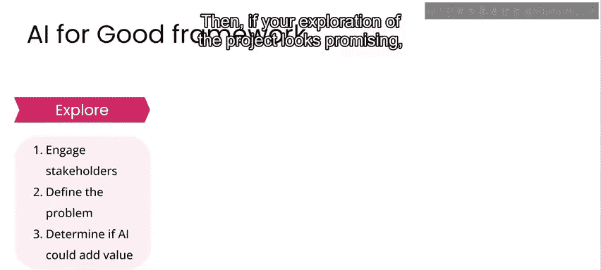

## 第二阶段：设计 ✏️

如果项目的探索阶段看起来前景良好，你就可以进入设计阶段。在此阶段，你需要对解决方案进行原型设计，制定模型策略，进一步调查数据，并思考如何确保数据隐私，以及潜在用户将如何与你的系统交互。

现在，在设计阶段，你可能会意识到从探索阶段得出的一些假设并不成立，因此需要返回并进一步探索，与利益相关者进行更多讨论，或者迭代修改你的问题陈述。如果是这样，这里从设计到探索的小箭头表明，这可能是一个迭代过程。有时，如果你发现没有完成当前阶段工作所需的条件，可能需要回到之前的阶段。

坦率地说，很多时候你会发现根本无法成功完成一个项目，这并不可耻。我参与过的大多数关注社会公益的项目，并未对我们试图帮助的社区产生可证明的影响；我参与过的大多数人工智能项目或由人工智能辅助的技术，也未能真正证明通过使用人工智能为该产品带来了非常显著的改进。因此，如果大多数人工智能项目不成功，大多数公益项目也不成功，那么当你尝试将这两个非常困难的领域结合起来时，大多数想法无论初衷多么良好，都不会成功，也就不足为奇了。能够认识到你不太可能达到成功的成果，实际上是你能够培养的最重要的领导力和设计技能之一。

对于本课程，我们将讨论那些我们认为你能够产生积极影响的用例。

## 第三阶段：实施 ⚙️

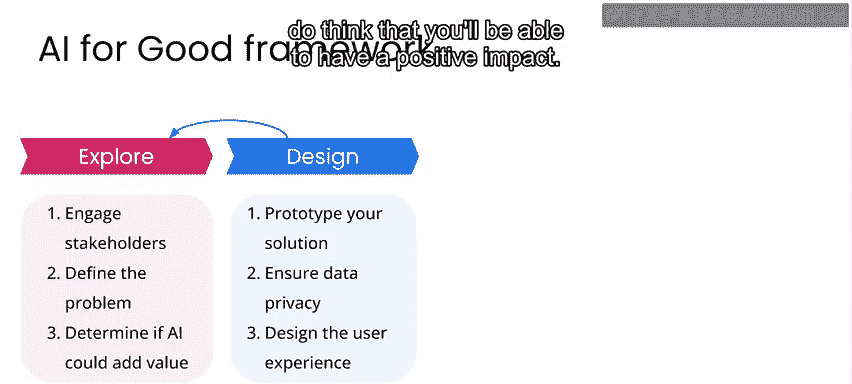

在这个模型中，一旦你确定了设计，就会进入实施阶段。在此阶段，你需要进行所谓的“模型产品化”。这实际上意味着将你在某种测试环境中设计的内容准备好，以便部署并与用户界面集成。然后，你还需要再次测试系统的性能和可用性。

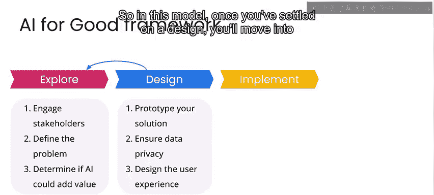

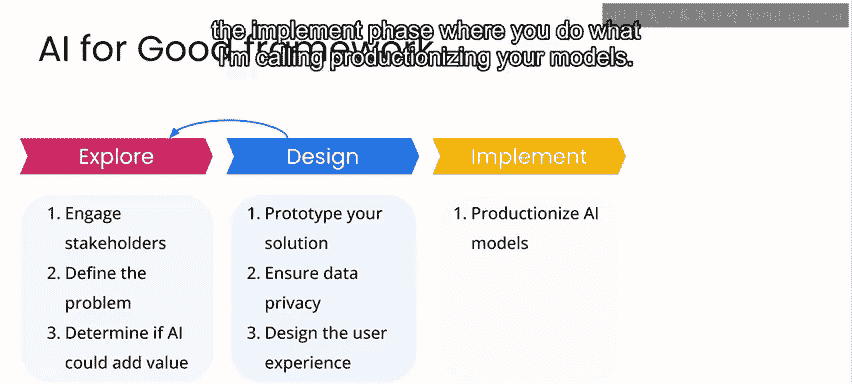

在实施阶段的工作中，你可能会发现设计的某些方面确实行不通，需要返回设计阶段，这是完全可以接受的。因此，这里添加了另一个小箭头，从实施返回设计，因为这是你在迭代最终产品过程中可能采取的路径。

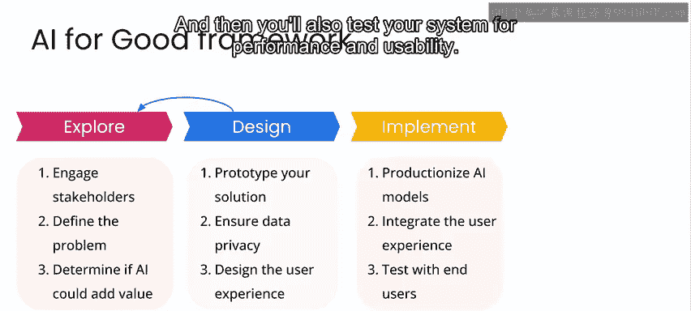

## 第四阶段：部署与评估 🚀

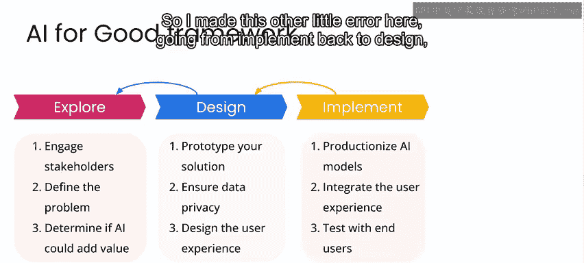

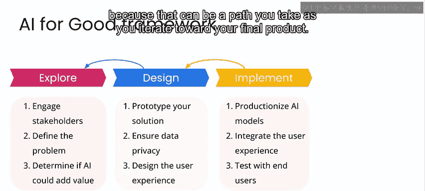

一旦你对实施结果感到满意，就可以准备部署了。当然，部署涉及的技术细节远不止按下一个按钮然后上线那么简单。但为了本课程的目的，这里用一个小火箭图标起飞来表示部署，并请注意，关于成功机器学习产品开发的技术方面，有完整的其他课程，但我们不会在这里讨论这些细节。

系统部署后，就是评估影响、沟通发现并决定下一步行动的时候了。此时，可能发生多种情况。

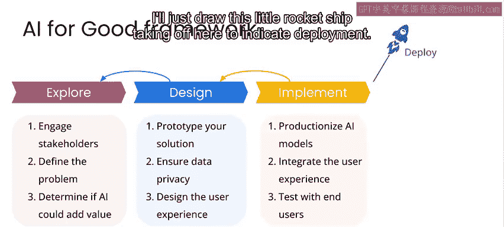

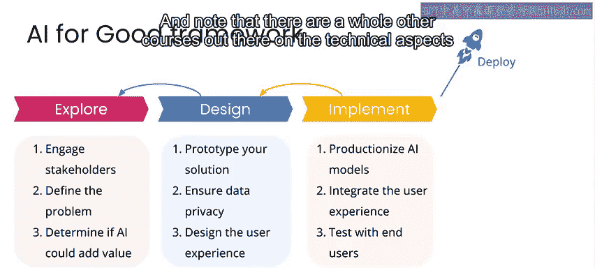

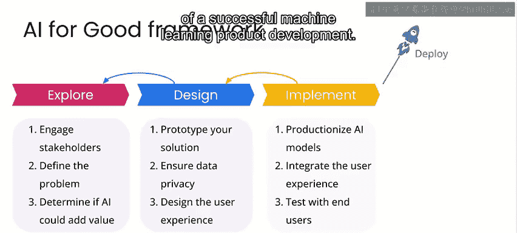

最常见的情况或许是，你通过部署系统发现，需要对实施进行一些调整，因此你返回实施阶段，最终重新发布产品的更新版本。

或者，你可能发现设计的某些方面最终未能达到预期，决定返回设计阶段，在实施新解决方案之前重新思考系统的某些组件。

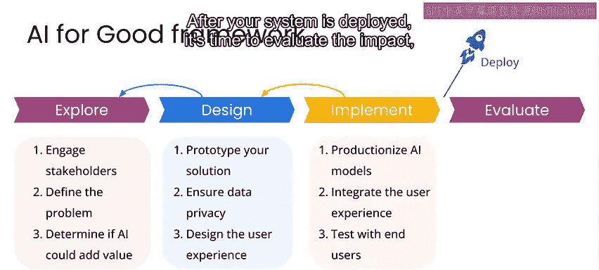

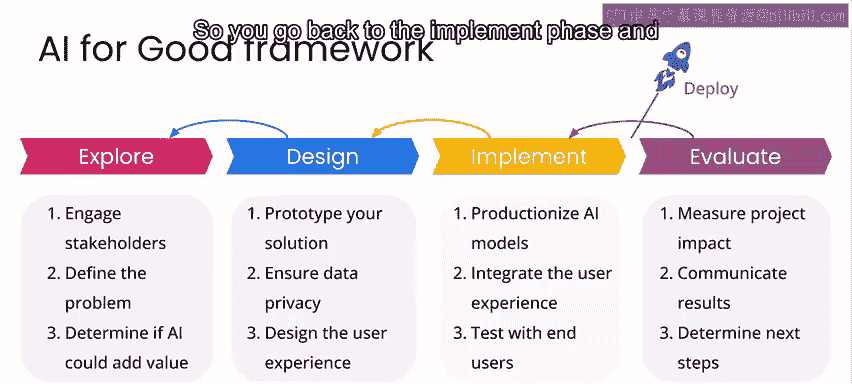

又或者，你决定探索最初所处理问题的一个新方面，或者完全去探索一个新问题。所有这些都可能是非常常见的结果。根据经验，我可以告诉你，当你从事一个真实项目时，情况可能比这个相对简单的图表所显示的看起来要混乱得多。但我同样可以说，如果你在项目的每个阶段都牢记这个框架，那么你更有可能获得成功的结果，或者至少能意识到何时偏离了轨道，然后能够尽可能有效地调整并回到正轨。

我想顺便提一下，如果你熟悉软件开发实践，这看起来可能像瀑布式开发范式。但请注意，其中评估项目影响的理念同样适用于迭代更频繁的敏捷开发范式。

在接下来的几个视频中，我将引导你了解一个项目经历此框架所有四个阶段的示例，以便你能看到在特定场景下事情是如何推进的。

---

**本节课总结**

本节课我们一起学习了“人工智能为善”项目的四阶段框架：**探索**、**设计**、**实施**和**部署与评估**。这个框架强调了项目的迭代性，允许在发现假设不成立或设计需要调整时返回之前的阶段。理解并应用这个结构化方法，能帮助你更系统、更有效地推进旨在产生积极社会影响的人工智能项目，并提高成功的可能性。