# 012：AI与公共卫生项目实战——尼日利亚母婴健康案例 🏥

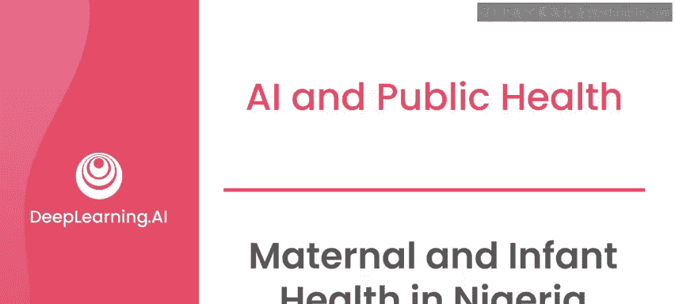

在本节课中，我们将通过一个具体的项目案例，详细拆解“AI向善”项目框架的各个阶段。这个项目是我多年前与联合国儿童基金会合作，聚焦于尼日利亚母婴健康的实践。希望通过这个案例的逐步分析，你能清晰地了解在开发任何AI项目时，每个阶段需要关注的核心要点。

## 项目背景与通信革命

上一节我们介绍了“AI向善”的项目框架，本节中我们来看看这个框架在一个真实项目中的应用背景。

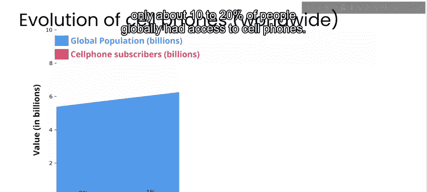

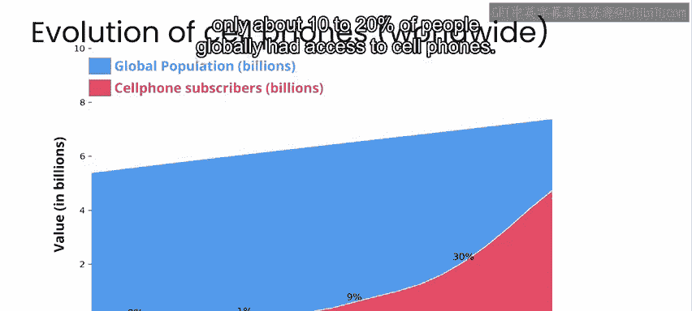

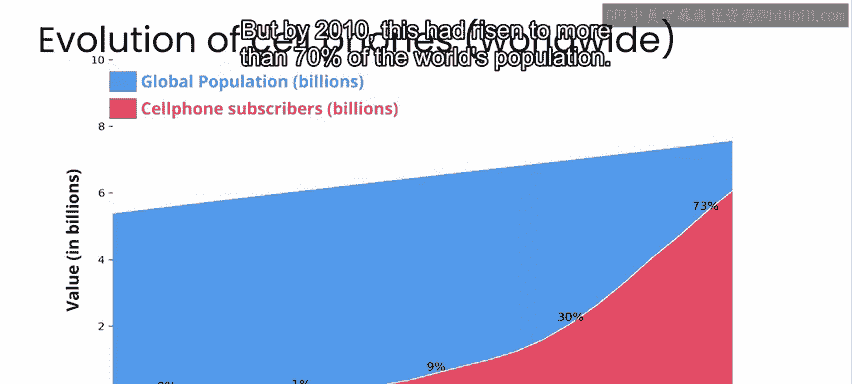

在21世纪的第一个十年，全球通信经历了一次重大变革。2000年，全球只有约10%到20%的人能使用手机。但到了2010年，这一比例已上升至全球人口的70%以上。当时联合国发布的一系列报告强调了一个事实：拥有手机的人数已超过了能获得基本卫生设施（如厕所或自来水）的人数。这个状态在十多年后的今天依然存在。

正是在2008年至2009年，我在马拉维的一家诊所工作。这家诊所只有一名医生和少数几名工作人员，却要为近10万人提供服务。这种状况至今变化不大，该地区的许多诊所仍保持着约1名医生对应10万人的比例。因此，我们当时首次遇到的许多通信问题，在今天为人们提供医疗服务时仍然是巨大的挑战。

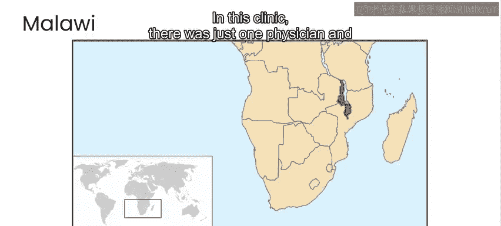

## 初期实践：马拉维诊所的挑战

在马拉维的案例中，当地居民与诊所工作人员沟通的主要方式是通过手机短信。面对如此庞大的人群，诊所被海量的信息淹没，人工处理很快变得不可能。我的工作是帮助该诊所建立一个系统，利用一些基本的AI技术来自动分类收到的信息并进行相应路由。

如果你对这项研究的更多细节感兴趣，我们在本周材料的资源部分附上了我于2010年与斯坦福大学的克里斯·曼登共同发表的论文，这也是我博士论文的一部分。

随着全球手机普及率的快速提升，处理大量自发短信的挑战也成为一个新兴的全球现象。从工业界、政府到医疗保健和应急响应部门，各类组织都必须学会如何快速应对这一新挑战。

## 海地地震的应急响应

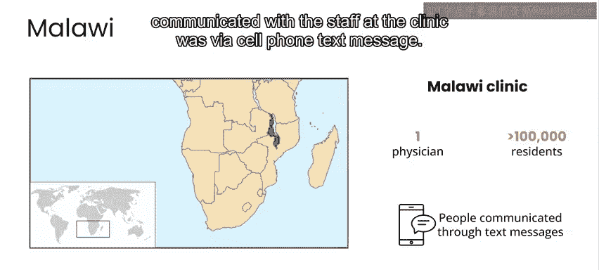

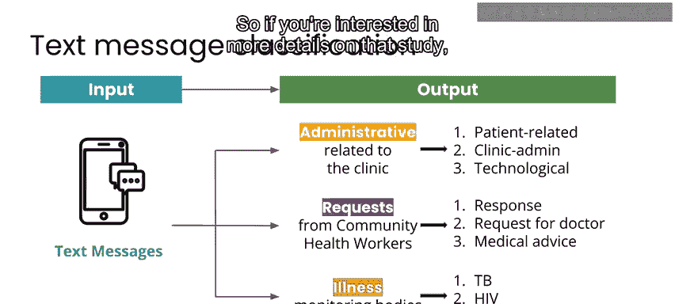

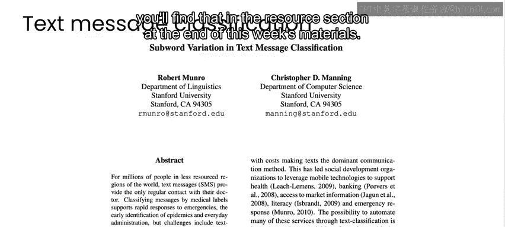

2010年，海地发生地震后，我被请求提供帮助。地震导致数十万人死亡，大部分基础设施遭到损坏或摧毁，但大多数手机信号塔仍然完好。因此，人们通过短信进行交流，寻求援助和信息。

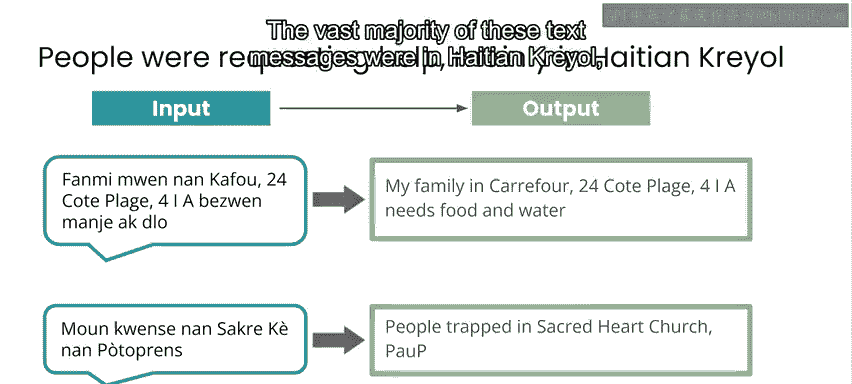

这些短信绝大多数是海地克里奥尔语，而大多数国际救援人员并不懂这种语言。当时，还没有能够自动在海地克里奥尔语和英语之间进行翻译的应用程序。

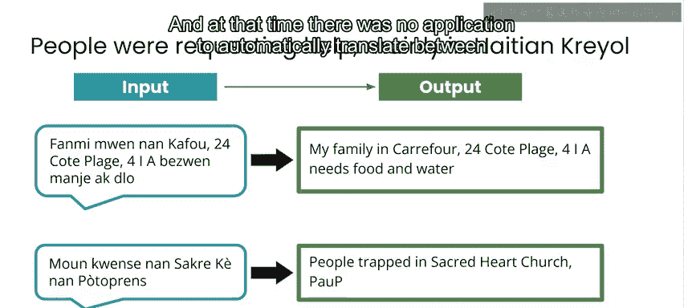

作为响应工作的一部分，我帮助组织了来自全球海地侨民社区的数千名志愿者，他们可以快速地将收到的紧急信息在海地克里奥尔语和英语之间进行翻译。借助这些人工翻译，以及分类和地理位置信息，我们得以帮助以英语为主的国际救援界响应那些最紧急的信息。

除了为紧急信息进行众包翻译外，我们还能够将海地克里奥尔语和英语信息提供给机器翻译服务。因此，在地震后不久，微软和谷歌相继发布了海地克里奥尔语和英语之间的机器翻译系统。这些系统随后被两种语言的使用者用于信息重要性低于紧急响应的日常交流。

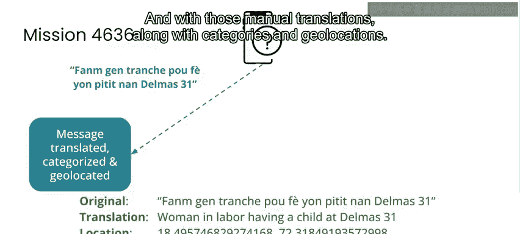

## 从实践到研究焦点

通过马拉维和海地的这些经历，以及当时我参与的其他公共卫生和灾难响应工作，我熟悉了处理多语言、大规模通信的问题。事实上，这成为了我最终博士研究的焦点：我们如何调整AI系统，以帮助应对过去通常不是自然语言处理重点的语言在灾难响应和公共卫生领域的挑战。

正是在这种灾难响应和公共卫生工作的背景下，我于2012年共同创立了Idibon公司。这是一家致力于构建各种自然语言处理技术的公司，目标是让这些技术能在尽可能多的语言中部署。在Idibon，我们为三星等大型手机公司以及其他金融、游戏等领域的大型行业参与者构建了生产系统，使他们能够将分类和信息提取系统适配到任何语言。

## U报告系统与项目契机

2011年，联合国儿童基金会推出了一个名为“U报告”的系统。这是一个社交信息工具和数据收集系统，允许社区成员发送短信，直接报告影响其社区的各种问题，范围从安全、疾病爆发到基础设施问题等。

U报告系统面临着与跨国公司相同的挑战：他们需要监控、翻译、分类和路由大量多语言短信，但他们缺乏构建和部署此类系统的资源或专业知识。

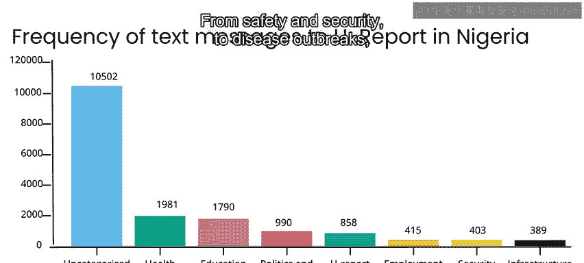

2015年，联合国儿童基金会联系到我们在Idibon的团队，希望我们帮助他们在尼日利亚一家为母亲和新生儿服务的诊所应用U报告工具。这看起来是一个我们可以产生重大影响的项目，通过将已经为工业应用开发并经过生产测试的技术，引入到一个社区健康与发展项目中。因此，我们Idibon团队自愿免费提供服务，帮助联合国儿童基金会专门为他们在尼日利亚的工作开发系统。

## 本节总结

本节课中，我们一起学习了“AI向善”项目框架在一个真实公共卫生项目中的应用背景。我们回顾了全球通信变革如何创造了新的挑战与机遇，并通过马拉维诊所和海地地震响应的早期实践，看到了利用AI技术处理多语言、大规模通信的迫切需求。这些经验最终促成了与联合国儿童基金会在尼日利亚母婴健康项目上的合作。

在下一节视频中，请与我一同探讨我们如何在这个项目的“探索”阶段着手开展工作。