# 013：探索阶段——问题定义与利益相关者 📋

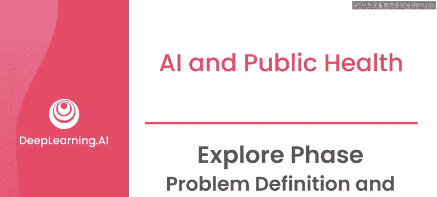

在本节课中，我们将学习AI项目探索阶段的核心步骤：如何与利益相关者沟通，并定义一个清晰、具体的问题陈述。我们将通过一个帮助尼日利亚医疗工作者的真实案例来理解这个过程。

---

## 项目背景与目标

本节视频深入探讨了一个具体项目的探索阶段：如何帮助尼日利亚的医疗工作者监测和支持母亲及其新生儿的健康状况。

尼日利亚使用联合国儿童基金会U报告系统的人群，加入了一个名为“1000天计划”的宏伟全球项目。该项目至今仍在运行，其核心目标是为所有母亲及其孩子提供营养和医疗保健，覆盖范围从母亲怀孕的第一天到孩子两岁。

在尼日利亚的“1000天计划”中，U报告系统的主要用途是作为发送和收集调查回复的工具，这些调查旨在追踪母亲和儿童的健康状况。

系统按设计运行，但他们很快开始收到除调查回复外的大量非结构化短信。这些信息使用多种不同语言，涉及社区内各种不同的问题，有些与调查相关，有些则无关。

这与我在马拉维诊所工作的经历类似。信息量迅速超过了医疗工作者实时回复的能力，尽管他们认识到需要尽快处理许多这类沟通。

当我们的团队加入这项工作时，目标是帮助诊所工作人员实施一种方法，对通过U报告系统收到的信息进行分类和优先级排序。

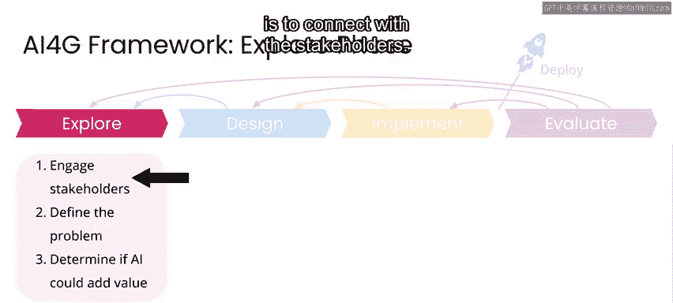

---

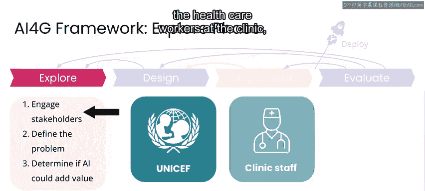

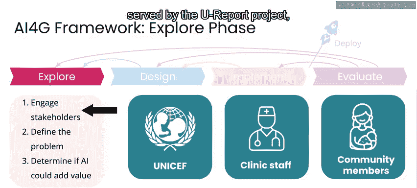

## 第一步：联系利益相关者

正如之前提到的，在任何你想开展的项目中，第一步都是与利益相关者建立联系。

在这个案例中，主要利益相关者包括：
*   联合国儿童基金会的代表。
*   诊所的医疗工作者。
*   受U报告项目服务的社区内的人们，特别是母亲和她们的孩子。

我们与联合国儿童基金会合作，以更好地理解他们项目的整体目标。反过来，我们也让他们对AI在其特定情况下可能提供的帮助限度有了现实的预期。

我们还花了一些时间直接与诊所的工作人员交谈，他们将是使用我们即将构建的技术的人。这有助于我们更好地理解他们在尝试与“1000天计划”中的母亲们沟通时所面临的挑战，尤其是在他们必须支持多种语言的情况下（很多时候，某种语言在医疗工作者中只有一个人会说）。

---

## 第二步：定义问题陈述

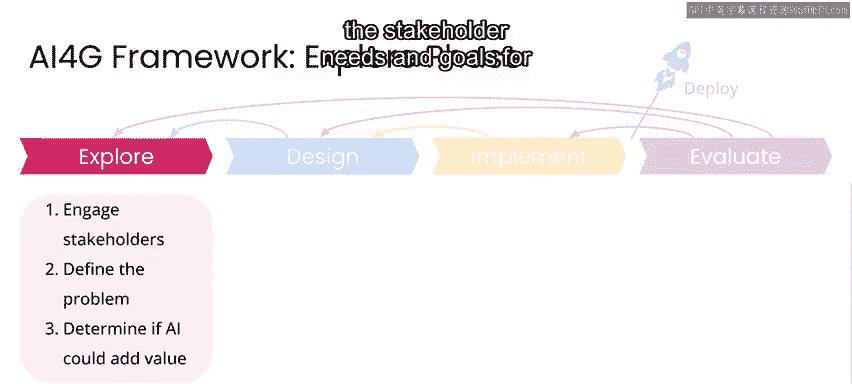

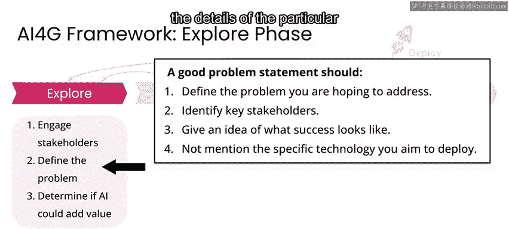

与利益相关者建立联系后，重要的是将他们的需求和项目目标整合成一个清晰、简洁的问题陈述。

你的问题陈述应定义你希望解决的问题，包括提及关键利益相关者，并描述成功的大致模样，但不必深入你可能部署的具体技术细节。

这是一个重要的步骤，因为如果你不清楚你希望解决的问题是什么、涉及哪些人，而过于关注你试图构建的技术，那么在项目开发的后续阶段很容易偏离轨道。

在定义你试图解决的问题时，做到非常具体和透明至关重要。

例如，在这个案例中，我们可能会被诱惑将问题描述得有点模糊，比如“难以处理大量不同语言的短信”。虽然这是事实，但并不清楚我们是在为谁解决这个问题。

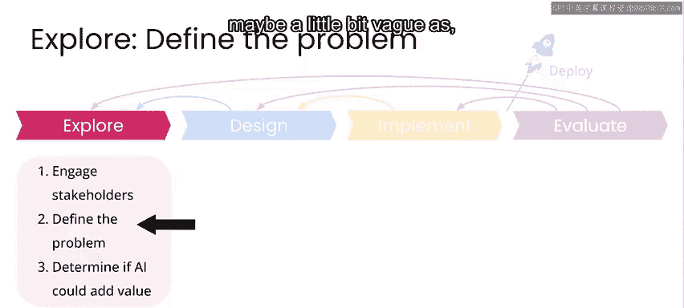

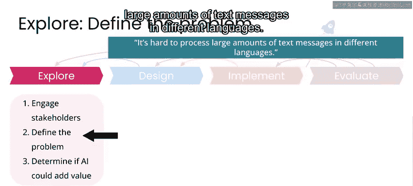

因此，你可以通过修改这个问题陈述来向正确的方向迈进一步，使其更准确，例如：“医疗工作者需要与社区中的母亲直接沟通以监测她们及其婴儿的健康状况，而他们面临着处理大量多语言短信的挑战。”

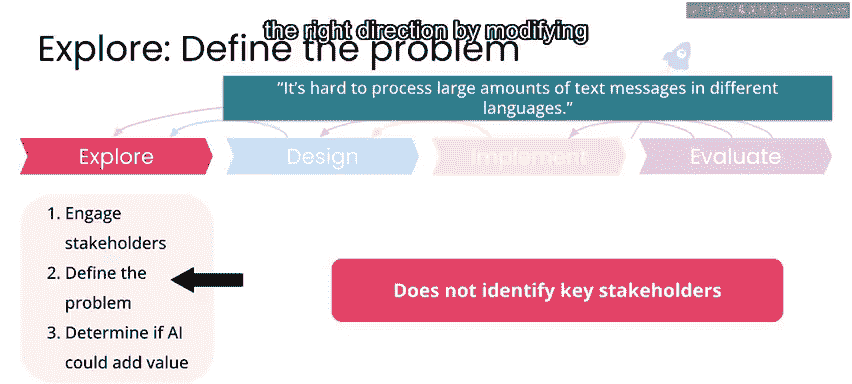

现在这样好一些了，因为明确了部分利益相关者是谁。但如果这些医疗工作者能够成功完成工作，好的结果具体是什么样子，仍然不完全清楚。

因此，一个更好的问题定义可以是：
> 医疗工作者需要通过调查与社区中的母亲直接沟通，以监测她们及其婴儿的健康状况。为此，他们需要能够快速处理大量涌入的多语言短信，包括调查回复和来自社区的其他无关信息。

现在，这是一个清晰得多的问题陈述。像这样清晰的问题陈述能让你看到项目成功的结果会是什么样子，并将帮助你和你的团队专注于构建解决这个问题的方案。

这个过程我也在工业界应用过。在某些情况下，撰写一页纸的问题陈述可能是一个长达三个月的过程。我记得当我们最终启动时，我思考的版本大约是第70版。当我担任亚马逊理解服务（亚马逊云服务上首个NLP服务）的产品经理时，我们花了大约四个月时间，在甚至决定开始构建问题并思考我们想要什么具体技术之前，就撰写了大约50个版本的一页纸问题陈述。当然，当你在医疗保健等关键用例中处理某些事情时，你希望确保你对自己正在处理的问题以及你能实现的现实目标非常清楚，同时将危害降到最低。

---

## 总结与回顾

上一节我们介绍了如何与利益相关者沟通并收集需求，本节中我们重点学习了如何将这些需求转化为有效的问题陈述。

一个好的问题陈述应该：
*   **清晰、简洁、具体**。
*   **明确关键利益相关者**。
*   **给出成功的大致模样**。
*   **不一定提及你计划部署的任何特定技术**。

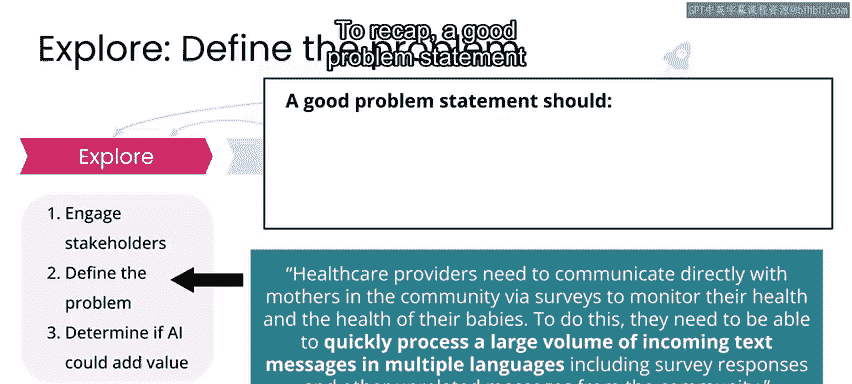
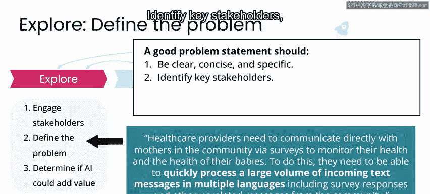

在尼日利亚项目的这个阶段，我们通过接触利益相关者和定义我们希望解决的问题，完成了探索阶段的前两个步骤。

---

本节课中，我们一起学习了AI项目探索阶段的两个关键步骤：**联系利益相关者**与**定义问题陈述**。我们了解到，一个精准的问题陈述是项目成功的基石，它能确保团队始终聚焦于解决真正的核心挑战，而非迷失在技术细节中。

在接下来的视频中，我们将探讨AI是否能在这一特定场景中创造价值。