# 014：探索阶段 - 人工智能能否增加价值？🤔

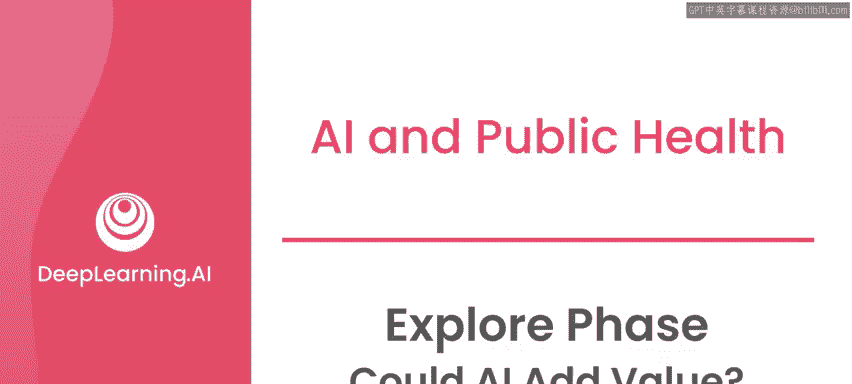

在本节课中，我们将学习探索阶段的最后一步：评估人工智能是否能为解决你所面对的问题增加价值。我们将通过一个公共卫生领域的实际案例，分析做出这一判断所需考虑的关键因素。

## 确定AI的价值潜力

探索阶段的最终步骤是确定人工智能是否能为解决你所处理的问题增加价值。实际上，在你深入了解问题、与更多利益相关者沟通的过程中，你会一直思考这个问题。你也会思考，为这个特定用例实施人工智能解决方案所需投入的精力、时间和专业知识是否值得。

在与利益相关者沟通后，你可能会发现一个更简单的解决方案就足以解决问题，这种情况经常发生。特别是考虑到，如果不这样做，你将需要为一个更复杂的人工智能系统投入大量资源。

对于我们一直在讨论的案例——帮助尼日利亚的医护人员处理短信，我们考虑了所有这些因素，与利益相关者合作，并最终决定探索人工智能作为潜在的解决方案。

然而，人工智能能否为任何特定解决方案增加价值，最终取决于你能获取的数据类型以及你试图解决的问题本身。

## 监督学习的数据基础

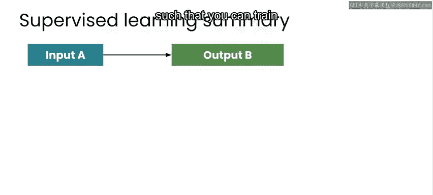

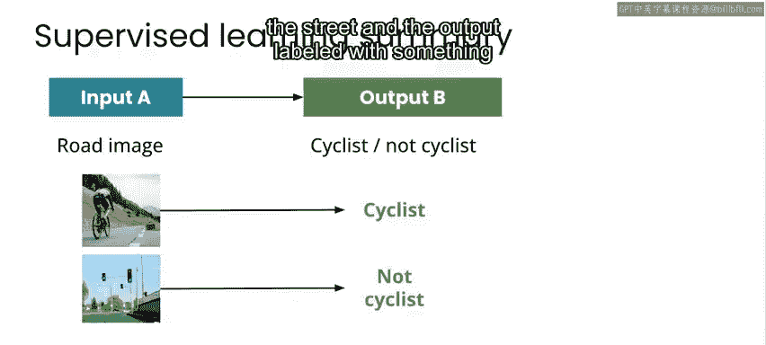

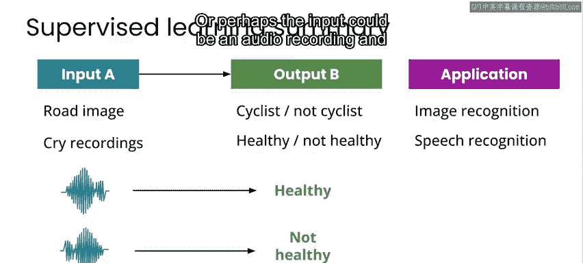

在本课程的第一周你了解到，对于监督式机器学习问题，你需要有数据。我们需要许多输入A和输出B的示例，以便训练机器学习模型学习从A到B的映射。你看到的这些输入A和输出B的示例，可能是图像和标签，例如输入是街拍图像，输出标签是“是否为骑行者”；或者输入是音频记录，输出是“健康”或“不健康”的标签。这对于任何你可能想处理的监督式机器学习问题都是类似的。

针对我们关注的孕产妇和婴儿健康这一具体案例，需要处理的数据是过去由诊所工作人员手动分类的短信数据库。从这个意义上说，我们拥有诊所收到的短信作为输入A，以及与这些短信相关的类别作为输出B。这些类别包括：

*   短信使用的语言
*   短信的特定主题
*   信息的时效性要求
*   是否是对之前发出的特定调查的回复

## 评估数据与可行性

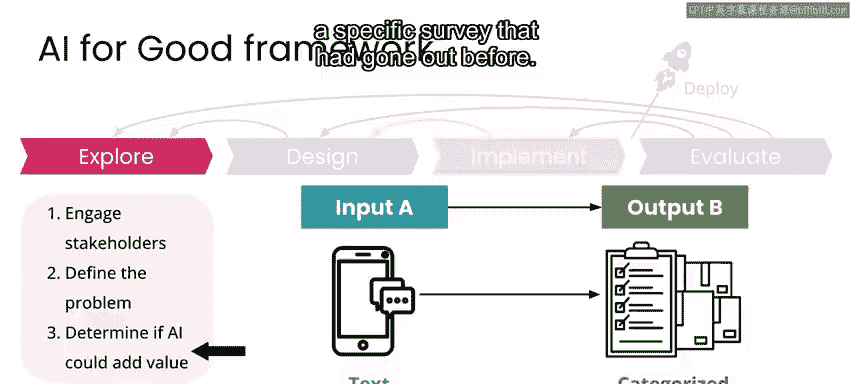

作为开发人工智能模型的训练数据集，这个用例的可用数据在总量上（尤其是某些语言的数据）似乎有些有限。但我们得出结论，在诊所工作人员的帮助下，我们可以通过新分类的示例来扩展训练数据。

有了这些输入的短信文本和输出的类别，看起来有足够的数据开始设计一个AI应用。这个应用可以自动分类和优先处理收到的短信，从而提高医护人员的工作效率，同时不影响其准确性。

在考虑人工智能能否为你正在进行的特定项目增加价值时，思考“不伤害原则”并考虑你的工作可能产生的任何负面影响非常重要。这些负面影响可能并不总是显而易见，尤其是你的工作最终可能造成伤害的方式。但如果你在项目开发的每个阶段都考虑潜在的负面结果，并与利益相关者就此合作，那么你将更有可能避免这些负面结果。

## 识别潜在危害

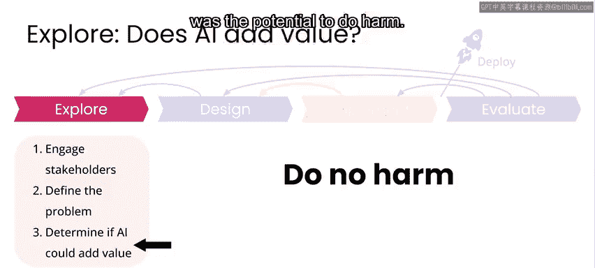

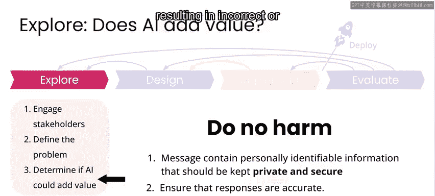

在我们的尼日利亚项目中，存在多种可能造成伤害的方式。以下是一些主要的方面：

*   **隐私与安全**：短信包含个人身份信息和人们的健康状况信息，两者都是敏感信息和个人信息，需要保密并安全存储。
*   **过度信任AI**：在AI辅助系统中，始终存在人们过度信任AI输出从而做出错误决定的可能性。在这个特定案例中，这可能导致AI对短信的错误分类，从而为母亲或孩子提供不正确或延迟的医疗建议。
*   **特定情境风险**：我们还有一些更具体的可能造成伤害的情况，特别是与我们支持的一种语言相关，该语言与一个曾遭受迫害的特定民族密切相关。

对于你正在处理的任何问题，都会有一些你经常遇到的普遍问题，如隐私和安全；也会有一些普遍问题，如人类与AI决策之间的权衡；还会有一些针对你特定情况的非常具体的问题。作为一个外来者，你无法提前知道所有这些。这就是为什么我们需要持续与利益相关者合作的原因之一。在这个案例中，必须有该特定语言社区的成员，他们能让我们理解可能造成伤害的全部程度。如果不与这些特定的利益相关者沟通，我们无法完全理解这一点。

## 探索阶段结束时的关键问题

在框架的每个阶段结束时，你应该问自己和团队许多问题，以确保你具备进入下一阶段所需的条件。

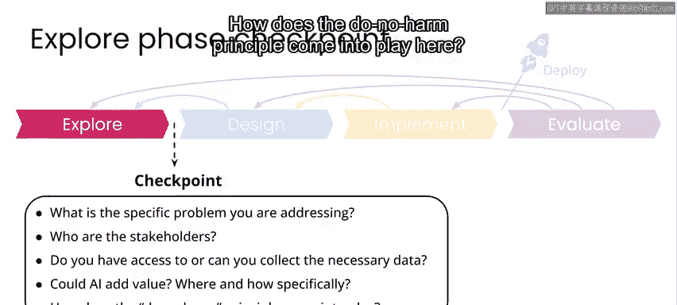

在探索阶段结束时，你需要能够回答以下问题：

*   **具体问题**：你正在解决的具体问题是什么？
*   **利益相关者**：利益相关者是谁？
*   **数据**：你是否能够获取或收集到必要的数据？
*   **AI价值**：人工智能能否增加价值？如果能，在哪里以及如何增加？
*   **不伤害原则**：“不伤害原则”在此如何体现？

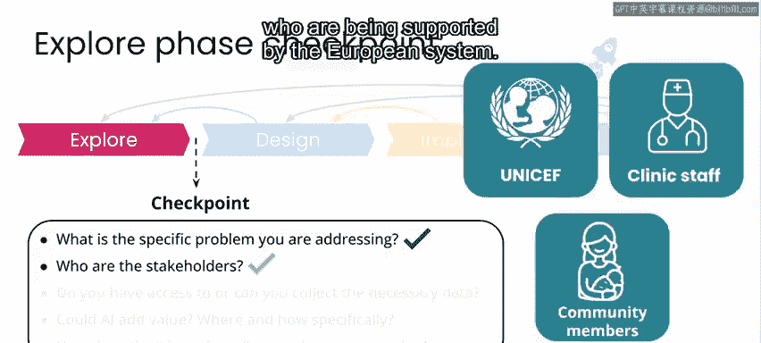

## 案例回顾：公共卫生项目

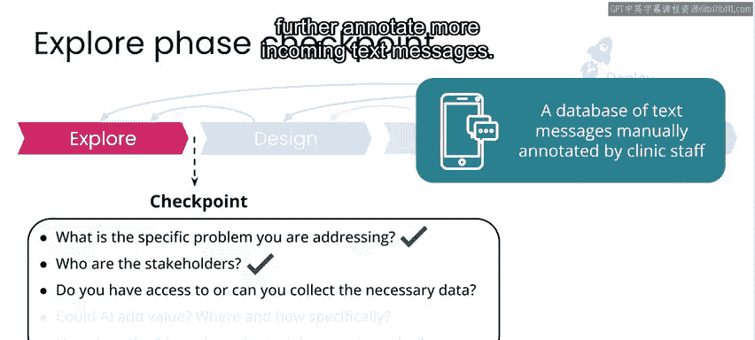

在我们一直研究的公共卫生示例中：

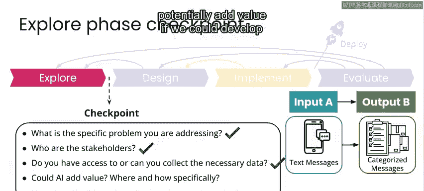

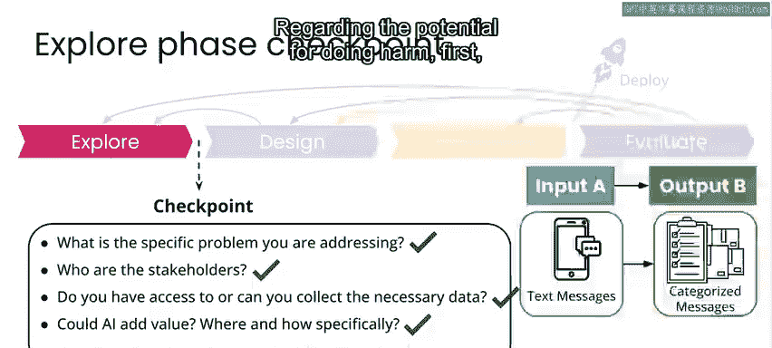

*   **具体问题**：医疗服务提供者需要通过调查直接与社区中的母亲沟通，以监测她们及其婴儿的健康状况。为此，他们需要能够快速处理大量涌入的、包含多种语言的短信，包括调查回复和来自社区的其他相关短信。
*   **利益相关者**：包括联合国儿童基金会代表、发送调查的诊所医护人员、母亲及其孩子，以及受U报告系统支持的社区中的其他人。
*   **数据**：我们能获取的数据包括发送到诊所的短信，以及分配给它们的类别或关键词。我们确定可以通过诊所工作人员的帮助进一步标注更多收到的短信，来扩展这个带标签的数据集。
*   **AI价值**：考虑到我们打算创建的带标签短信数据库，如果我们能开发一个系统来自动分类和优先处理收到的信息，人工智能就有可能增加价值。
*   **潜在危害**：首先，短信包含个人可识别信息和人们的健康状况信息，需要保密并确保安全。此外，我们旨在设计的系统将提供AI对问题的回复，如果一个人错误地信任了AI，这可能导致较差的体验，并可能为母亲提供不正确的医疗信息。此外，我们还有许多针对这个特定用例和特定人群的危害示例。

## 何时进入下一阶段

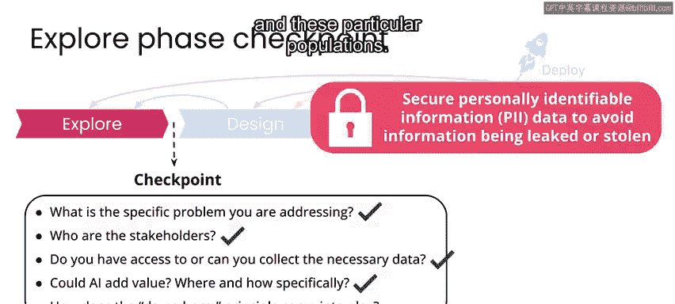

如果你在未来探索一个项目时，发现对一些问题的答案仍不清楚，最好在探索阶段花更多时间。你可以花更多时间研究问题并与利益相关者沟通，直到你们共同认为可以进入下一阶段。

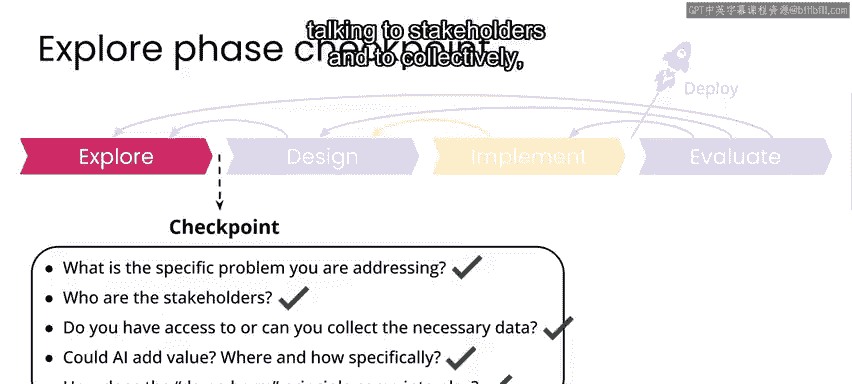

在我们的案例中，我们已经准备好进入项目的设计阶段。为了让大家了解这在现实中是什么样子，我想我们在探索阶段花了大约三到六个月的时间，只是为了弄清楚我们是否有条件继续推进，以及投入资源看看AI能否在此提供解决方案是否值得。我认为这可能是一个非常典型的时间线，甚至可能更长。

本节课中，我们一起学习了如何在探索阶段评估人工智能项目的价值潜力。我们分析了判断所需的数据基础、可行性考量，以及至关重要的“不伤害原则”与风险识别。最后，我们明确了结束探索阶段前必须回答的关键问题，并通过案例进行了回顾。

请加入下一节课，我们将一起探讨如何为医护人员设计自动分类和优先处理这些信息的系统。