# 015：设计阶段 🎨

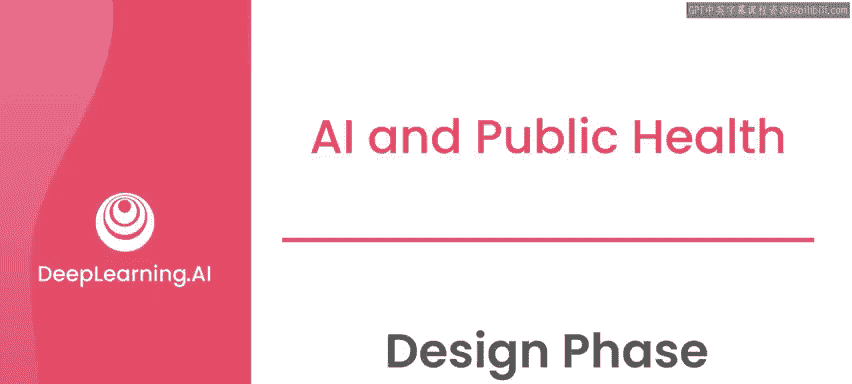

在本节课中，我们将学习AI项目流程中的“设计阶段”。在成功完成探索阶段后，你已经明确了问题，并确认AI可能带来价值。现在，我们将进入设计阶段，学习如何构建解决方案的原型，同时处理数据隐私、安全以及用户体验设计等关键问题。

---

## 设计阶段概述

设计阶段是连接问题定义与具体实施的桥梁。在此阶段，你需要深入审视数据、测试模型，并规划如何保障数据隐私与安全，同时设计出符合用户需求的体验。

上一节我们介绍了探索阶段，本节中我们来看看如何将初步构想转化为具体的设计方案。

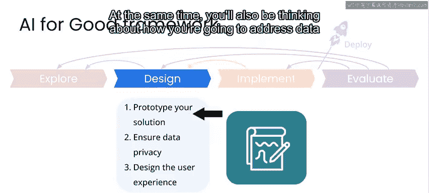

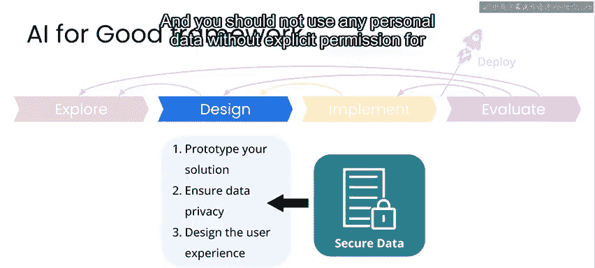

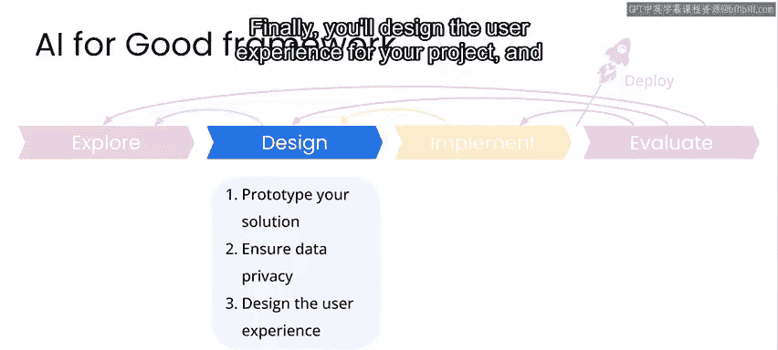

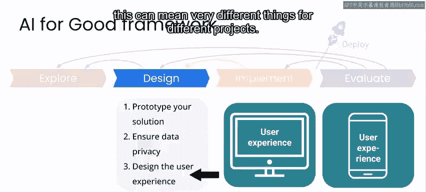

---

## 设计阶段的核心步骤

设计阶段主要包含三个核心步骤：解决方案原型设计、数据隐私与安全考量，以及用户体验设计。

以下是每个步骤的详细说明：

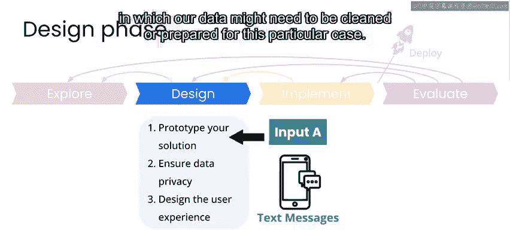

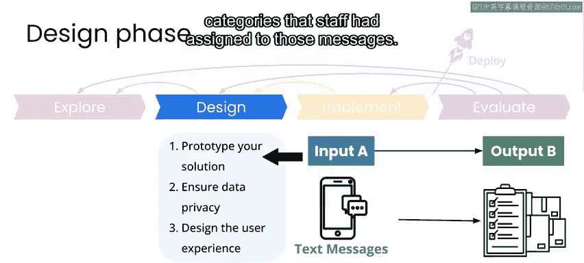

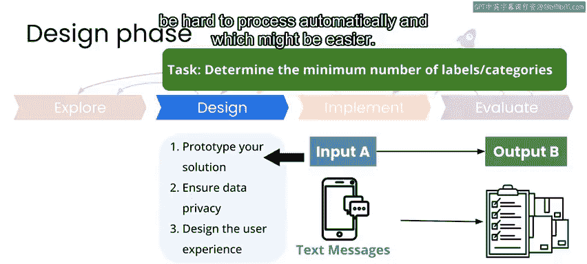

### 1. 解决方案原型设计

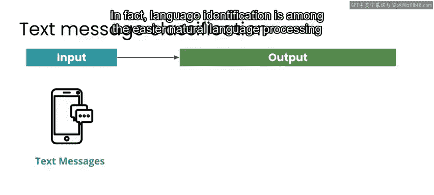

首先，你需要构建解决方案的原型。这包括更深入地分析数据，并测试一些初步的模型。

在之前的探索阶段，我们分析了数据并确定AI方案可能为项目增值。现在，在设计阶段，我们需要更深入地研究数据，以验证数据是否需要为特定用例进行清洗或准备。

以母婴健康项目为例，我们拥有的数据包含文本消息以及工作人员为这些消息分配的关键词或类别。在此阶段，我们着手确定训练数据中所需标签或类别的最少数量，并考虑哪些类别难以自动处理，哪些相对容易。

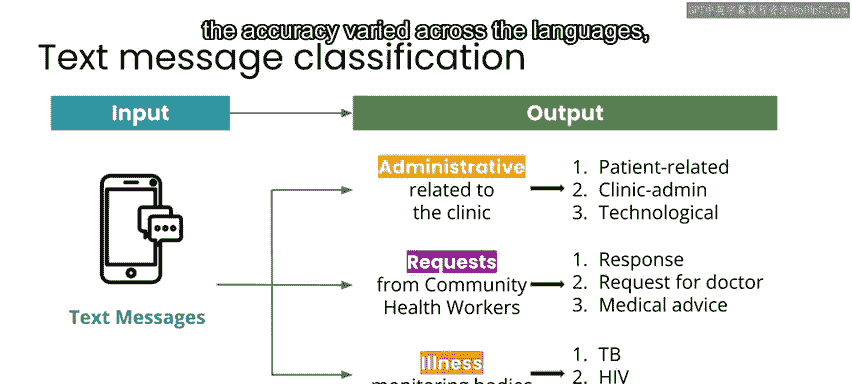

例如，识别消息的语言相对容易。事实上，语言识别是自然语言处理任务中较为简单的一类。其核心公式可以简化为：

**语言识别 = 识别文本所属语种**

另一方面，对消息内容进行分类可能非常困难。例如，尝试分类消息是否与孕产妇健康或其他问题相关，即使是这种简单的二元决策，准确率也不高，且准确率在不同语言间存在差异，这主要与特定语言的数据量有关。

在更详细地调查数据后，我们设计了一个模型和标注策略：让诊所工作人员为更多传入的消息进行标注，特别是在我们初始数据较少的特定主题和语言上。这将使我们能够将这些额外的标注用作新的训练数据，从而更快地更新模型并实现更多处理流程的自动化。

### 2. 数据隐私与安全考量

在处理涉及人员或财产信息的数据时，必须在项目的所有阶段慎重考虑如何处理数据，以确保其安全与私密性。未经明确许可，不应将任何个人数据用于特定用途。

无论你从事何种项目，都应默认采用隐私数据实践，确保所涉及数据的**隐私性、安全性和个人尊严**。

在母婴健康项目中，数据集包含个人（特别是医疗健康方面）的敏感信息。因此，我们谨慎确保数据存储和处理的安全。例如，消息从未暴露给在其常规工作之外无权查看的人员。这意味着，项目团队（如Idibon公司）本身也**无法以任何方式访问、查看或下载数据**。

这是一个很好的例子，说明我们在工业界的经验如何帮助应对医疗用例中的挑战。对于许多行业客户，由于敏感性和监管原因，我们同样无法查看他们正在处理的数据。因此，已经构建并经过第三方验证的防护措施，让我们更有信心能够尽力保护医疗社区的安全与隐私。

### 3. 用户体验设计

用户体验设计根据项目不同而差异很大。其目标是确保最终系统易于使用，并能有效解决问题。

对于母婴健康项目，最终用户是诊所的医护人员。因此，我们的目标是利用自动消息分类工具提高他们的工作效率。该项目的成功实施将使医护人员在减少处理传入短信工作量的同时，以更快的响应时间为患者提供更好的服务，并通过处理更多消息来帮助社区。

---

## 设计阶段的验证与迭代

完成设计阶段后，在进入下一阶段前，团队应共同回答一系列问题，以验证设计的可行性。

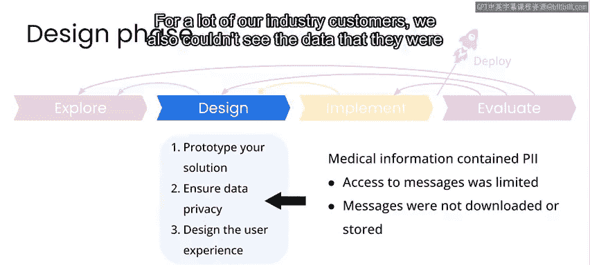

以下是需要回答的关键问题列表：

*   **关于数据**：你将如何解决数据不平衡、偏见、隐私或其他相关问题？
*   **关于模型**：你将实施何种模型？如何衡量其性能？
*   **关于问题解决**：你的设计将如何成功解决在探索阶段定义的问题？
*   **关于用户交互**：最终用户将如何与你的系统交互？

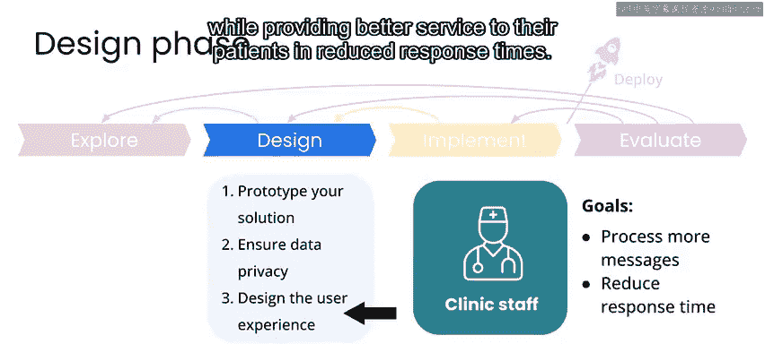

在回答这些问题时，你可能会发现遇到了未预见的挑战，例如数据问题、模型构建困难或用户体验设计缺陷。

在这种情况下，你可能需要**返回探索阶段**，从利益相关者那里获取更多信息，调查其他数据资源，甚至重新审视你试图解决的问题。

---

## 案例回顾：母婴健康项目设计决策

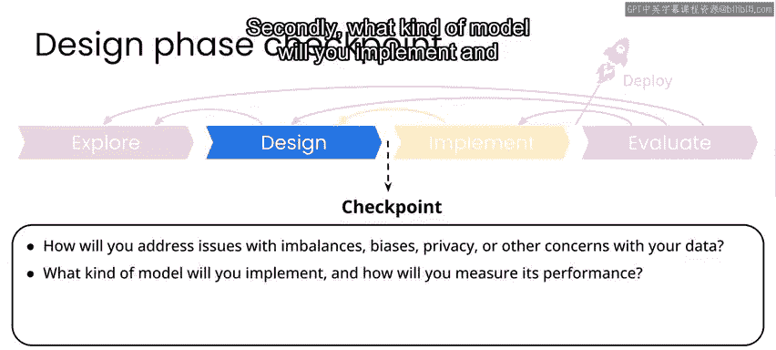

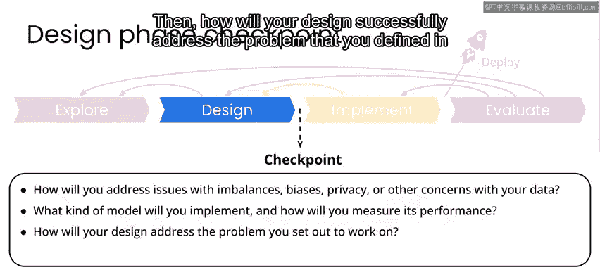

让我们回顾一下母婴健康项目的具体设计决策。

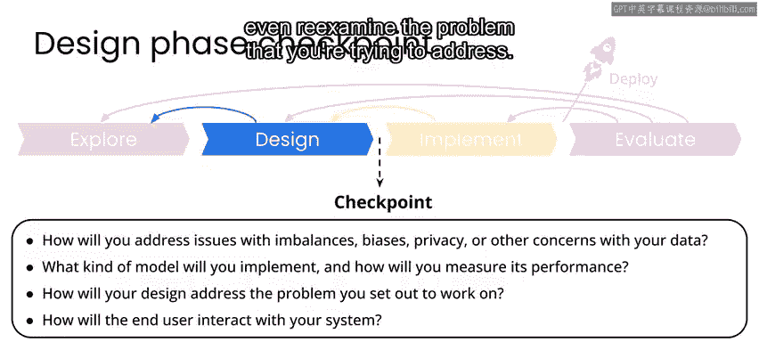

**数据考量**：涉及安全存储和处理个人信息。我们采用了已为行业客户设计的系统，确保无权限人员无法访问数据。

**模型设计**：我们采用了一个已在行业客户中部署过的模型版本。这让我们能够将大规模工业场景中积累的知识免费应用于此医疗场景。我们还采用了让现有诊所工作人员对传入短信进行额外标注的策略，以构建数据库，使模型在分类我们所关心的各种语言和类别时更加稳健。

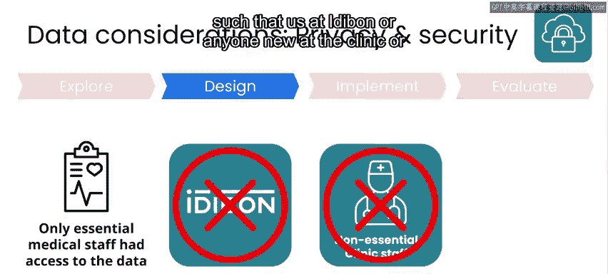

**系统价值**：该系统通过让诊所医护人员处理更大量的短信并为患者提供更快的响应时间，来解决我们正在处理的问题。

**用户交互**：系统的用户（诊所工作人员）将收到关于新消息分类和优先级的自动更新。他们会审查相同的类别和优先级以确保准确性，并可以手动重新分配类别或优先级，以帮助模型的进一步改进。

当然，对于这个特定用例，我们略过了许多细节。设计阶段可能持续数月甚至数年，尤其是对于需要缓慢、慎重、仔细构建的复杂系统，以确保不违反“不伤害”原则。在你自己的项目中，你可能需要花费大量时间来验证你选择的AI模型和最终用户体验相关的设计决策。

---

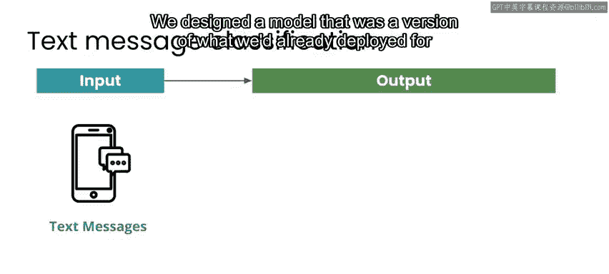

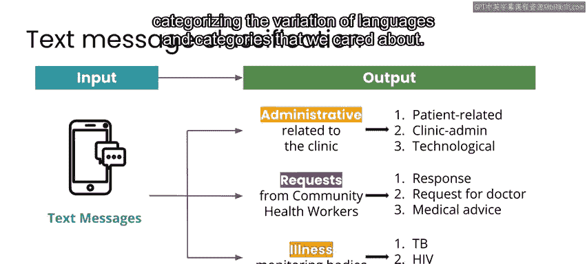

## 总结与下一步

本节课中我们一起学习了AI项目流程中的设计阶段。我们了解了如何构建解决方案原型，深入探讨了数据隐私与安全的至关重要性，并学习了如何设计以用户为中心的体验。设计阶段是一个需要反复验证和迭代的过程，确保方案切实可行。

一旦你认为已经有了一个设计良好的解决方案，那么就可以准备进入实施阶段了。

在下一节课中，我们将一起探讨如何从设计阶段过渡到实施阶段。