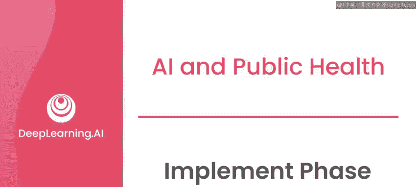
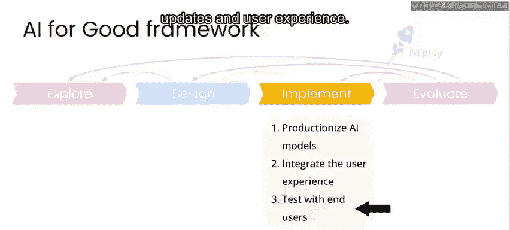
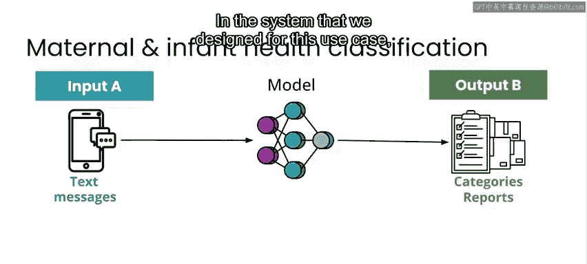
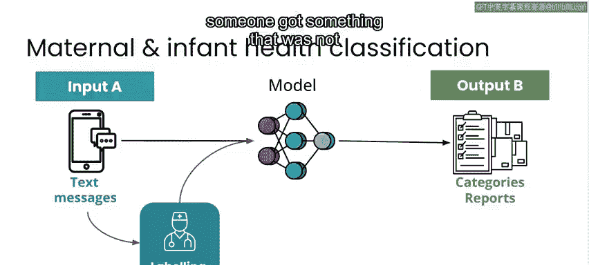
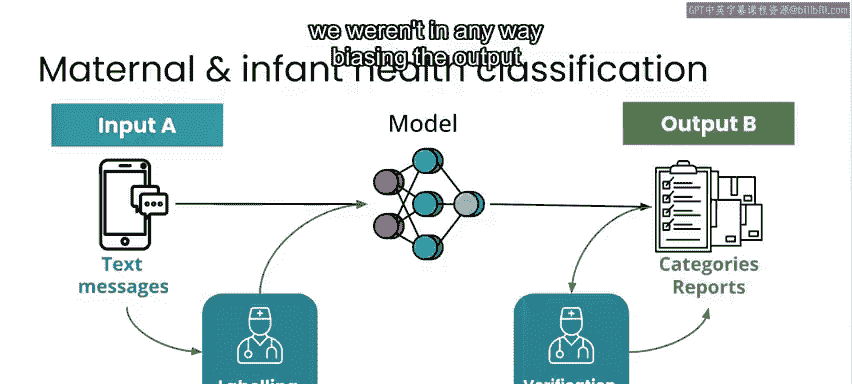
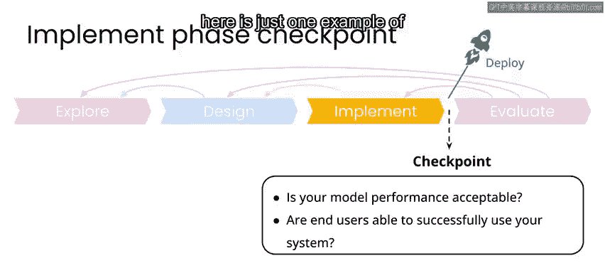

# 016：实施阶段 🚀

在本节课中，我们将学习AI项目流程中的“实施阶段”。我们将了解如何将设计好的模型策略和系统投入生产环境，进行最终测试，并确保其性能与可用性达到要求。我们将通过一个尼日利亚孕产妇健康项目的具体案例，来理解实施阶段的关键步骤与考量。

---

在完成了数据审视、模型策略设计、标注方案制定、数据隐私安全规划以及用户体验设计之后，您便已准备就绪，可以开始实施您的系统了。

在这个阶段，您将通过运行模型的最终训练与测试，并将其部署到可扩展的生产环境中，为正式上线做好准备。我们将重点关注监控模型性能、理解潜在的失败模式等问题。这里的“生产”意味着，将您在设计阶段于测试环境中开发的模型，变得更加**可用、可靠和健壮**，使其成为生产系统的一部分，并可供最终用户应用程序使用。

当您准备将模型部署到生产环境并进行迭代与集成时，您将进入一个能够进行端到端测试的阶段。

这意味着需要审视系统中从一端到另一端的所有环节，包括**数据吞吐量、模型监控与可靠性、系统更新以及用户体验**。

---

上一节我们介绍了实施阶段的总体目标，本节中我们来看看一个具体案例的实施过程。

对于之前描述的尼日利亚孕产妇健康项目，我们使用的模型最初是为行业应用开发的一个非常简单的单层模型。我们针对这个特定用例、可用的语言、元数据、指令和非结构化数据对其进行了重新训练。

在我们为该用例设计的系统中，有一项要求是标注工作必须由诊所的工作人员完成。

这主要有两个原因：一是他们具备专业知识，已经处理过这些信息；二是出于隐私考虑。我们不想仅仅为了更新机器学习模型，就雇佣额外的人员来查看受助者的个人健康信息。

---

考虑到这些医护人员的时间有限，这项工作的安排如下：对于语言检测等极少数任务，由于模型准确率很高，几乎以全自动方式完成。如果遇到模型无法识别的语言，工作人员可以快速手动重新分配。

在其他情况下，则由人工复核模型的预测结果，但重点放在模型不确定的预测上。

因此，我们会特别提出模型无法做出准确预测的用例，而不是直接给出模型预测结果，并确保在这些情况下仍然进行人工标注。这样，我们就避免了因过多不正确的模型预测而给输出结果带来偏差。

---

以下是完成实施阶段需要满足的两个核心条件，您需要能对这两个简单问题给出肯定的回答：

1.  **您的模型性能可以接受吗？**
2.  **最终用户能够成功使用您的系统吗？**

在实施阶段，您可能会发现模型性能或系统可用性存在问题，这时就需要返回设计阶段去解决这些问题。

在我们的案例中，经过数月的工作，我们开发了模型，将其与用户体验集成，并以诊所工作人员作为最终用户对整个系统进行了测试。

模型性能是可以接受的，并且我们能够证明模型性能在持续改进，进而持续提升诊所工作人员的整体处理量和响应速度，尽管他们仍然需要手动复核和分类一部分新收到的信息。至此，我们已准备就绪，可以上线并部署该系统了。

😊 实际上，这里讨论的项目只是众多可能的设计与实施方案中的一个例子。您特定的项目可能会涉及大量与技术挑战相关的问题。

例如**系统正常运行时间、低延迟预测、模型重新训练时间**等，以及许多其他关于现实世界AI应用的实际问题，这些问题通常不属于更偏理论或学术的AI课程或您可能习惯的实验内容。

因此，我们不会在此详细讨论这类问题，但我想强调它们确实存在。如果您有兴趣成为部署真实AI系统的一员，我强烈建议您也要了解和体验在规模化部署任何技术时会面临的各类问题。

在本课程中，您需要关注的重点是从探索阶段确定的问题定义，到项目评估，直至最终阶段的整体流程。在最后，您仍然应该能够根据最初设定的问题定义来评估您的项目。

这就是对您成果的评估，以及对使用并从您所创建系统中获益的用户体验的评估。

---

**本节课总结**

在本节课中，我们一起学习了AI项目流程中的“实施阶段”。我们了解了如何将模型部署到生产环境，进行端到端测试，并确保其满足性能和可用性标准。通过尼日利亚孕产妇健康项目的案例，我们看到了在实施过程中需要考虑的实际因素，如隐私保护、人机协作流程设计等。最后，我们明确了成功进入下一阶段的两个关键条件：可接受的模型性能和成功的用户体验。下一节课，我们将进入本项目的最后一个阶段——评估阶段。