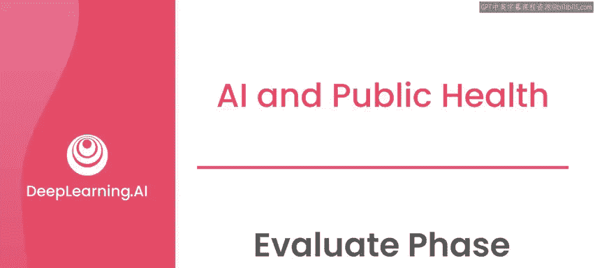
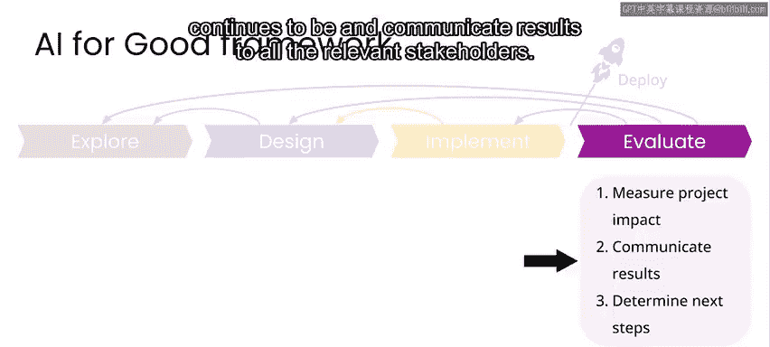
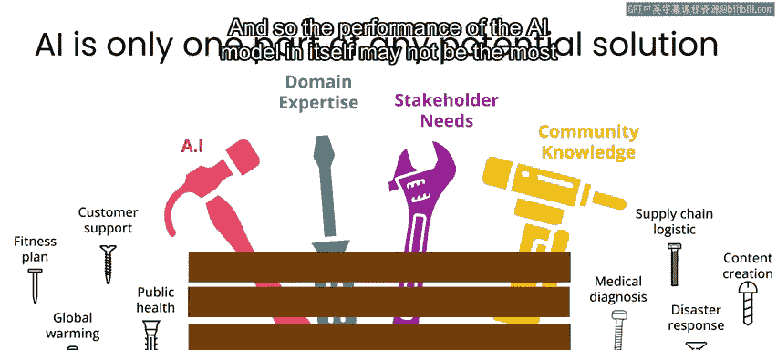
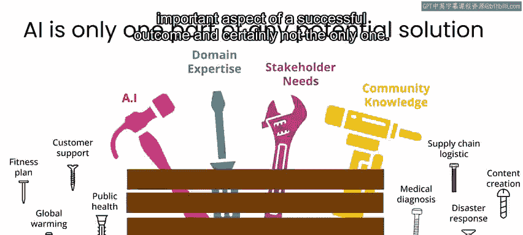
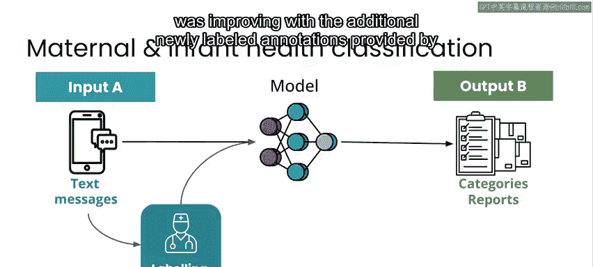
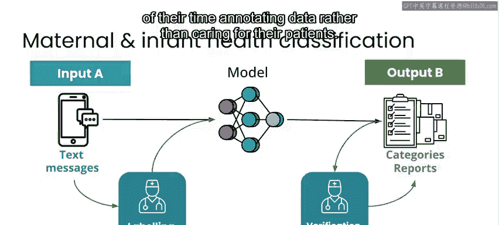
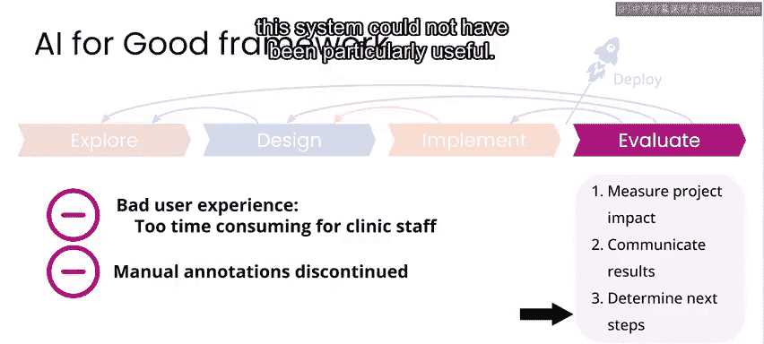
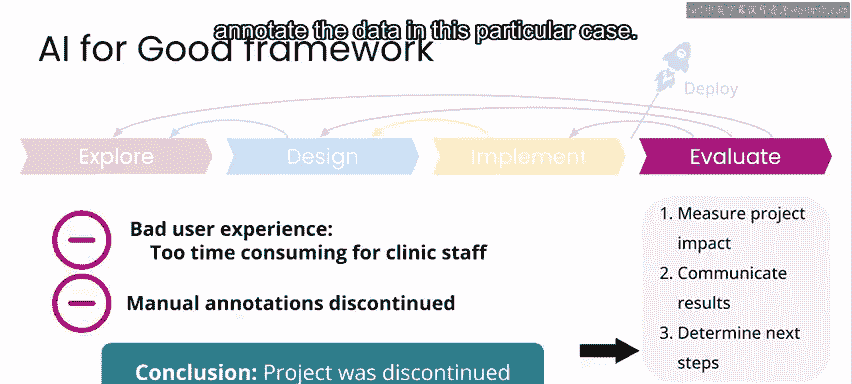
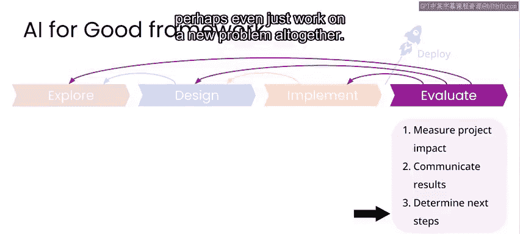

# 017：评估阶段 📊

在本节课中，我们将学习AI项目框架的最后一个阶段——评估阶段。我们将探讨如何衡量项目的成功与否，如何与利益相关者沟通结果，并通过一个实际案例理解即使技术成功，项目也可能因其他因素而失败。

---

## 概述

系统部署后，项目将进入评估阶段。在此阶段，你需要尝试衡量项目的成功程度，并将结果传达给所有相关利益相关者。

衡量项目的影响可能很棘手。但如果你一直遵循本框架，早在探索阶段，你就应该通过详细且具体的问题陈述，至少定性地定义了成功的模样。

---

## 定义成功

在之前介绍的案例项目中，问题陈述是：**医疗保健提供者需要通过调查直接与社区中的母亲沟通，以监测她们及其孩子的健康状况。为此，他们需要能够快速处理大量涌入的多种语言的短信，包括调查回复和来自社区的其他无关信息。**

正如之前强调的，对于任何AI项目，AI的技术组件只是解决方案的一部分。它是一个更庞大、可能更复杂的技术或产品中的一个组件。因此，AI模型本身的性能可能不是成功结果中最重要的方面，当然也不是唯一的方面。

---

## 案例评估：技术成功与用户体验失败

在我们的案例中，我们发现模型确实表现良好，并且随着诊所工作人员提供的新标记数据的增加而不断改进。这使得工作人员的工作效率得以提高，他们能够处理更多的患者沟通，且平均响应时间更短。

然而，随着项目的进行，诊所工作人员最终发现这对他们来说是一种糟糕的用户体验。他们感觉自己现在将更多时间花在了标记数据上，而不是照顾病人。

即使系统在信息自动分类方面有所改进，诊所工作人员仍需花费相同的时间来审查边缘案例、模型错误或低置信度的预测。他们无法直接体验到一些自动化任务，例如基于语言自动重新路由信息。因此，他们不太能直观感受到模型的改进或他们个人整体生产力的平均提升，尽管在他们的日常手动任务中感觉并非如此。

这种涉及人工标记和编辑数据的系统在AI应用中并不少见。可以说，我参与过的大多数AI系统都考虑到了持续获取人工标记以更新模型，其中大多数标记工作由专家（如诊所工作人员）完成。因此，这种特定的架构并不罕见，然而，这种类型的人机交互在这个特定案例中并不成功。

---

## 用户体验的重要性

这正强调了我们的观点：**确保标注员（无论是外包标注员还是专家标注员）拥有良好的用户体验，与设计AI解决方案中纯粹的机器学习部分同等重要且复杂。**

为了具体说明提供良好用户体验的复杂性，以下是一些人们尝试改善AI协作中用户体验的方法，这些方法旨在解决标注员可能因工作而感到沮丧或疲劳的问题：

*   **游戏化系统**：例如，让标注员看到他们的改进如何提高模型性能，从而提升整体准确性的计数。然而，许多最初听起来不错的方法往往效果不佳。有大量证据表明，试图将系统游戏化本身会成为一种疲劳源，只有那些在排行榜或游戏化评分系统中名列前茅的人才会在工作中获得更好的体验。

因此，思考如何创建能够结合人类与机器智能的界面是非常困难的。

---

## 项目结果与反思

在我们的案例中，虽然我们实施的系统似乎成功解决了问题陈述中概述的一些问题，但最终对于关键利益相关者——医疗保健提供者自身——来说，用户体验很差。没有大量的标注工作，这个系统就不会特别有用。因此，我们最终终止了该项目，因为替代方案要么需要诊所工作人员投入更多时间和精力（这对他们来说是糟糕的体验），要么我们需要寻找外部方来标注数据，但在这个特定案例中，我们不愿意为了让更多人标注数据而牺牲隐私。

显然，我们对项目最终未能成功感到失望，不是为我们自己，而是为我们试图支持的社区。然而，我们在此过程中吸取了宝贵的教训。

例如，我们了解到这类系统如何在医疗保健的某些应用中提高效率，但我们也突显了一个事实：在更广泛地推广此类系统之前，需要解决重要的用户体验挑战。

---

## 后续发展与原则坚持

自我们完成这个项目以来的八年里，实际上还有其他一些尝试将AI整合到通过U-report系统半自动化管理医疗保健的案例。例如，我十分尊敬的“无国界译者”组织进行了一次尝试，这是一个你可以查看的开源解决方案，他们也遇到了一些相同的问题，即无法充分向医护人员传达他们所做的改进。就在最近，在我们失败的尝试八年之后，我终于看到了一些来自自然语言处理研究人员的早期研究论文，他们正在与联合国儿童基金会和U-report合作，似乎已经解决了问题——前提是有一个良好的用户体验。

但我认为，即使是这些研究人员也不会宣称这个问题已经最终解决。归根结底，我认为这对于任何思考“AI向善”项目的人来说都是一个非常好的用例：**你可能做对了一切，但最终仍然没有产生成功的影响。** 正如我之前所说，大多数社会公益项目会失败，大多数AI项目也会失败，将它们结合起来并不会产生魔力，反而会让事情变得更难。

希望这也是一个很好的例子，说明了为什么“不伤害”原则如此重要。如果我们当时在那个原则上妥协，比如在隐私方面，那么最终我们所做的就是在没有长期利益的情况下损害了人们的隐私。如果我们采用的解决方案在开始时标注员的准确性实际上较低，那么我们就在标注员的工作、临床医生的工作以及患者的健康方面都做出了妥协，以换取一个可能更积极的未来结果——而这个结果从未发生。

因此，你需要记住，**即使规划良好，并且有强烈信号表明你的解决方案直到最后都在有效工作，你也不能在依赖你所构建系统的任何人的健康和安全方面妥协。**

---

## 其他领域的挑战与启示

我想分享其他一些领域的例子，在这些领域，AI似乎显然可以提供帮助，例如医疗保健和公共卫生，但当我们尝试构建系统时，并不清楚我们能否在不造成伤害的情况下推广这些系统，或者它们最终是否会对利益相关者产生积极影响。

我认为COVID-19是一个很好的例子。在COVID-19之前，有相当多的研究表明，AI在通过CT扫描、X光和其他医学影像识别某些疾病方面可能有用。因此，在COVID-19大流行期间，一些研究小组自然开始研究通过医学影像（如胸部X光、CT扫描等）来诊断COVID-19。其中一些小组发表了论文，并根据结果表明基于胸部影像有可能提供准确的COVID诊断，从而宣布他们的项目成功。

然而，相对廉价且有效的COVID鼻拭子检测在大流行早期就已广泛普及。因此，几乎没有（如果有的话）实际需要使用更昂贵、更耗时的胸部影像来诊断COVID。此外，从未明确的是，在少量X光和CT上进行的离线测试，当推广到世界各地，面对更多样化的X光机、人群和患者成像体位时，是否仍能保持准确性和可扩展性。因此，尽管构建这些COVID-19影像检测系统的人是善意的，但最终没有一个对COVID诊断产生影响。

---

## 保持积极与务实

我意识到，我首先介绍了一个失败的项目，这在你可能上过的任何AI课程中都从未见过。但我认为这是一个重要的教训：**你着手进行的任何AI项目，失败的可能性都大于成功。** 因此，这也有积极的一面：如果你专注于“AI向善”，你不妨瞄准那些潜在收益极高的领域，因为在你成功的时候，可以积极影响最多的人。

就像我说的，虽然我们的孕产妇健康案例没有成功，但它后来为现在看起来更成功的、能够通过短信帮助孕产妇健康的系统提供了信息。这与我过去的一些其他案例类似。例如，我在2011年曾致力于大规模疾病暴发检测。我们当时对这些技术进行了很长时间的迭代，但那时我们未能赶在疫情暴发之前。然而，我合作过的同一家公司后来成为最早识别出COVID-19的机构之一。这再次是在我们首次尝试某事但未成功的八年之后。当时我们没有伤害到我们意识到的人，我们强调了像疫情监测这样的监控可能伤害人们的方式，这为后来非常重要的COVID早期检测提供了信息，并在更大范围内帮助影响了全球政策。

在思考“AI向善”项目时，请保持积极和务实。回报可能需要比你最初预期的更长的时间，但大多数AI项目都是如此。因此，当你瞄准更大的目标时，财务回报之外的收益也会大得多。

---

## 确定后续步骤

当涉及到为你自己的项目确定后续步骤时，在评估结果后，你可能会意识到需要回到实施阶段，调整你的模型或改进用户体验。或者你可能发现设计中存在问题，需要回到设计阶段，开发系统的新版本。

也有可能你会发现无法提供有意义的影响，因此需要一路返回到探索阶段，调查你最初着手解决的问题的其他细节或角度，甚至可能完全转向处理一个新问题。

在我们这里强调的、致力于为尼日利亚孕产妇健康提供更好支持的项目案例中，我们考虑的后续步骤包括如何改进用户体验，使诊所工作人员能更直接地看到系统的好处。我们评估了在时间和项目投入方面对诊所工作人员要求的潜在权衡，并确定虽然可能存在一条路径，但造成更差用户体验或对患者响应时间更长的风险是明显存在的，因此我们没有继续这个项目。

然而，十年后，U-report系统已在全球数十个国家部署，并通过借鉴我们和其他类似项目的经验教训，实现了真正的改进。现在，它确实开始包含各种AI工具，看起来可能开始支持诊所工作人员，进而支持他们所服务的社区。

---

## 总结

本节课结束了关于“AI向善”项目框架的介绍，我们走过了探索、设计、实施和评估项目的四个步骤。你将把这个框架应用到本课程中呈现的案例研究中。随着每个新案例研究，你将从广泛的“AI向善”项目中获得关于细微差别和挑战的新视角。

我想用另一个项目聚焦来结束本周的材料，这次来自Iva Gumnishka，她是“Humans in the Loop”公司的创始人兼CEO，该公司专注于赋能受危机影响的社区，在全球AI项目中从事重要工作。Iva将重点介绍每当你在工作中涉及来自受危机影响社区的协作者时需要牢记的事项。