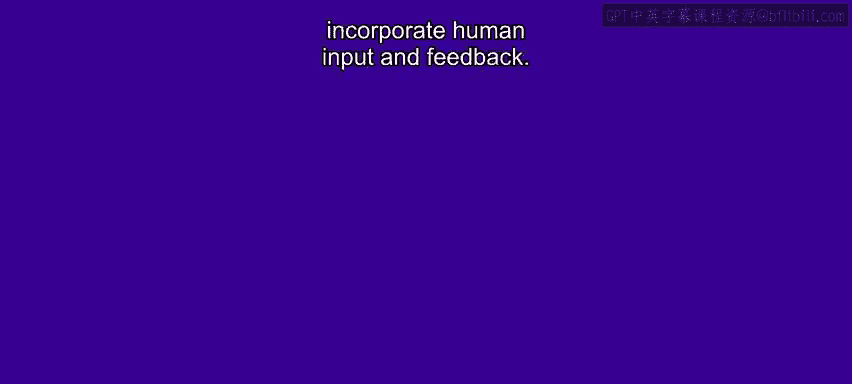
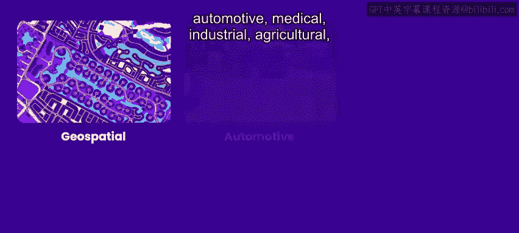
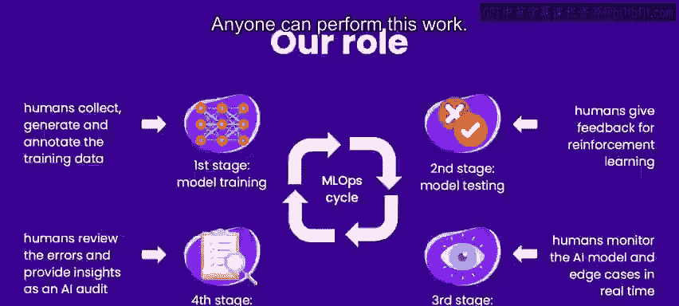
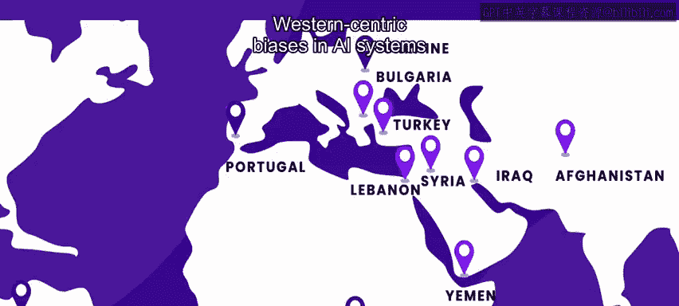
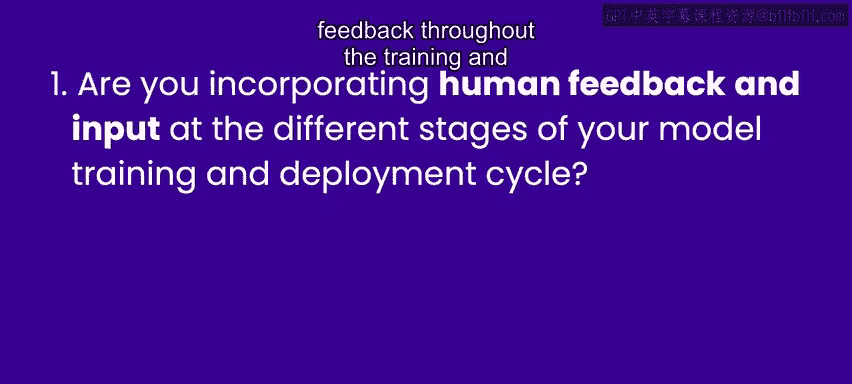

# 018：构建AI伦理供应链 👥➡️🤖

在本节课中，我们将学习如何为人工智能系统构建一个道德的供应链。我们将探讨人类在AI开发周期中的关键作用，以及如何通过包容性和公平的实践来确保AI系统的多样性与公正性。

---

大家好，我是伊娃，是社会企业“Humans in the loop”的创始人兼首席执行官。

我们是一家为AI系统提供数据和人类输入的道德供应商，我们帮助公司、学术机构和政府为其AI系统获取、收集数据，并整合人类的输入与反馈。

我们致力于多个与AI相关的项目，涵盖地理空间、汽车、医疗、工业、农业和零售等应用场景。

我们数据集的一些应用包括：用于检测海岸垃圾和可回收材料的标记垃圾数据集；用于训练AI驱动机器人手术的数千个标记手术帧；以及为保险公司自动化理赔流程而检测车辆损伤的数据集。

除了收集和标注数据集，我们的人类操作员还参与了实时验证与批准工作。在所有项目中，我们的参与对于将人类对数据的理解和解释传递给AI系统是必要的。

否则，计算机视觉模型如何知道外科医生正在进行所谓的“抽吸”操作，或者汽车上的损伤应被归类为“划痕”？

---

## 人类参与的重要性与伦理考量

上一节我们介绍了人类在数据标注中的角色，本节中我们来看看为何这种参与至关重要。

人类输入和反馈对于训练可信赖的AI系统至关重要。而伦理和多样性是贯穿整个过程都应考虑的关键因素。

否则，模型可能会学习到有偏见的知识。例如，模型可能只学会识别进行手术的白人手掌，或者只能分析美国典型的车辆损伤类型，这最终可能伤害许多终端用户。

其他潜在的偏见也可能发生：如果AI模型学会将穿手术服的男性归类为医生，而将穿手术服的女性归类为护士；或者模型在检测一种肤色上的皮肤癌时准确率远高于另一种肤色。

---

## AI开发周期中的人类介入点

那么，这个过程是怎样的？我们又在何时介入呢？

在整个AI训练和部署周期中，即所谓的机器学习运维周期或MLOps周期，始终需要人类的参与。

以下是人类介入的几个关键阶段：
*   **训练阶段**：当你训练模型时，需要收集和标注训练数据。
*   **测试阶段**：测试模型时，可能需要人类反馈来强化期望的行为。
*   **部署阶段**：系统部署后，人类可能需要参与实时监控和处理警报。
*   **部署后阶段**：你可能需要审查模型的输出并审计其性能。

这些都是全球各地的人们可以参与的领域，他们贡献自己对数据的理解和道德判断。这项工作很多是手动的，但也要求操作员在特定领域发展专业知识并运用判断力。

---

## 创造包容性的就业机会

上一节我们了解了人类在技术流程中的作用，本节我们来看看这种工作如何与社会价值结合。

任何人都可以从事这项工作。仅仅因为你是人类，你就已经具备为AI标注和解释数据的资格，你独特的观点对于使AI系统更加多样化很有价值。

我们从中看到了为弱势群体创造就业机会的巨大潜力。更具体地说，我们专注于那些受世界各地武装冲突影响而流离失所的人们。

迄今为止，我们已为中东、欧洲和非洲的1000多人提供了就业。他们的参与有助于消除AI系统中的西方中心主义偏见，并融入不同的观点。

例如，在收集和标注食物图像时，我们的工作者能带来对面包外观或不同菜肴名称的多种理解。

此外，我们确保他们因其重要工作而获得有尊严的报酬。通过这种方式，我们保证了AI系统的创建不会建立在剥削人类劳动力的基础上（即所谓的“血汗工厂”）。

通过我们的社会企业，我们正在对弱势群体的生活产生影响（通过连接他们与在线远程工作），同时也对AI系统产生影响（通过确保它们能够获取多样化且符合道德来源的数据和人类输入）。

---

## 构建道德供应链的三大准则

当你开始自己的“AI向善”项目时，请记住考虑以下三点：

以下是构建道德供应链的三个核心准则：
1.  **贯穿全程的人类参与**：你是否在整个AI模型的训练和部署周期中融入了人类输入和反馈？
2.  **多样化的参与者**：你是否使用了多样化的人类群体来提供这些输入？
3.  **有尊严的报酬**：你是否确保他们因其工作获得了有尊严的报酬？

遵循这三条准则，你将确保为你的AI模型创建一个道德的供应链。祝你好运！

---

**本节课总结**：本节课我们一起学习了构建AI伦理供应链的重要性。我们认识到人类在AI开发周期中不可或缺的作用，包括数据标注、反馈提供和系统监控。我们探讨了确保参与者的多样性和给予其公平报酬对于消除偏见、创建更公正、更可信AI系统的关键意义。记住，道德的AI始于道德的供应链。