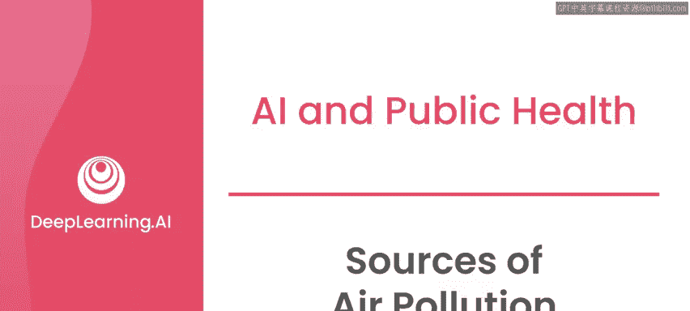
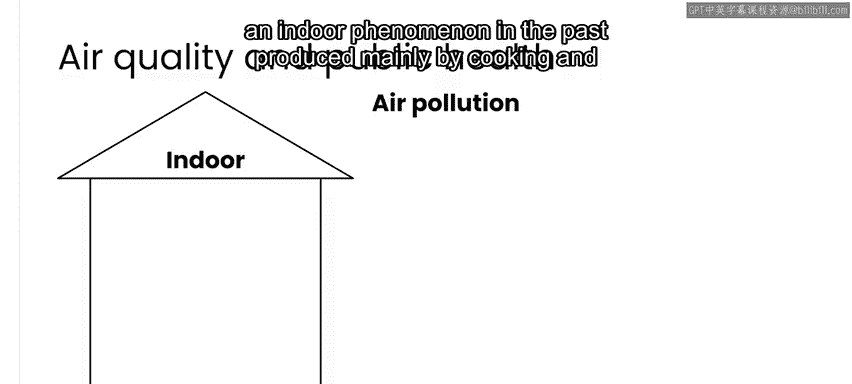
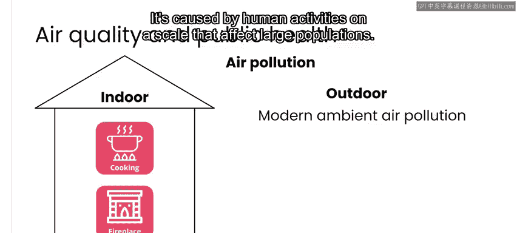
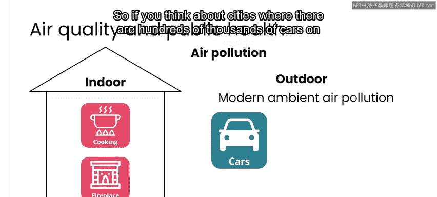
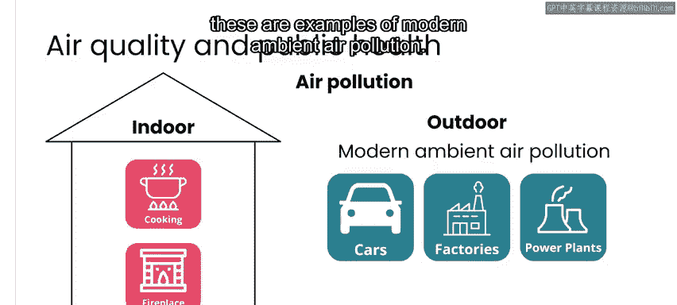
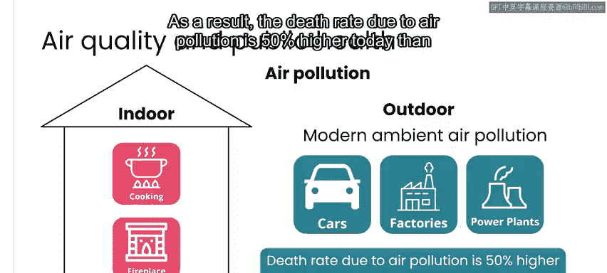
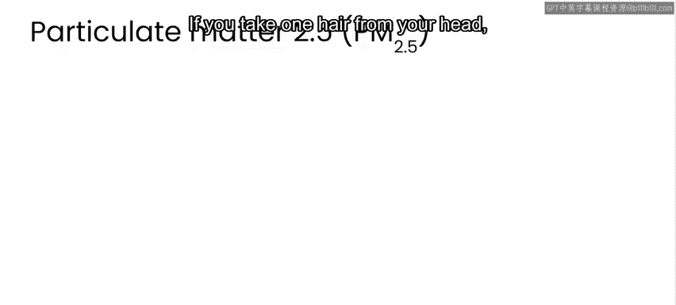
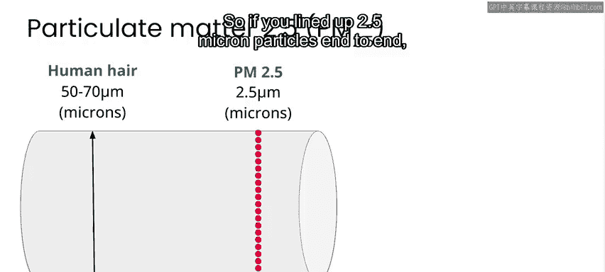
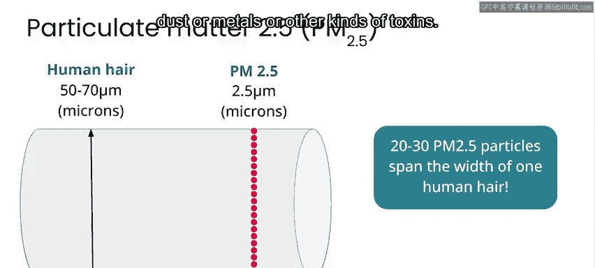

# 020：空气污染的来源与危害 🌫️

在本节课中，我们将学习空气污染的主要来源、其对公共健康的严重危害，并重点了解最常见的空气污染物——PM2.5。

---

正如上一节视频所述，污染是一个重大的公共卫生问题。每年有数百万人因长期暴露在污染的空气中而死亡。

事实上，每年因空气污染导致的过早死亡人数，与新冠疫情高峰期间因COVID-19导致的年死亡人数相当。

空气污染可能来自许多不同的来源，既有人为来源，也有自然来源。

例如，如果你像我一样在加利福尼亚，可能会经历野火造成的空气污染；在世界其他地区，则可能遭遇沙尘暴或活火山喷发。然而，大多数空气污染，特别是长期持续的空气污染，都源于人类活动。而在人类活动中，最主要的污染源是燃烧化石燃料。

本节视频，我们将具体了解什么是空气污染，以及它对公共健康构成的危险。

---

如果你曾见过工厂或炼油厂的烟囱冒出浓烟，闻过道路上车辆或路过火堆排放的废气，那么你就对空气污染有了亲身体验。这是我们许多人日常都会经历的事情。

与空气污染相关的健康问题并非新问题，事实上，它已存在数千年之久。

近期最大的不同在于，过去的空气污染主要是一种室内现象，主要由家庭内用火烹饪和取暖产生。事实上，在那些使用明火烹饪或取暖且通风不良的地方，空气污染仍然是一个严重问题。

关于这种长期存在的空气污染形式，一个令人鼓舞的消息是，随着更好的技术和信息让更多人了解如何更安全地烹饪和取暖，这种情况正在减少。

然而，根据《柳叶刀》杂志2022年发表的一篇文章，所谓的现代环境空气污染正在加剧。

现代环境空气污染指的是室外空气污染，它由大规模影响大量人口的人类活动引起。例如，在城市中，道路上数十万辆汽车以及工厂和发电厂都在向空气中排放烟雾，这些都是现代环境空气污染的例子。

尽管一些城市和国家通过政策和更好的技术，在区域范围内减少了空气污染，但在全球范围内，随着我们对商品、燃料和电力的需求增长，以及越来越多的人生活在城市化社区中，污染仍在持续加剧。

因此，如今因空气污染导致的死亡率，比仅仅20年前高出50%。

---

最常见的空气污染物由人类活动产生，其中包括被称为**颗粒物**的物质（指非常微小的物质颗粒，通常只有几微米大小），以及其他如臭氧、铅、氮氧化物、硫氧化物和碳氧化物等。

在这些污染物中，最常见且在全球范围内导致最多死亡的是颗粒物，特别是直径小于2.5微米的颗粒物，简称**PM2.5**。

如果你不熟悉“微米”这个计量单位，可以通过以下方式直观理解。

取一根你的头发，一根典型的人类头发直径约为50至70微米。

因此，如果将2.5微米的颗粒首尾相连，需要20到30个这样的颗粒才能跨越一根人类头发的直径。可见这些颗粒极其微小。

正是由于其极其微小，当你吸入它们时，它们可以进入肺部最深处，甚至穿过肺部进入你的血液系统。这就是它们如此危险的原因：吸入后，它们会深入你的体内并常常滞留其中。这些细颗粒物可能由灰烬、灰尘、金属或其他种类的毒素组成。

当你长期吸入过量的PM2.5时，会导致肺部和心血管系统出现问题，引发慢性肺部疾病、肺癌和心血管疾病。

因此，虽然需要记住空气污染包含多种不同类型的污染物，但在本课程接下来的部分，我们将主要关注**PM2.5**，因为它是影响公共健康的最常见污染物。幸运的是，对于这个应用场景而言，PM2.5也是当前技术下相对更容易检测的污染物之一。

---

由人类活动引起的空气污染正在加剧。尽管我们深知其危险性和来源，但我们距离建立减缓这一问题所需的政策和实践还相差甚远。

为这些政策提供信息支持的最重要步骤之一，是部署传感器网络。这使我们能够测量当前存在的污染水平，并告知公民他们所面临的真实且紧迫的风险。

在本周的实验环节中，你将使用空气质量传感器数据。接下来我们将进入该部分。

请与我一起观看下一个视频，了解如何测量空气质量。

---

**本节课总结**

本节课我们一起学习了空气污染的主要人为和自然来源，认识到其作为全球性公共卫生危机的严重性。我们重点剖析了最常见的致命污染物——**PM2.5**（直径小于2.5微米的颗粒物），了解了其微观尺寸、侵入人体的途径以及对心肺健康造成的长期危害。最后，我们指出了通过传感器网络监测污染是制定有效应对政策的关键第一步。