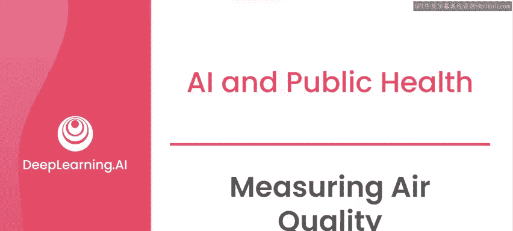
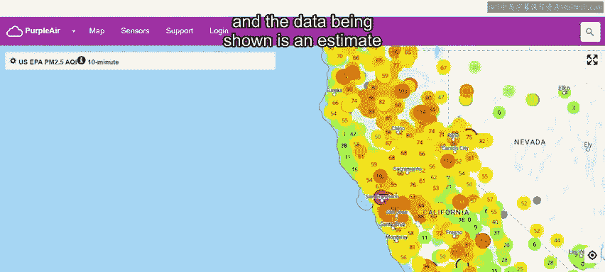
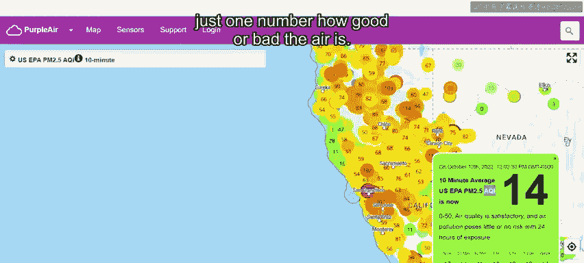
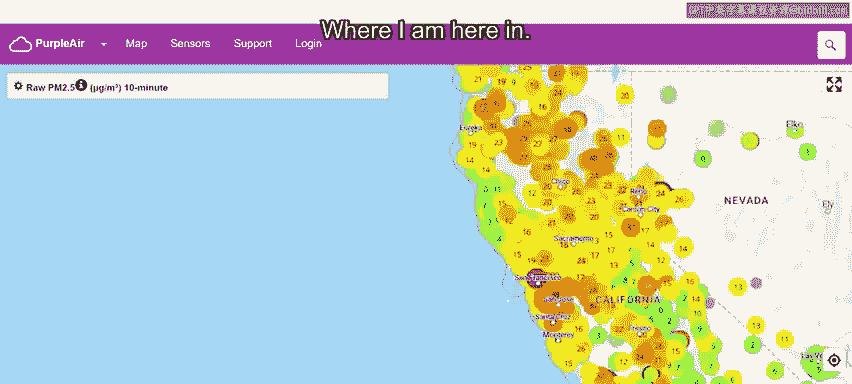
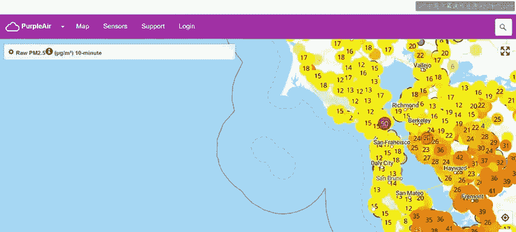
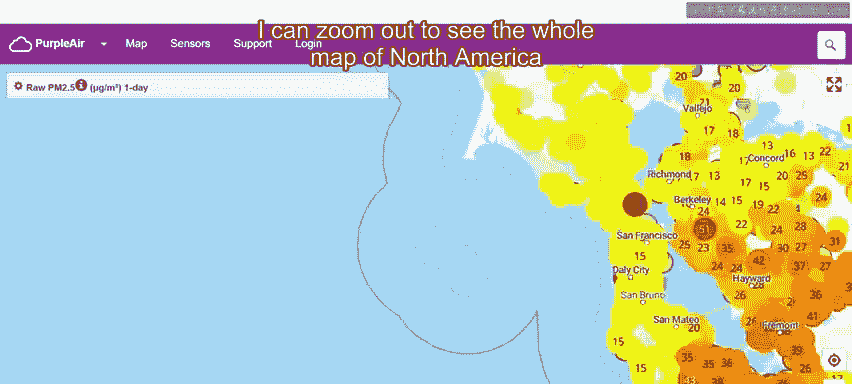

# 021：空气质量测量 🌍📊

在本节课中，我们将学习空气质量测量的目的、方法以及如何通过现有工具（如Purple Air网站）获取和理解实时空气质量数据。我们还将了解空气质量指数（AQI）和PM2.5等核心概念，为后续在波哥大的实际数据分析项目打下基础。

---

## 空气质量测量的目的

在世界许多地方，公共和私人的个人与机构都在测量污染物水平，以便对空气质量有更量化的理解。这些测量的目标既有长期的，也有短期的。

在短期，测量有助于告知公众其特定区域的污染物何时上升到危险水平，或揭示一天中或一周内哪些时段更适合安全外出。

在长期，监测和污染数据帮助我们量化问题的严重程度，识别不同区域的趋势，并为最终有助于减少空气中污染物含量的政策和实践提供信息。

## 实时空气质量数据来源

现在有各种网站和应用程序发布实时的空气质量数据。如果你附近有传感器，你很可能可以立即看到室外空气质量的好坏。

其中一个网站是Purple Air。你可以在世界地图上导航并放大，查看全球数千个地点的传感器数据。

生成这些测量数据的传感器体积小、成本相对较低，仅测量颗粒物、温度、压力和湿度。这些传感器由希望了解所在地空气质量的个人购买，所有传感器的数据都被共享，以便世界上的任何人都能看到测量结果。

## 理解空气质量指数（AQI）

这里我们看到的是美国西部的加利福尼亚州，显示的数据是所谓的“空气质量指数”（AQI）的估计值。

这是一个综合指数，试图用一个数字来表示空气的好坏。

**AQI低于50** 被认为是良好的，而 **AQI超过150** 则被认为是不健康的，这意味着如果可能，你应该完全避免户外活动或佩戴口罩。

这些都是实时测量数据，因此你可以快速了解在特定时间、特定地点的空气污染程度。

## 关注PM2.5水平

与空气质量指数相关，我也可以选择“原始PM2.5”来直接查看PM2.5水平。

现在显示的数据是以 **微克/立方米** 为单位的PM2.5测量值。在美国，环境保护署已确定，健康的PM2.5暴露水平是长期平均低于 **12微克/立方米**。

这意味着，与你呼吸的空气中PM2.5含量相比，某些日子或某些地点的含量可能更高或更低。在很长一段时间内，比如一年，你希望这个平均值低于12。

在这张地图上，你可以快速看到，虽然许多地方显示空气质量良好，但在某些区域，PM2.5水平相当高。例如，在我所在的旧金山，目前的水平看起来就不太好。

## 深入查看历史数据

在这张地图上，你可以点击一个数据点，查看该地点过去测量的更多信息，包括不同时间段的平均值。

你还可以看到该地点的测量历史记录。在上方，我可以切换到更长的平均周期，比如一日平均值。在这种情况下，我可以看到更长的历史时间跨度，回顾过去一年左右的数据。

如果你想自己对污染水平随时间的变化进行分析，也可以下载任何这些传感器的数据。

我可以缩小地图，查看整个北美洲或整个世界的地图。如果你好奇，可以看看你居住地附近是否有传感器，它们可以让你了解你所在区域的空气质量。

## 关于数据可靠性的重要说明

需要注意的是，与我们在波哥大的例子不同，这些传感器不一定是由具备专业知识的人员或在战略位置安装的。大量传感器可能安装在烟囱附近或其他可能产生错误高值或易出错信号的地方。

---

## 总结与下节预告

本节课中，我们一起学习了空气质量测量的目的，如何通过Purple Air等平台获取和解读实时空气质量数据，理解了AQI和PM2.5的核心概念及其健康标准，并认识了现有公民科学数据的潜在局限性。

接下来，我们将前往哥伦比亚的波哥大。该市部署了一个空气污染传感器网络，你的任务将是直接使用这些数据，构建类似于我们刚才在Purple Air网站上看到的空气质量地图产品。请跟随我进入下一个视频，我们将更仔细地研究波哥大的空气质量。