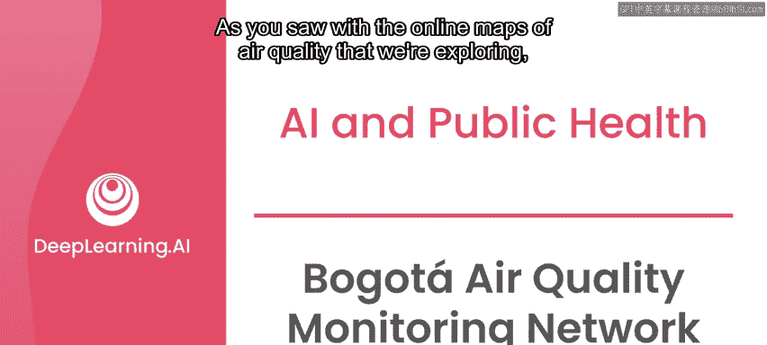
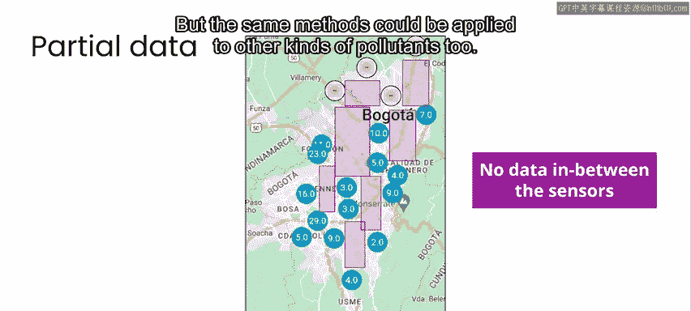
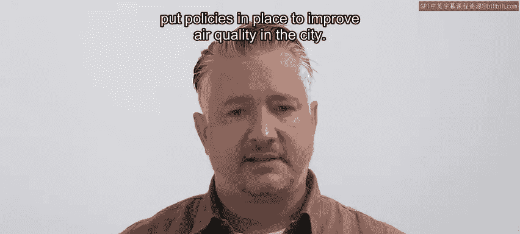

# 022：波哥大空气质量监测网络 (RMCAB) 🏙️🌫️

在本节课中，我们将学习波哥大空气质量监测网络（RMCAB）。我们将了解该网络如何运作，其使用的传感器类型，以及如何利用其数据构建一个改进的空气质量地图应用。课程最后，我们将明确本项目的具体目标。

## 概述

正如我们之前探索的空气质量在线地图所示，获取特定区域的实时污染测量数据和历史数据非常有用。这有助于我们了解空气是否安全可呼吸，以及污染趋势如何随时间变化。在本课程的后续项目中，你将参与一个测量波哥大空气质量的项目。

## 波哥大与空气质量挑战

波哥大是哥伦比亚的首都，位于南美洲北端。它拥有超过800万人口，是南美洲最大的城市之一，规模与纽约市或班加罗尔相当。与任何大城市一样，波哥大有道路上的汽车和卡车，以及为满足人口需求而存在的大量工业和发电厂。所有这些都导致了空气污染和整个城市空气质量的变化。

## RMCAB监测网络

自1997年起，波哥大当地政府一直在全市范围内开发一个传感器网络。该网络目前在全市20个地点定期测量颗粒物、臭氧、硫氧化物、氮氧化物、碳氧化物以及大气状况。

这些传感器并非像上一视频中提到的Purple Air网络那样的小型廉价传感器。它们是科学级传感器，整套设备大约有一辆大型送货卡车那么大。与Purple Air网络不同，这20个传感器被放置在非常具有战略意义的位置。

因此，如果你想把这里学到的方法应用到像Purple Air这样的网络（也许在你的社区），考虑这一点会很有趣。这20个传感器比许多人在Purple Air网络上使用的更廉价的传感器可靠得多，并且部署在更具战略意义的位置。在Purple Air网络中，传感器可能更集中在特定的居民区，并且可能部署不当。例如，我经常收到我家附近空气质量警报，因为有人将Purple Air传感器部署在他们的厨房里。虽然烹饪是空气污染的一大来源，但这并非Purple Air网络的初衷。

因此，如果你考虑将波哥大学到的模型和方法应用于其他类型的传感器数据，你需要考虑网络的分布方式及其部署方式可能对你特定系统成功的影响。

## 城市目标与你的任务

该城市的长期目标是根据联合国特定的可持续发展目标，管理和降低全市的空气污染水平。

具体而言，这些目标是大幅减少因空气、水和土壤中的有害化学物质导致的死亡和疾病人数，并减少城市对环境的人均不利影响，包括特别关注空气质量。考虑到这些目标，到2030年，波哥大市的目标是让城市70%的区域达到世界卫生组织推荐的空气质量健康限值，高于2015年测量的仅25%。

短期来看，该城市旨在为其公民提供空气污染物的实时测量数据，以及未来48小时的空气质量预报。他们将数据发布在网站上，供人们搜索或下载。这就是你发挥作用的地方。

现在，让我们仔细看看部署在波哥大各地的传感器网络记录的空气质量测量数据。

## 现有应用与改进方向

该城市已经开发了一个地图和应用程序。你可以看到整个城市每个传感器站的位置。点击某个特定站点，你可以看到该站点的照片以及过去一周记录的一些历史数据。你还可以看到一个叠加或插值地图，它提供了站点之间空气质量的估计值。

在接下来的实验中，你将组装一个类似的应用，并专注于对现有系统的两项特别改进，这两项都与估计测量值有关。

以下是两项核心改进任务：

1.  **传感器数据填补**：传感器有时会意外宕机。这意味着有时某个传感器没有可用的测量数据。当地图上的某个站点显示“维护中”图标时，就表示该站点的PM2.5传感器离线了。因此，你将致力于开发一个功能，即使传感器暂时离线，也能估计给定站点的PM2.5值。
2.  **改进的插值地图**：全市有20个监测站。你希望更好地提供监测站之间（而不仅仅是监测站本身）的空气污染估计值。鉴于PM2.5对人口健康的巨大影响，我们将特别关注它，但同样的方法也可应用于其他类型的污染物。

## 项目目标总结

简而言之，你的目标是提供一个产品，让波哥大市民能够看到改进的、全时段、全市所有位置的PM2.5浓度实时估计值。

因此，你将创建一个基于你估计值的地图产品，该产品能够：
*   提供PM2.5读数，即使特定传感器宕机。
*   在传感器之间做出更准确和插值的空气质量估计。

在开始之前，我想向你介绍这个项目的一些实际利益相关者。为了了解波哥大空气质量工作的所有相关细节，我们拜访了主要利益相关者，即波哥大市环境秘书处办公室。正是这些人运营着空气质量监测网络，并制定政策以改善城市空气质量。

## 总结

本节课中，我们一起学习了波哥大空气质量监测网络（RMCAB）的背景、目标和挑战。我们了解到这是一个由20个科学级传感器组成的战略网络，旨在监测和改善城市空气质量。你的项目任务是构建一个改进的应用，重点实现传感器宕机时的数据填补和更精确的空间插值，以提供更全面、可靠的PM2.5浓度信息。

请观看下一个视频，以了解更多关于他们测量和改善波哥大空气质量的努力，然后我们将进入本项目的探索阶段。