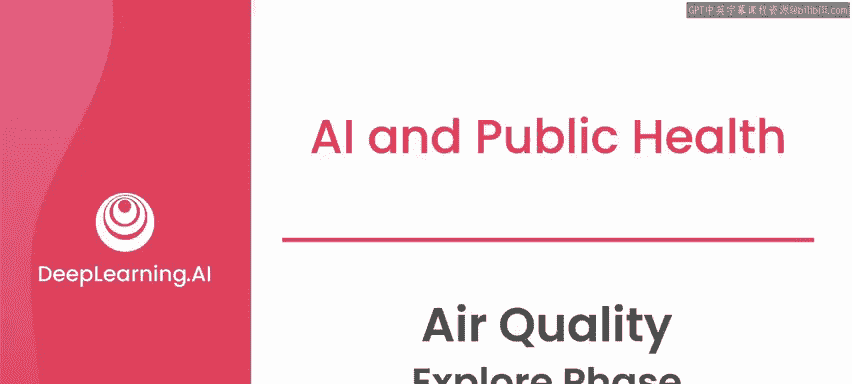
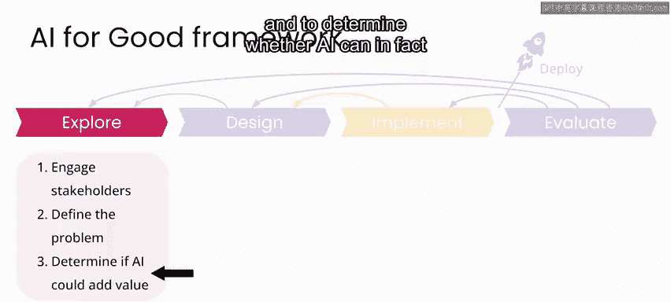
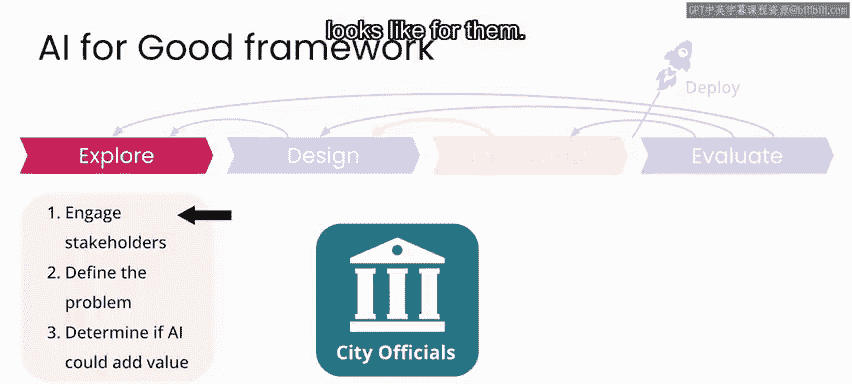
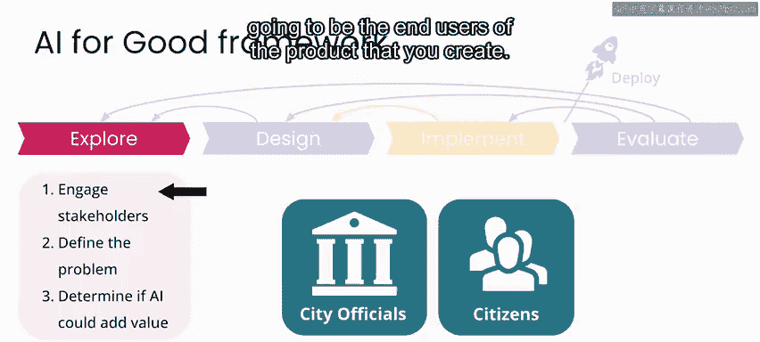
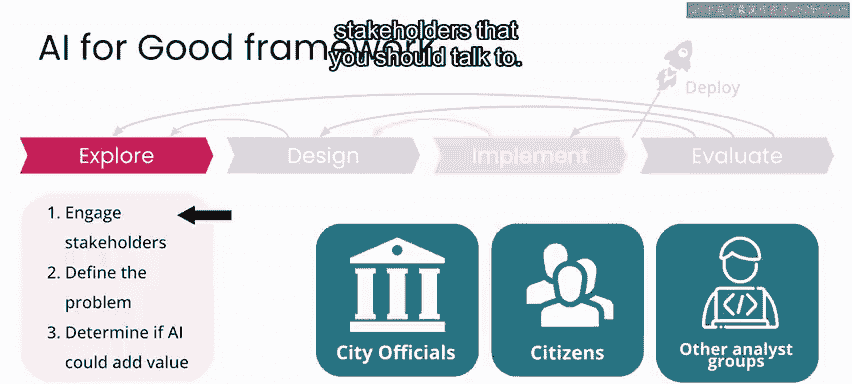
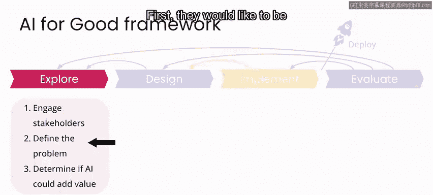
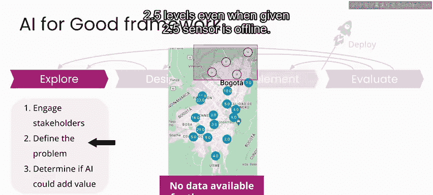
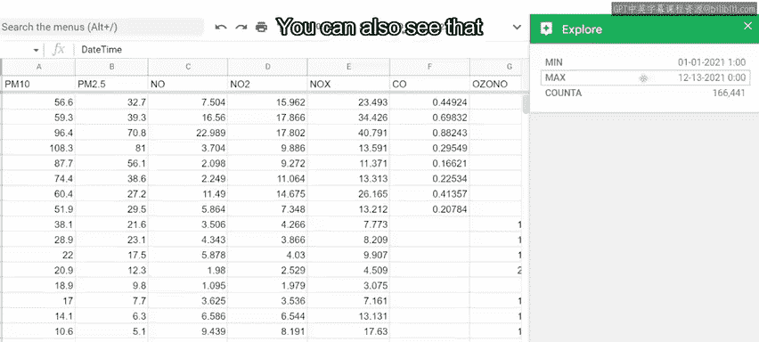

# 024：空气质量项目探索阶段 🕵️

在本节课中，我们将学习AI项目流程中的“探索阶段”。我们将以波哥大空气质量项目为例，了解如何与利益相关者沟通、明确问题定义、评估AI的适用性，并初步查看可用数据。

在上一节视频中，我们对需要解决的问题以及成功的成果有了初步了解。现在，我们准备进入波哥大空气质量项目的探索阶段。

## 与利益相关者沟通

在项目的探索阶段，你的目标是**与利益相关者进行沟通**，以确保你理解他们的需求。

你需要清晰地识别将要处理的问题，并确定AI是否确实能作为潜在解决方案的一部分提供价值。

对于与利益相关者沟通这一步，在这个场景中，你需要花一些时间与城市代表交流，以确保你清楚地理解对他们而言，成功的成果是什么。

你可能还需要花时间与将成为你所创建产品的最终用户的市民们进行沟通。

与在其他地方实施过类似解决方案的人员交流也是一个好主意，以便更好地理解最佳实践和需要避免的事项。

在探索阶段与不同的利益相关者群体沟通时，你还会了解到其他应该与之交谈的利益相关者。

## 明确问题陈述

当涉及到你的问题陈述时，正如我在上一个视频中提到的，该市希望在其空气质量地图应用中纳入两个关键功能。

首先，他们希望即使在某个特定的PM2.5传感器离线时，也能提供PM2.5水平的估计值。其次，他们希望改进传感器之间区域的估计值。

在这种情况下，你的问题定义可以是：与波哥大市合作的公共卫生专业人员需要能够提供全市空气质量的实时估计，以便市民能够意识到因空气质量差而带来的任何健康风险，并相应地规划他们的户外活动。

请注意，在这个问题陈述中，你完全没有描述技术。相反，你关注的是所涉及的个人以及他们需要解决的问题。

通过这样构建问题，可以清楚地表明部分利益相关者是谁、成功的成果会是什么样子，以及你不打算做什么。我们并非试图或能够完全解决哥伦比亚的空气质量问题，我们只是在改善哥伦比亚一个非常小区域（即波哥大这些传感器周围的区域）的传感器测量，这反过来可以帮助我们在空气质量方面推动政策和实践朝着正确的方向发展。

## 评估AI的价值与数据可用性

最后，你需要确定AI是否能为这个项目增加价值。如果你自己不是AI专家，这可能涉及与一些过去在实际AI环境中工作过的人交谈，以了解AI是否曾用于类似项目，以及潜在的风险和注意事项。

这一步还将涉及确定成功项目所需且可用的数据类型。

在这种情况下，提供给你的数据看起来是这样的。

你会注意到这里有几列数据，在这个例子中，每一列都对应一种特定的污染物。你可以看到这里有PM10（较大的颗粒物）、我们关注的PM2.5，以及其他污染物，如氮氧化物和一氧化碳。

你还有一个标识符，用于标记每个测量值来自哪个监测站，以及测量的日期和时间。

因此，你可以从日期和时间列中看到，这些是历史数据，来自2021年。

在日期和时间列中，第一个日期是2021年1月1日，最后一个日期是同年的12月，所以大约是**一年的数据**。

你还可以看到，新的数据点是每小时记录的，因此你将拥有大约一年时间跨度的**每小时数据**。

最终，对于这个项目，你希望构建一个能够实时接收数据并进行预测的系统。但拥有这样的历史数据集，可以让你在开始处理当前数据之前，考虑解决方案的各种实现方式并进行测试。

如果你查看其他一些列的详细信息，可以看到有效数据点的数量（或此处显示的计数）对于每一列是不同的，这应该是你判断数据集中**数据缺失程度**的第一个指标。

你也可以向下滚动数据，开始看到一些数据缺失的地方。

例如，在这里，你可以看到PM2.5传感器数据看起来是离线的。

但你可以看到，在那个监测站，我们记录了其他一些污染物的测量值。这很重要，因为这将转化为我们可以用来构建模型的特征，以创建关于PM2.5数据应该是什么样子的更好估计。

## 初步数据探索

现在你对数据的样子有了一点概念，这几乎是任何项目中你应该做的第一件事：**查看数据**。

无论你是AI专业人士还是灾难响应专业人士，我们首先做的很多事情就是查看数据表格，以了解数据的分布、缺失数据、潜在异常值、数据的多样性，以及我们能解释和不能解释的内容。

因此，查看数据表格是正确的第一步。当我们想要开始在这些数据之上构建更具扩展性的系统时，我们会转向代码环境。

在这里，我们将在Jupyter notebook环境中使用Python处理相同的数据。如果你从未使用过Python或Jupyter，不用担心，我将在下一个视频中指导你如何操作实验环境。

## 总结

在本节课中，我们一起学习了AI项目“探索阶段”的关键步骤。我们了解了如何通过与利益相关者沟通来明确需求，如何清晰地定义问题陈述，以及如何初步评估AI的适用性和数据基础。这些步骤为后续的方案设计和实施奠定了重要基础。