# 025：Jupyter Notebook实验室简介 🧪

在本节课中，我们将学习如何开始第一个实验，并演示你将使用的Jupyter Notebook环境的一些基本功能。

## 概述

Jupyter Notebook是一个开源的Web应用程序，广泛用于原型设计和编程。它允许你创建和共享包含代码、可视化和文本的文档。本节将引导你熟悉这个环境的基本操作。

## 启动实验室

如果你想跟随操作，可以在另一个浏览器标签页中打开实验室。如果你已经熟悉Jupyter Notebook环境，可以跳过本节，直接观看下一个视频。

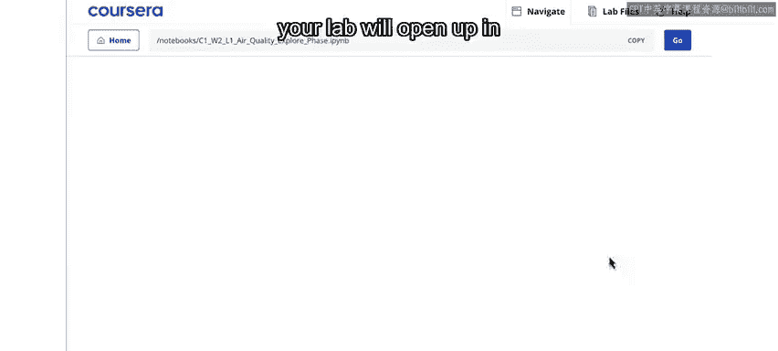

在本课程中，你可以在“Week 2”部分找到这个特定的实验室，标题为“Lab: Air Quality Exp the Data”。点击“Launch Notebook”后，实验室将在新的浏览器标签页中打开。

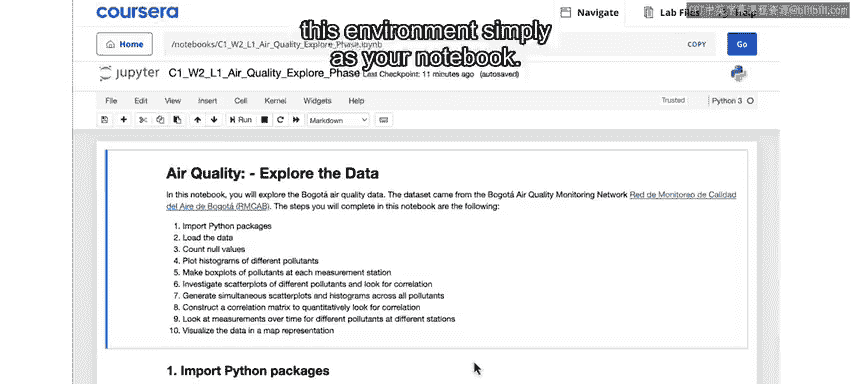

## Jupyter Notebook环境介绍

Jupyter Notebook是一种非常流行的编程应用原型设计格式。从现在开始，我将这个环境简称为“你的笔记本”。

你可以向下滚动，快速浏览笔记本的内容。你会注意到，笔记本中包含文本块和代码块。通常，文本部分会包含代码功能的说明或描述。当你运行每个代码单元时，你会看到代码的输出结果。

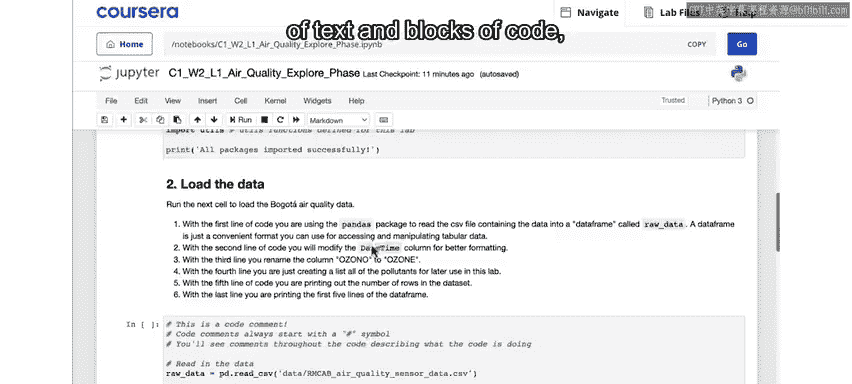

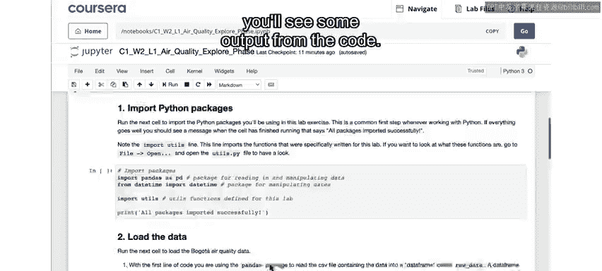

通常，笔记本会与一些其他文件（如数据集和其他代码文件）存放在同一个文件夹中。你可以通过点击左上角的Jupyter图标来查看文件夹中的其他内容。

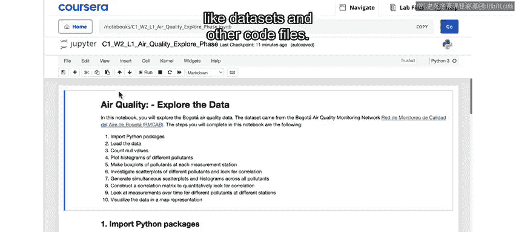

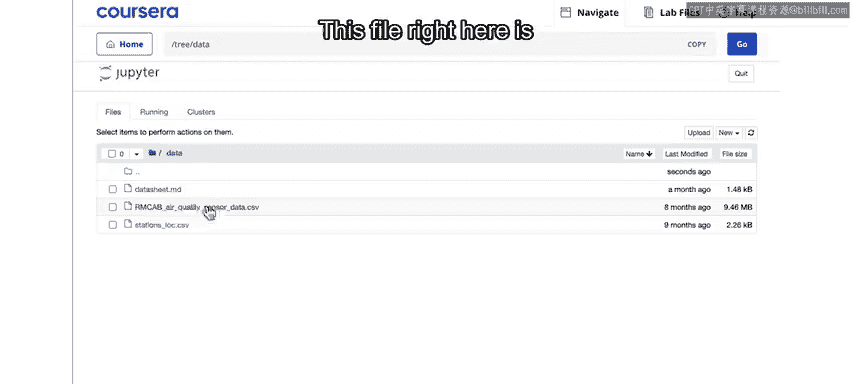

## 文件夹内容

在这个案例中，我们有一个包含数据的文件夹。

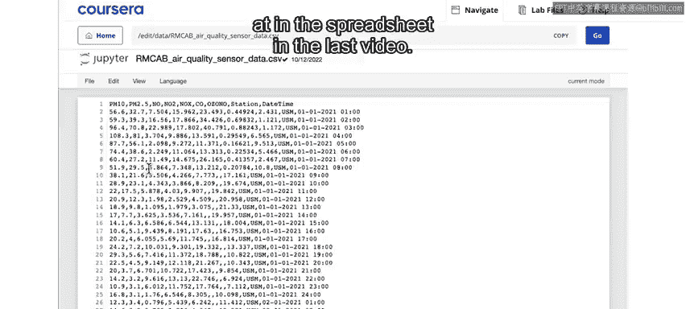

以下是你将在文件夹中看到的文件：

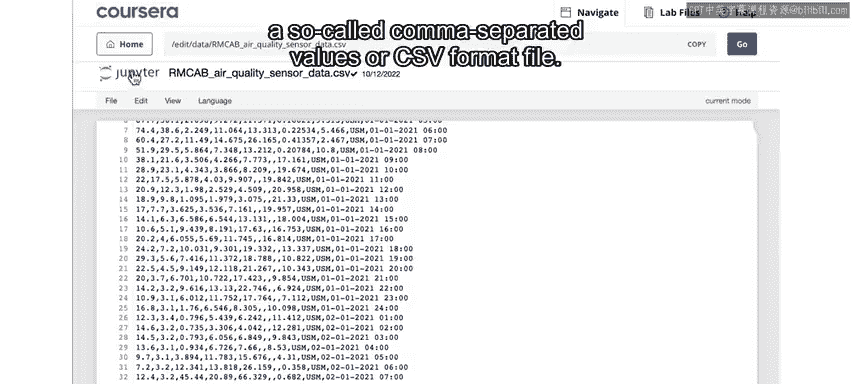

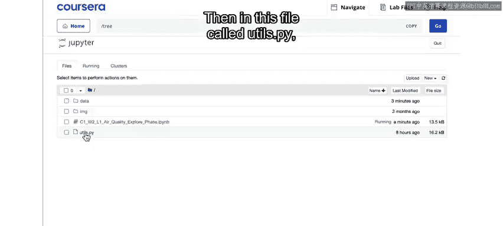

*   **CSV文件**：这个文件与我们上一个视频中看到的电子表格是同一个数据集。它现在以“逗号分隔值”格式显示，即CSV文件。
*   **IPYNB文件**：这个以`.ipynb`结尾的文件就是你正在查看的笔记本本身。
*   **Python文件**：在这个名为`us.py`的文件中，我们放置了一些你将在笔记本中使用的代码。

你不需要担心这里的代码内容。我展示它只是为了说明，我们将一些功能放在后台，以避免弄乱你的实际笔记本。

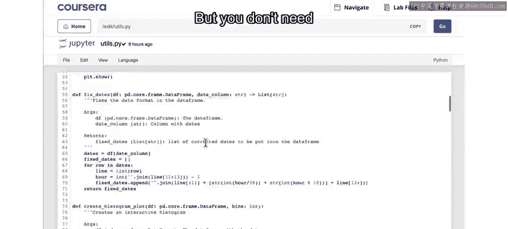

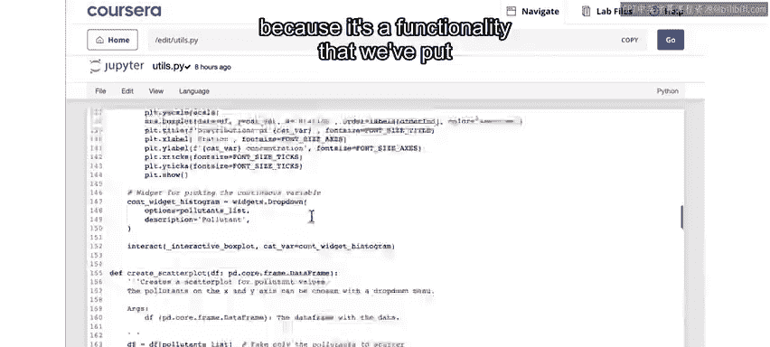

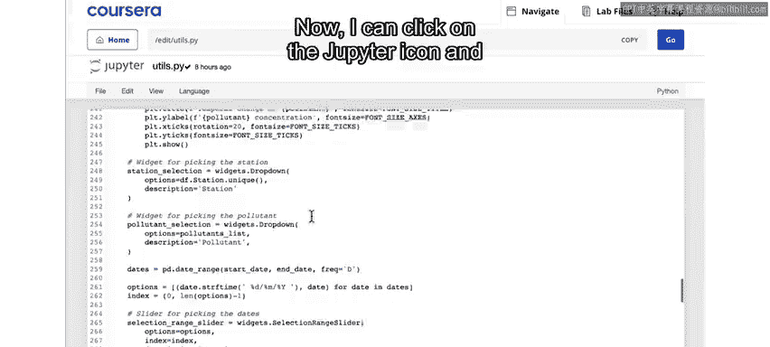

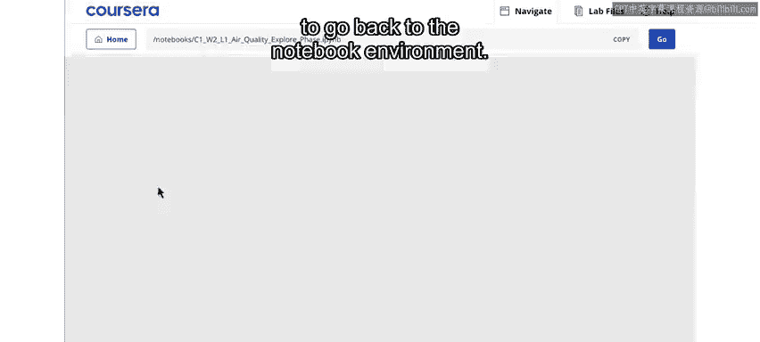

现在，我可以点击Jupyter图标，然后点击这个笔记本文件，返回到笔记本环境。

## 运行代码单元

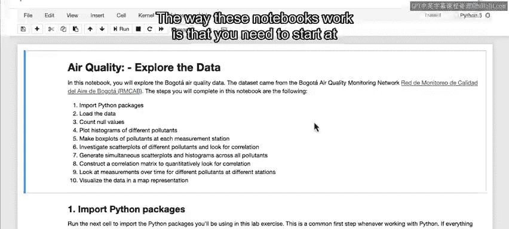

这些笔记本的工作方式是，你需要从顶部开始，按顺序运行每个代码单元。

每个后续的代码单元都能够基于你在前一个单元中执行的操作进行构建。如果你熟悉编程但不熟悉笔记本，可以将其视为一个逐步执行应用程序的过程，而不是一次性全部运行。

运行代码单元的方法是：首先选中该单元，然后点击顶部的“运行”按钮。你也可以同时按下`Shift`和`Enter`键作为键盘快捷键来运行代码单元。

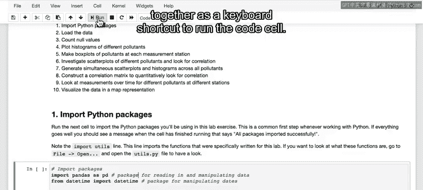

接下来，我将运行笔记本顶部的第一个代码单元。

## 导入Python包

这个单元现在正在导入我们在这个实验室中需要的一堆Python包。这是在Jupyter Notebook中运行Python程序时常见的第一步。第一步是导入你将需要的各种包。

你还可以看到，我们正在导入你刚才看到的那个`us.py`文件，以便也能使用该文件中的函数。就像我说的，这些代码本可以放在这个笔记本里，但这不是我们在这里查看或修改的内容，所以我们为了方便将其放入了另一个文件。

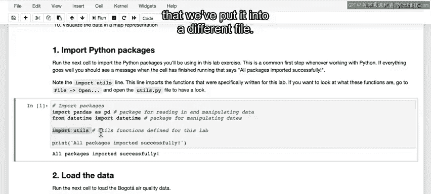

## 读取和处理数据

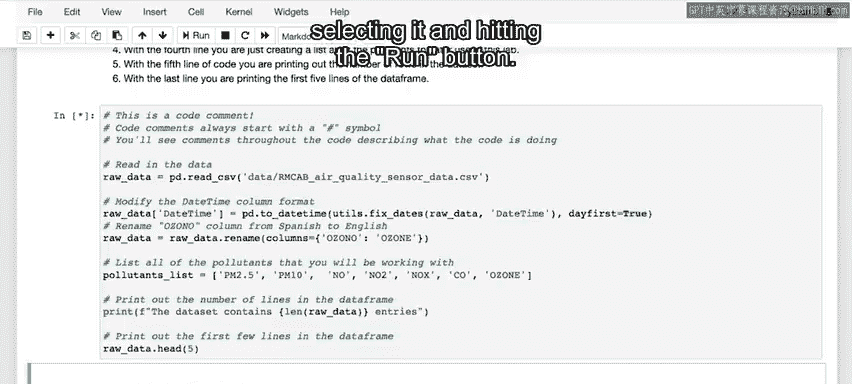

向下滚动，你可以看到我们接下来要做的是再次读取数据。

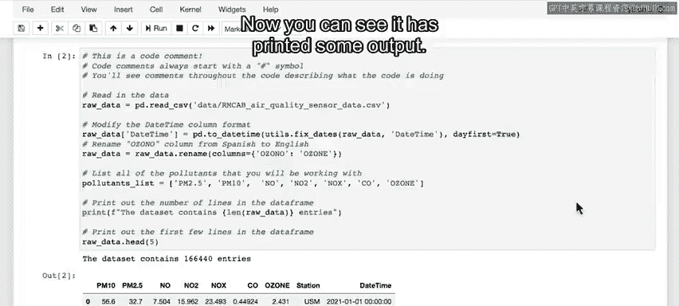

同样，我将通过选中该单元并点击运行按钮来运行这个单元。

这可能需要几秒钟才能运行完成。现在你可以看到它打印出了一些输出。

这段代码的功能是：通过第一行代码，我读取了我们在上一个视频的电子表格中看到的同一个CSV文件。

读取数据文件后，我们对导入的数据进行了一些修改，以便更容易地使用它。这里，我们只是将CSV文件中的日期时间转换为代码中更容易操作的日期时间格式。你还可以看到，我们预先标记了不同的PM值，并且因为本课程是用英语教学的，我们将“Ozzoone”自动翻译为“Ozone”。

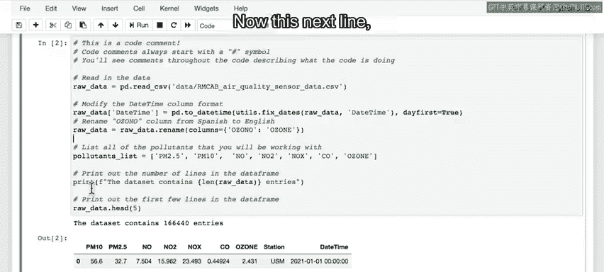

通过下一行代码，我们打印出数据集的前五行，这只是查看数据是否成功读取的一种简单方法。

## 处理错误

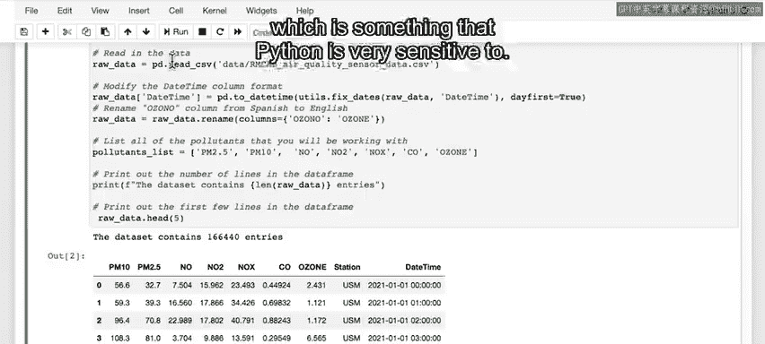

现在，有可能在点击和运行代码的过程中，你不小心在代码中引入了拼写错误，即使是像添加一个额外的空格这样简单的事情，Python对此也非常敏感。

然后，当你尝试运行该单元时，你会收到这样的错误。

当Python抛出这样的错误时，它会尝试告诉你问题出在哪里。在这个案例中，它正确地指出这是一个“缩进错误”，这就是额外空格导致的问题。但如果你不熟悉Python，这些错误信息可能看起来有点令人困惑。

所以，如果你在某个时候看到错误，不用担心，这完全正常，可能只是意味着代码单元中某处有拼写错误。

你可以尝试找出错误发生的原因并进行纠正。或者，如果你无法找出原因并卡住了，你可以直接重置实验室。

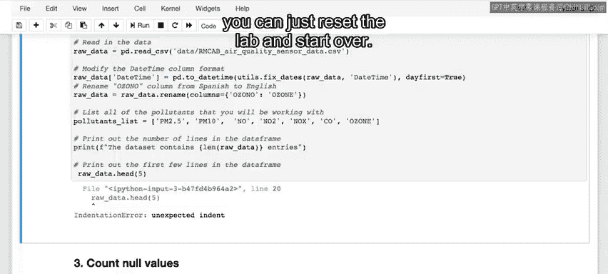

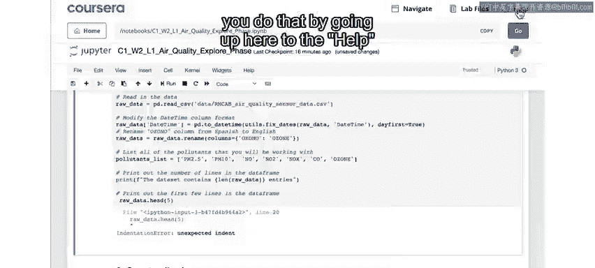

要重置实验室，你需要点击顶部的“帮助”菜单，然后选择“获取最新版本”。这将使你返回到实验室的最新、干净的版本。

如果实验室确实有新版本，你可以在这里更新到新版本。但你也可以使用这个功能来刷新你的实验室，获得一个新的干净副本，这应该可以清除你在编辑代码时可能引入的任何错误。

就像我之前说的，我不会要求你从头开始编写任何代码，但在某些情况下，我会建议更改一两个参数，以查看一些不同的输出。所以，你不必认为编辑代码是完全禁止的，只需记住，如果你有拼写错误，可能会收到错误提示。

## 总结

本节课中，我们一起学习了Jupyter Notebook环境的基本操作，包括如何启动实验室、运行代码单元、导入必要的Python包、读取和处理数据，以及如何处理可能遇到的错误。掌握这些基础知识将帮助你在后续课程中顺利进行实验。

在下一个视频中，我将逐步讲解这个实验室的其余部分，在那里你将有机会探索数据，更清楚地了解你正在处理的内容。