# 026：空气质量数据探索与缺失数据可视化 📊


在本节课中，我们将一起学习波哥大空气质量项目数据探索笔记本的第一部分。我们将通过查看数据的汇总统计信息和可视化图表，来更好地理解数据集本身的特性，以及在进行数据分析时可能面临的挑战。

---

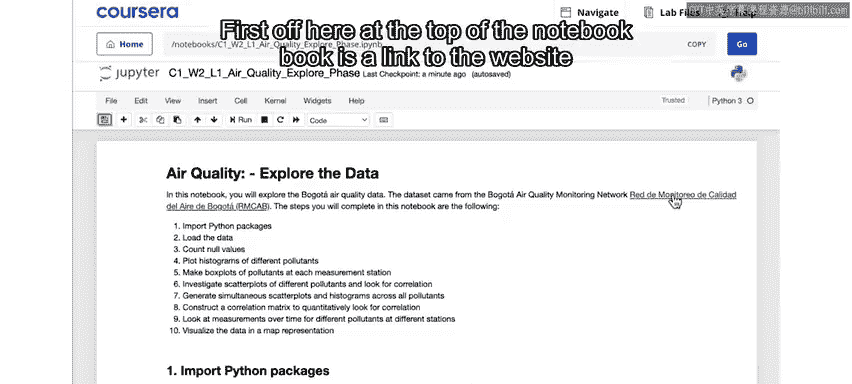

## 导入必要的包

首先，我们需要运行一个单元格来导入所有必要的包，这与我们在上一个笔记本开始时看到的一样。

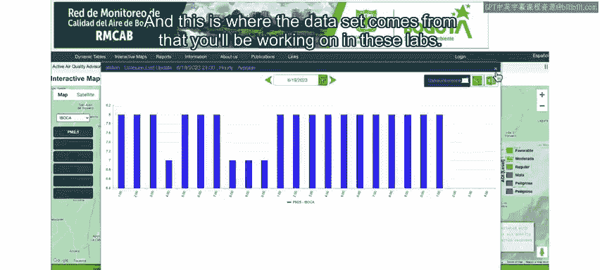

```python
import UTs
```


通过导入名为 `UTs` 的模块，我们导入了与笔记本在同一文件夹下的 `UTs.py` 文件中定义的所有功能。

你可以通过点击 Jupyter 界面顶部的图标并打开该文件，来查看 `UTs.py` 文件的内容。

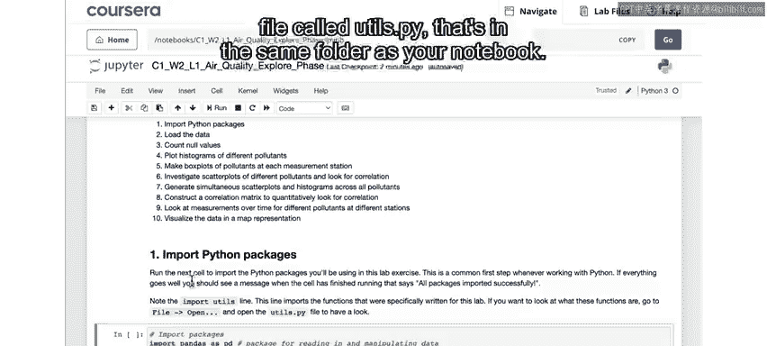

我们为每个笔记本设置了这些实验，在 `UTs` 文件中定义了各种你将使用的函数。如果你已经是 Python 程序员，你可能会发现其中一些可视化工具和建模函数对你自己的项目很有用，请务必看一看。

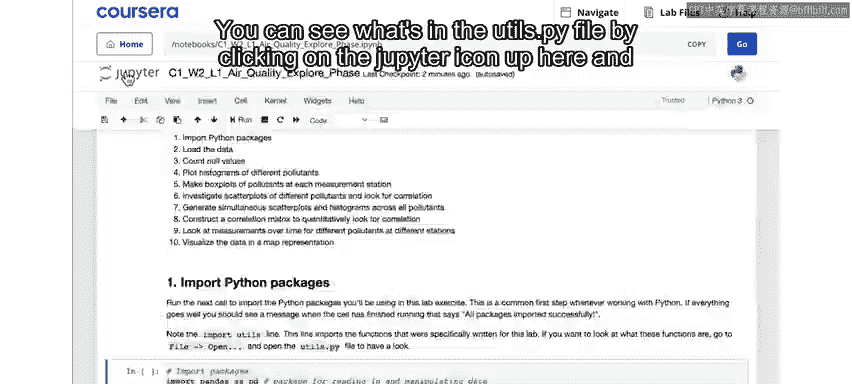

回到笔记本，我们运行第一个单元格来导入包。

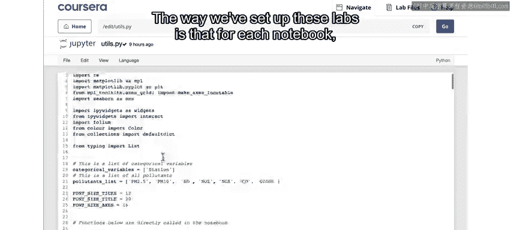

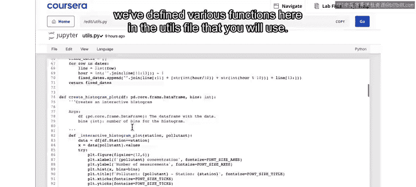

---

## 读取数据集

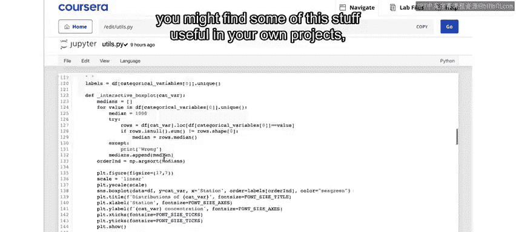

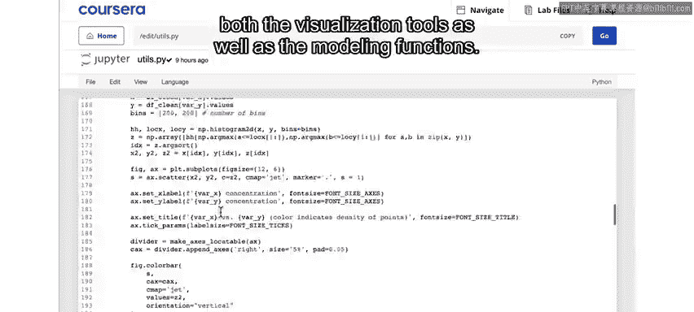

接下来，我将运行这个单元格来读取数据集。


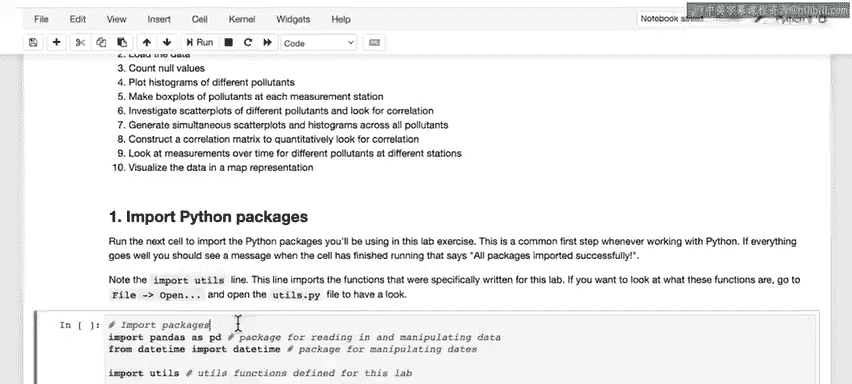

```python
role_underscore_the_score_dataator = pd.read_csv('your_data_file.csv')
print(f"数据集行数: {len(role_underscore_the_score_dataator)}")
print(role_underscore_the_score_dataator.head())
```

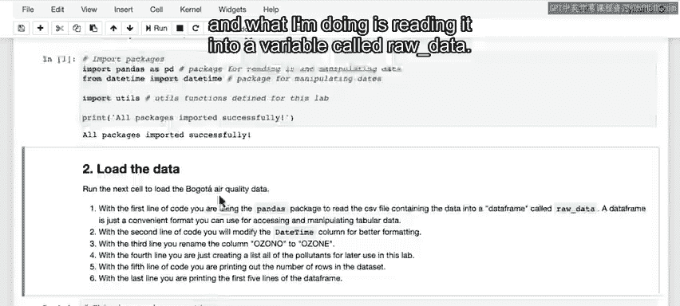

我将其读入一个名为 `role_underscore_the_score_dataator` 的变量中。同时，我还会打印出数据集中包含的行数，以及数据的前五行内容，以检查数据是否成功读入。

你可以看到，这与之前你在电子表格中查看的是同一个数据集，其中包含不同列的各种污染物数据，以及站点标识符和列出日期时间的时间戳。

---

## 检查缺失数据

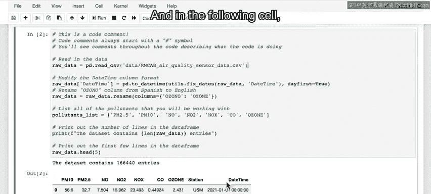

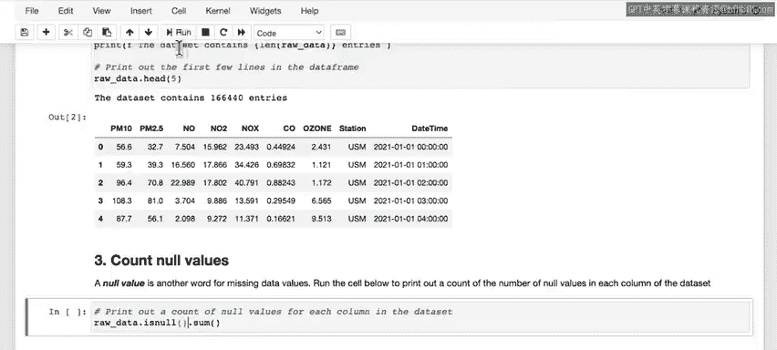

在接下来的步骤中，这个命令会打印出每列中缺失的数据点数量。

```python
print(role_underscore_the_score_dataator.isnull().sum())
```

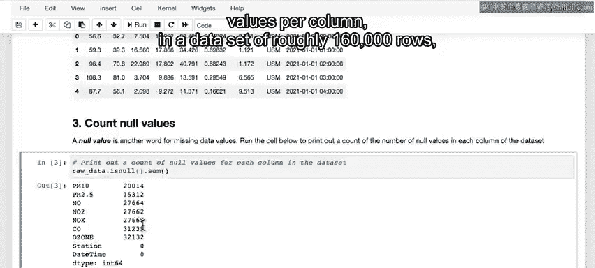

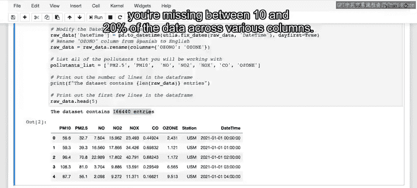

这些数字中的每一个都让你了解每列中有多少缺失数据。你应该能看到，在一个大约有 160,000 行的数据集中，每列有 15,000 到 30,000 个缺失值，这意味着各列大约缺失了 10% 到 20% 的数据。这将是分析中的一个重要问题。

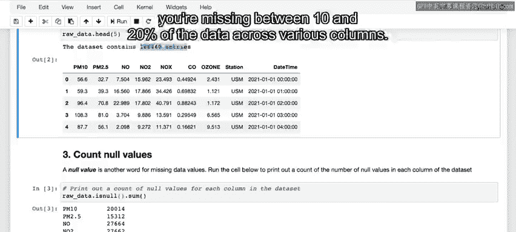

这意味着，大约有 10% 到 20% 的时间，各种传感器可能无法为它们试图检测的某种污染物生成读数。在下一个笔记本中，用估计值替换缺失值将是你需要应对的挑战之一。

---

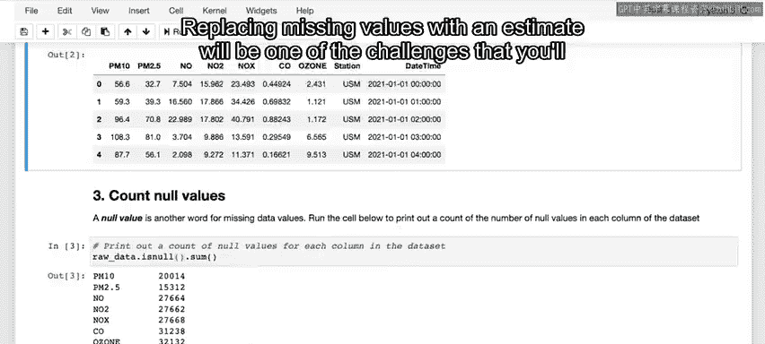

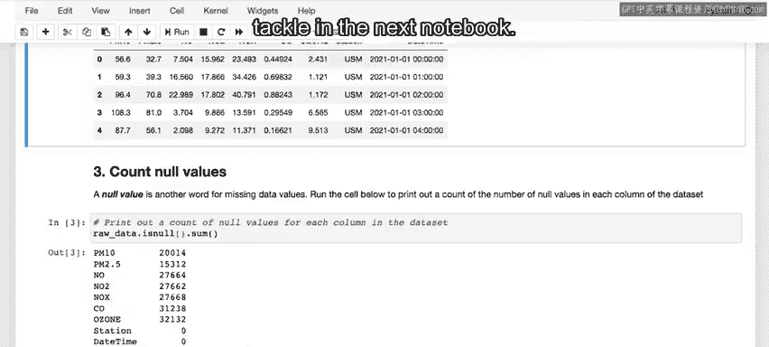

## 查看数据分布（直方图）

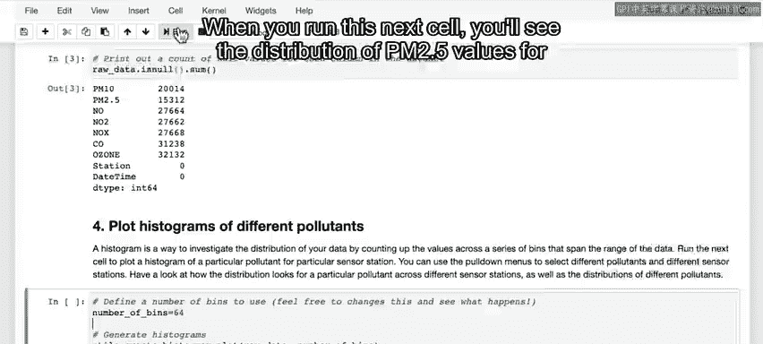

当你运行下一个单元格时，你将看到一个特定站点的 PM2.5 值分布以直方图的形式绘制出来。

```python
# 示例代码：绘制特定站点和污染物的直方图
plot_histogram(station='USM', pollutant='PM2.5')
```

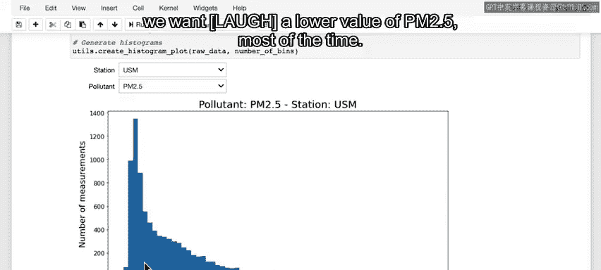

像这样查看数据可以让你了解数值的分布情况。例如，我可以看到 USM 站点的 PM2.5 值范围大约在 0 到 70 之间，峰值大约在 5 左右。这是一个非常不均匀的分布，偏向于较低的值，这显然是一件好事，因为我们希望大多数时候 PM2.5 的值较低。

你可以使用这里的选项来选择不同的站点或不同的污染物，并调查每种污染物在每个站点的分布情况。

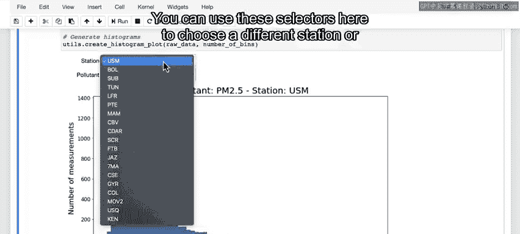

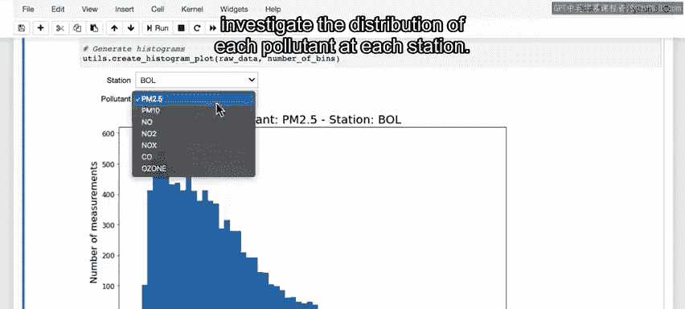

了解不同特征（在本例中是不同污染物和不同传感器站点）的数据分布情况非常重要。通过这种方式，你可以在考虑人工智能是否能为你的项目增加价值时，熟悉数据集的特征。

---

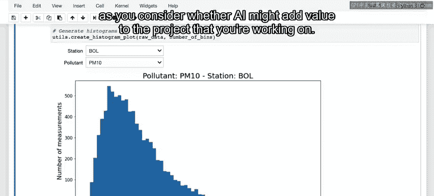

## 查看数据分布（箱线图）

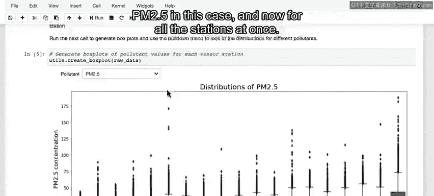

当你运行下一个单元格时，你会为特定污染物（本例中是 PM2.5）生成另一种类型的图表，称为箱线图。

```python
# 示例代码：绘制所有站点的PM2.5箱线图
plot_boxplot(pollutant='PM2.5')
```

现在，所有站点的情况会同时显示。X 轴（底部）是站点名称，Y 轴是 PM2.5 的值和范围。

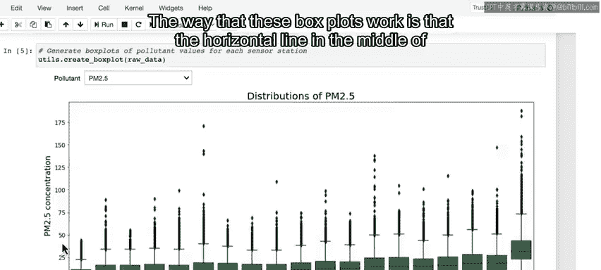

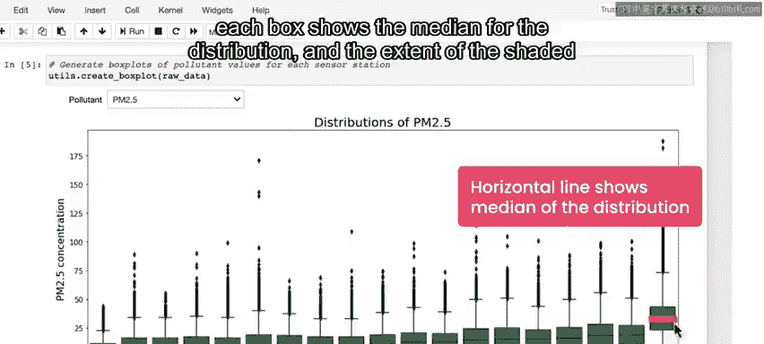

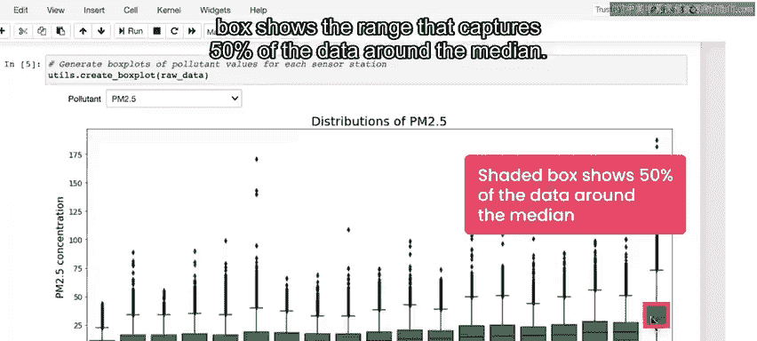

这些箱线图的工作原理是：每个箱子中间的横线显示分布的中位数，阴影箱子的范围显示了围绕中位数的 50% 数据的范围。单个数据点也沿着垂直轴绘制在这里。

这个图本质上显示了你在直方图中看到的相同信息，只是方式略有不同。如果你想象自己从直方图上方俯视，那么你可以看到沿垂直轴覆盖的数值范围，并从不同的角度了解分布情况，包括数据的完整范围和任何异常值。

当我查看这里的数据时，有几件事让我注意到：在较高数值处数据非常稀疏。这对波哥大市及其市民来说是好事，PM2.5 高于 50 的情况相当罕见，高于 100 则非常罕见。

虽然这对空气质量来说是好事，但这确实意味着在空气污染最严重的时候，我们没有那么多数据点来进行训练。因此，这告诉我，当污染可能处于最危险水平时，我不期望我的机器学习模型在预测缺失值或预测站点之间的数值时能同样准确。我们稍后会在实验中讨论，当污染严重时，不准确的预测（无论是假阳性还是假阴性）可能会对现实世界的应用造成更大的危害。

---

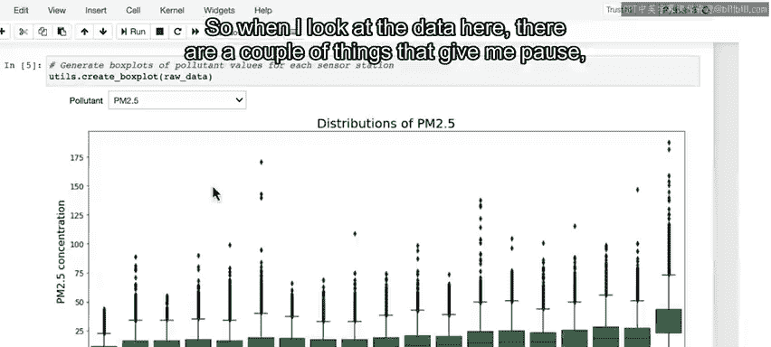

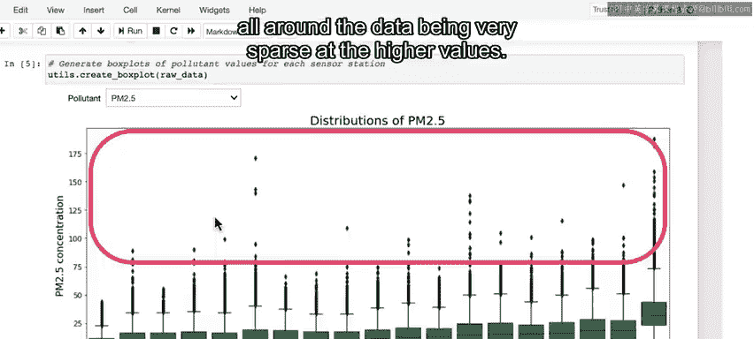

## 创建散点图进行比较

笔记本中的下一个单元格允许你为任意两种污染物创建散点图，并比较它们之间的分布。

```python
# 示例代码：绘制两种污染物的散点图
plot_scatter(pollutant_x='PM2.5', pollutant_y='PM10')
```

现在你可以看到，X 轴是一种污染物，Y 轴是另一种污染物。每个点显示了在特定时间和站点进行传感器测量时，这两种污染物的各自数值。

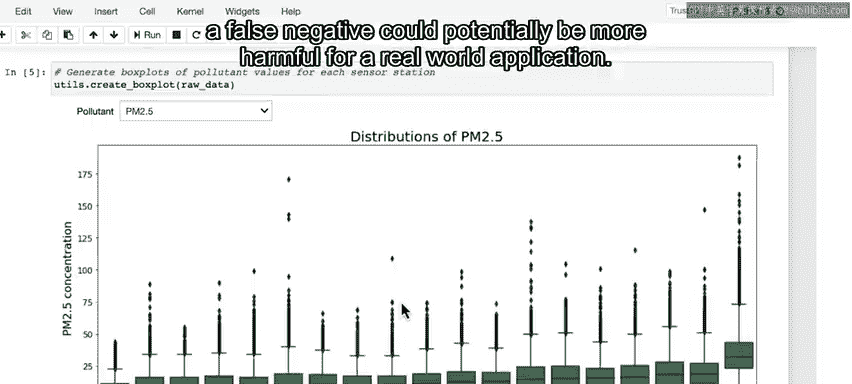

首先，我们可以查看 PM2.5 与 PM10 的对比图。毫不奇怪，两者之间存在很强的正相关性。

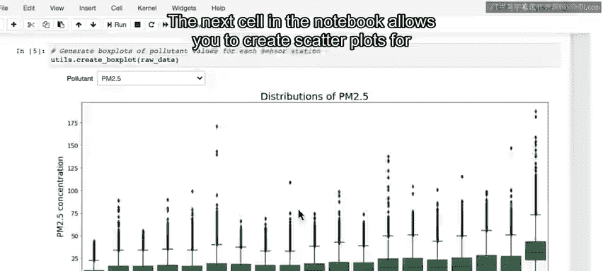

我建议你点击查看不同站点、不同污染物的散点图，看看哪些污染物之间存在相关性，直观感受它们之间可能的相关性强弱，以及是否存在负相关而非正相关的情况。

查看单个散点图、直方图以及其他类似的可视化图表，是所谓的“探索性数据分析”中非常常见的步骤。在这个阶段，你试图了解数据集的特征。

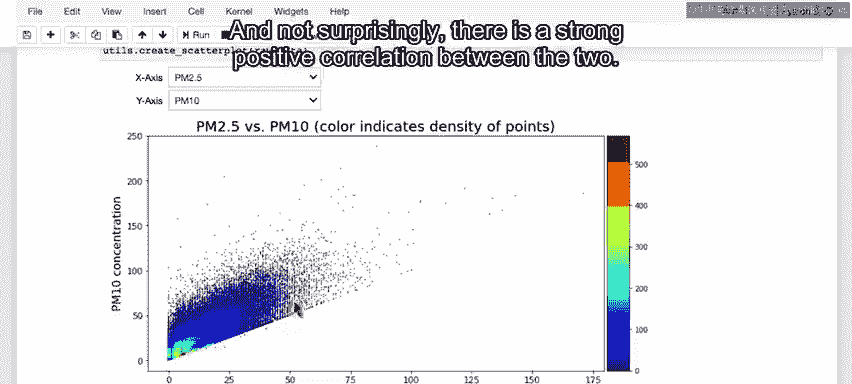

---

## 总结

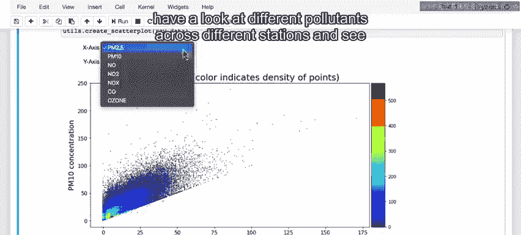

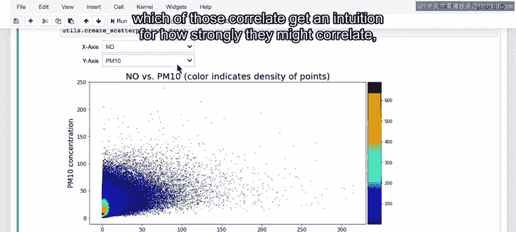

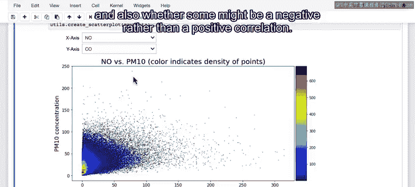

在本节课中，我们一起学习了如何对波哥大空气质量数据集进行初步探索。我们完成了以下步骤：

1.  **导入必要的包**并了解了辅助工具文件 `UTs.py`。
2.  **读取数据集**并检查了其基本结构和内容。
3.  **识别了缺失数据**，发现各列约有 10%-20% 的数据缺失，这是后续分析需要解决的关键问题。
4.  **使用直方图**查看了单个污染物在特定站点的分布，发现数据分布不均匀且偏向低值。
5.  **使用箱线图**同时比较了所有站点某污染物的分布，直观看到了数据范围、中位数和异常值。
6.  **使用散点图**探索了两种污染物之间的相关性，例如发现了 PM2.5 与 PM10 之间存在强正相关。

通过这些探索性数据分析步骤，我们熟悉了数据集的基本特性，认识到了数据缺失和分布不均等挑战，这为后续构建和评估机器学习模型（如下一个笔记本中将进行的缺失值估算）奠定了重要基础。请继续学习下一个视频，我们将完成本次数据探索实验。