# 027：空气质量数据探索与相关性分析 📊

在本节课中，我们将继续博加尔空气质量项目的探索性数据分析。我们将学习如何通过更多汇总统计量和数据可视化来深入理解数据集的特性，并确认数据是否足以支持项目目标。

上一节我们介绍了如何通过散点图和直方图初步探索数据。本节中，我们将进一步学习如何同时查看多个可视化图表，并量化分析变量间的相关性。

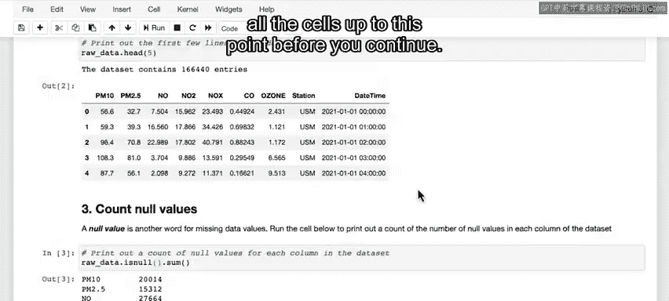

## 启动环境与数据准备

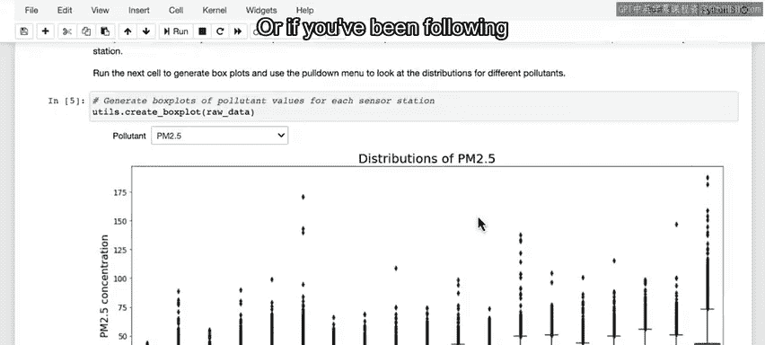

如果你刚刚打开实验环境，需要从顶部开始运行所有单元格，直到当前步骤。

如果你一直跟随操作并已运行了上方单元格，可以直接从这里开始。

## 多变量可视化网格图

查看单个散点图和直方图是了解数据集特性的好方法。有时，同时查看多个可视化图表会更有帮助。

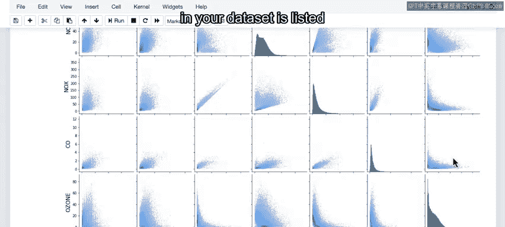

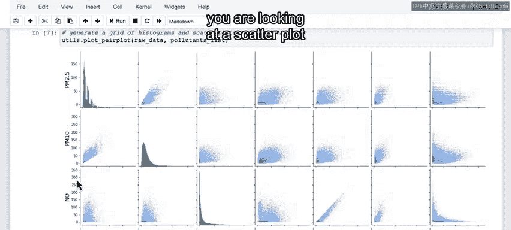

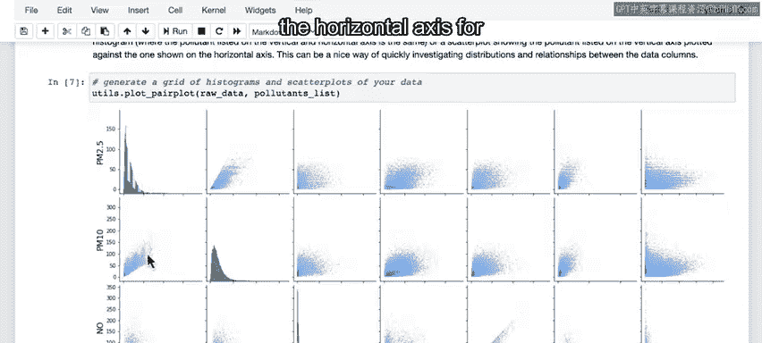

运行下一个单元格后，你将看到一个网格图，它展示了所有污染物两两组合的散点图，以及每个污染物的分布直方图。

以下是该网格图的构成：

*   网格的横轴和纵轴列出了数据集中的每种污染物。
*   每个网格单元格显示的是横轴污染物与纵轴污染物的散点图。
*   对角线上的单元格显示的是单个污染物的直方图，因为该单元格横纵轴的变量相同，绘制散点图意义不大。

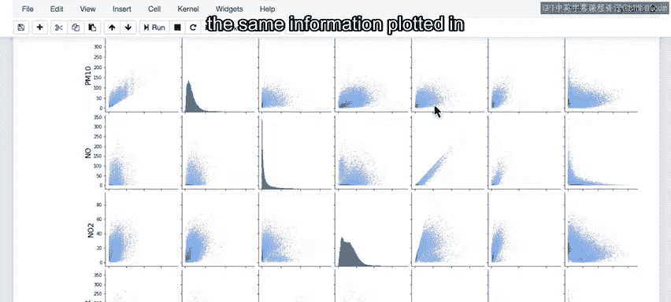

从某种意义上说，这个网格图是冗余的，因为右上部分和左下部分的信息是相同的，只是横纵轴互换了。

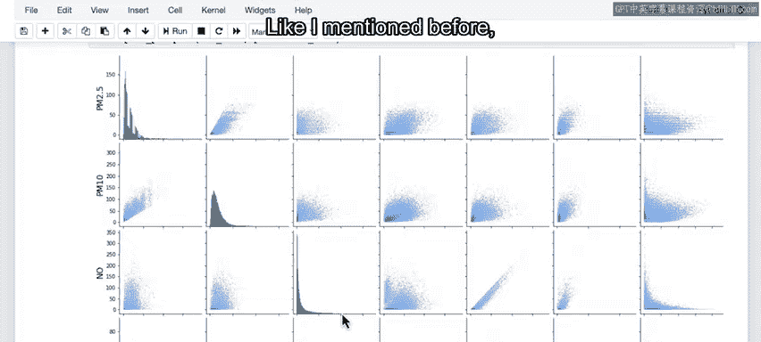

通过这些图表集合，你可以快速总结之前探索过的变量关系和分布情况。

## 相关性矩阵分析

如前所述，观察散点图时，一个有趣的探索方向是检查数据集中不同变量之间是否存在明显的相关性。如果你考虑将AI应用于特定问题，变量间的相关性可能意味着你可以用一个或多个变量来预测另一个变量的值。

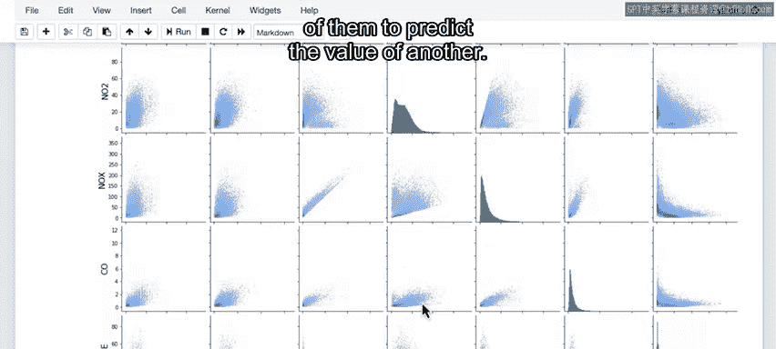

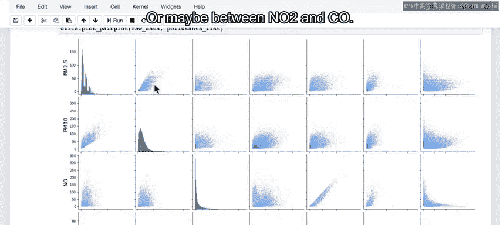

例如，你可以看到PM2.5和PM10之间可能存在一些相关性，或者NO2和CO之间也可能存在相关性。

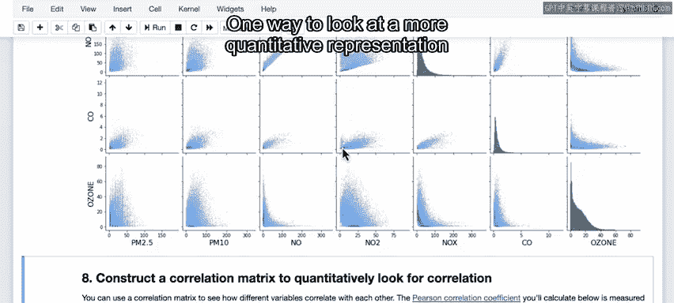

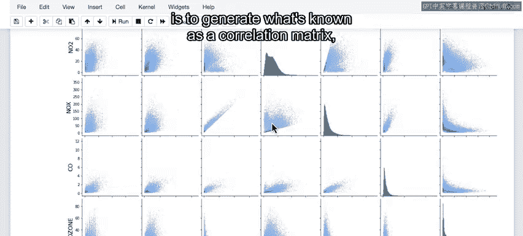

查看变量间相关性更定量的方法是生成所谓的**相关性矩阵**。运行下一个单元格即可实现。

现在你看到的网格展示了与散点图和直方图相同的比较内容，每种污染物同样列在网格的纵轴和横轴上。

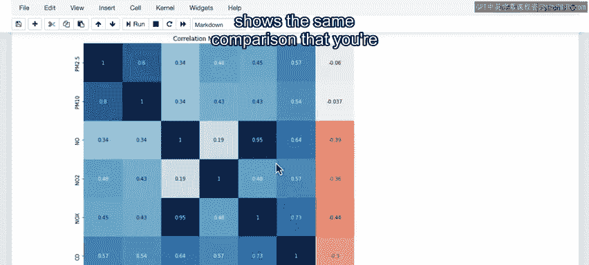

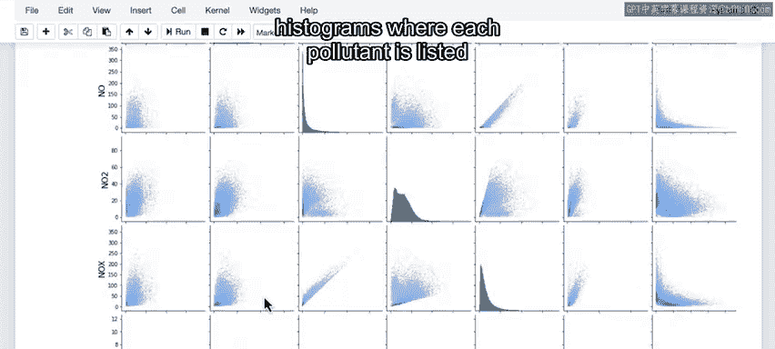

每个网格单元格中的数值现在表示该单元格对应纵轴和横轴两种污染物的**皮尔逊相关系数**。

*   相关系数接近`0`表示两个变量之间没有关系。
*   相关系数接近`1`或`-1`分别表示存在强烈的正相关或负相关。

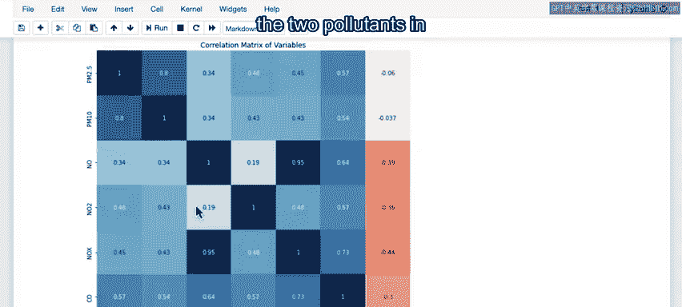

因此，对角线上的相关系数值为`1`，仅表示每个变量与自身完全相关。但在其他单元格中，你可以看到最强正相关和负相关的位置。

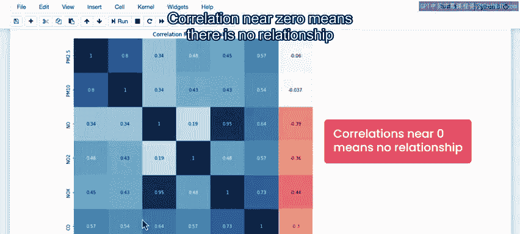

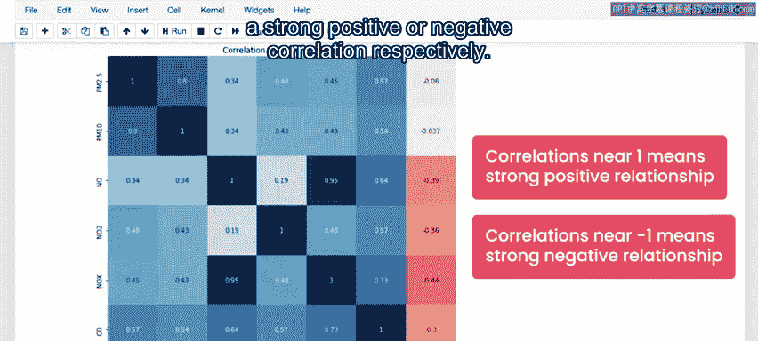

从某种意义上说，这个数值网格也是冗余的，因为沿对角线存在镜像。但现在，你可以利用这个结果更仔细地查看哪些污染物彼此相关。

例如，你可以看到NO2和CO之间存在显著的正相关。你还可以看到不同尺寸的颗粒物之间存在强相关性，因此PM2.5（较小颗粒）与PM10（稍大颗粒）呈正相关或许并不令人意外。

## 时间序列数据探索

运行下一个单元格，你将看到特定站点、特定污染物随时间变化的传感器测量值。

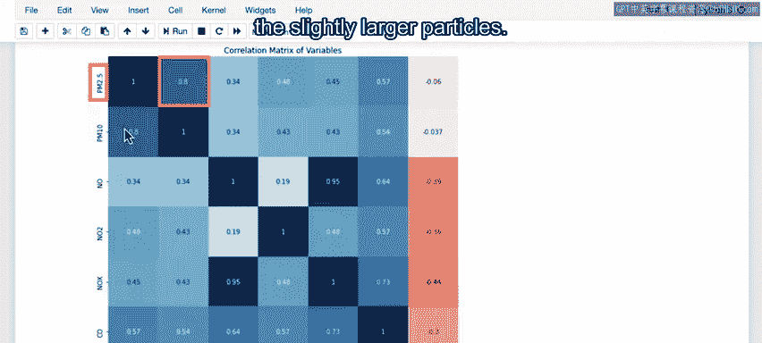

你可以使用这些下拉菜单选择不同的站点和污染物。

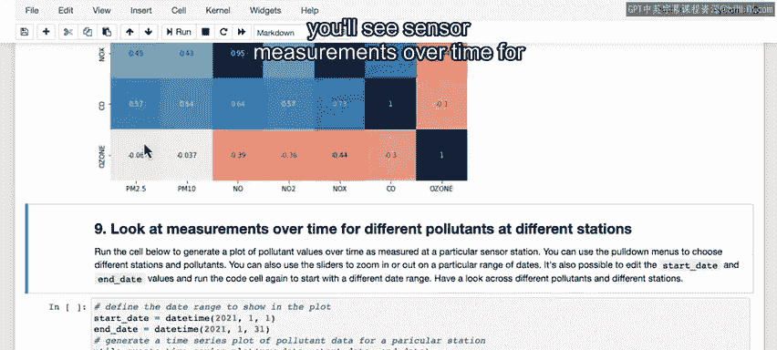

使用这个滑块，你可以调整绘图的时间范围，并可以放大特定的日期范围进行详细调查。

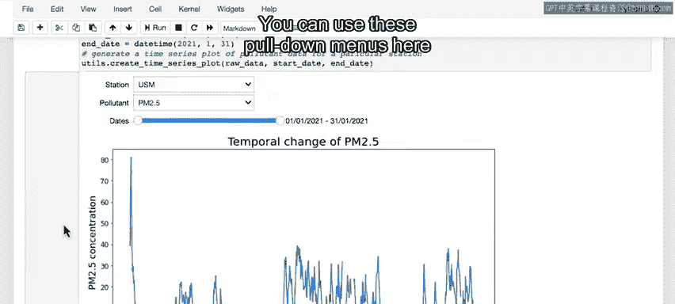

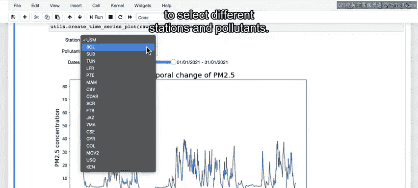

目前，图表显示的是2021年1月的数据。但你可以将这里的开始日期和结束日期变量更改为2021年的其他日期，然后再次运行代码，以在初始图表中查看不同的日期范围。

在图表的一些区域，你会看到数据缺口，这表示特定传感器在该时段数据缺失。

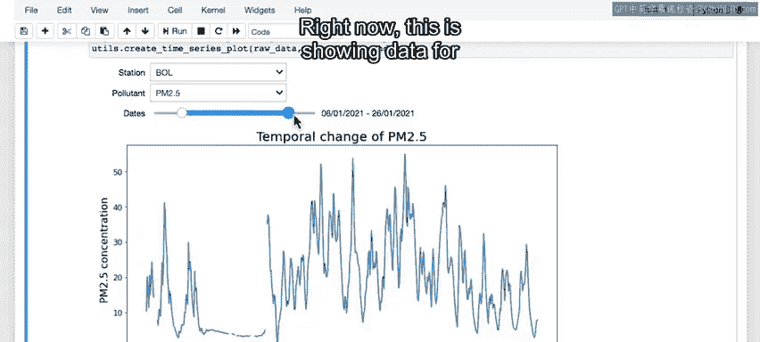

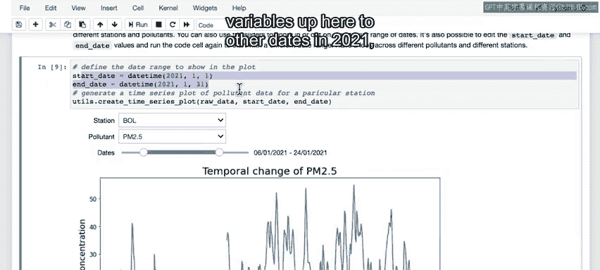

在下一个笔记本中，你将学习一种用估计值填补缺失数据的方法。为此，了解缺失数据的特征（例如特定传感器离线的频率和时长）非常重要。

通过这个图表，你可以更好地理解缺失数据的时间特性。

## 地理空间数据可视化

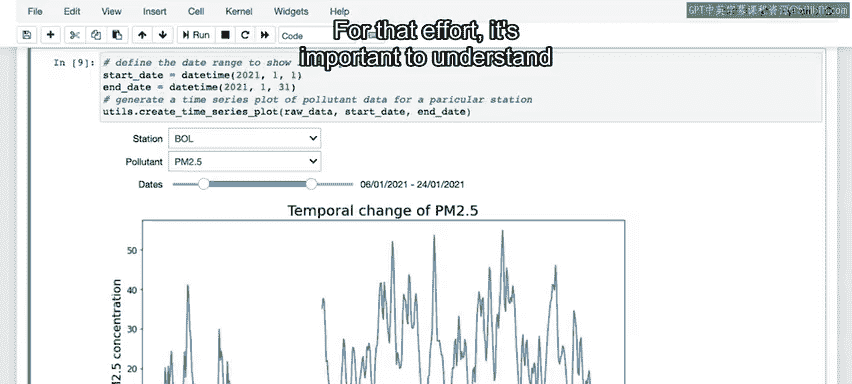

最后，查看地图总是很有趣的，这也是可视化数据中更多信息的好方法。

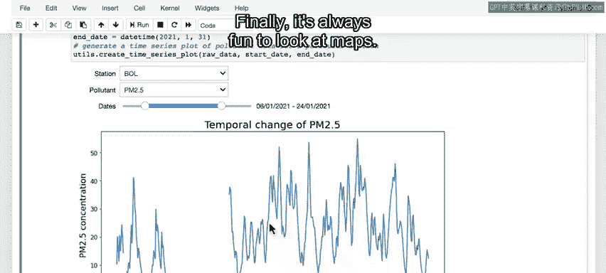

在最后一个单元格中，你将传感器站点的经纬度信息添加到数据集中，然后生成一张叠加了传感器站点位置的地图。

在地图表示中，你可以看到每个传感器的位置由一个圆圈标记，这些圆圈的颜色目前表示每个站点PM2.5的长期平均值。

*   像这样的绿色表示长期平均值低于美国环保署建议的每立方米12微克。

如果你点击一个传感器位置，可以看到一天中不同时间平均值的函数图。

例如，你可以在此站点看到，中午的平均PM2.5值约为每立方米12微克，而在早上7点左右平均值更高，大约为25。

*   这条绿色虚线显示了PM2.5的建议水平。
*   这条蓝色虚线显示了该站点的长期平均值。因此，在该站点，长期平均值略高于建议水平。

这里的每个单独数据点显示了该站点在一天中特定时间的平均值，该值是对全年数据平均的结果。蓝色阴影区域显示了这些平均值上下一个标准差的范围。

因此，你可以将阴影区域视为捕捉了该站点一天中大部分传感器测量值的典型范围。

如果你将这里的参数“一天中的小时”更改为“一周中的天”，然后再次运行代码，那么你可以点击一个站点来查看按星期几的平均值，以及一条显示长期平均值的虚线。

## 总结

在本节课中，我们一起学习了如何通过多变量可视化网格、相关性矩阵、时间序列图和地理空间地图来深入探索空气质量数据集。

在整个数据探索过程中，你的目标是了解将要使用的数据集的特性，并思考AI是否以及如何能为这个项目增加价值。

在本案例中，考虑到不同污染物之间的相关性，以及PM2.5水平对站点位置、一天中的时间和一周中的天等因素的明显依赖性，AI似乎适合用于估计数据中缺失值的问题。

此外，由于传感器分布在整个城市，应该可以利用数据来估计这些传感器之间的污染水平。

当你准备好后，可以进行接下来的测验，内容是关于你在数据中的发现。请将其视为开卷测验，最重要的是记住输出结果，而是在进入设计阶段之前，确保你对数据的特性感到熟悉。

正如我之前在本课程中多次强调的，这对于你正在进行的任何类型的项目都很重要：确保你熟悉数据，了解缺失了什么、可能有什么错误、什么是异常值，这些直觉将帮助你以更高效、更有效的方式设计和思考正确的模型。