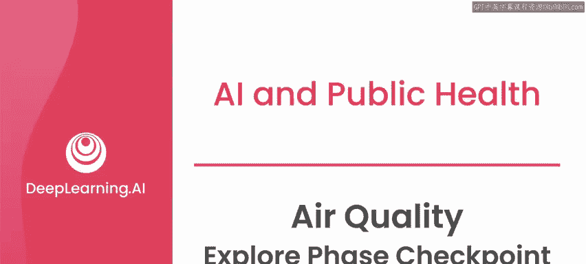
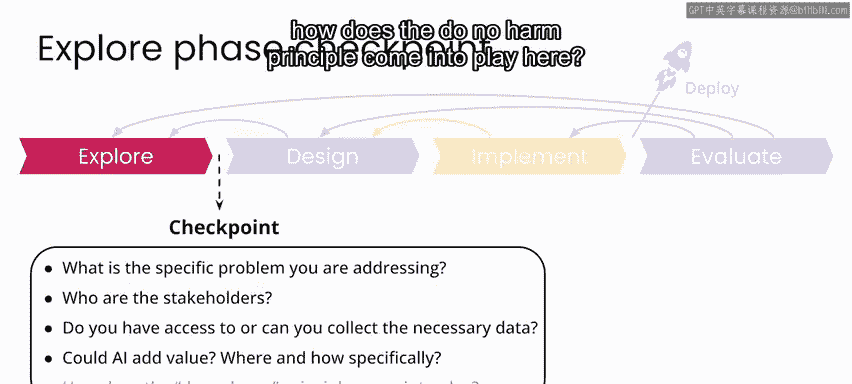
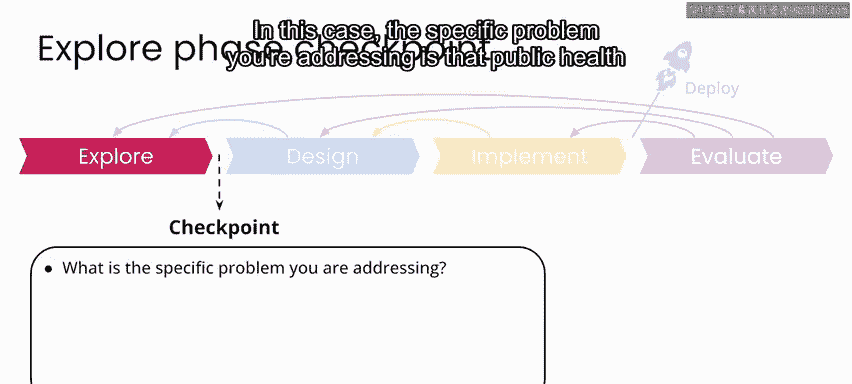
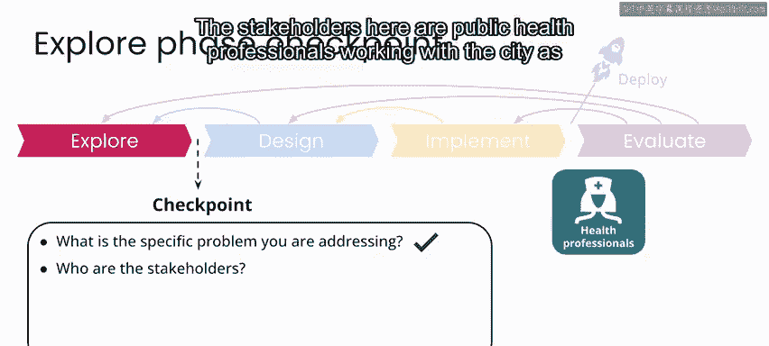
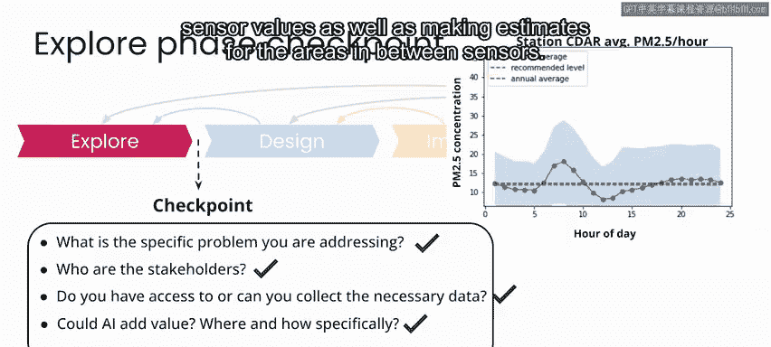
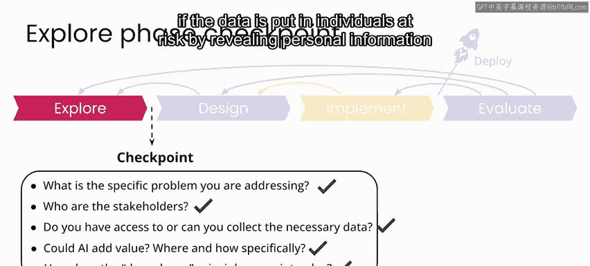

# 028：空气质量项目探索阶段检查点 📋

在本节课中，我们将回顾并总结一个AI向善项目在“探索阶段”需要完成的关键任务。我们将以虚构的“巴戈阿尔市”空气质量改善项目为例，学习如何确认项目是否已具备进入下一阶段的条件。

在之前的课程中，我们介绍了一个用于指导AI向善项目的通用框架。我们通过一个在尼日利亚妇幼保健领域的详细案例研究，了解了项目如何逐步推进，以及在每个开发步骤中需要考虑的因素，特别是“不伤害”原则的贯彻。

本节课程，我们将探索一个具体场景：巴戈阿尔市邀请你和你的团队，帮助他们朝着改善城市空气质量的长期目标迈出下一步。正如我们在尼日利亚公共卫生案例中讨论的那样，在探索阶段结束时，是时候进行检查，确认你是否已具备进入项目下一阶段所需的一切。

## 探索阶段成果回顾

此时，你已经与利益相关者会面，我们假设这包括代表城市的公共卫生专业人员以及市民，以更好地理解你希望解决的问题。你写下了具体的问题陈述，并探索了数据，以努力确定AI是否能为这个项目增加价值。

因此，现在你处于探索阶段末期，你和你的团队应该能够回答以下问题。

以下是需要回答的核心问题清单：
*   **具体问题**：你正在解决的具体问题是什么？
*   **利益相关者**：谁是利益相关者？
*   **数据**：你是否能够获取或收集到必要的数据？
*   **AI价值**：AI能否增加价值？具体在何处以及如何增加？
*   **不伤害原则**：“不伤害”原则在此如何体现？

---

### 具体问题陈述 🎯

在本案例中，你正在解决的具体问题是：与巴戈阿尔市合作的公共卫生专业人员需要能够提供整个城市的空气质量实时估算，以便市民能够意识到因空气质量差而带来的任何健康风险，并据此规划他们的户外活动。

### 项目利益相关者 👥

这里的利益相关者包括与市政府合作的公共卫生专业人员、阿加塔尔的市民，以及维护传感器网络的人员。

### 数据可用性 💾

你可以访问一个丰富的历史传感器测量数据集，用于开发你的解决方案。数据看起来非常适合用于解决估算缺失传感器读数，以及对传感器之间区域进行估算的问题。

### AI的潜在价值 🤖

AI似乎非常适合解决估算缺失值的问题，以及为传感器之间的区域进行估算。这可以通过建立预测模型来实现，例如：
`空气质量指数 = 模型(传感器历史数据， 气象数据， 地理位置)`

### 不伤害原则的考量 ⚖️

在这个特定场景中，数据风险相对较低，因为你将处理来自科学仪器且旨在公开的数据。因此，关于数据隐私或数据是否会通过泄露个人信息而使个人面临风险，没有明显的顾虑需要考虑。

然而，你需要记住，该应用程序本身旨在向公众告知健康风险，并提供有关与空气质量差相关的行为建议。因此，你的工作可能对公共健康产生直接影响，这是你在开发模型和设计最终用户体验时需要持续反思的问题。

---

## 阶段总结与过渡

考虑到以上所有因素，你已经准备好进入“设计阶段”。在设计阶段，你将开始试验模型，并决定你希望最终应用程序如何工作。

本节课中，我们一起学习了如何对一个AI向善项目的探索阶段进行收尾检查。我们明确了要解决的具体问题、识别了利益相关者、确认了数据的可用性与适用性、评估了AI增加价值的潜力，并初步考量了“不伤害”原则。下一周，我们将开始学习设计阶段的材料，正式启动解决方案的设计工作。