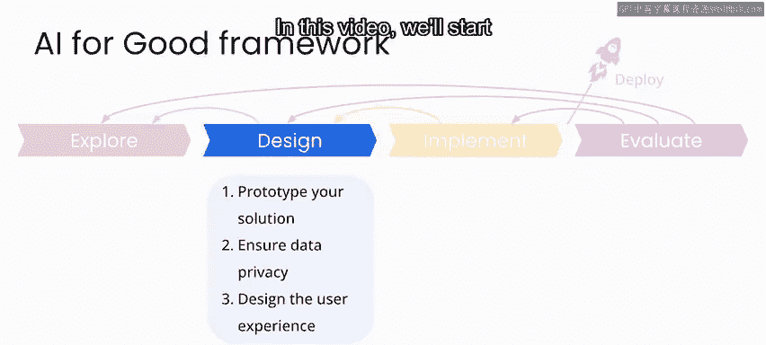
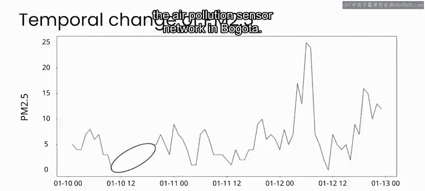
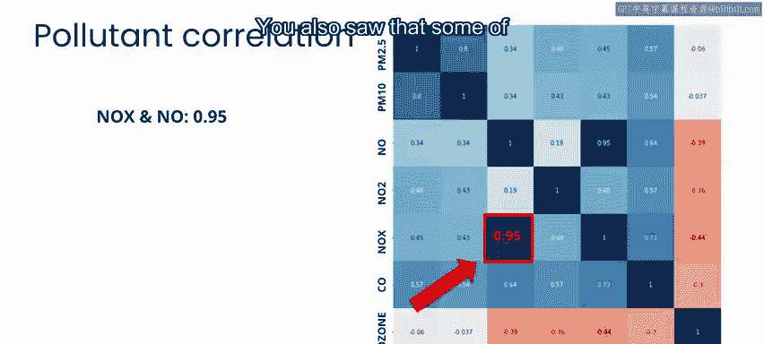
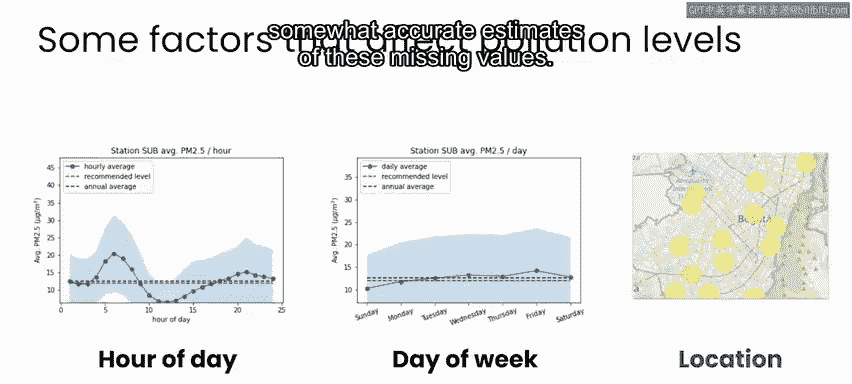
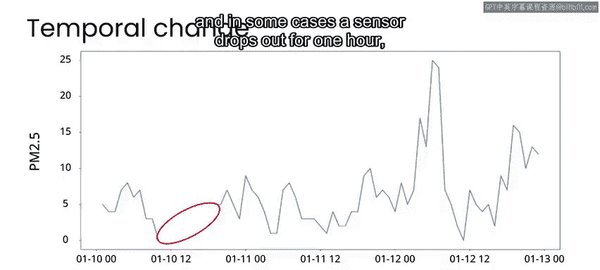
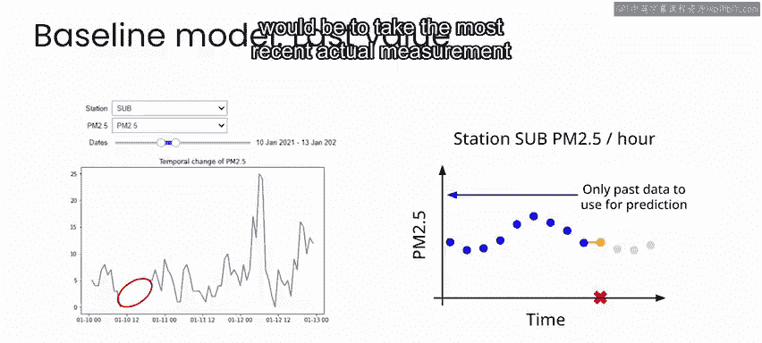
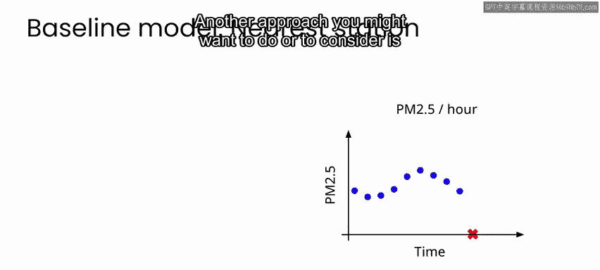
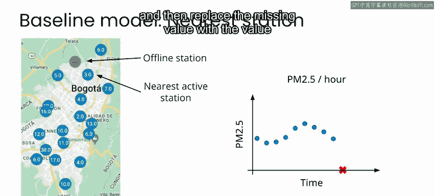

# 029：空气质量项目设计与实施阶段 🏭

在本节课中，我们将学习空气质量映射产品的设计与实施阶段。我们将重点关注设计阶段，包括数据与模型策略的原型设计、处理数据隐私与安全问题，以及设计最终用户体验。

## 数据与模型策略设计 📊

上一节我们介绍了项目背景，本节中我们来看看数据与模型策略的具体设计。

在项目的探索阶段，我们发现波哥大空气污染传感网络存在显著的数据缺失问题。在许多情况下，当一种污染物数据缺失时，其他污染物的记录仍然有效。

我们还观察到，不同污染物水平之间存在相关性。污染物水平似乎取决于一天中的时间、星期几以及监测站的位置。这让我们思考，人工智能或许可以利用其余数据，对这些缺失值进行相对准确的估算。

## 建立基线方法 📈

然而，在这个阶段，与其直接采用“AI优先”的方法，更好的做法是花时间尝试最简单的解决方案，以建立一个基线。这个基线能展示在不实施复杂方案的情况下，我们能达到的效果。

对于数据缺失的情况，我们看到传感器测量是每小时记录的。有时，传感器会中断一小时，然后下一小时又恢复在线。

在这种情况下，场景类似这样：传感器进行每小时测量，数值在一天中起伏，然后出现一个缺失值，接着传感器恢复在线，再次获得有效测量。请思考，估算这个缺失值最简单的方法是什么？

这里有一个关键点：如果我们进行实时估算，显然无法使用缺失点之后的数据。因此，我们不能简单地使用缺失点两侧数据的平均值进行插值。

针对这个具体用例，我们能想到的最简单的估算方法或许是：取该传感器最近一次的实际测量值，直接将其作为估算值。

另一种你可能考虑的方法是：寻找最近的在线的、有实际测量值的传感器，然后用该最近监测站记录的值来替换缺失值。

这两种方法各有优缺点。一种方法是使用同一地点的过去测量值，另一种方法是使用附近地点的当前测量值。无论如何，这两种方法都是合理的，特别是作为衡量基于机器学习方法效果的基线。

在下一节中，我们将通过实践看看这些基线方法在实际中的表现。

## 总结 🎯

本节课中，我们一起学习了空气质量项目设计阶段的核心任务。我们探讨了如何针对数据缺失问题设计简单的基线估算策略，包括使用同一传感器的历史值和邻近传感器的当前值。这些策略为后续更复杂的机器学习模型提供了重要的性能比较基准。