# 030：建立空气质量数据基准 📊

在本节课中，我们将学习如何为空气质量数据中的缺失值问题建立一个简单的性能基准。我们将测试两种基础方法，并量化它们的表现，为后续更复杂的AI模型提供一个比较标准。

---

## 概述

上一节我们介绍了两种估算传感器缺失值的方法：使用该传感器最近一次测量值，以及使用最近邻传感器的当前测量值。本节中，我们将通过实验来测试这些方法，并建立一个基准性能。这样做的原因是：如果简单方法足以满足目标，我们就不必追求复杂方案；同时，它也为衡量更复杂模型的性能提升提供了参照。

---

## 进入实验环境

要跟随本实验，你可以在另一个浏览器标签页中打开实验环境，并对照本视频进行操作。提醒一下，你可以点击这里的Jupyter图标查看文件夹内容。

首先，你会看到一个`data`文件夹，其中包含一个数据表。数据表是了解数据集的重要方式，它说明了数据收集的原因、标注者或创建者以及数据的具体内容。

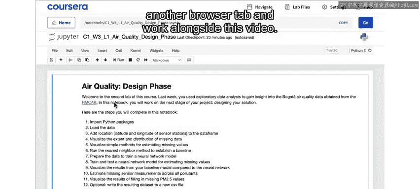

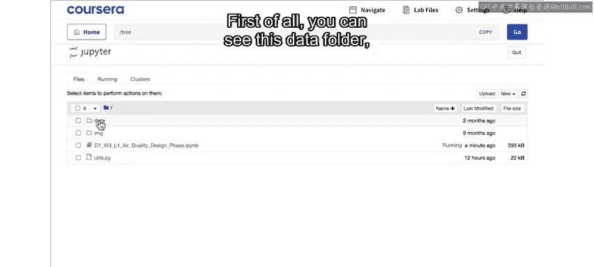

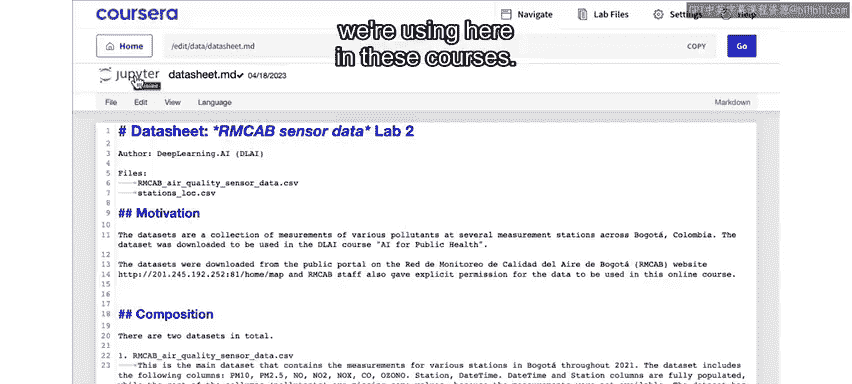

在本课程使用的所有数据集中，你都会看到类似的数据表。

如果你是Python程序员，并且有兴趣查看本实验背后的一些代码，可以查看这里的`ULs`文件。但一般来说，为了完成本实验，你不需要关心这个文件中的代码。我们特意将一些功能放在这个文件中，以保持你的笔记本界面整洁。

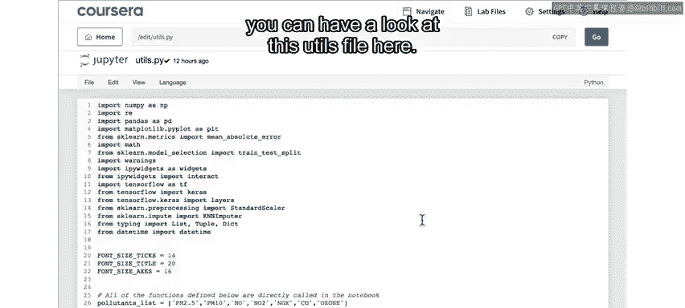

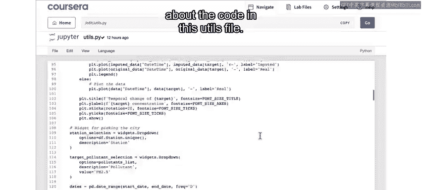

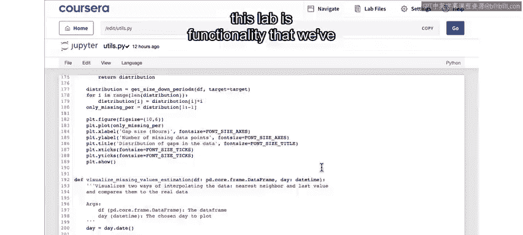
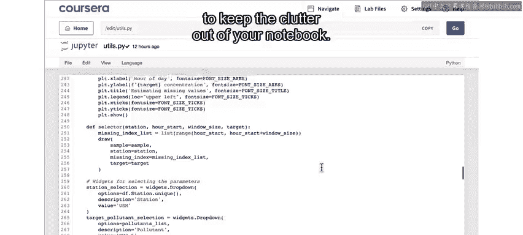

点击回到你的笔记本，首先要做的是从顶部开始，运行第一个代码单元格。

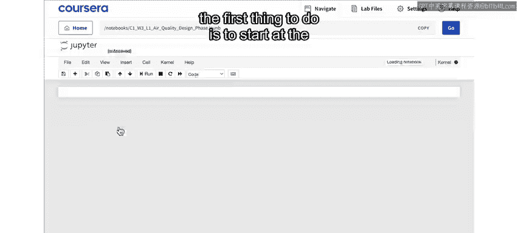

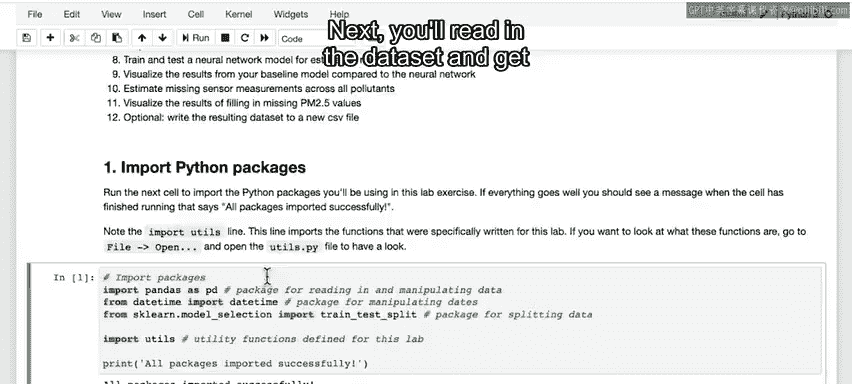

同样，第一个单元格只是导入本实验所需的各种包。

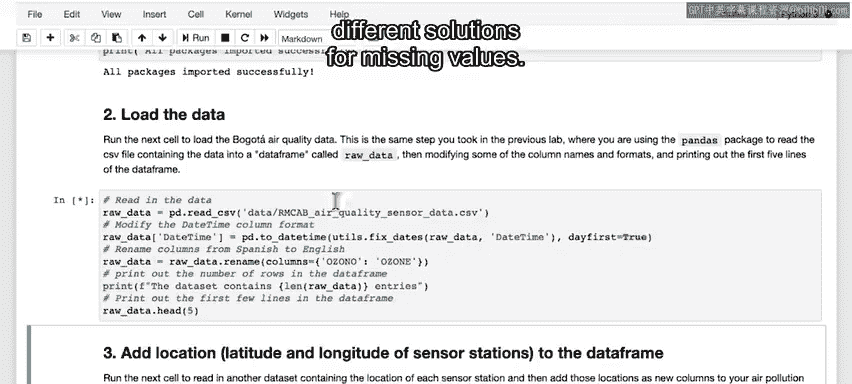

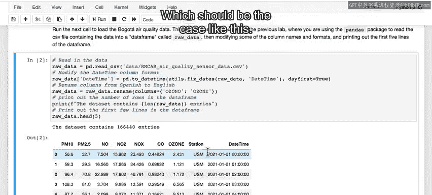

接下来，你将读入数据集，并准备开始研究处理缺失值的不同方案。

这里，你再次打印出数据集的前五行，以验证数据是否被正确读入，结果应该如下所示。

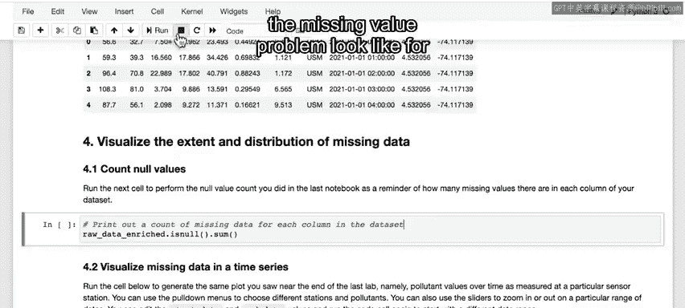

下一步是读入另一个数据集，其中包含每个传感器站点的位置信息，即纬度和经度。然后，我们将一些列名从西班牙语改为英语，以便在这个英文实验中更容易理解。

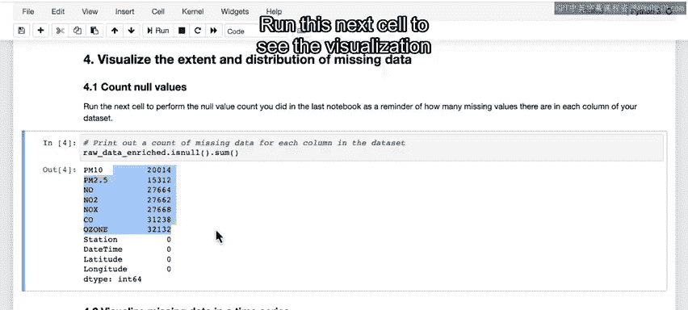

接着，你将把这些信息添加到现有数据集中，以便能够计算传感器站点之间的距离，为最近邻方法做准备。

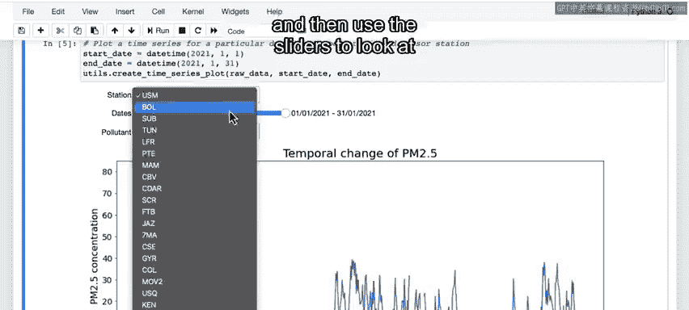

接下来的两个单元格旨在提醒你，在上一个实验中查看数据集时，缺失值问题是什么样子的。

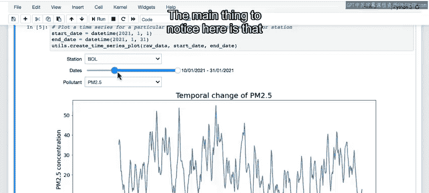

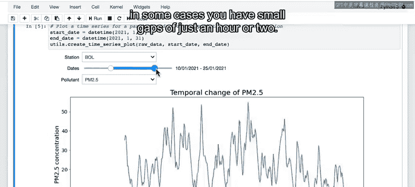

首先，这里打印出每列中缺失值的数量。

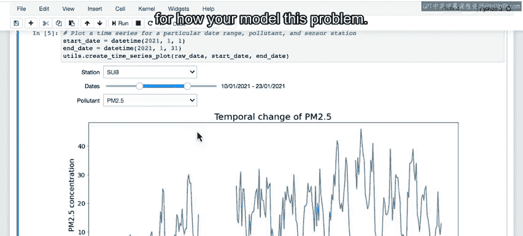

运行下一个单元格，查看你在上一个实验中看过的缺失数据可视化图。在这里，你可以再次选择不同的站点名称和污染物，然后使用滑块查看不同的日期范围。

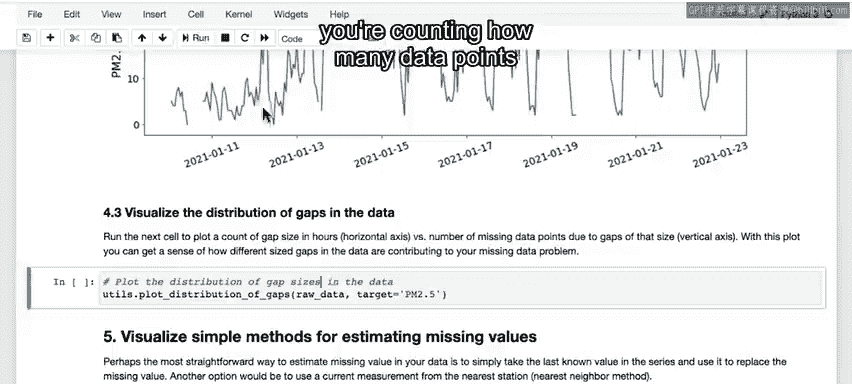

这应该与上一个实验中的内容相似。

这里主要需要注意的是，在某些情况下，你只有一两个小时的小缺口。

但重要的是，在其他情况下，存在更大的缺口，持续数小时，甚至在某些情况下持续数天或数周。此时，了解缺失数据中有多少是由于小缺口造成的，有多少是由于大缺口造成的，这一点很重要，因为这将对你如何建模这个问题产生影响。

当你运行这个Excel单元格时，你正在统计与不同大小缺口相关的数据点数量，特别是针对PM2.5数据。

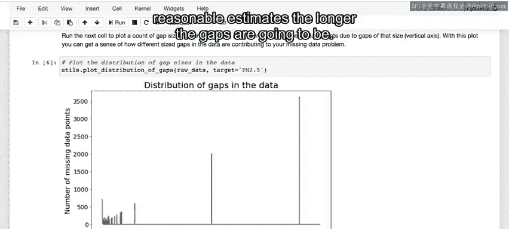

这张图在底部的X轴上显示以小时为单位的缺口大小，在Y轴上显示与该大小缺口相关的缺失数据点数量。

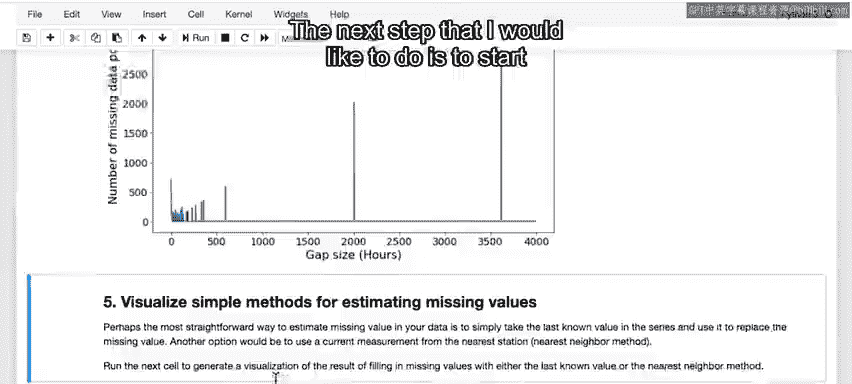

这张图一开始可能有点令人困惑，所以让我们花点时间来分析它。解读方式是：左侧的这个峰值对应仅持续一小时的缺口，换句话说，每个缺口只导致一个数据点缺失。你可以看到数据中大约有700个这样的缺口。

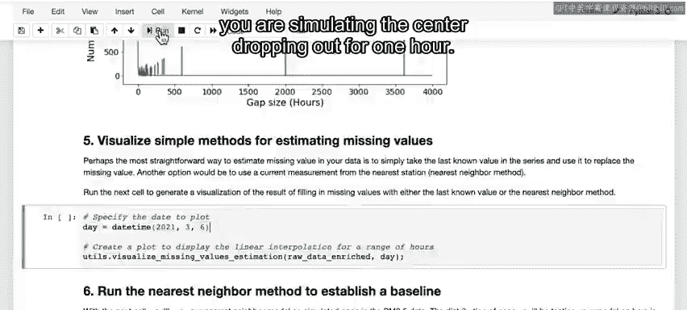

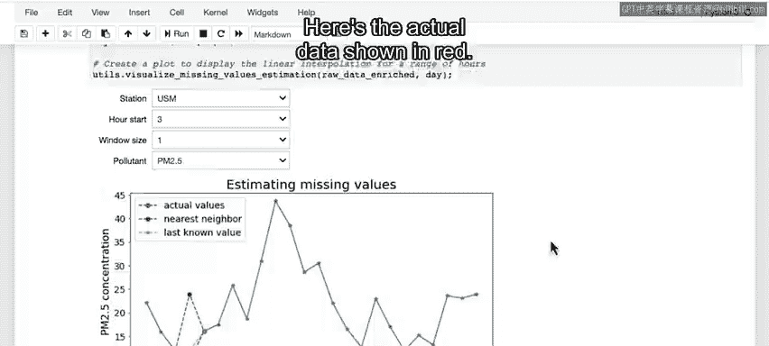

向右移动，你可以看到最大的缺口大小约为3600小时，即某个特定传感器停机了大约五个月。当你看这个大小的缺口导致了多少个单独的小时数据点缺失时，你会发现也大约是3600个。这意味着这个峰值表明数据中只有一个大约3600小时（五个月）的单一缺口。

同样，你也有一些持续数百小时的单一缺口，以及许多在0到200小时范围内的缺口。从这张图中得到的主要启示应该是：虽然大多数单个缺口很小，但大部分缺失数据实际上来自持续数十或数百小时的大缺口。正如你现在可以想象到的，缺口时间越长，提供合理估计的难度就越大。

接下来我想做的是开始可视化解决方案可能的样子。当你运行下一个单元格时，你正在模拟一个传感器停机一小时的情况。

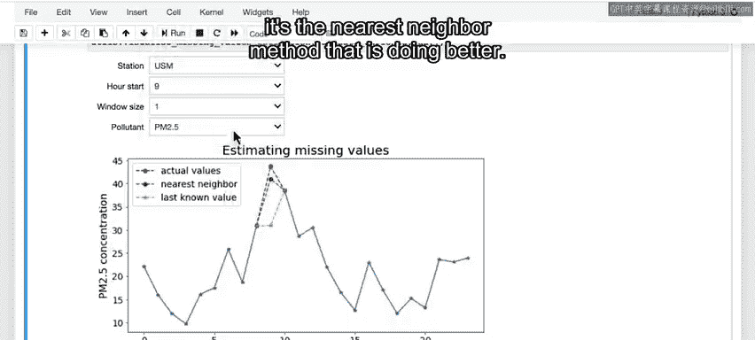

红色显示的是实际数据。

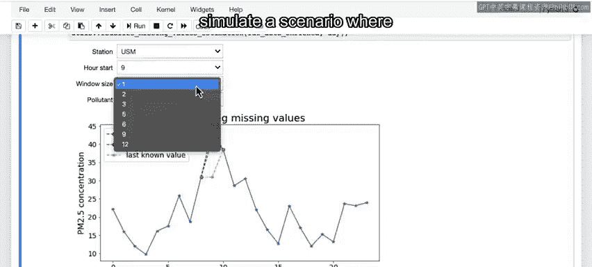

现在，你正在可视化如何用黄色显示的最远一次测量值替换那个点，这里只是一条平直线，因为我们重复了最远一次的测量值。对于另一种方法，你可以用最近邻传感器站点的值替换它，这就是这里用绿色显示的。所以，在这个特定的小时，最近的工作站实际上有一个相当高的PM2.5读数。

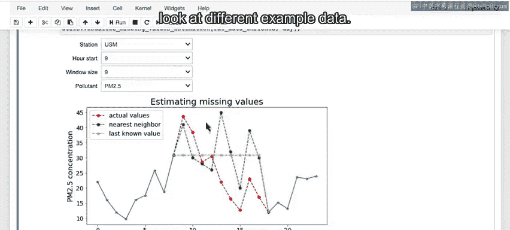

你可以使用这个下拉菜单更改起始变量，以查看在这个示例数据中不同小时的比较情况。你可以看到，在某些情况下，最远值看起来更接近真实值。但在其他情况下，最近邻方法表现得更好。

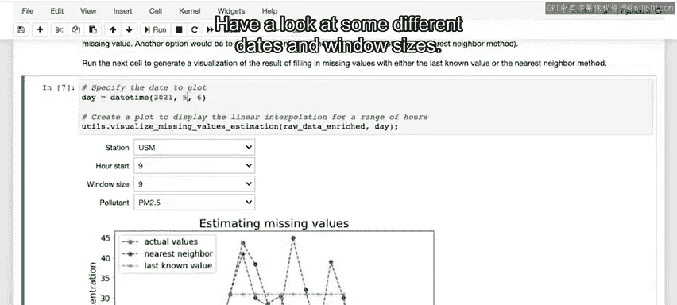

你还可以在这里更改窗口大小，以模拟存在超过一小时缺口的情况。

你会注意到，无论窗口大小如何，最远值方法只是简单地记录传感器离线前的那个值，而最近邻方法在每个小时都会有一个不同的值，该值基于最近的工作邻站记录的值。

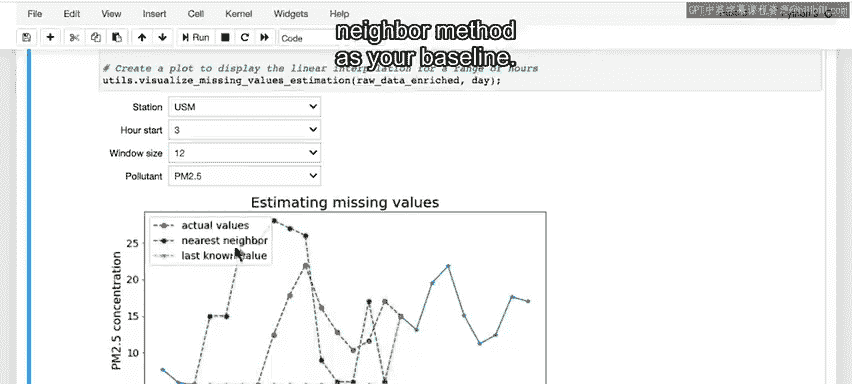

你也可以更改日期以查看不同的示例数据。

查看一些不同的日期和窗口大小，你可以看到，随着窗口变大，你认为哪种方法往往会表现得更好？

正如上面所看到的，很多时候传感器会离线数十或数百小时。在这些情况下，仅仅使用最远数据的方法，随着缺口变大，其估计效果会变得更差。所以你可以看到，对于这种情况，这个方法似乎效果不佳。

最近邻方法提供了可变的结果，但它不一定随着缺口大小增加而性能下降。因此，在这一点上，你将放弃使用最后记录测量值的方法，并进一步测试最近邻方法作为你的基准。

接下来要做的是测试这种方法在真实数据缺口分布上的表现如何。

运行下一个单元格来运行一个模拟，你随机选择数据中的位置，然后使用你的最近邻方法来估计该时间该站点的传感器测量值。这将需要几分钟时间运行，所以请耐心等待，或者当你看到代码单元格左上角的小星星时稍作休息，这意味着它仍在运行。

你将针对实际数据中识别出的各种大小（从一小时到数百小时）的模拟缺口进行这个练习。原则上，这种方法不应该受缺口大小的影响，因为你只是用另一个站点的最近记录测量值替换缺失值，但为了保持一致性，我们在这里模拟了实际数据中的缺口。

为了衡量你的表现，你将计算平均绝对误差，这只是你的估计值与真实传感器测量值之间差异的平均值，模拟运行后会在这里打印出来。

平均绝对误差是衡量预测准确性的常见且直观的方法。之所以说它直观，是因为平均绝对误差的误差度量单位与你试图估计的事物单位相同，在本例中是PM2.5水平，单位为微克/立方米。

话虽如此，它并不是误差度量的唯一可能选择，对于不同的应用，你可能会选择不同的度量标准，例如均方误差，或者与实际测量值相比的百分比误差。这里我们将使用平均绝对误差，作为直观比较不同模型结果的简单方法。

当你运行这个模拟时，你会发现你得到的平均绝对误差大约为8。这意味着，平均而言，你的估计值与传感器测量值相差8个单位。对于PM2.5，如前所述，单位是微克/立方米。所以，这个结果告诉你，平均而言，你的最近邻方法返回的值与真实测量值相差8微克/立方米。

这个误差估计现在可以作为你的基准，来衡量在不实施任何更复杂AI算法的情况下你能做到多好。我认为这是一个很好的时机来提醒一下，PM2.5的最大推荐值是12微克/立方米，因此平均误差为8，我们处理的误差范围很容易高于或低于该推荐水平。

这个误差估计现在可以作为你的基准，来衡量在不实施任何更复杂的AI方案的情况下你能做到多好。所以，请你自己尝试操作一下，感受一下这是如何工作的，然后进入下一个视频，我们将开始研究使用神经网络来估算缺失值。

---

## 总结

本节课中，我们一起学习了如何为空气质量数据填补问题建立基准。我们测试了两种简单方法，并最终选择最近邻方法作为基准，其平均绝对误差约为8微克/立方米。这个基准为我们后续评估更复杂的AI模型（如神经网络）的性能提升提供了明确的量化标准。