# 031：空气质量训练和测试神经网络 🧠

在本节课中，我们将要学习如何使用神经网络来改进空气质量传感器缺失值的估算。我们将从回顾上一节建立的简单基线方法开始，然后探索如何利用更复杂的机器学习模型来捕捉数据中的深层模式，从而获得更精确的预测结果。

## 回顾基线方法

上一节我们介绍了如何使用“最近邻传感器”方法来估算缺失的PM2.5值。该方法仅依据最近传感器的测量值进行估算，其平均绝对误差（MAE）约为 **8 微克/立方米**。这意味着，使用此方法估算的缺失值，平均会与真实值相差正负8个单位。

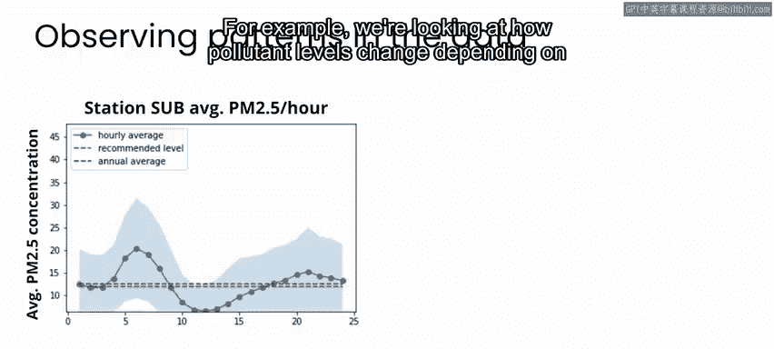

虽然在某些情况下该方法效果尚可，但在其他情况下表现不佳。这表明我们有改进的空间。

## 探索数据模式

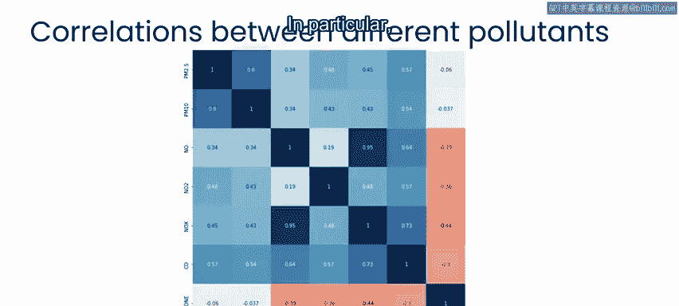

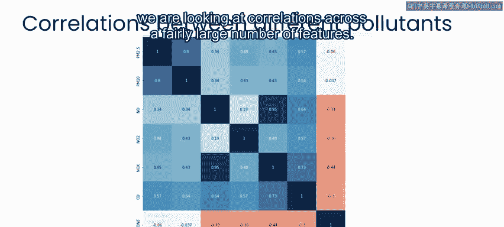

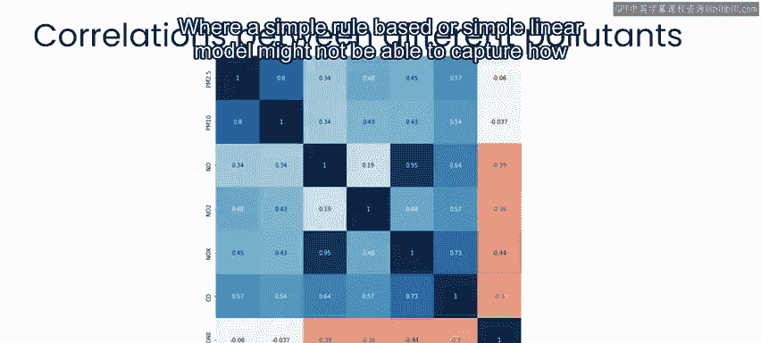

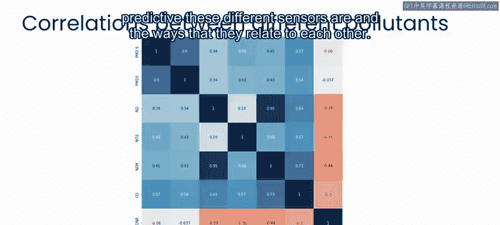

在数据探索阶段，我们发现数据中存在一些明显的模式。例如，污染物水平会随着一天中的时间或一周中的某天而变化，并且不同污染物之间的水平也存在关联。

通过计算**相关系数**，我们可以量化这些模式。这些发现是一个良好的早期迹象，表明AI可能通过学习数据中的这些模式来发挥作用。特别是当特征数量较多、关系复杂时，简单的基于规则或线性模型可能难以捕捉这些预测性信号及其相互关系。

## 引入神经网络

接下来，我们将尝试使用**神经网络**算法来学习数据中的模式，并观察是否能对缺失的传感器值做出更好的估算。

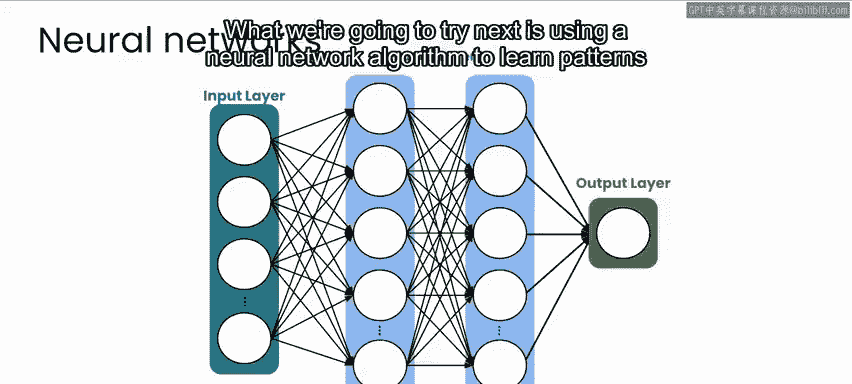

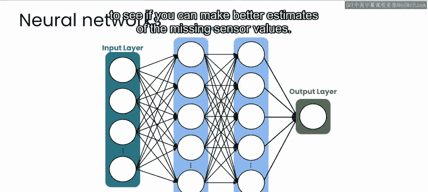

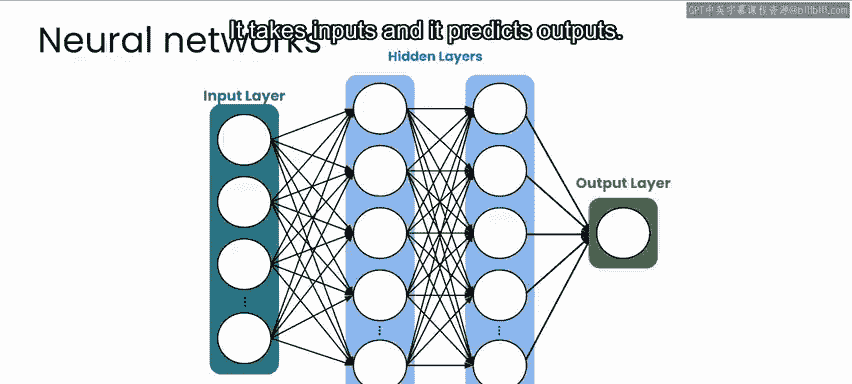

神经网络是一种算法，其核心原理相对简单：它接收输入并预测输出。如果你不熟悉神经网络，主要需理解的是：它能够学习数据中那些难以用规则系统或简单线性关系捕捉的复杂**相关性**。

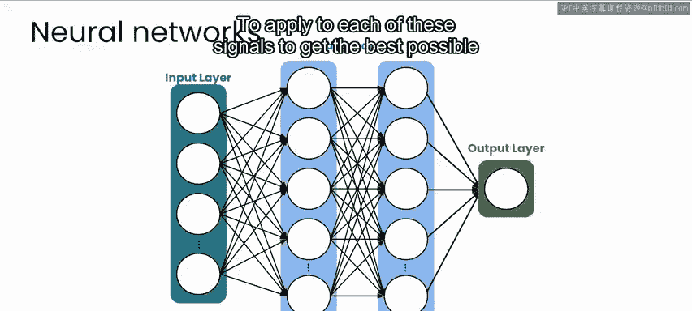

例如，在预测缺失值时，邻近传感器的值是否有用，可能取决于一天中的时间、一周中的某天或检测到的特定颗粒物类型。数据中存在大量我们称之为“维度”的信息，这让人难以直观理解，但对人工神经网络来说，找到应用于每个信号的最佳权重组合以基于历史数据做出最优预测，是相对简单的过程。

### 神经网络的工作原理

本质上，人工神经网络是一种计算机器。其中的神经元接收一系列输入（如我们一直在看的传感器数据），运行简单计算，然后生成输出（在本例中是对传感器缺失值的估算）。

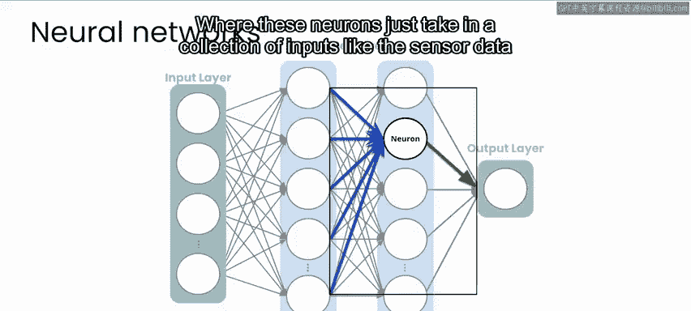

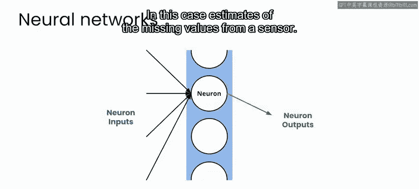

如果网络中有多层神经元，一层的输出不会直接成为最终预测，而是会传递到下一层神经元，每一层都会生成自己的输出。我们使用多层结构的原因是，它们能够发现超越线性组合的信号组合。

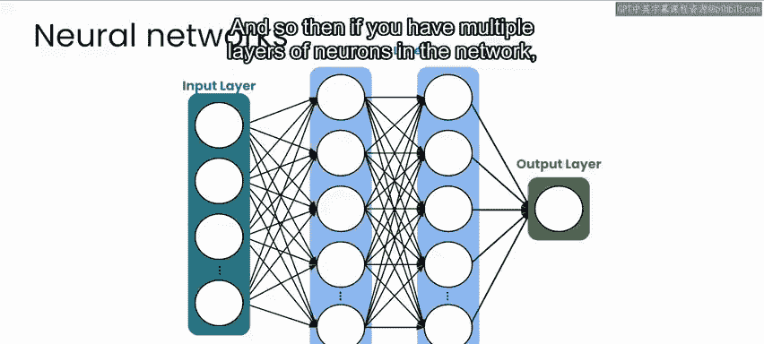

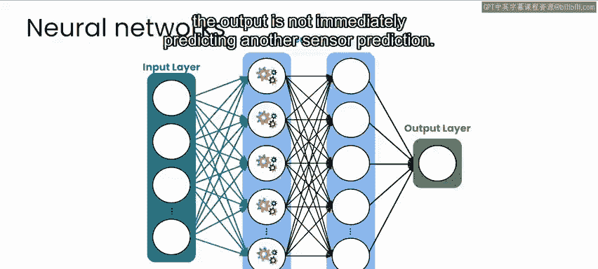

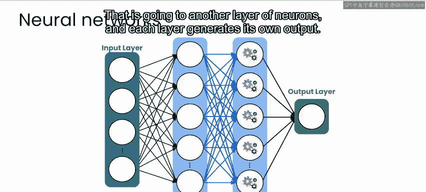

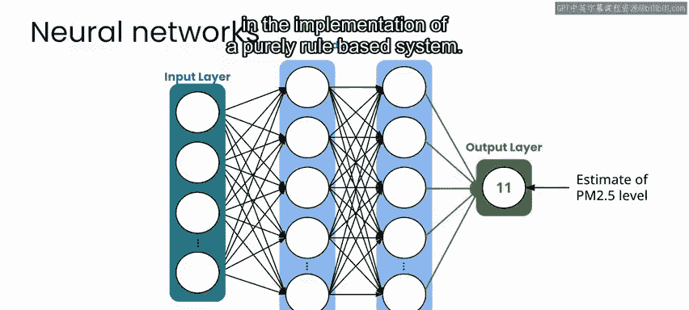

例如，神经网络可能发现PM10仅在一天中的某些时段或一周中的某些天是PM2.5的良好预测指标。使用这些**隐藏层**的神经网络能够发现这类更细微、更复杂的相关性，而这些在纯手动分析或纯基于规则的系统实现中是难以发现的。

## 构建与训练神经网络

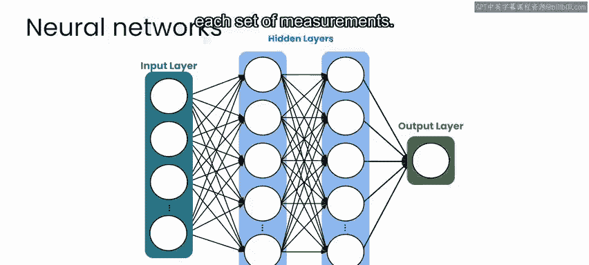

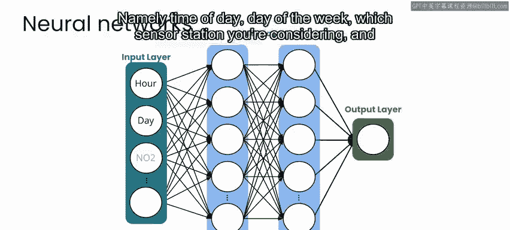

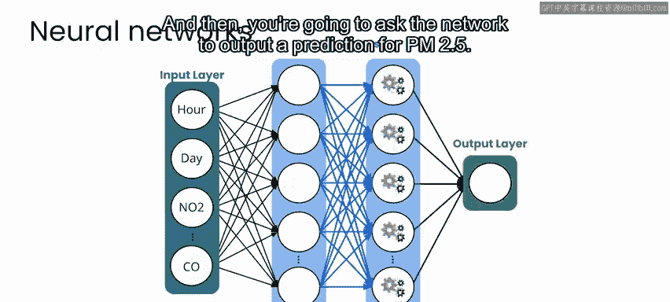

在我们的具体任务中，神经网络的输入将包括：**一天中的时间、一周中的某天、传感器站点ID以及其他所有污染物的测量值**。然后，我们将要求网络输出对PM2.5的预测。

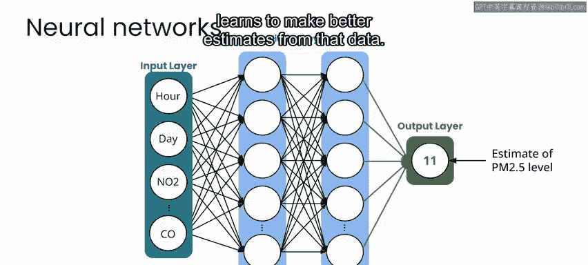

按照惯例，我们随机初始化神经网络。因此，一开始网络完全不会做出好的预测。但我们将使用已知正确答案的示例来训练网络。随着网络看到每个新示例，它会逐步更新或学习从数据中做出更好的估算。

需要记住的重要一点是，在基线方法中，我们只考虑了一个信息：最近传感器站点的测量值。而现在，在神经网络中，我们考虑了更多的信息，包括站点位置、时间、星期几以及其他所有污染物的值。

## 实验步骤详解

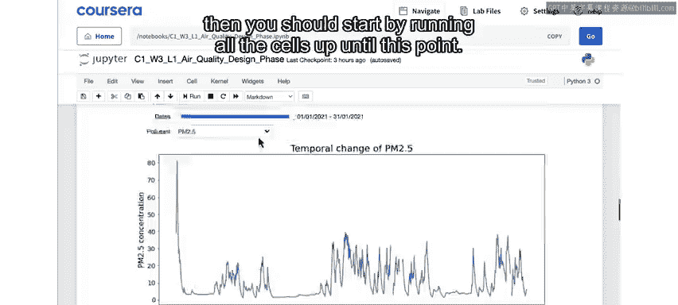

以下是实验中的关键步骤：

### 1. 数据准备

在开始之前，我们需要处理数据。代码会将日期时间列中的值解析，并创建新的列来表示每个测量的月份、星期几和小时。同时，还会创建所谓的**独热编码数组**，用于向神经网络指示特定测量来自哪个站点。

此步骤还会从数据集中删除所有包含缺失值的行。这样做的原因是，我们需要在已知正确答案的示例上训练神经网络。目前，我们为了训练和测试的目的移除了缺失值。

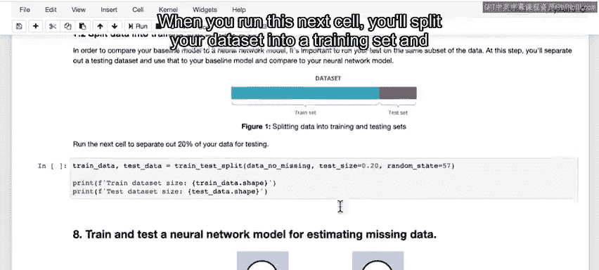

### 2. 划分数据集

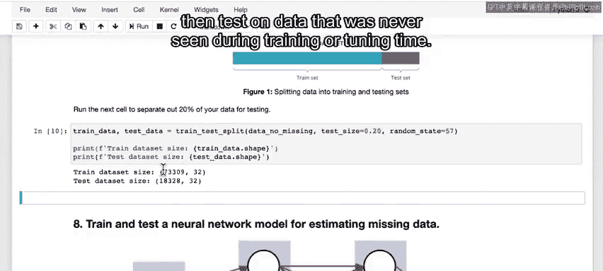

运行代码单元格会将数据分为**训练集**和**测试集**。在许多项目中，通常还会划分一个**验证集**用于调整模型参数。但在本实验中，我们将只运行一次训练而不调整任何模型参数，因此我们将80%的数据用于训练，保留20%用于测试。

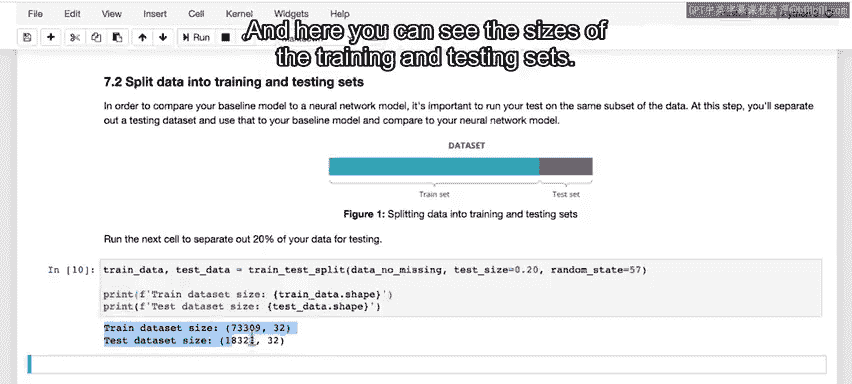

### 3. 训练神经网络

训练神经网络是一个迭代过程。在代码运行时，你可以看到每次迭代（或称**周期**）都会输出一个**损失**值的估计。你只需要知道，损失值越低，意味着你的网络在做出预测方面变得越好。

同时，代码还会打印每个周期的平均绝对误差（MAE）。但请注意，这是在训练数据本身上测量的误差，尚不能代表模型在最终测试集上的性能。我们稍后会为之前分离出的测试集计算MAE。

值得一提的是，在神经网络训练的背后，它实际上是在优化**均方误差**。在处理数据中的异常值时，这可能是一个更稳健的指标，并且其数学特性使得神经网络更容易收敛到正确的解。

### 4. 评估模型性能

当网络训练完成后，我们将在之前创建的测试数据集上进行预测，以测试其表现。运行下一个单元格可以打印出基线模型与神经网络的比较结果。

对于这个测试集，神经网络的**平均绝对误差显著降低，大约是基线方法的一半**。

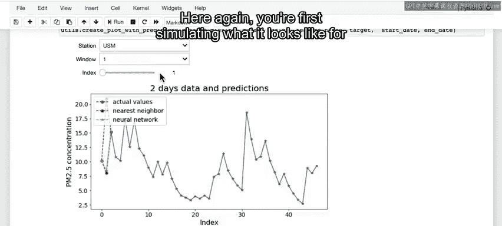

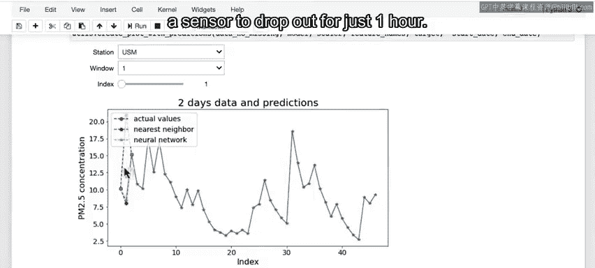

### 5. 结果可视化

我们可以通过可视化来比较新的神经网络模型在不同场景下与基线最近邻模型的差异。我们可以选择要查看的站点、模拟传感器失效的窗口大小（小时数），并通过滑块在时间轴上移动这个窗口。

图表中，**红色**代表实际测量值，**绿色**代表最近邻模型预测值，**黄色**代表神经网络预测值。在某些情况下，神经网络可能看起来比最近邻方法更差。但解读的关键在于平均误差：神经网络的平均绝对误差为4，而最近邻方法为8。这意味着，**平均而言，神经网络的估算值比最近邻方法更接近真实值**。

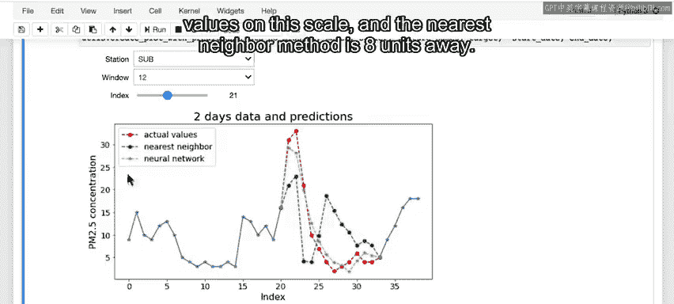

## 填补全部缺失值

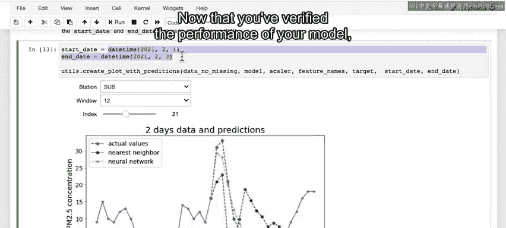

在验证了模型性能后，下一步是完善解决方案的原型，包括估算传感器之间PM2.5值的方法，并进一步完善用户界面。

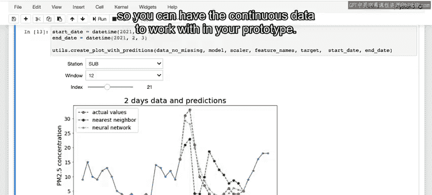

为此，我们现在将使用模型来填补数据集中的所有实际空缺，以便在原型中拥有连续的数据可供使用。

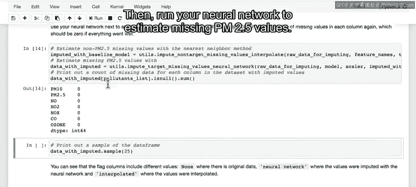

需要注意的是，我们的神经网络模型需要所有其他污染物的输入值，以及日期、时间和站点ID。因此，下一步将是首先使用简单的**线性插值**方案估算所有非PM2.5污染物的缺失值，然后运行神经网络来估算缺失的PM2.5值。

当然，这样做会创建一个情况：我们的一些PM2.5值是使用其他污染物的估算值得出的，而这些估算值本身的误差可能会传播。但此处的重点只是填补空缺，以便在下一个实验中继续构建原型。

在现实场景中，你可能会选择训练多个不同的神经网络模型来处理其他污染物值缺失的情况，甚至可能将邻近传感器的测量值也加入神经网络的输入特征中。但在这里，我们保持简单。

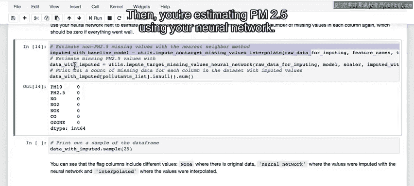

### 数据标记

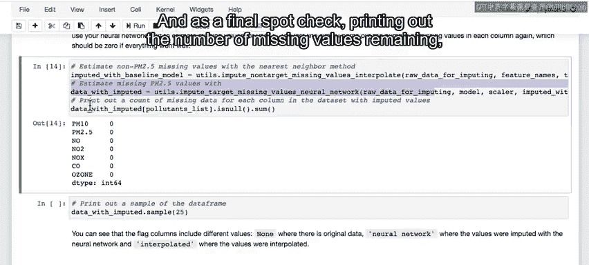

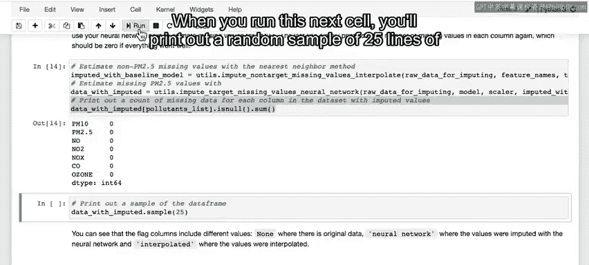

完成上述步骤后，我们还向数据集中添加了一些额外的列：**估算标志列**。这些列用于指示当前数据集中的哪些值是估算值，哪些是原始的真实传感器测量值。

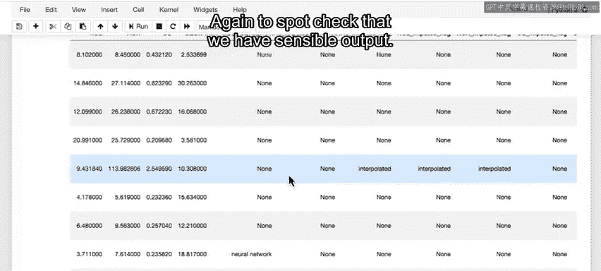

*   对于PM2.5，标志为 `neural_network` 表示该值是使用神经网络模型估算的。
*   对于其他污染物，标志为 `interpolated` 表示该值是使用线性模型填补的。
*   标志为 `none` 的地方，则是原始的传感器测量值。

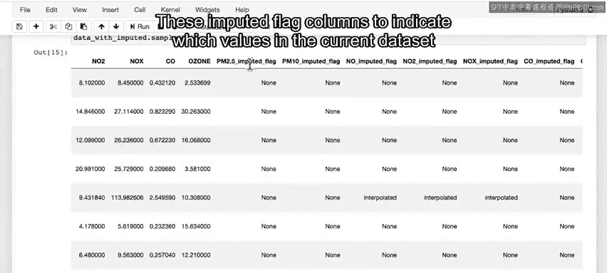

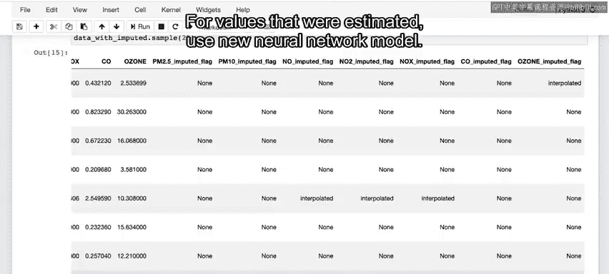

添加这些标志的目的是，以后在地图上显示污染水平时，可以区分哪些是直接测量值，哪些是估算值。同时，如果后续要使用这些数据进行进一步处理或建模，也能跟踪测量值与估算值。

最后，我们可以将结果写入一个新的CSV文件，供后续实验使用。

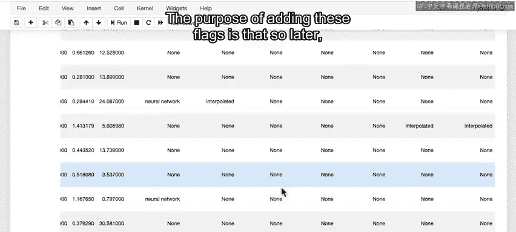

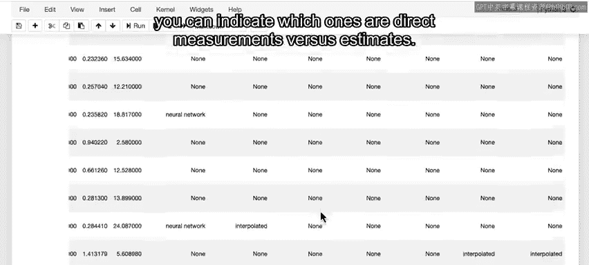

## 总结

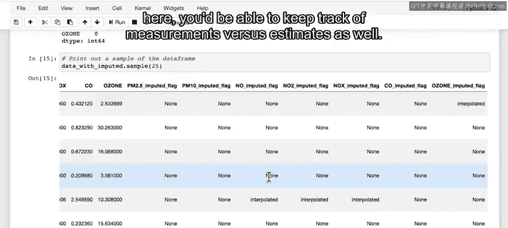

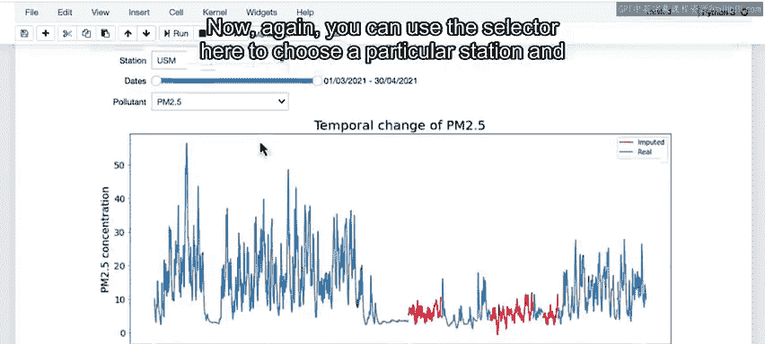

本节课中，我们一起学习了如何应用神经网络来改进空气质量传感器缺失数据的估算。我们从回顾简单的最近邻基线方法开始，认识到其局限性。然后，我们探索了数据中的复杂模式，并引入了能够学习这些模式的神经网络。

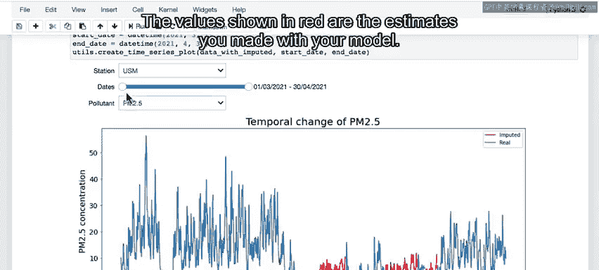

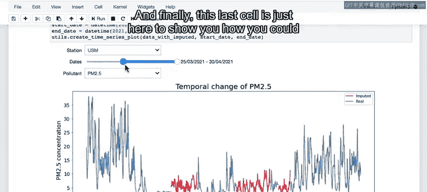

我们详细介绍了神经网络的构建、训练和评估过程。通过实验，我们成功将PM2.5估算的平均绝对误差从基线方法的8降低到了4，性能提升了一倍。最后，我们使用训练好的模型和线性插值方法，填补了数据集中所有的缺失值，并为估算值添加了标记，为下一阶段的原型开发做好了数据准备。

现在我们已经设计出了估算缺失值的方法，接下来将设计估算传感器站点之间污染物水平的方法，这将是下一节视频的内容。