# 032：空气质量最邻近方法 🏙️


## 概述

在本节课中，我们将学习如何利用最邻近方法来估算传感器站点之间的污染物水平。我们将从最简单的基线方法开始，逐步探讨如何通过机器学习技术进行改进，最终完成空气质量监测系统的设计阶段。

---

## 设计阶段收尾：估算站点间污染物水平的方法

上一节我们介绍了如何处理传感器站点的缺失值，本节中我们来看看如何估算传感器站点之间的污染物水平。

首先，我们需要建立一个简单的基线方法。设想你在波哥大市的某个位置，试图估算该位置的空气污染水平。最简单的方法是查找最近空气质量传感器的最新测量值，并假设该值适用于你的位置。这就是我们在之前实验中使用的基线方法，不过现在我们要估算的是城市中任意位置的污染水平。

在机器学习中，这种方法被称为**最邻近方法**。它基于一个假设：数据集中邻近的观测点在某些特征上具有相似性。这种邻近可以是物理空间上的（如我们这里的情况），也可以是时间上或其他可测量维度上的。

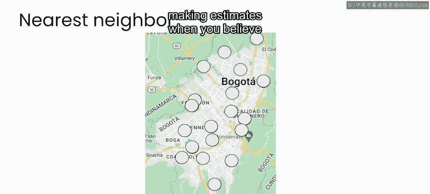

---

## 最邻近方法的直观理解

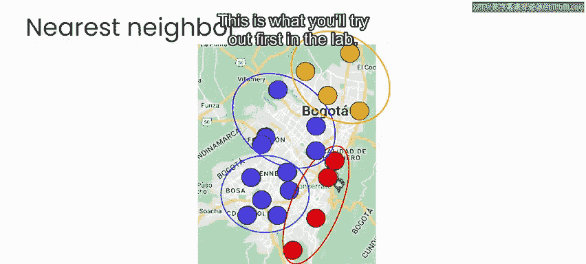

考虑到空气污染测量，这种方法具有一定的直观意义。因为任何位置的空气特征很可能与最近传感器位置的特征最为相似。当然，这不一定总是成立，但作为基线方法，它是一个合理的初步猜测。因此，在实验中你将首先尝试这种方法。

---

## 改进方法：K最邻近（KNN）

如果你思考如何改进这种方法，考虑到城市中有多个传感器站点，你可以考虑不仅使用一个最近邻，而是使用两个、三个甚至更多个最近邻来估算你所在位置的空气质量。

这种最邻近方法的扩展被称为**K最邻近方法**，其中 **K** 代表为每次估算所考虑的邻居数量。那么问题来了：给定多个邻居，应该如何进行估算？你可以取所有邻居值的简单平均值，但对于像空气质量测量这样的数据，你可能会假设最近邻居的测量值应该比更远邻居的测量值具有更大的权重。

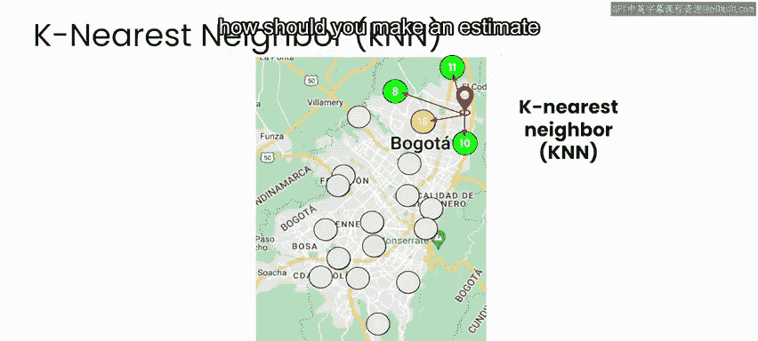

事实上，这正是当前最邻近技术在实际应用中常见的做法。

---

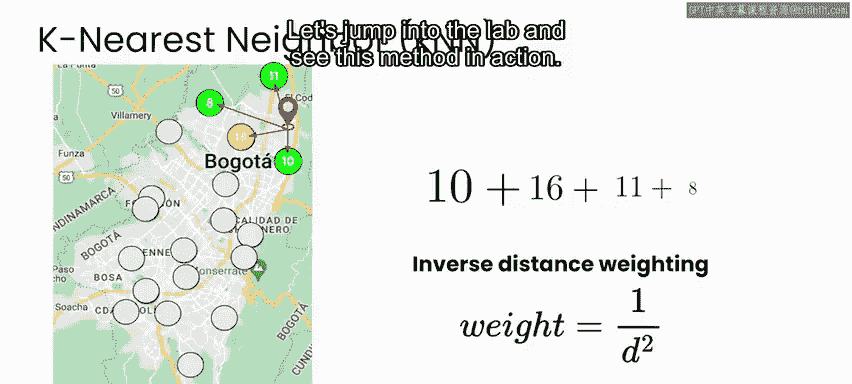

## 距离加权方案

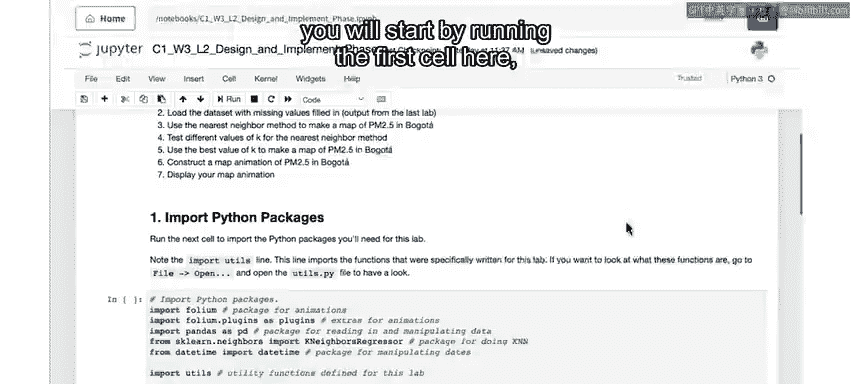

有多种加权方案可以考虑。在本周的实验中，你将使用**反距离加权**方法。具体来说，你为每个邻居分配一个权重，该权重等于该邻居与你想要估算位置距离的**平方的倒数**。

以下是反距离加权的公式表示：

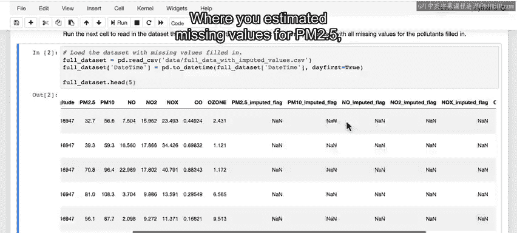

**权重 w_i = 1 / (d_i)^2**

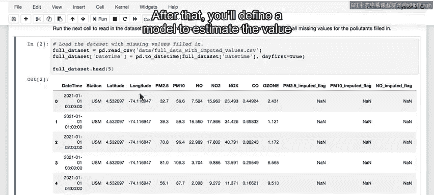

其中，**d_i** 是第 **i** 个邻居到目标位置的距离。

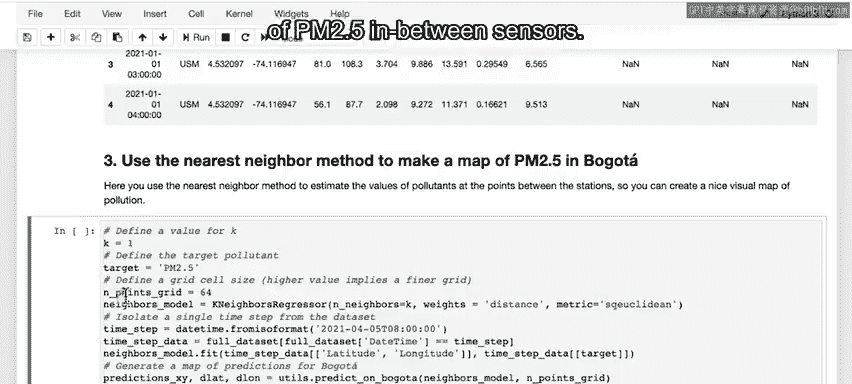

让我们进入实验，看看这种方法的具体应用。

---

## 实验步骤

### 1. 导入必要包

与之前的实验一样，你首先需要运行第一个单元格，导入本实验所需的所有包。

```python
# 导入所需库
import pandas as pd
import numpy as np
import matplotlib.pyplot as plt
from sklearn.neighbors import NearestNeighbors
```

### 2. 读取数据集

运行导入后，你将读取数据集并打印前五行，以检查一切是否导入正常。

```python
# 读取数据
data = pd.read_csv('air_quality_data.csv')
print(data.head())
```

现在你可以看到，这是你在上一个实验结束时生成的数据集，其中使用神经网络模型估算了PM2.5的缺失值。

### 3. 定义估算模型

接下来，你将定义一个模型来估算传感器之间的PM2.5值。

首先，为波哥大市创建一个网格，并基于最邻近方法（这里K=1）估算每个网格单元内的PM2.5值。这类似于上一个实验中的做法，但现在是估算覆盖整个城市的网格上的值。

```python
# 创建城市网格并估算PM2.5值
def estimate_pm25_grid(data, k=1):
    # 此处为估算逻辑
    pass
```

运行后，你将得到一张地图，上面显示了传感器站点的位置，以及覆盖在城市上的彩色编码网格。

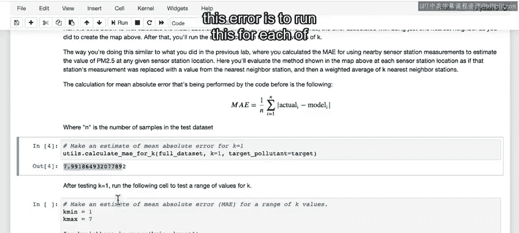

### 4. 分析估算结果

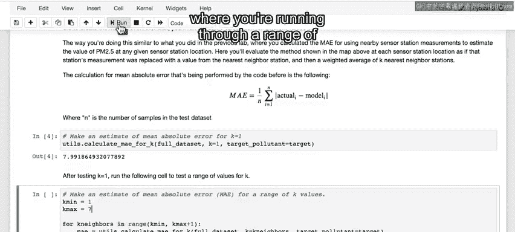

你可以点击站点位置查看该站点的PM2.5测量值。带有白色边框的圆圈表示直接传感器测量值，而带有黑色边框的圆圈表示由神经网络估算的值。在弹出的窗口中也会标明“估算值”。

在这个例子中，你隔离了数据中的单个时间戳（即日期和时间）。你可以更改时间戳以查看不同日期和时间的结果。这可以成为你地图应用中的一个功能，用户可以选择日期和时间来查看城市的PM2.5地图。

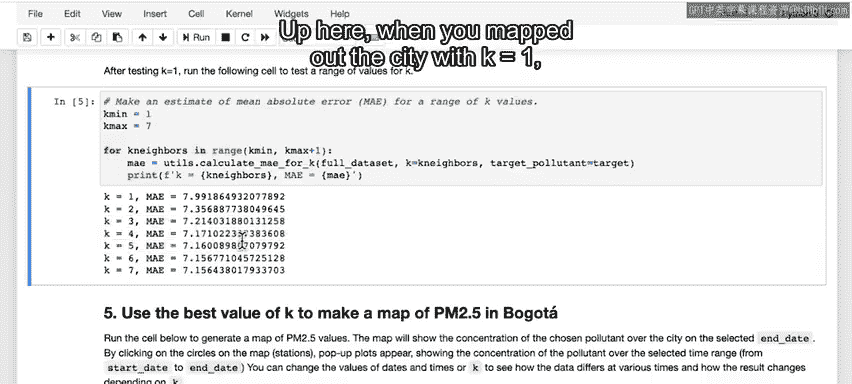

### 5. 计算误差并尝试不同的K值

接下来，你将计算与K=1相关的平均绝对误差，然后逐步尝试不同的K值场景。

```python
# 计算不同K值下的平均绝对误差
def calculate_mae(data, k_values):
    mae_results = {}
    for k in k_values:
        # 估算并计算误差
        mae = compute_mae_for_k(data, k)
        mae_results[k] = mae
    return mae_results
```

运行后，你会发现使用K=1时，PM2.5水平的估算平均偏差约为8微克/立方米。计算误差的方法是对每个传感器站点位置运行估算，并将基于最邻近方法的估算值与该站点的实际测量值进行比较。

### 6. 尝试更高的K值

接下来，你可以将K值更改为其他值，例如3。这意味着对于地图中的每个网格单元，你将考虑三个最近的站点，并取加权平均值。

```python
# 使用K=3进行估算
estimate_pm25_grid(data, k=3)
```

运行后，你会得到一个更平滑的PM2.5估算表示。与仅考虑一个最近邻不同，现在每个网格单元都考虑了三个最近邻，并根据距离的平方倒数进行加权平均。

同样，如果你将K增加到4、5或其他数字，那么你将基于该数量的附近站点进行估算，并根据每个传感器站点的距离平方倒数对平均值进行加权。

---

## 设计阶段完成

至此，你的设计阶段基本完成。你已经设计了一个用于估算特定站点缺失值的神经网络方法，以及一个基于最近邻估算传感器之间值的系统。你还在一个美观的地图中展示了所有内容，这可以作为你的用户界面。

值得一提的是，在估算传感器站点之间值时，你还可以尝试其他算法，甚至尝试K最邻近方法的不同加权方案。使用其他方法，你可能在平均绝对误差方面做得更好一些。但在这种情况下，你面临一个非常现实的物理约束：你实际上并不知道传感器之间的污染物水平。因此，无论参数如何，你采用的任何模型都只是一个粗略的估计，并且你可能无法比这里使用的K最邻近方法有太大改进。

---

## 总结

本节课中我们一起学习了如何利用最邻近方法估算空气质量传感器站点之间的污染物水平。你首先使用K=1建立了基线方法，然后通过使用更高的K值和距离加权，设计了一个更复杂的算法，以更好地估算波哥大市任意位置的空气污染水平。至此，你完成了项目的设计阶段。在下一个视频中，我们将回顾在进入实施阶段之前需要回答的关键问题，以结束设计阶段。