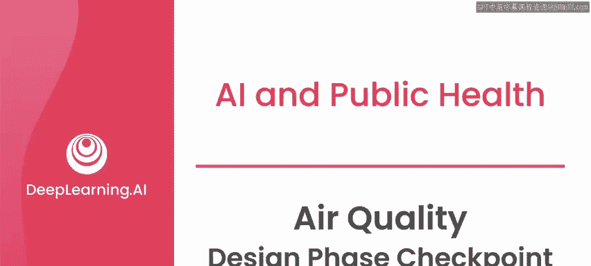
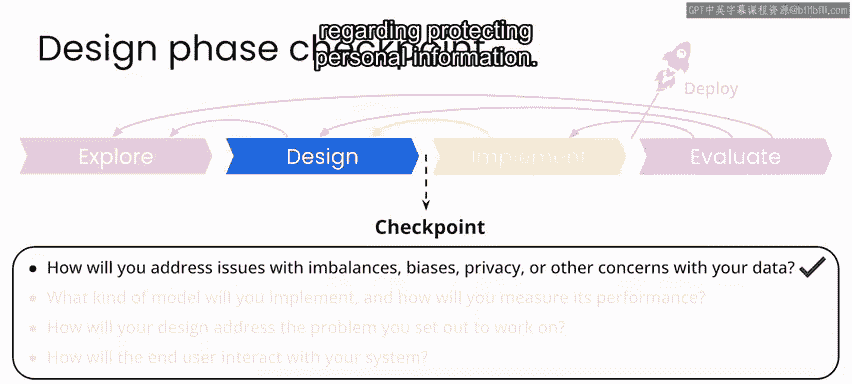
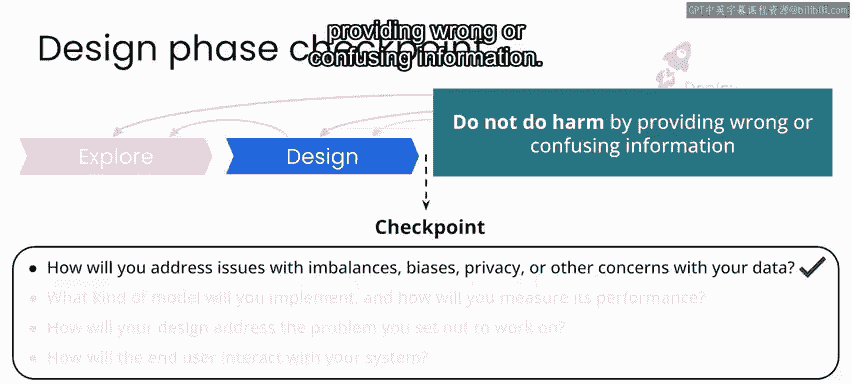
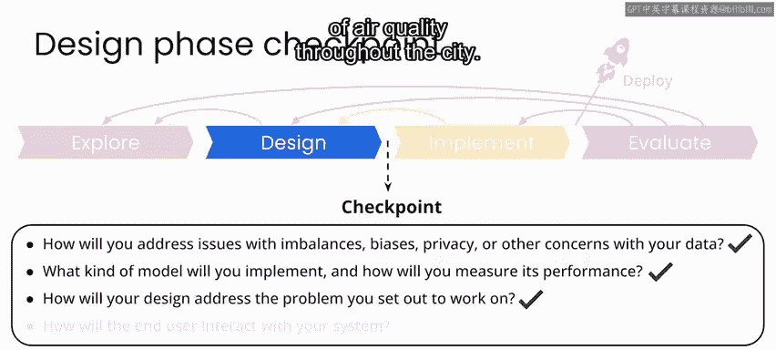

# 033：空气质量项目设计阶段检查点 🧭

在本节课中，我们将回顾波哥大空气质量项目设计阶段的成果，并明确进入实施阶段前需要确认的关键问题。

恭喜你完成了波哥大空气质量项目的设计阶段。在此阶段，你完成了解决方案的原型设计，考虑了如何处理数据中关于隐私或个人信息的任何问题（在本项目中应极少），并设计了用户体验。做得很好。

此时，在进入实施阶段之前，你应该能够回答以下问题。

以下是进入下一阶段前需要明确的四个核心问题：
1.  你如何解决数据中的不平衡、偏见、隐私或其他问题？
2.  你将实现何种模型，以及如何衡量其性能？
3.  你的设计将如何解决问题？即，它如何解决？
4.  最终用户将如何与你的系统交互？

---

## 数据隐私与潜在风险分析

上一节我们列出了设计检查点，本节中我们来看看如何具体分析数据风险。

如前所述，你始终需要对数据进行彻底分析，关注数据隐私、安全、偏见或其他问题。对于这个项目，你使用的是来自科学仪器的公开可用数据，因此在保护个人信息方面没有重大顾虑。

然而，请记住，数据是公开的这一事实并不意味着它不会造成伤害。你正在开发的应用旨在成为波哥大市更广泛的空气质量公共卫生倡议的一部分，因此你需要确保你的产品至少不会因提供错误或令人困惑的信息而造成伤害。

我认为你可以考虑此信息可能被滥用的其他潜在情况，并与利益相关者讨论。例如，如果你能更准确地估算出污染的突然爆发，这可能与非法制造、非法焚烧或其他犯罪活动有关。这可能会吸引监控用例，不仅是对污染物的监控，还有对犯罪的监控。

如果这些信息随后被用于起诉犯罪或识别罪犯，那么社区可能会因此失去对这些传感器的信任，并对信任传感器数据甚至未来安装更多传感器产生抵触。

因此，对于任何用例，即使你一开始就知道它不包含个人信息，你也应该与利益相关者一起花时间思考潜在风险，以及通过机器学习提供更丰富体验可能带来的潜在负面影响。

---

## 模型设计与性能评估

在分析了潜在风险后，我们来看看为解决核心问题所设计的模型方案。

通过这里的实验，你为估算传感器缺失值和估算传感器之间的PM2.5值提出了一个模型设计，并使用**平均绝对误差（MAE）** 来建立模型相对于基线的性能。

**性能评估公式示例：**
`MAE = (1/n) * Σ|y_i - ŷ_i|`
其中，`y_i`是真实值，`ŷ_i`是模型预测值，`n`是样本数量。

---

## 解决方案与用户交互设计

有了性能达标的模型，接下来我们看看整个解决方案如何落地并与用户连接。

通过这一设计，你旨在解决我们着手处理的问题，即为波哥大市提供一个应用程序，让市民能够获取全市范围内的实时空气质量估算。

最终用户将通过一个**支持Web的移动应用程序**与你的系统交互。这将使他们能够查看当前的估算值以及来自各个传感器站点的历史数据。

当然，你在实验中实际进行的设计仍然是一个原型。但在这些实验过程中，你已经能够演示一个可以估算缺失传感器值、估算传感器之间污染水平，并在点击传感器站点位置时提供历史数据快照的系统。

---

## 总结与下一步

至此，你已经完成了本项目设计阶段的所有工作。现在是时候在实施阶段将所有部分整合起来了。

本节课中我们一起学习了设计阶段的成果验收，包括对数据风险的思考、模型方案的确立以及用户体验的设计。请加入下一节视频，共同完成关于产品实施的实验部分。