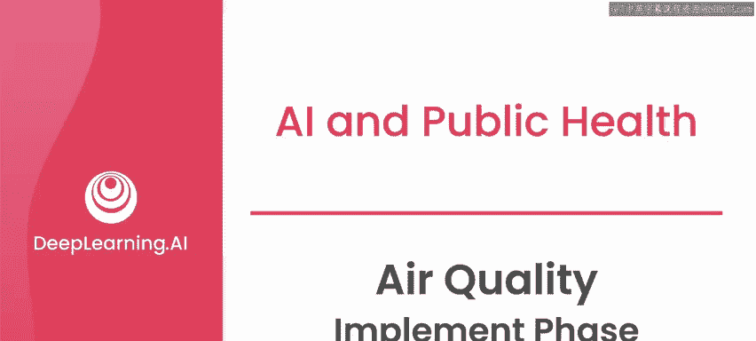
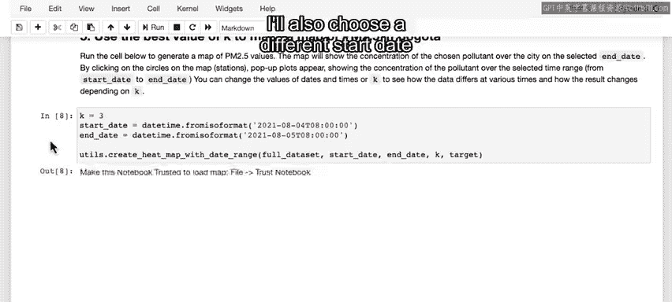
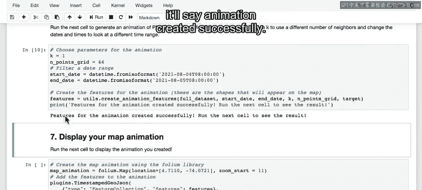
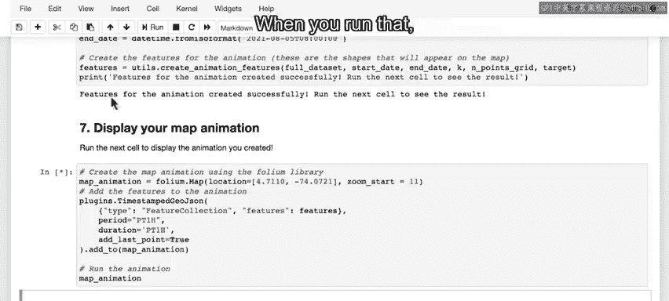
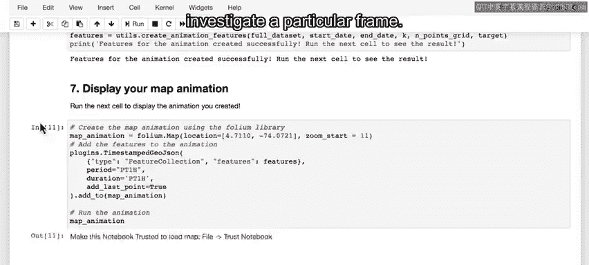

# 034：空气质量项目实施阶段 🚀

在本节课中，我们将探讨如何将空气质量监测应用从实验室原型推进到实际部署阶段。我们将回顾已构建的映射应用，为其添加新功能，并讨论在实际部署中可能遇到的技术挑战。

---

## 实施与部署的挑战

上一节我们完成了模型构建与评估。本节中我们来看看，当您像在这些实验中所做的那样，开发并准备部署一个空气质量监测应用时，会遇到一系列实际挑战，其中许多本质上是技术性的。

以下是您需要考虑的主要技术挑战：

*   **系统部署**：如何将您的系统部署到云端或托管服务器上。
*   **数据处理**：如何接收和处理来自传感器的实时测量数据流。
*   **系统监控**：如何监控系统的正常运行时间。
*   **异常处理**：如何处理与之前所见不同类型的异常值（离群点）。
*   **用户体验**：如何根据用户是通过网页还是移动应用访问，来展示相应的用户界面。

所有这些技术挑战都需要克服，才能让这样一个系统真正投入生产环境。在本课程中，我们会花时间讨论这些技术策略，并提醒您它们的存在。如果您具备一些软件工程经验，或者您所在的团队有此能力，您可以思考如何将您的映射应用部署到生产环境中。

为了总结这个项目，我们将跳转回实验环境，为您一直在开发的映射应用添加几个小功能，然后花些时间讨论在项目的最终实施评估中您可能还需要关注哪些方面。首先，让我们回到实验。

---

## 回到实验室：完善映射应用

如果您一直在跟进本实验，并且已经运行了至此的代码单元，那么您可以直接从这里开始，运行以下代码单元。如果您是刚刚打开这个实验，那么您需要从顶部开始，按顺序运行这些代码单元。

从导入库开始，然后依次运行每个单元，直到这里。

现在，您需要做的是选择一个 **K** 值，定义一个开始和结束日期。当您运行此代码时，将生成一张地图，显示每个传感器站在结束日期时间戳的当前PM2.5水平，以及站点之间的插值。

再次说明，当传感器站点的圆圈边框为白色时，表示这是直接测量值；当边框为黑色时，表示这是由您的神经网络模型生成的估计值。

此外，除了地图，您还可以点击每个传感器站点，查看从您选择的起始点开始的历史数值图表。在本例中，我们获取了2021年8月某24小时的数据。

您已经使用特定的K值（本例中K=1）创建了传感器间插值的地图表示。

现在，基于之前的分析，我将把我的K值改为3。因为之前的分析显示，超过K=3或4后，改进并不明显。当然，您可以选择任何您喜欢的K值。我还会选择一个不同的开始日期，以便在图表中显示更长的历史数据。

运行后，您可以看到我得到了一个更平滑的插值地图，并且当我点击传感器站点时，图表中有了更多的历史数据。

目前这仍然是一个在Jupyter笔记本中运行代码的原型，但您可以开始想象它在更友好的用户界面中会是什么样子：用户或许可以通过下拉菜单选择开始日期，或者选择查看过去一周或一个月的数据图表。您可以想象地图会定期更新以显示最新数值，类似于您之前在Purple Air应用中看到的那样。

这只是用户应用可能形态的一个设想。您可以在此尝试不同的日期和不同的K值，查看您生成的示例用户界面。

---

## 创建时间动画

接下来，您将创建一个特定时间范围的动画，本例中是此处指定的开始日期和结束日期之间的过去24小时。同样，您可以选择一个K值。我先用K=1来运行。

当您运行这个单元时，它正在构建将在下方显示的动画。运行完成后，它会显示“动画创建成功”。

然后，您可以运行最后一个单元来显示您的动画。运行后，您将看到类似的效果：现在您可以暂停动画以研究特定帧，也可以逐帧前进，或者播放动画并在此处调整播放速度。

这仍然有些原型化，但原则上，它与当前在线的许多空气质量地图应用相似。同样，您可以设想让用户指定他们想要观看动画的日期，或者点击传感器站点以查看有关这些近期测量的更多信息。

我将用K=3再次运行，看看效果如何。在这里，您可以看到不同传感器之间更平滑的插值。

如果您的应用要构建预测功能，这类动画也可能用于展示未来的空气质量预测。

---

## 总结与展望

如前所述，当要将此类应用在线部署到网页或移动应用时，会伴随许多软件开发挑战。但您可以想象，就像其他一些在线的空气质量监测应用一样，在设计师和一些工程师的帮助下，您可以拥有一个界面，让用户能够观看此类动画，或者与地图交互，查看当前测量值、特定位置传感器的历史测量数据，或城市内其他位置的估计值。

以上就是使用K=3创建的更平滑地图的效果。

波哥大空气质量项目的实施阶段到此结束。当然，在实际实施一个要投入生产、用以支持波哥大市民或关心空气质量的卫生专业人员的系统时，需要考虑更多细节。但我希望此刻您能感受到，至少从高层面上，了解一个项目从最初的探索、到设计、再到最终实施的全过程是怎样的。

在本节课中，我们一起学习了将AI项目从原型推向实际部署所面临的技术挑战，并通过实验完善了空气质量地图应用的功能，包括静态地图展示、历史数据查询以及动态时间动画的创建。我们认识到，一个完整的生产系统还需要解决部署、数据处理、监控和用户体验等诸多实际问题。