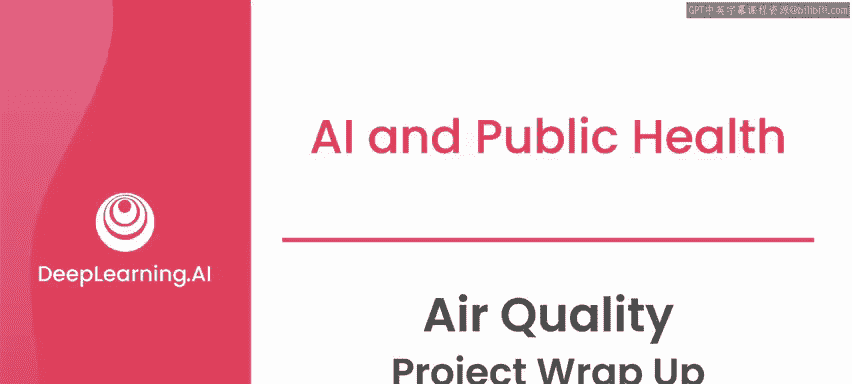
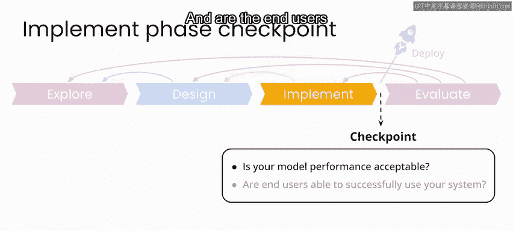
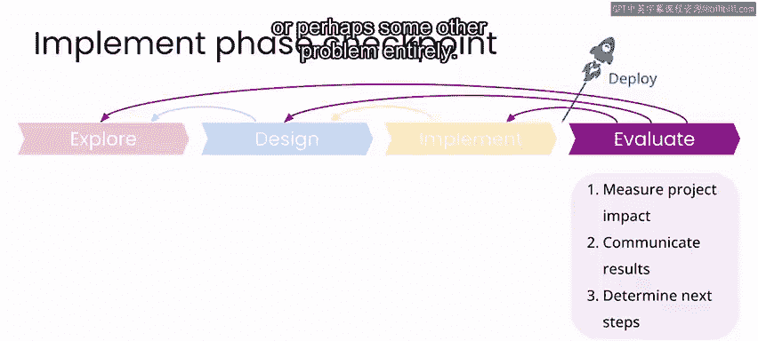
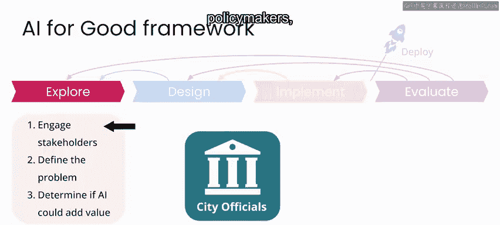
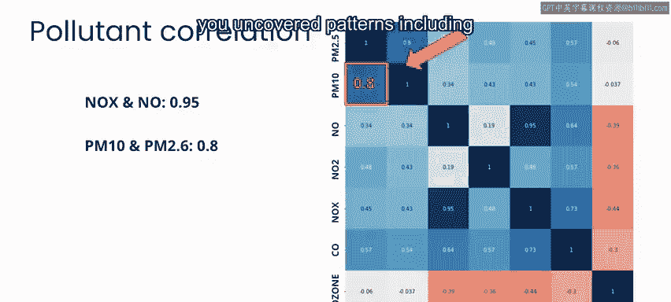
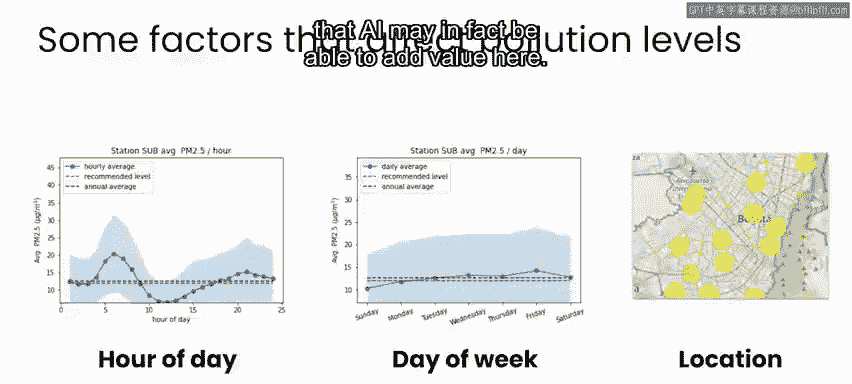
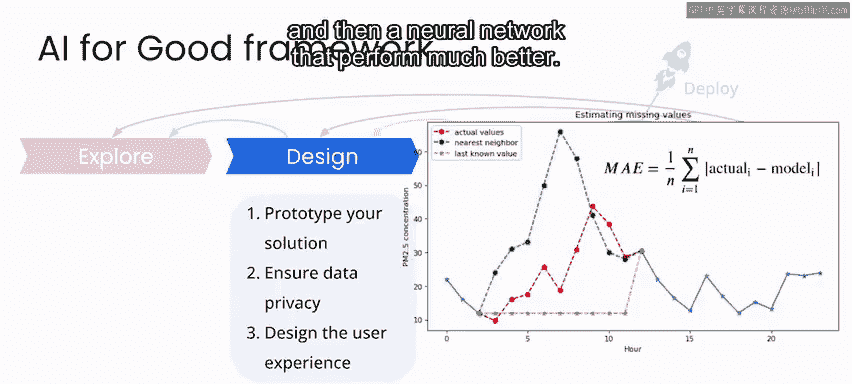
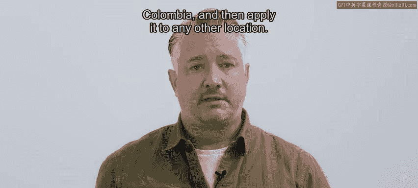
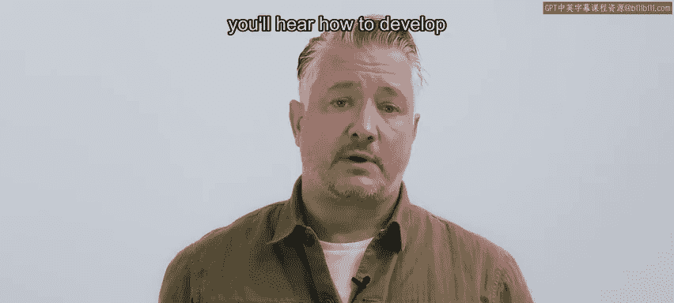

# 035：空气质量项目总结 🌍

在本节课中，我们将对空气质量监测系统项目进行总结。我们将回顾从探索、设计到实施的全过程，并讨论在系统部署前需要评估的关键问题，最后对整个“AI向善”框架在本项目中的应用进行梳理。

---

## 系统部署前的关键评估 🔍

目前，您已经完成了空气质量监测系统的探索、设计和实施工作。在将系统部署到现实世界之前，有几个关键问题需要解决。

您需要能够肯定地回答以下两个问题：
1.  您的模型性能是否可接受？
2.  最终用户能否成功地与您的系统进行交互？

---

## 评估模型性能 📊

对于本项目中的两个模型——**估算缺失值**的模型和**估算传感器之间污染**的模型——在估算PM2.5浓度时，其相关误差大约在每立方米**4到7微克**之间。

对于向公众提供区域呼吸安全建议这一目的而言，拥有一个带有此类误差的估计值，很可能比完全没有测量要好。在本课程中，我们可以假设这是一个合理的误差范围。

需要注意的是，对于不同类型的项目，其他误差估计（如**均方误差**）或性能指标（如**精确率**和**召回率**）可能更为合适。这一切都取决于您特定项目的目标、具体规范以及利益相关者的要求。

---

## 评估用户体验 👥

关于最终用户如何与您的系统交互，您需要进行一些最终用户测试来了解实际情况。
*   他们是否对当前的软件交互方式感到舒适？
*   他们的交互方式是否符合您的预期？

同时，您也需要与其他利益相关者沟通，以了解您的产品是否足以满足他们的需求。

根据您从最终用户和其他利益相关者那里得到的反馈，您可能会决定：
*   对现有实施方案进行更新迭代。
*   为您的系统开发一个新的设计方案。
*   重新开始，探索空气污染问题的其他方面，或者转向一个完全不同的问题。

---

## 回顾“AI向善”框架的应用 🔄

在为波哥大估算空气质量的工作中，您完整地实践了我们“AI向善”框架的所有步骤。

### 探索阶段

在此阶段，您分析了在此类项目中可能涉及的相关利益相关者，包括公共卫生官员、政策制定者、空气质量传感器管理人员以及市民。您制定了问题陈述，并探索了数据，以确定AI是否真的能为该项目增加价值。

以下是探索阶段的关键发现：
*   您发现了数据中的模式，包括不同污染物之间的相关性。
*   您识别出污染物浓度随时间（如一天中的不同时刻、一周中的不同天数）和传感器站点位置而变化的趋势。
*   所有这些发现都强有力地表明，AI确实有能力在此领域增加价值。

### 设计阶段

在设计阶段，您更深入地研究了数据缺失问题，并开发了用于估算缺失传感器测量值的模型。
*   首先是一个简单的基线模型。
*   随后是一个性能更优的神经网络模型。

在利用模型估算数据集中所有污染物的缺失值后，您还开发了一种估算传感器站点之间污染水平的方法。

### 实施阶段

在实施阶段，您将模型投入应用，生成了对最终用户有用的地图。这些地图能够显示：
*   当前的污染物水平。
*   近期全市范围内污染物水平随时间（如几天或几小时内）的变化趋势。

---

## 项目的延伸与启发 💡

如果您对在空气质量监测项目中遇到的一些挑战仍有兴趣继续探索，那将非常棒。您可以考虑：
*   从波哥大市下载更多数据。
*   甚至寻找您所居住区域的空气质量数据。

此时，我也鼓励您花点时间思考一下，您可能对哪些类型的项目感兴趣，以及如何运用我们本课程中一直使用的相同框架来着手这些项目。例如，您可以思考：
*   关键的利益相关者会是谁？我如何联系他们？
*   您将解决什么样的问题？
*   这个问题是否可能包含数据组成部分？

带着这些问题，您就可以顺利开启自己的项目之旅了。

---

## 课程总结与下一个亮点 🎬

在结束本课程之前，我们为您准备了另一个项目聚焦。Tipewa Chawewei是一位技术战略家，曾在南非从事空气污染相关工作。正如我们所说，您可以将为哥伦比亚波哥大所做的这个项目，应用到任何其他地点。

在下一个视频中，您将听到Tipewa如何在他的祖国南非开发解决方案。

---

本节课中，我们一起回顾并总结了空气质量监测项目的完整流程，从模型性能与用户体验的评估，到“AI向善”框架（探索、设计、实施）各阶段工作的梳理。希望这个项目能为您将来利用AI解决实际问题提供一个清晰的范式和启发。