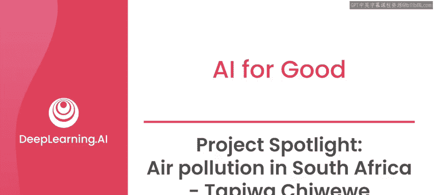
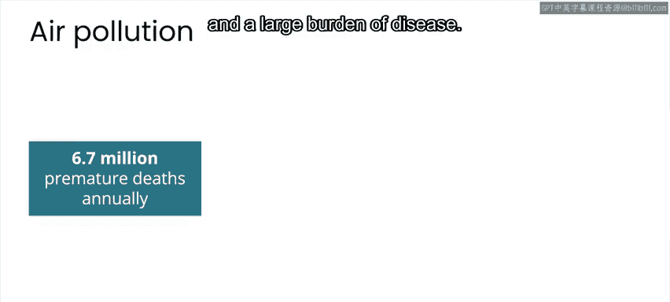
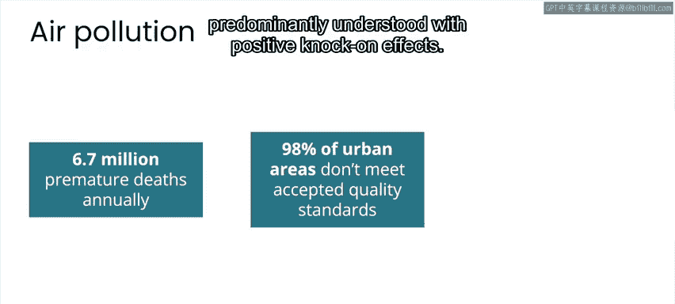
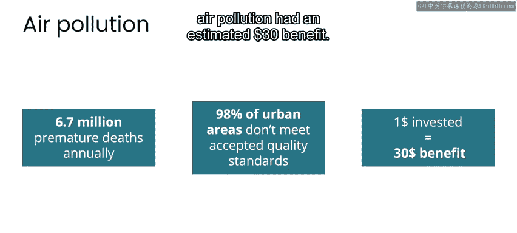
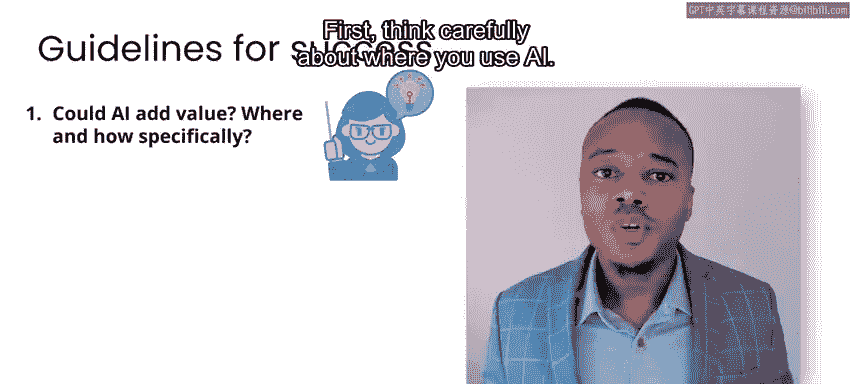
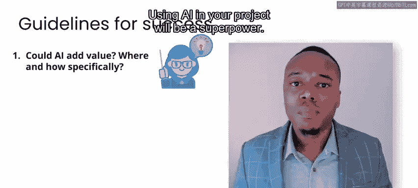
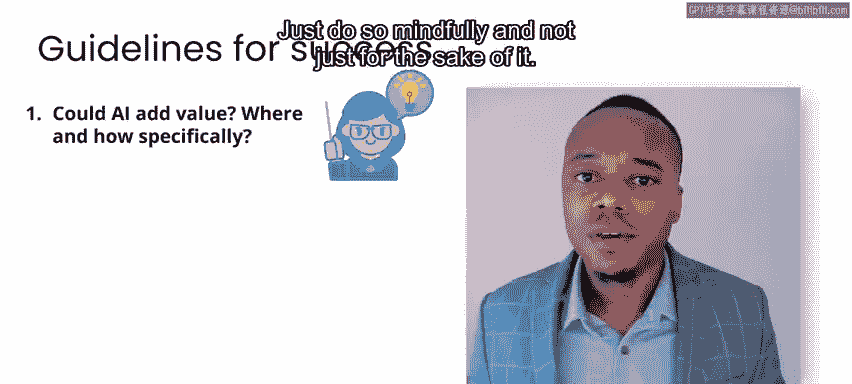

# 036：AI与公共卫生、气候变化、灾难管理 🌍🤖

## 概述
在本节课中，我们将跟随Tapiwa Chiwewe的分享，学习如何利用人工智能技术应对空气污染这一全球性公共卫生挑战。课程将展示从发现问题到构建解决方案的全过程，并总结出初学者也能实践的指导原则。

---

大家好，我是Tapiwa Chiwewe。
“呼吸新鲜空气”——当你听到这句话时，会想到什么？
其字面含义指的是我们可能轻易视为理所当然的事物。
但请想象一个世界，你吸入的每一口空气都是有毒的。
几年前，我在约翰内斯堡的一个冬日清晨就瞥见了这样的景象。
当时我正努力开始工作，注意到城市上空笼罩着一片不祥的污染云。
这激起了我的好奇心。
在那一刻，我感到一种必须为此做点什么的冲动，但我并不知道具体该做什么。
我只知道，我不能袖手旁观。

上一节我们了解了Tapiwa发现问题的契机，本节中我们来看看他如何开始探索。

我从学习更多关于空气污染的知识开始。
我惊讶地了解到，空气污染每年导致全球数百万人死亡，并造成巨大的疾病负担。
我还了解到，发展中国家98%的城市地区空气质量不符合可接受的标准。
好消息是，空气污染的解决方案在很大程度上已被理解，并能产生积极的连锁效应。
事实上，据估计，在控制空气污染上每投资1美元，就能产生约30美元的效益。

基于我的计算机工程背景，我萌生了一个想法：创建一个由人工智能驱动的空气质量管理系统。
然而，我很确定自己无法单枪匹马解决这个空气污染问题，并很快意识到需要一种协作的方法。
因此，我决定最好去结识一些在该领域工作的人。
最终，我与普通公民、政策制定者、技术人员、律师等建立了联系。
我所投入的参与过程帮助我更深入地理解了问题领域和相关利益方。
这帮助我避免了在尚未牢固掌握手头问题之前就急于应用技术的陷阱。

现在，到了创建解决方案的过程。这个过程有时会很艰难。
关键在于坚持不懈，并且永远不要忘记大局。
我与合作者们一起，利用超过十年的空气质量和天气数据，开发了一个基于云的系统解决方案。
该系统能够分析空气质量数据，以揭示趋势并预测未来不同污染物的水平，例如碳氧化物、氮氧化物、硫氧化物，以及臭氧和颗粒物等其他污染物。
这意味着公民和官员可以在微观和宏观层面，就与个人及环境健康相关的活动与政策，做出更明智的决策。
这展示了人工智能工具如何能让我们更好地关爱我们的社区和环境。

只有少数组织和人员能够使用这个解决方案，部分原因是许可和数据使用方面的限制。
采用开放数据和开源的方法或许能让更多人获得访问权限。
我本希望花更多时间开发解决方案，并让更多利益相关者参与进来。
总而言之，这项工作在社会中引起的强烈共鸣，让我深感谦卑。

有一天，你可能会发现自己处于与我相似的境地。
或者，你可能已经感觉到自己想要为一个具有积极社会使命的人工智能项目做出贡献。
你只需要从总体上关心并对手头的具体问题感兴趣，并且渴望实现一个明确的积极成果。
如果具备了这些，事情就会开始步入正轨。
当我从事空气质量项目时，我利用了我的技术背景优势。
你也可以利用你的背景优势，无论它是什么。
你在特定领域之外的专业知识，可能正是解决该领域内重大挑战的关键。

以下是你可以用来快速起步的三条指导原则。

首先，仔细思考在何处使用人工智能。
人工智能是一项具有广泛应用的前沿技术，提供了令人兴奋的新能力。
因此，在你的项目中使用人工智能将是一种超能力。
但请务必审慎使用，而不是为了用而用。

其次，利用能够让你创建自己解决方案的技术平台。
这将使你免于重复造轮子，并让你能够以更低的成本更快地创造价值。
通过重用、本地化和在已有成果（例如开源项目）的基础上进行构建，来推动你的工作。
你可以利用基础模型和云平台。
此外，还有一些无需编写代码的工具可用，它们能让你描述数据并创建人工智能模型。

第三，遵循多学科社区协作的方法。
没有任何个人或组织能够解决所有问题。
因此，要寻找方法，利用全球社区中丰富的人才和资源。
正如你所见，你不需要成为人工智能专家也能参与人工智能项目合作。
你也不需要直接参与人工智能技术本身。
你可能了解问题背景、能够获取数据、可以转译社区需求等等。
这些其他维度对于创建合适且可持续的解决方案是必需的。
它们也确保了我们所创建的人工智能解决方案能够保留人类价值观。

所以，请满怀信心地去从事你热衷的、具有深刻社会意义的事业。
祝愿你在“AI向善”项目中一切顺利。
愿它们成为比喻意义上的“新鲜空气”。

---

## 总结
本节课中，我们一起学习了Tapiwa Chiwewe如何将个人观察转化为一个利用AI应对空气污染的实际项目。我们了解到，成功的AI for Good项目始于对问题的深刻理解、跨学科协作以及对技术应用的审慎思考。无论你的专业背景如何，都可以通过关心社会问题、利用现有平台和积极寻求合作，为创造积极影响贡献自己的力量。