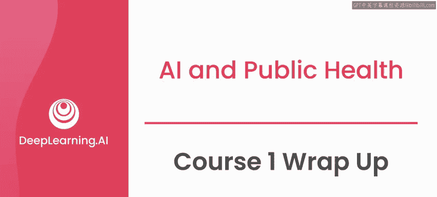
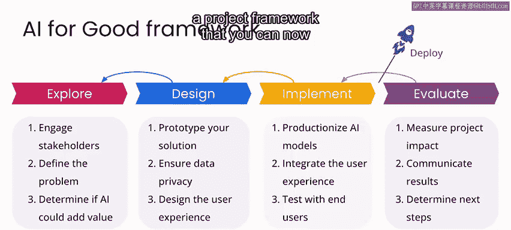

# 037：AI for Good 专项课程第一课 🎯

在本课程中，我们学习了“AI for Good”的实际含义，探讨了人工智能的潜力与局限，并通过案例研究和实际项目，深入了解了如何将AI技术应用于解决现实世界的问题。

恭喜你完成了“AI for Good”专项课程的第一门课。

通过本课程，你从实践层面掌握了“AI for Good”的含义。你看到了一些关于人工智能能做什么的例子，并理解了一些局限性。你探索了一些案例研究，并看到了一些令人兴奋且有影响力的项目。我希望，通过对这里所呈现主题的探索以及你直接参与的空气质量项目，你对这类项目的关键方面获得了一些新的见解，并且在将所学知识应用到自己的项目中时，感觉准备得更充分了。

通过详细研究空气质量项目的每个阶段，你看到了在为像波哥大这样的城市构建AI辅助空气质量解决方案时，一些关键的考虑因素可能是什么。更重要的是，你逐步体验了一个项目框架，现在可以将这个框架应用到你感兴趣的任何项目上。

---

如果你受到启发，开始考虑自己的项目，但你不是软件开发人员或AI从业者，请不要让这阻碍你。我鼓励你尝试学习如何编码，或者联系那些可以帮助你处理项目中可能涉及的技术方面的人员。如果你已经熟悉软件开发和AI，并且有动力参与“AI for Good”项目，那么我鼓励你联系你所热衷领域的领域专家，看看是否有办法参与到他们感兴趣的项目工作中。

如果你喜欢本课程的内容，我邀请你加入本专项课程的下一个课程——**AI与气候变化**。在那里，我们将使用全球温度数据，并关注可再生能源和生物多样性相关的案例研究。

期待在下个课程中与你相见。