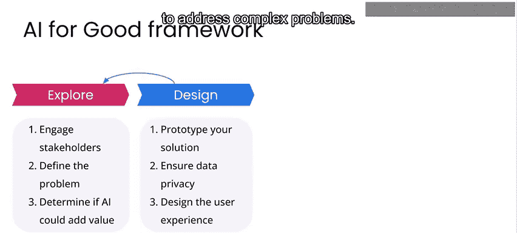
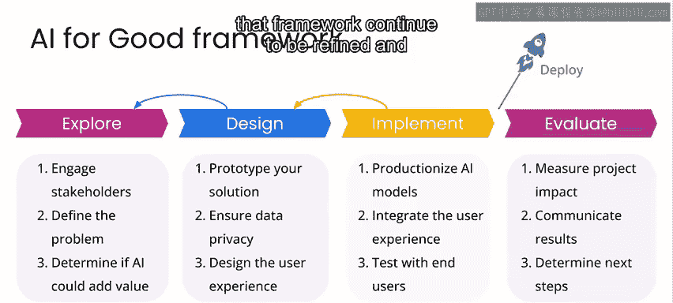

# 038：🌍 欢迎来到人工智能与气候变化

在本课程中，我们将学习人工智能如何成为应对气候变化挑战的解决方案的一部分。气候变化正通过干旱、洪水、野火、海平面上升等不利现象，影响着人类和自然生态系统。我们将通过案例研究，了解全球团队如何应对气候变化带来的问题，并探索人工智能在可再生能源和生物多样性监测等领域的应用。

我是你们的讲师罗伯特·莫纳克。很高兴来到这里，我认为在这个领域，你（吴恩达）可能比我更有经验。你过去在人工智能应对气候变化方面做过一些工作。

事实上，我和我的合作者撰写了许多论文，关于使用卫星图像来理解森林砍伐和甲烷排放的驱动因素等。因此，我认为气候变化不仅对每个人都很重要，其技术方面也与我个人密切相关。

这与我们今天要讨论的用例非常相似。我们将讨论生物多样性监测和风电功率预测。这两个主题对于理解如何减少对化石燃料的依赖以及监测气候变化对生物圈的影响非常重要。

事实上，风电功率预测是人工智能已经对风电场运营和电网规划产生重大影响的技术之一。

作为一名人工智能从业者，我为此感到自豪。

这确实非常令人兴奋。我认为我们现在已经达到了一个阶段，即风能和太阳能等对化石燃料影响较低的发电方法正变得非常有效。然而，预测部分非常困难，我们并不总是知道天气会多晴朗或风力会如何。这类问题非常适合机器学习解决方案，因为你本质上是在处理大量信号，多到无法用基于规则的人工系统来整合。你可以使用机器学习来获得更好的预测。即使是风能或太阳能预测的几个百分点的改进，也能对减少碳排放量产生巨大影响，因为它们可以更好地预测未来几小时或几天内有多少太阳能和风能。这有助于决定何时启动或关闭高污染工厂，并优化电网。也许你可以在一天中更好的时间为人们的电动汽车充电。这些信息以我看来非常令人兴奋的方式在电网中流动，这正在使电力供应更高效。

我认为这是一个非常好的视角。基于化石燃料的电网通常只有几个百分点的波动，过高或过低都会导致停电或限电。因此，我们正在重新思考电网的形态，当我们能够利用家庭或汽车中的分布式电池储能，并能够根据可再生能源在不同时间的发电能力，在多个电网之间共享电力时。

因此，在本课程中，你将了解更多关于应对气候变化这方面的内容。第二个主要项目是生物多样性监测。思考气候变化如何已经影响生物多样性也很重要。

第二个项目真的很有趣。我们正在查看南非一个国家公园的图像，试图估算动物的数量。这可以告诉我们环境影响或其他人类活动如何减少了特定地点的动物数量。我认为这是一个很好的例子，既有积极的一面，也有消极的一面。在这个领域，我们可以非常有效地部署现有的机器学习技术，但同时我们也必须问自己，什么是最重要的事情。对于许多生物多样性监测，我们关心植物或细菌，但这更难做到。所以我认为这很有趣，我们正在观察那些被称为“魅力巨型动物”的生物。观察这些动物很有趣，我们有很好的目标检测方法可以用于此。但同时，我们必须思考，由于当前机器学习技术的限制，我们检测大型动物比检测小型动物更容易。因此，这也是思考当前技术差距的好方法，并希望这能激励人们思考未来解决这些差距的方法。

我认为在之前的课程中，你已经开始看到一个解决复杂问题的系统框架。在本课程中，你将看到这个框架继续被完善和调整，以适应风电功率预测和生物多样性监测这两个非常令人兴奋的应用。

因此，我很高兴能带领你学习这些主题。请继续前进，让我们进入下一个视频。