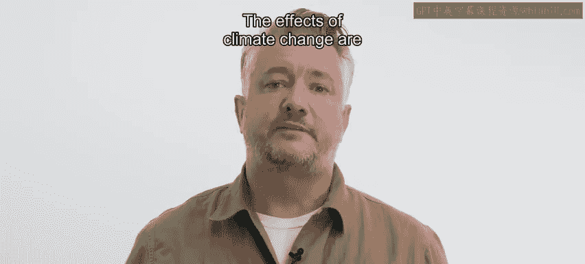
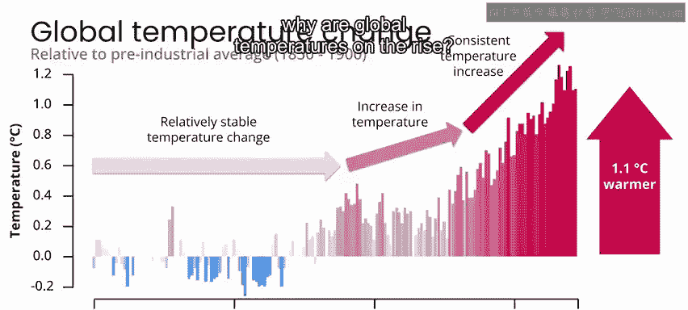
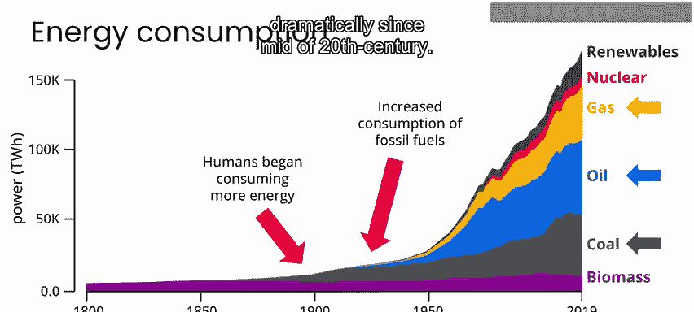
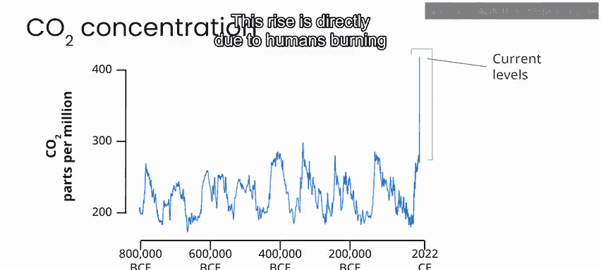
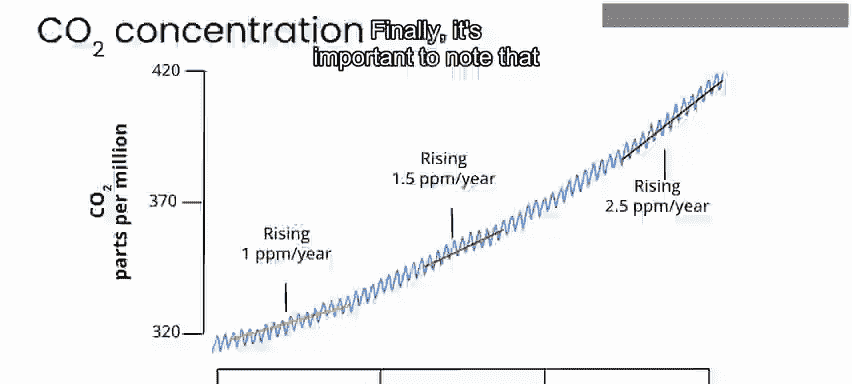

# 039：什么是气候变化？🌍

在本节课中，我们将学习气候变化的基本概念、其背后的驱动因素以及全球变暖的主要表现。我们将通过数据和图表来理解这一全球性现象。

气候变化是一个全球性现象。如果你关注新闻，无疑会听到关于气候变化及其如何影响全球人口和生态系统的报道，以及各国为应对气候变化制定了哪些政策和承诺。本课程假设你已经对气候变化有所了解，并希望进一步学习人工智能如何帮助解决其中的一些问题。

为了开始学习，我们先简要概述气候变化：哪些因素导致了气候变化，以及我们需要采取哪些措施来避免未来最糟糕的结果。气候变化的影响范围广泛，可能包括看似矛盾的现象，例如一个地区极端干旱，另一个地区却发生严重洪涝。

## 全球气温上升是核心驱动因素

然而，在所有现象背后，驱动气候变化各种表现的核心事实是：全球气温正在逐年上升。

这张图表显示了从1850年到1900年测量的全球平均气温（以摄氏度为单位），相对于工业化前平均水平的比较。纵轴上的零点代表20世纪前50年的平均气温。红色和蓝色条形图显示了相对于该零点的年度平均气温，红色表示比平均气温更暖的年份，蓝色表示更冷的年份。

从图表中可以看出，直到20世纪初，有些年份稍暖，有些年份稍冷，但长期全球平均气温相对稳定。然后在20世纪中叶的某个时间点，年度平均气温开始持续高于工业化前的平均水平。近几十年来，全球气温一直在稳步上升。

观察全球平均气温上升的幅度，可以发现现在比100年前的平均气温高出约1.1摄氏度。这听起来可能变化不大，但将整个地球的温度提高1摄氏度需要巨大的能量。正是全球气候系统中新增的这些能量导致了极端天气、危险的热浪、冰川和极地冰盖融化，进而导致海平面上升。

## 能源消耗与温室气体排放

那么，为什么全球气温在上升呢？

如果我们观察过去几百年间演变的另一个现象，即我们的能源消耗，可以看到一个类似的趋势：在20世纪初的某个时候，人类开始逐年消耗更多能源，而这些能源主要来自化石燃料，如煤炭、石油和天然气。从这张图表中可以清楚地看到，自20世纪中叶以来，化石燃料的消耗量急剧增加。

所有这些化石燃料消耗之所以令人担忧，是因为燃烧化石燃料会向大气中释放气体，如二氧化碳、一氧化碳和甲烷。所有这些气体都加剧了地球大气层的温室效应。

其原理是：当阳光照射并温暖地球时，地球会将热量辐射回太空。随着大气中温室气体的增加，更多的热量被捕获，导致大气变暖。经过几十年来向大气中排放温室气体，我们已经捕获了大量来自太阳的额外热量。因此，我们看到现在的全球年平均气温比过去高出约1摄氏度。

## 大气中二氧化碳浓度的变化

另一个自然的问题是：到目前为止，我们向大气中添加了多少温室气体？或者简单地说，我们相对于正常水平处于什么位置？

要回答这个问题，可以查看大气中二氧化碳的长期平均浓度。二氧化碳不是大气中唯一的温室气体，但它是全球变暖最重要的贡献者。

我们能够测量过去80万年的二氧化碳浓度，这听起来可能非常惊人。实际上，这是通过一种巧妙的技术实现的：钻探南极冰盖深处，每一层冰都可以被视为像树木的年轮一样标记其年龄。在这些冰层中，有微小的气泡，它们就像是冻结在时间中的微小大气样本。因此，我们可以直接测量过去数十万年大气中的二氧化碳。

从数据中可以看到，这里有一些有趣的周期性和其他行为。但总体而言，大气中的二氧化碳水平在许多千年里一直非常稳定，直到现在——也就是最近的一百年左右，二氧化碳的含量比过去测量的任何时候都要高得多。这种上升直接源于人类燃烧化石燃料并将这些气体排放到大气中。

## 二氧化碳浓度加速上升

我们可以放大观察最近几十年，更仔细地观察二氧化碳浓度的上升情况。你会发现，不仅大气中的二氧化碳浓度在强劲上升，而且每过十年，其上升速度都比以往任何时候都快，换句话说，上升正在加速。这意味着每年我们捕获的太阳能更多，这些能量将导致全球气温上升，未来几年的平均升幅将比过去更大。

## 全球变暖的不均匀性

最后，重要的是要注意地球表面温度的变化并不均匀。为了可视化这一点，美国国家航空航天局的科学家们制作了这段从19世纪末到现在的全球温度异常动画。蓝色区域显示地球在特定年份比平均温度更冷的地区，红色区域显示地球在特定年份比平均温度更暖的地区。

你可以看到，随着时间的推移，一些地区变暖，另一些地区比平均温度更冷，但到了20世纪末进入21世纪，全球大部分地区的平均温度更高。总体而言，陆地上的变暖程度比海洋上更强，而北极地区的变暖程度比地球上任何其他地方都更强。

陆地上变暖更强是预料之中的，因为水比陆地更能反射阳光。为什么极地变暖速度比地球上任何其他地方都快，目前还存在一些争议，但普遍认为这与海冰融化导致的区域反射率变化，以及这些地区的大气模式和天气系统有关。

## 总结与下一步

简而言之，这就是全球气候变化的“是什么”和“为什么”。我相信你以前已经了解了很多这方面的内容，但我想从这个简单的复习开始，以便在我们深入研究解决气候变化问题的细节之前，大家对基础知识有共同的理解。

除了讨论全球变暖，我还想让你有机会实际操作一些真实的全球温度数据。这就是接下来要做的：在下一个视频中，加入我一起完成本课程的第一个实验，探索全球温度数据。