# 040：Jupyter Notebook实验室简介 🧪

在本节课中，我们将学习Jupyter Notebook实验室环境的基本操作。如果你已经完成了本专业课程的第一门课，那么你对这个环境应该已经有所了解。本视频将快速概述实验室环境的工作方式，为下一节探索全球温度数据做好准备。如果你已经熟悉Jupyter Notebook，可以直接跳到下一个视频。

## 概述

Jupyter Notebook是一个用于原型设计和编程的流行开源Web应用程序。它允许你创建和共享包含代码、可视化和文本的文档。在本课程中，我们将这个环境简称为“你的笔记本”。

## 启动与界面

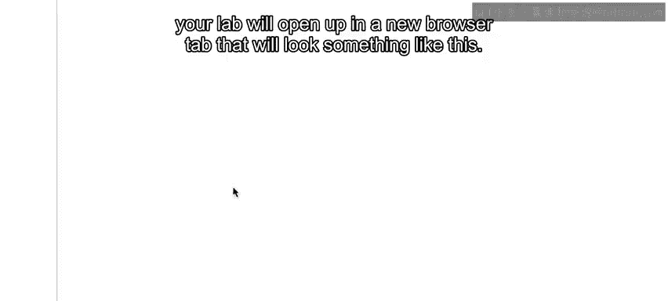

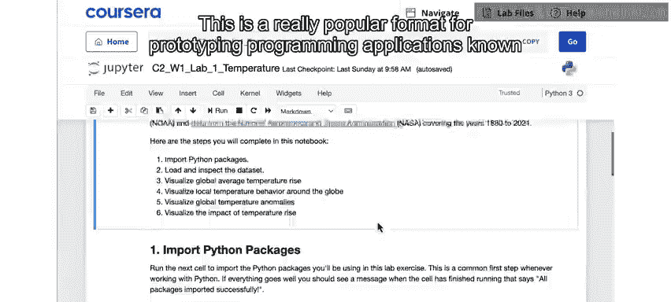

当你点击“启动笔记本”时，实验室会在新的浏览器标签页中打开，界面如下图所示。

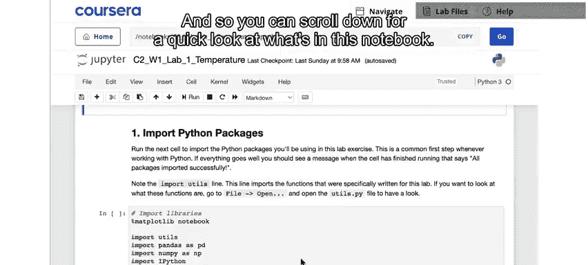

你可以向下滚动，快速浏览笔记本的内容。你会注意到，笔记本中包含文本块和代码块。通常，文本部分会包含操作说明或对代码功能的描述。

## 文件结构

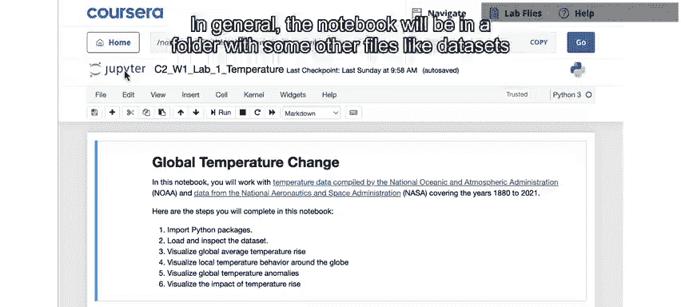

笔记本通常位于一个包含其他文件（如数据集和其他代码文件）的文件夹中。你可以通过点击左上角的Jupyter图标来查看文件夹中的其他内容。

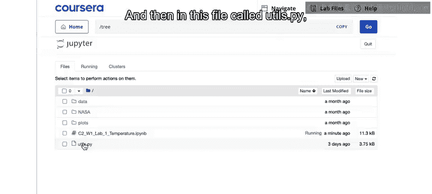

以下是文件夹中常见的文件类型：
*   **CSV文件**：这是一种以逗号分隔数值的文件格式，通常用于存储数据。
*   **.ipynb文件**：这是你正在查看的笔记本文件本身。
*   **.py文件**：例如 `utils.py`，我们会在其中放置一些将在笔记本中使用的代码，以保持笔记本界面的整洁。

你无需担心这些后台代码的具体内容，它们只是为了方便而设置的功能。

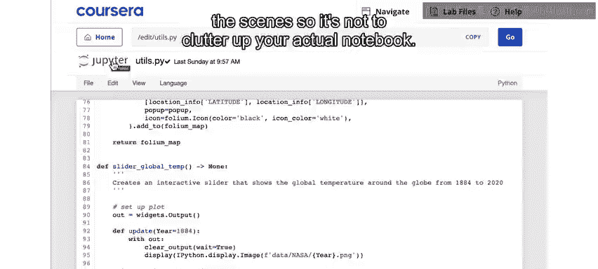

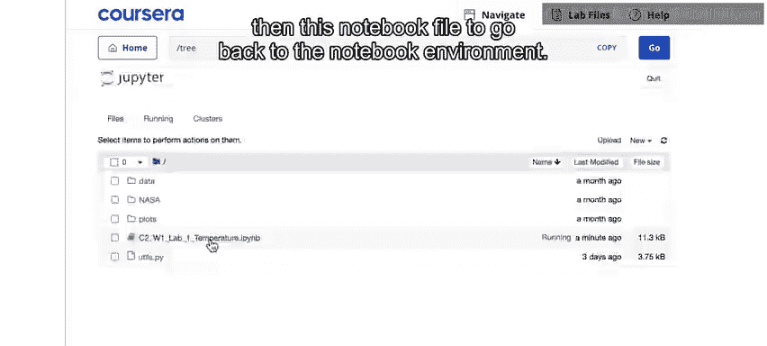

## 运行代码单元

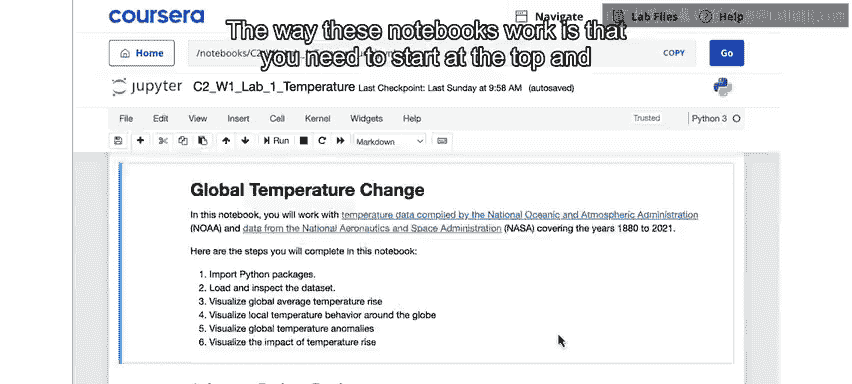

要返回笔记本环境，可以点击Jupyter图标，然后选择笔记本文件。

笔记本的工作方式是，你需要从顶部开始，按顺序运行每一个代码单元。后续的每个代码单元都能够基于你在前一个单元中执行的操作进行构建。

如果你熟悉编程但不熟悉笔记本，可以将其理解为一种分步执行应用程序的方式，而不是一次性全部运行。

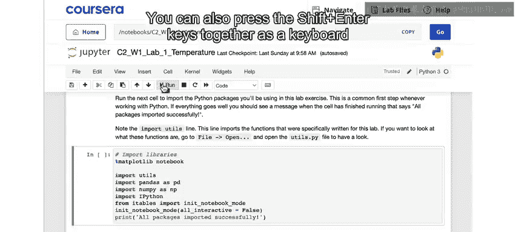

运行代码单元的方法是：
1.  首先选中该单元。
2.  然后点击顶部的“运行”按钮。
3.  你也可以使用键盘快捷键 **Shift + Enter** 来运行代码单元。

我将运行笔记本顶部的第一个代码单元。

这个单元的作用是导入本实验所需的一系列Python包。这是在Jupyter Notebook中运行Python程序的常见第一步。我们还会导入之前提到的 `utils.py` 文件，以便使用其中的函数。

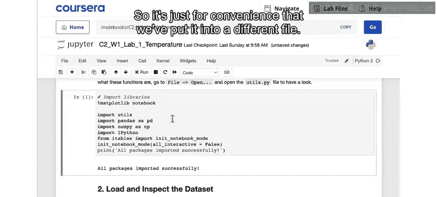

## 错误处理

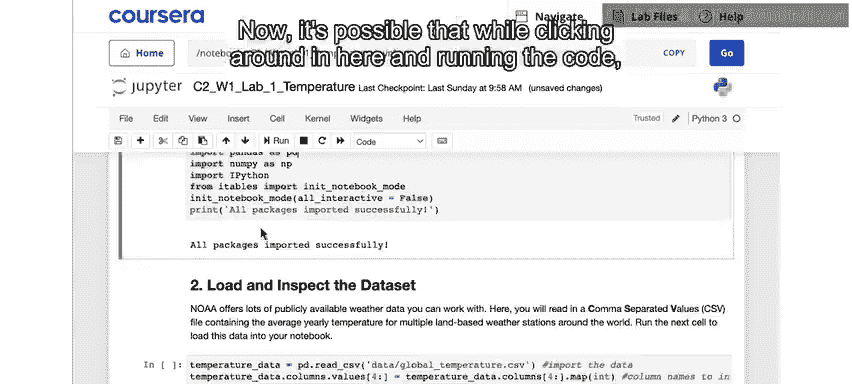

在点击和运行代码的过程中，你可能会无意中在代码中引入拼写错误，即使是像多打一个空格这样简单的错误，Python对此也非常敏感。

当你尝试运行该单元时，就会收到类似下图的错误提示。

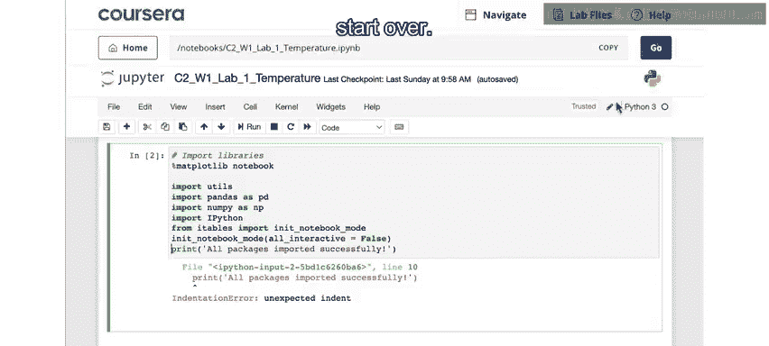

Python会尝试指出错误所在，例如本例中正确地指出了这是一个“缩进错误”。但如果你不熟悉Python，这些错误信息可能看起来有些令人困惑。

如果你看到错误，请不要担心，这完全正常，很可能只是代码单元中某处存在拼写错误。你可以尝试找出错误原因并纠正它。

如果你无法找出原因或遇到困难，可以重置实验室环境。重置的方法是：点击顶部的“帮助”菜单，然后选择“获取最新版本”。这将使你返回到实验室的最新、干净的版本。即使没有新版本，你也可以使用此功能刷新实验室，获得一个全新的副本，从而清除你在编辑代码时可能引入的任何错误。

## 总结

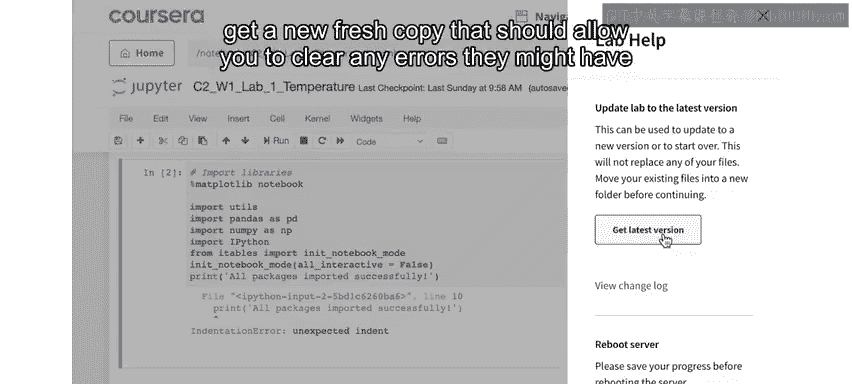

本节课我们一起学习了Jupyter Notebook实验室环境的基本操作，包括如何启动、界面结构、文件组成、运行代码单元的顺序与方法，以及遇到错误时如何排查和重置环境。掌握这些知识将帮助你在本课程的实验环节中顺利进行。请继续观看下一个视频，我们将开始探索数据。