# 041：全球气温变化数据探索 🌡️

## 概述

在本节课中，我们将学习如何探索和分析全球气温变化数据。我们将使用一个包含自19世纪末以来全球数百个地点记录的实际温度测量值的数据集。通过动手实践，我们将深入了解全球气温变化的模式、数据中的潜在偏差，以及如何可视化这些变化。

---

## 数据来源与准备工作

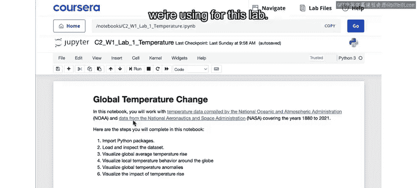

在开始之前，我们需要了解数据的来源和准备工作。在笔记本的顶部，你可以找到一个链接，指向本实验所用数据的下载来源。

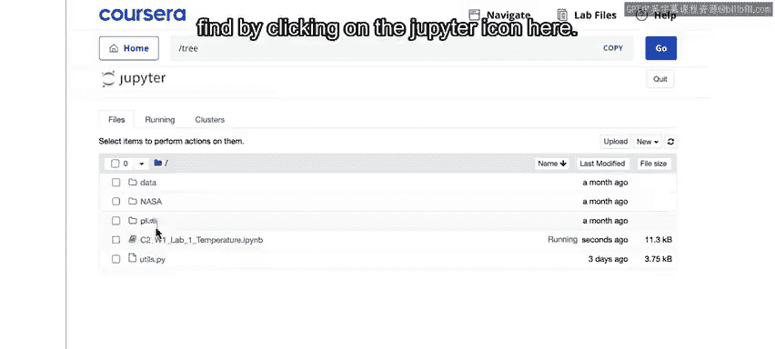

如果你是一名Python程序员，可能会对点击此处Jupyter图标找到的`utils.py`文件感兴趣。

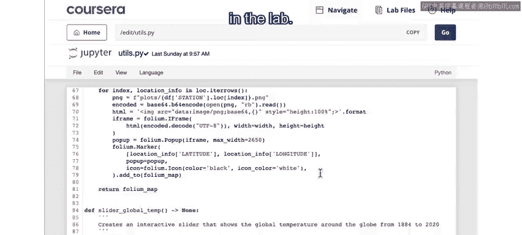

这个文件包含了一些将在实验中使用的函数。本课程中的每个实验通常都有这样一个`utils.py`文件，用于存放部分代码，以避免笔记本内容过于杂乱。

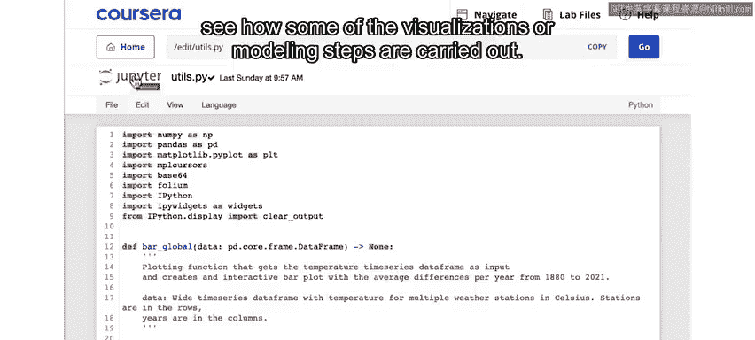

通常，你无需关心其中的具体内容。但如果你好奇，完全可以查看一下，了解一些可视化或建模步骤是如何实现的。

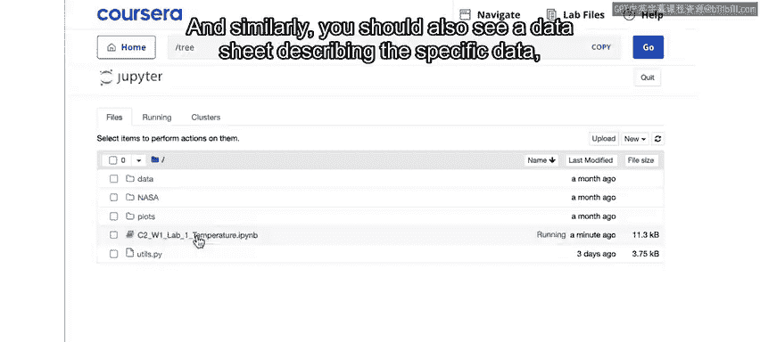

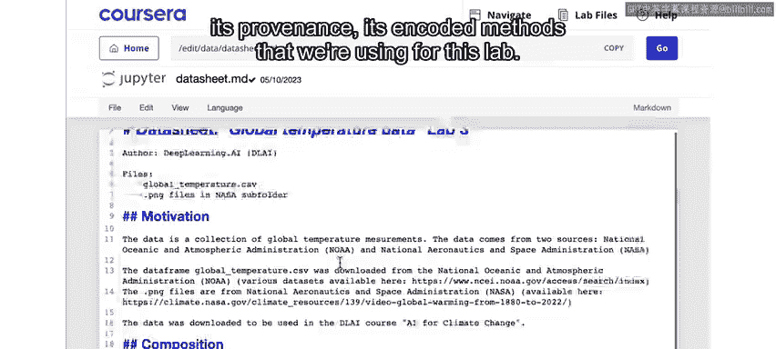

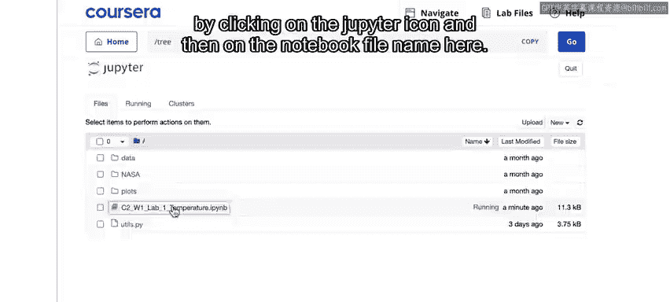

同样，你还应该看到一个数据表，描述了本实验使用的具体数据、其来源以及编码方法。

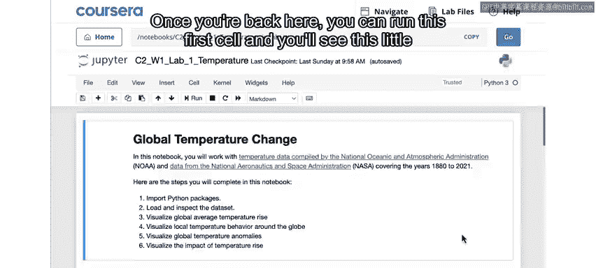

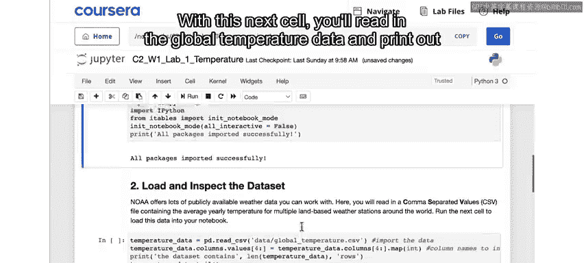

你可以随时通过点击Jupyter图标，然后点击此处的笔记本文件名，导航回我们正在使用的笔记本。

---

## 加载与查看数据

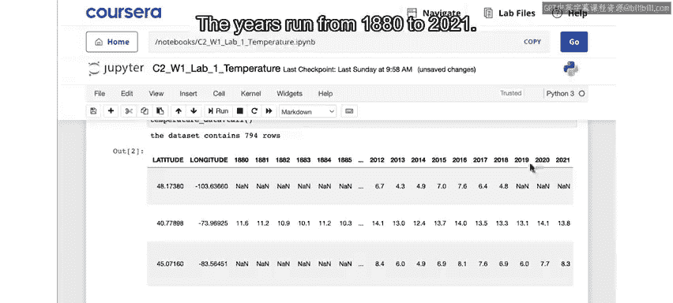

上一节我们介绍了实验环境和数据文件，本节中我们来看看如何加载和初步查看数据。

回到笔记本后，你可以运行第一个单元格。如果一切顺利，你将看到所有包成功导入的提示。

通过运行这个单元格，你将读入全球温度数据，并打印出数据集的最后几行，以验证数据是否被正确读取。

当你读入数据后，可以在此处进行抽查，看到它包含一个站点ID列表、站点位置、每个站点的经纬度，以及此处列出的每个年份在该位置的平均温度（摄氏度）。

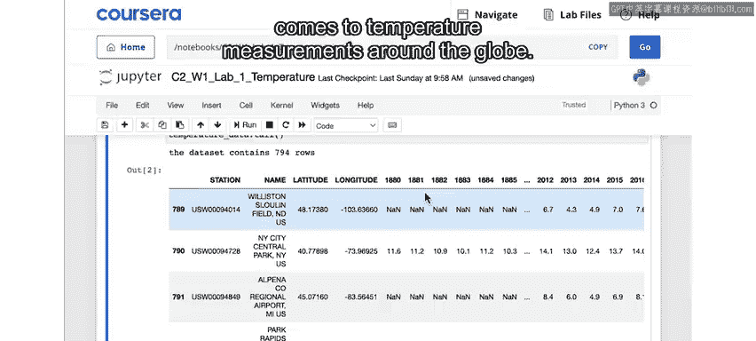

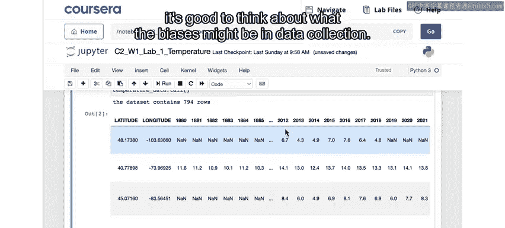

年份从1880年运行到2021年，因此你拥有全球794个站点大约140年的温度数据。

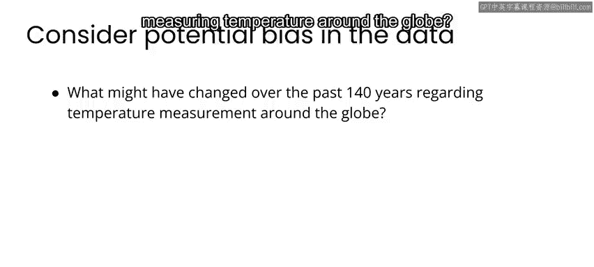

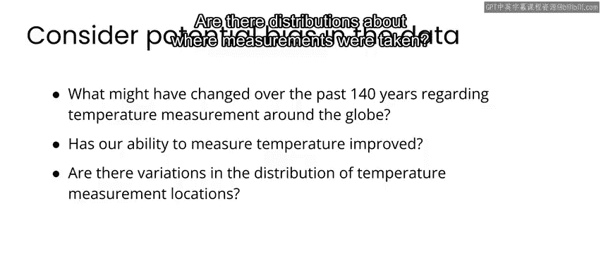

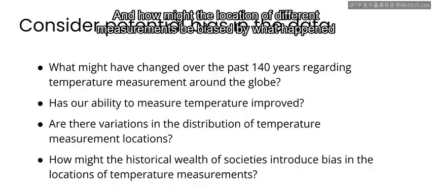

---

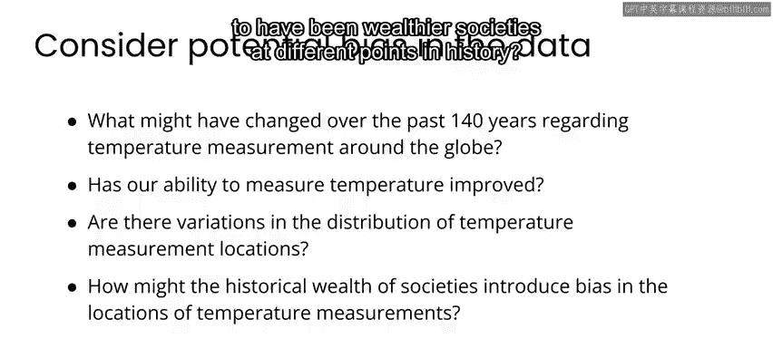

## 思考数据偏差

在查看任何数据集时，思考其中可能存在的偏差总是有益的。例如，在本案例中，过去140年来全球温度测量可能发生了哪些变化？花些时间思考可能存在的偏差，以及哪些数据无法被测量。

这是一个小测验，你可以思考哪些因素可能影响了实际进行的测量。无论你查看什么数据，思考数据收集中可能存在的偏差都是有益的。因此，在本案例中，过去140年来全球温度测量可能发生了哪些变化？我们的温度测量能力是否变得更精确？测量地点的分布情况如何？不同测量地点的位置可能如何受到历史上不同时期较富裕社会状况的影响？

在许多情况下，你会看到此处列出的是`NaN`（非数字），而不是温度值。这仅意味着该年份在该地点没有记录数据。

在本专业课程中，你看到了空气污染传感器测量数据，其中也包含缺失值，在某种意义上与此类似。现在你拥有的是温度传感器数据，而不是空气污染传感器数据。有时没有记录数据，可能是因为该地点的传感器尚不存在，或者传感器因某种原因离线。

因此，你并非在所有年份的所有地点都有温度测量值。但我们限制了这个数据集，只包含在时间范围内至少有90年数据的地点。选择这个阈值（只包含有90年或以上数据的站点）是任意的。你可以选择使用更低的阈值查看更多的站点位置，或者使用更高的阈值查看数据完整性更高的站点。这里我们选择了90年或以上，以仅包含记录年份中至少有大约三分之二具有有效温度的站点。我鼓励你尝试一下，看看那些恰好拥有较长温度记录历史的站点是否存在任何位置偏差。

---

## 绘制全球平均温度变化图

了解了数据的基本情况和潜在偏差后，本节我们将通过可视化来观察全球平均温度的变化趋势。

运行这个单元格，你将绘制出本数据集中所有站点合并后的全球平均温度图。此处的文本细节是：通常，当你听到人们谈论全球平均温度上升1度或2度时，他们指的是相对于1850年至1900年工业化前时期计算的基线的上升。

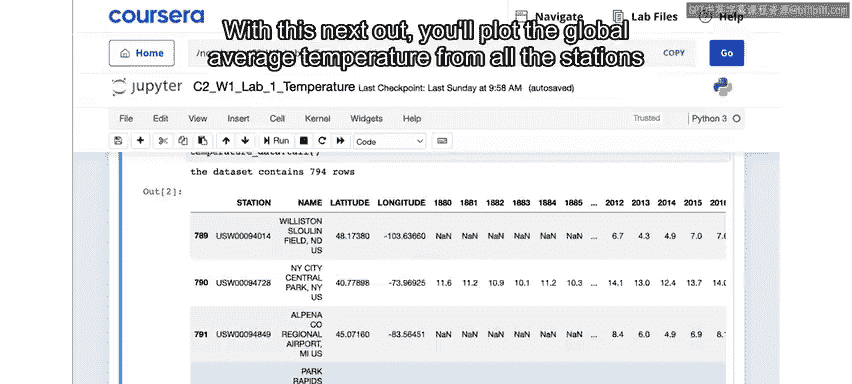

实际上，20世纪之前全球那个时间范围的数据是稀疏的。因此，在实践中计算这个基线的方法是：取1981年至2010年的现代值平均值，然后减去0.69摄氏度，这已被确立为最近几十年与工业化前时期之间的转换因子。你可以点击此处的链接查看参考资料，了解更多关于该转换因子是如何确立的。

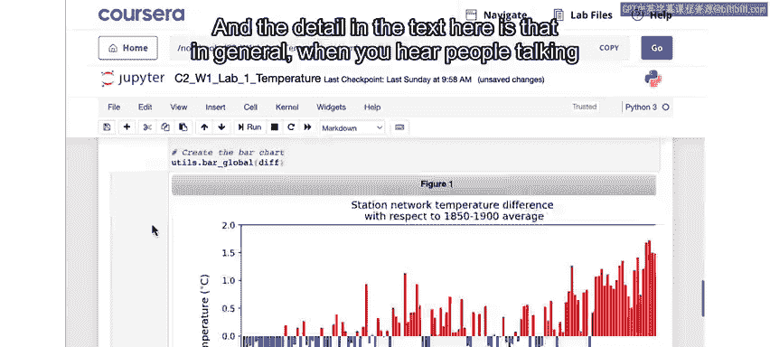

因此，你在这里所做的也是同样的事情：取1981年至2010年的平均值，减去常数0.69，然后用每个单独年份的平均值减去所得结果，得到这个图表，其中每个条形都略高于或低于零点。

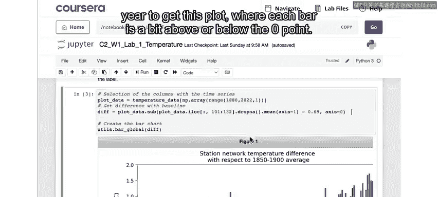

因此，这里的零代表工业化前基线，这些红色和蓝色条形表示特定年份的年平均温度高于或低于该基线。你可以点击这些条形以查看每个测量的更多细节。

与你在上一个视频中看到的类似，这里的温度正在上升。然而，看起来温度平均从基线上升了约1.5度，而不是你在上一个视频中看到的约1度上升。这是因为本数据集中的所有温度测量都来自陆地测量站，而事实上，陆地上的平均温度上升幅度超过了全球平均水平，这就是你在这里看到的情况。

---

## 创建数据地图表示

上一节我们观察了全球平均温度的整体趋势，本节中我们来看看如何在地图上查看各个站点的具体数据。

当你运行下一个单元格时，你将创建数据的地图表示，可以放大查看你正在使用的温度传感器的位置，并且可以点击任何传感器或位置，查看该位置随时间变化的平均温度。

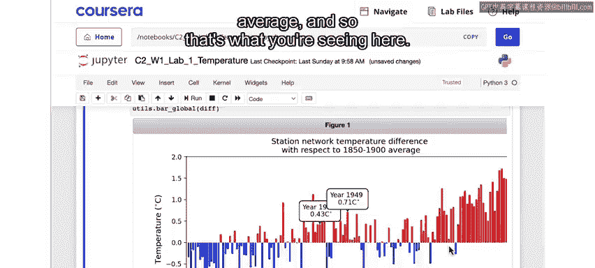

请注意，你现在看到的是垂直轴上的不同刻度。在这里，每个图表都基于该站点位置在整个数据集上的平均值设为零。

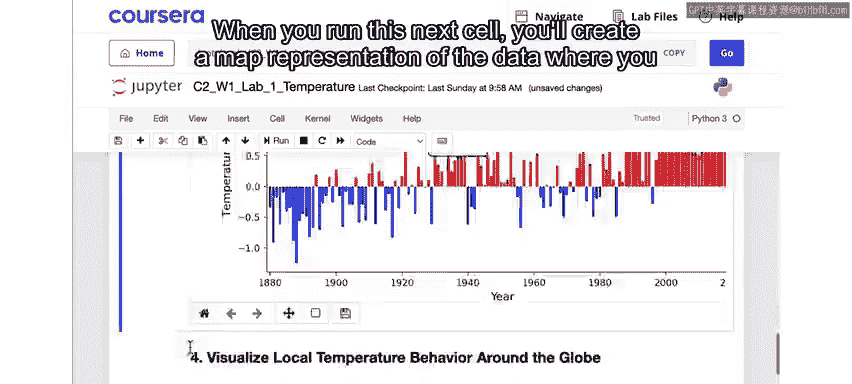

需要关注的是大尺度趋势。

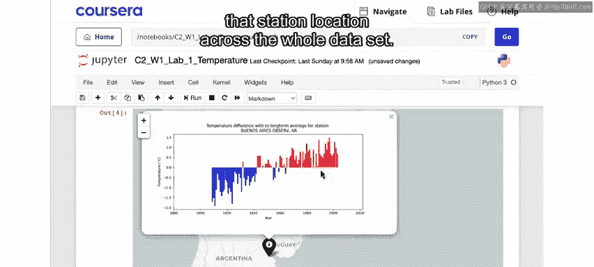

你会发现，在许多情况下，温度随时间上升。但在某些情况下，它看起来是平坦的。在少数情况下，它甚至略有下降。这反映了地球表面温度演变并不均匀的事实。因此，请查看全球不同地点的温度是如何变化的。

---

## 可视化全球温度演变

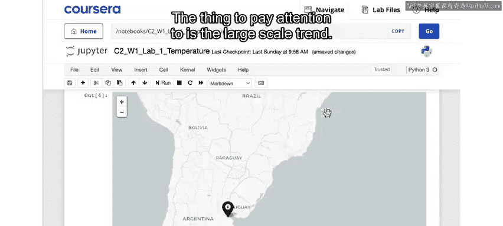

运行下一个单元格，你将创建一个由NASA整理的关于过去140年左右整个地球表面温度演变的数据可视化。

因此，你可以使用这个滑块在年份之间前后移动，查看全球温度随时间的变化情况。

最后，在底部，你可以运行这些单元格中的每一个，查看全球变暖在特定地区长期影响的图像。

例如，你可以使用这个滑块来比较全球变暖导致冰融化的影响。

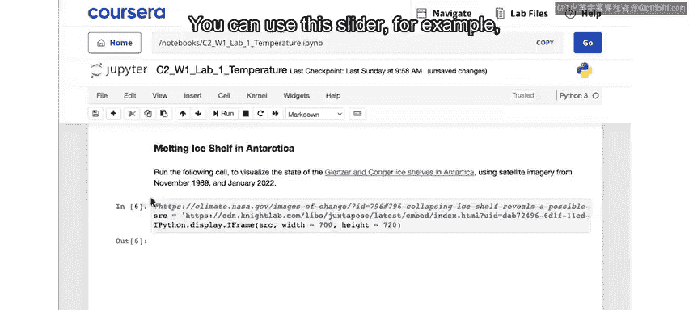

第一个显示的是1989年11月至2022年1月期间南极洲的格伦泽康冰架。

下一个显示的是西藏的冰川正在融化，本例中是1987年10月至2021年10月期间。

最后一个显示的是阿拉斯加的大保罗冰川，从1984年9月到2019年9月。

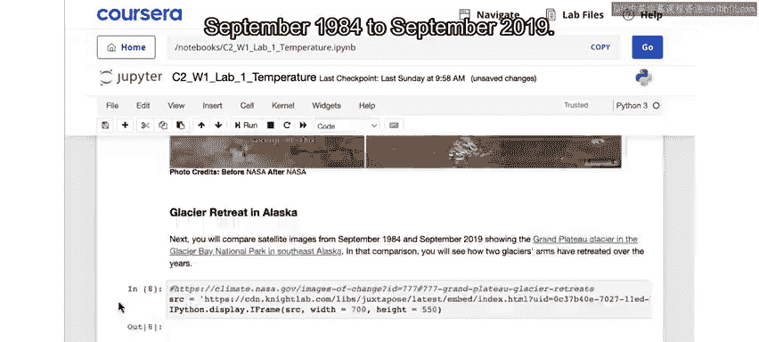

---

## 总结

本节课中，我们一起学习了如何探索全球气温变化数据。我们加载并查看了包含全球794个站点约140年温度记录的数据集，思考了数据收集中可能存在的偏差，例如测量技术、地点分布和历史社会经济因素的影响。我们绘制了全球平均温度相对于工业化前基线的变化图，观察到陆地温度上升幅度（约1.5°C）高于全球平均水平。通过交互式地图，我们查看了各个站点的温度变化趋势，发现变化并不均匀。最后，我们通过NASA的可视化数据和冰川对比图像，直观地看到了全球变暖的长期影响。希望这次动手探索能帮助你更深入地理解全球气温变化的模式和复杂性。接下来，我们将进一步探讨气候变化的影响、应对措施以及人工智能可能提供的帮助。