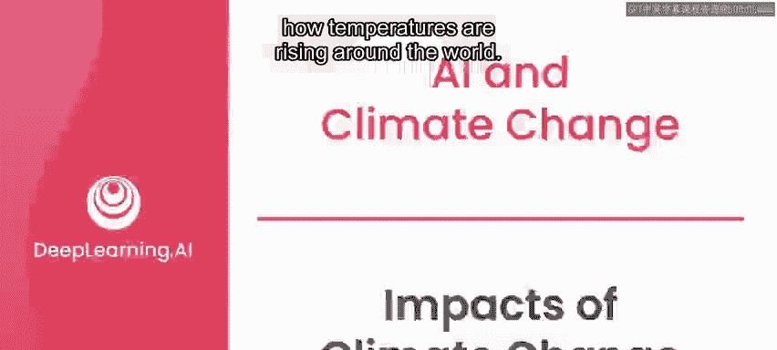
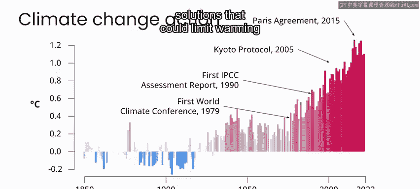
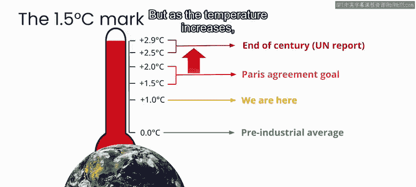
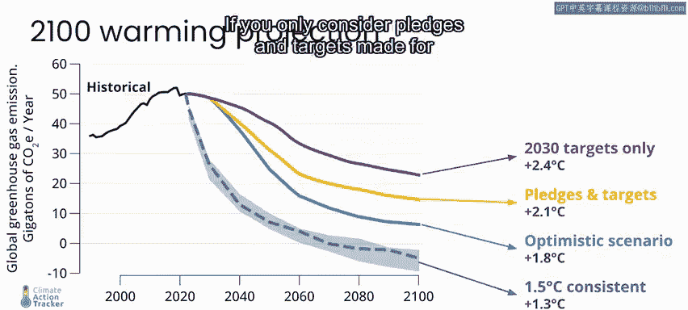
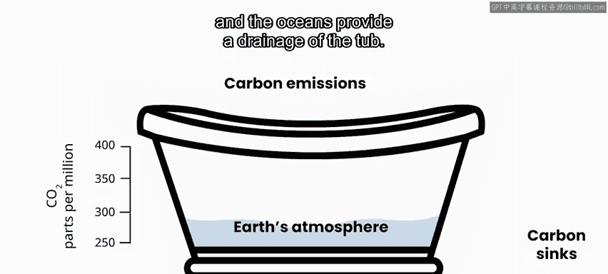
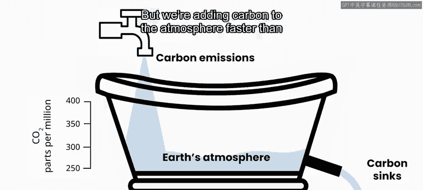
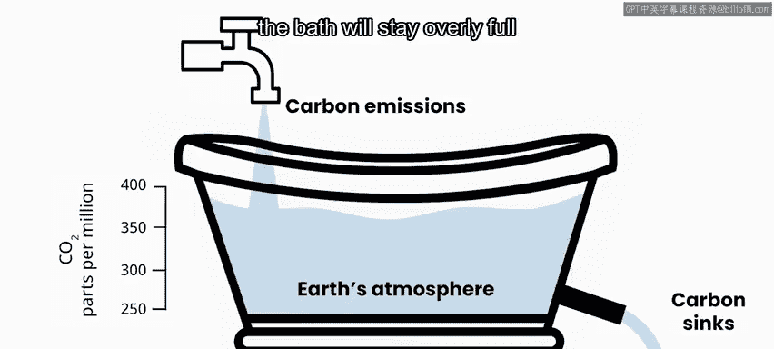
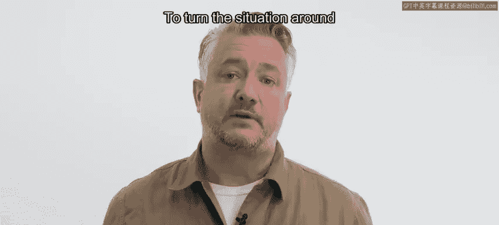
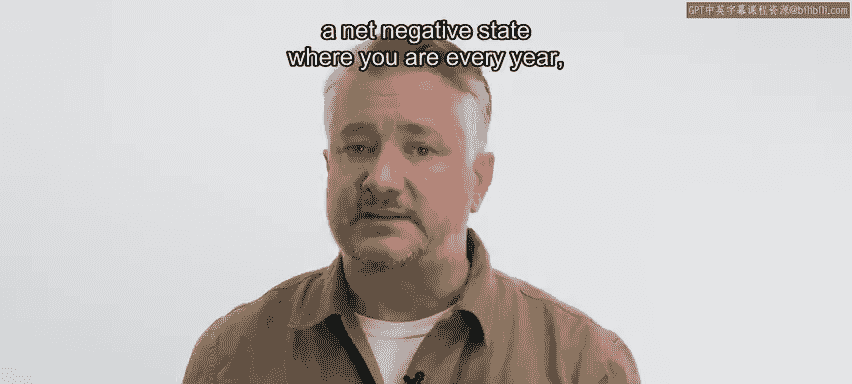
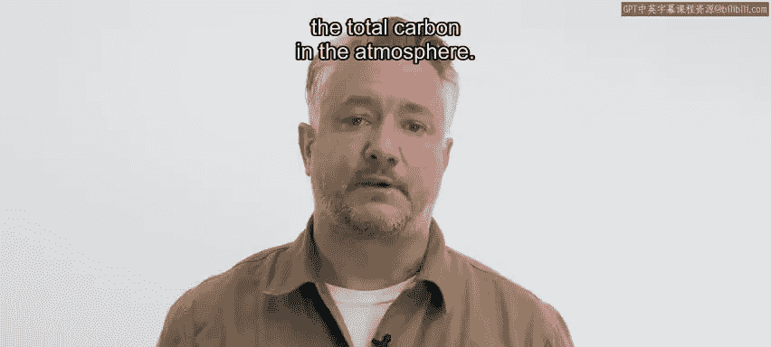

# 042：气候变化的影响 🌍

在本节课中，我们将要学习全球变暖已造成的具体影响，以及未来不同温室气体排放情景下的可能后果。我们会看到，即使全球平均气温仅上升1摄氏度，其影响也已十分显著。同时，我们也将了解国际社会为应对气候变化所设定的目标，以及实现这些目标所面临的挑战。

## 全球变暖的当前影响

在上一节实验中，我们探讨了全球气温如何上升。我们看到，陆地气温的上升速度通常快于海洋，而地球最北端的气温上升速度又比其他任何地方都快。全球气温上升的影响已经以戏剧性的方式在世界各地显现。

以下是当前已观测到的一些主要影响：

*   **冰盖与冰川融化**：导致海平面上升，威胁沿海社区，甚至使一些岛屿变得不适宜居住。
*   **极端高温与干旱**：引发比过去规模更大、更频繁的野火。热浪导致更多人死亡，并助长疾病传播。
*   **极端天气事件**：大气中热能增加，导致飓风、洪水等极端天气事件变得更频繁、更严重。例如，2022年巴基斯坦因气候变化引发的极端洪水使数百万人流离失所数月。
*   **海洋生态系统破坏**：海洋变暖导致许多珊瑚礁死亡，引发海底生态系统的极端生物多样性丧失。

因此，气候变化已在全球引发诸多问题。事实上，人们早在几十年前就开始关注气温的上升趋势。

## 国际社会的应对与目标

面对这些挑战，国际社会已采取行动。1979年召开了第一次世界气候大会。1990年，政府间气候变化专门委员会（IPCC）发布了第一份报告。2005年的《京都议定书》和2015年的《巴黎协定》使世界各国齐聚一堂，承诺减少温室气体排放以应对气候变化。

根据《巴黎协定》，各国同意将全球变暖控制在**2摄氏度以内**，并努力寻求将升温限制在**1.5摄氏度**的解决方案。

正如我们所看到的，目前全球气温已上升约1摄氏度。因此，《巴黎协定》代表了一个雄心勃勃的目标，即扭转全球变暖的趋势，阻止当前态势，将总体升温控制在1.5至2度范围内。

然而，联合国最近的一份报告指出，按照当前趋势，到本世纪末全球气温可能上升**2.5度或更多**，这将对人类和自然生态系统造成灾难性影响。

## 未来的排放情景

为了直观展示从今天起，不同减排力度与气温上升之间的关系，我们可以先绘制出近几十年来温室气体的增长情况。

在下面的图表中，纵轴是**CO₂当量**，这是一个将各种温室气体折算成等效二氧化碳的度量单位，单位为**十亿吨/年**。可以看到，过去几十年，温室气体排放量一直在稳步上升。图中出现的小幅下降是由于COVID-19疫情，但随着生活恢复正常，排放量再次开始增加。

一个名为“气候行动追踪”的组织汇总了一种可视化不同未来排放情景的方法。

以下是几种关键的未来情景路径：

*   **1.5摄氏度路径**：为实现将升温控制在1.5摄氏度的目标，温室气体排放的未来轨迹必须如此。这意味着从现在开始排放量需急剧下降，到2030年减少约50%。到本世纪末，排放量需达到**净负值**，这需要通过减少排放和从大气中清除温室气体（如保护森林、植树造林及新的碳捕集技术）共同实现。但鉴于当前趋势，这种轨迹的急剧转变显然不太可能。
*   **1.8摄氏度路径**：基于我们能多快扭转排放趋势的一些乐观但或许并非不现实的假设。
*   **2.1摄氏度路径**：基于《巴黎协定》中各国承诺和目标所达成的效果。
*   **2.4摄氏度路径**：仅考虑各国为2030年设定的承诺和目标。
*   **2.5-2.9摄氏度路径**：根据联合国报告，这是基于当前趋势和政策外推的结果。

纵轴显示的单位是**每年十亿吨CO₂当量**。需要记住的一个关键数字是：到2030年，每年需要**减少或清除300亿吨**的排放，才能走上最激进的、仅升温1.5摄氏度的轨迹。如果通过减排和从大气中清除碳的结合，我们能在2030年前实现每年总计300亿吨的减排量，就能走上这条最佳路径。任何不足都将导向其他未来。

## 理解现状：浴缸比喻

理解我们所处情况的一个简单方法，是将地球大气层想象成一个浴缸，这个浴缸是一个巨大的碳储存库。

碳的自然汇，如植物和海洋，就像是浴缸的排水口。

但我们向大气中添加碳的速度（如同向浴缸注水）快于其通过排水口排出的速度，导致大气中的碳含量随时间不断上升。

如果我们能将排放减少到**净零**，意味着碳从大气中排出的速度与其注入的速度一样快，这将阻止碳含量进一步上升。但由于大气中碳总量的增加，变暖仍将持续。换句话说，浴缸的水位将保持过高，即使进出水量相等。

要扭转局面并使地球降温，我们需要达到**净负**状态，即年复一年，我们实际上能够减少大气中的总碳量。

显然，我们现在正处于一个关键时刻，我们所采取的行动将对子孙后代产生深远影响。

## 总结与展望

本节课中，我们一起学习了全球变暖已造成的广泛影响，包括海平面上升、极端天气和生态系统破坏。我们回顾了国际社会为应对气候变化设定的目标，特别是《巴黎协定》中将升温控制在1.5-2摄氏度的雄心。通过分析不同的未来排放情景，我们了解到到2030年每年需减少或清除300亿吨CO₂当量，才能走上最佳路径。最后，我们用“浴缸比喻”形象地说明了实现“净零”与“净负”排放的重要性。

尽管在目前情况下正确的选择似乎显而易见，但采取行动减少温室气体排放将对许多政府、企业和个人带来实实在在的经济成本，这使得变革困难重重。尽管如此，全球许多团体正在研究帮助减缓或适应气候变化的解决方案。在许多情况下，人工智能可以成为这些解决方案的一部分。在下一节视频中，我们将一起探讨可以采取哪些行动来减缓和适应气候变化，以及人工智能可能在哪些方面提供帮助。