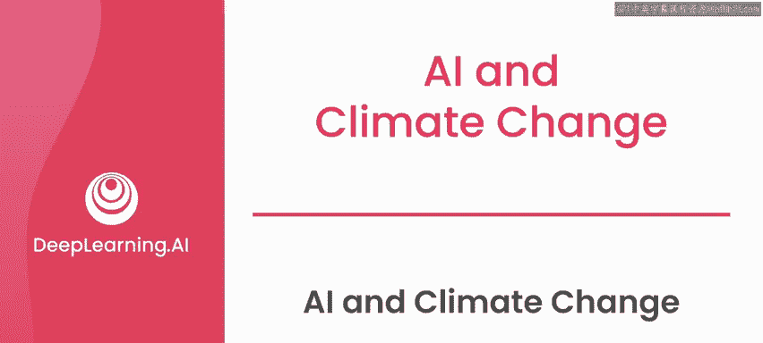
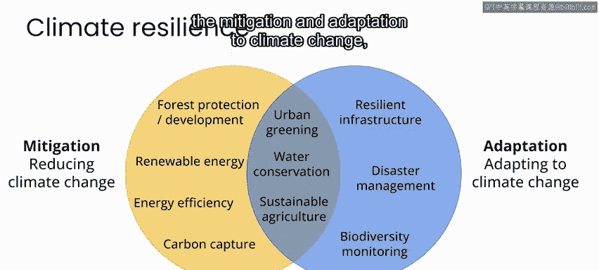
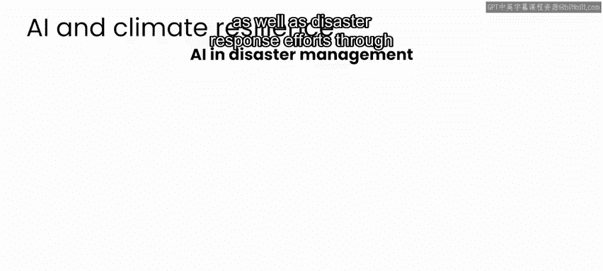
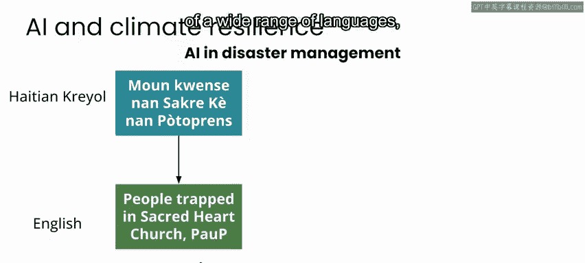
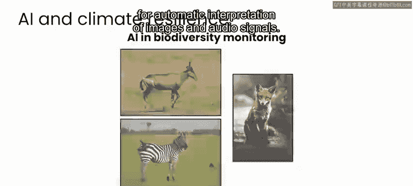
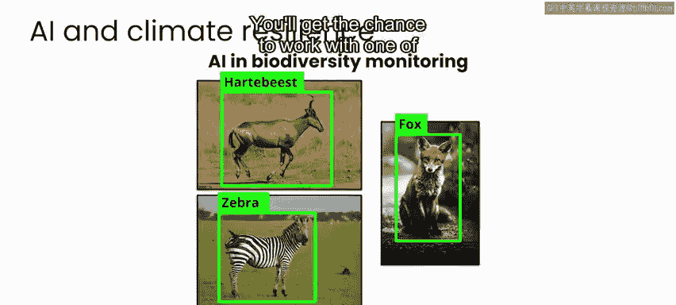
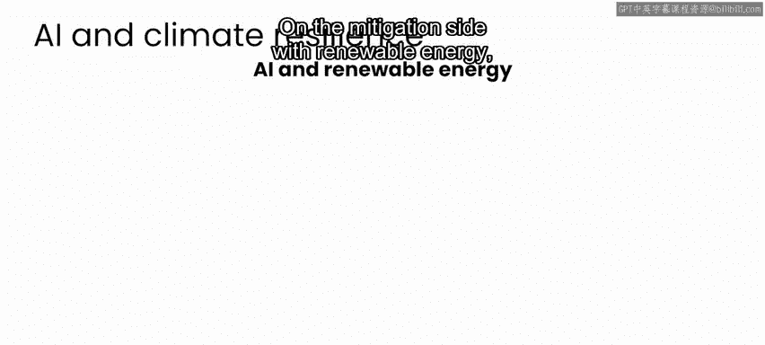
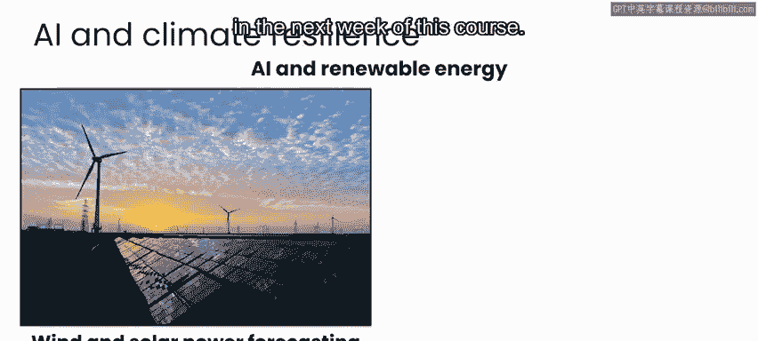

# 043：人工智能与气候变化 🌍

在本节课中，我们将探讨人工智能如何作为应对全球变暖与气候变化复杂解决方案的一部分。我们将了解缓解与适应两大策略，并分析AI在其中可能发挥的具体作用。

***

全球变暖与气候变化带来的问题出现在地方、国家和全球各个层面。任何针对这些问题的解决方案都将是复杂的，并且需要个人、组织和政府之间的协作。与本专业系列第一门课程中介绍的案例研究类似，在应对气候变化问题时，确实存在一些AI可以提供帮助的领域，但在几乎所有情况下，AI都只是更庞大、更复杂解决方案中的一部分。

因此，在本视频中，我们将简要介绍几个AI可以作为气候变化解决方案一部分的示例。

***

## 两大核心策略：缓解与适应 🛡️

首先，在思考应对气候变化的解决方案时，可以将其分为两大类：**缓解**和**适应**。

*   **缓解**：旨在解决问题的根源，主要是减少大气中的温室气体。
*   **适应**：旨在帮助我们更容易地适应并承受气候变化带来的影响。

上一节我们介绍了应对气候变化的两大策略框架，本节中我们来看看这两类策略下的具体措施。

以下是缓解策略的一些关键措施：
*   保护和重新造林：这是目前从大气中去除温室气体的最佳机制。
*   用可再生能源替代化石燃料，并转向更节能的系统：这是减少温室气体排放的最佳途径。
*   新的碳捕获技术：未来可能在从大气中去除温室气体方面发挥作用。

以下是适应策略的一些关键措施：
*   建设更具韧性的基础设施和主动的灾害管理：以承受或更容易从由气候变化引发或加剧的洪水、火灾、风暴或疾病爆发中恢复。
*   生物多样性监测：监测动物种群或植物物种分布等生态系统，以识别趋势并为政策制定提供信息，从而帮助保护这些生态系统免受气候变化影响。

此外，还有一些解决方案兼具缓解和适应的特性：
*   城市绿化：在城市景观中增加植物和树木，有助于降温和净化空气，同时减少大气中的温室气体。
*   水资源保护：有助于减少水资源短缺的影响、保护生态系统，并降低水分配基础设施的碳足迹。
*   投资可持续农业：即使用更少土地、水和能源，最终对环境影响更小的农业。可持续农业有助于减少关键资源的消耗和温室气体排放，同时也在许多情况下使农业实践适应不断变化的气候。

这只是一个不完整的列表。关于缓解和适应气候变化的更多可能方法，请查阅本周课程末尾列出的一些资源。

***

## AI在应对气候变化中的角色 🤖

了解了主要的应对策略后，我们来看看AI如何在这些领域提供助力。在缓解和适应这两个方面，AI都有一系列的应用机会。

以灾害管理为例，AI可以在早期预警系统以及灾害响应工作中发挥关键作用。具体方式包括通过自动翻译和解释多种语言，以及通过分析灾后图像和其他数据进行损害评估和资源分配。

您将在本专业系列的下一门课程中看到这两个应用的具体示例。

在生物多样性监测方面，AI已通过自动解释图像和音频信号，在陆地和海洋的大量应用中得到部署。您将在本课程的后半部分有机会使用其中一个系统。

在缓解方面，对于可再生能源，AI可以在风能和太阳能发电预测中发挥关键作用，使这些可再生资源作为化石燃料的替代品更具价值和可行性。

您将在本课程的下一周进行风力发电预测的实践。

AI还可以帮助规划新的商业太阳能装置，使其生产力最优且影响最小。

以上只是AI作为更广泛的缓解和/或适应气候变化影响解决方案一部分的几个例子。在下一个视频中，您将听到来自微软“AI for Good”实验室的研究科学家Caleb Robinson的分享，他们将使用AI计算机视觉技术分析现有的商业太阳能装置，以识别在大规模安装太阳能时的潜在风险和机遇。

***

## 总结 📝

本节课中，我们一起学习了应对气候变化的两大策略——缓解与适应，并探讨了AI在其中扮演的角色。我们看到，AI可以在灾害预警、生物多样性监测、可再生能源预测与优化等多个具体领域提供技术支持，成为应对这一全球性挑战的复杂解决方案中的重要组成部分。