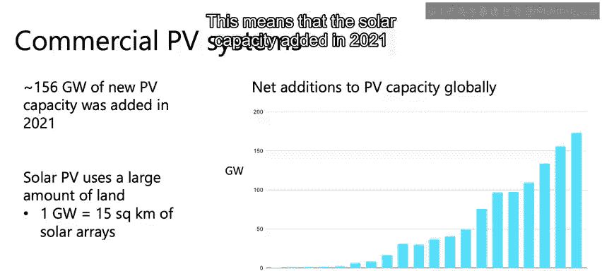
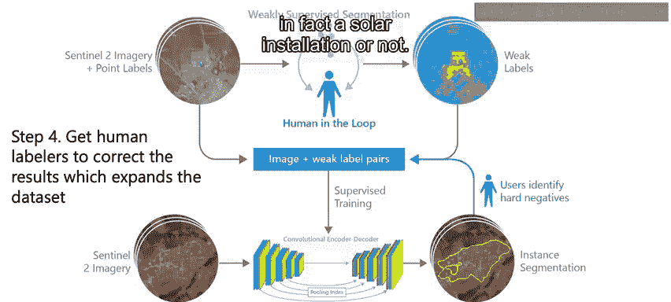
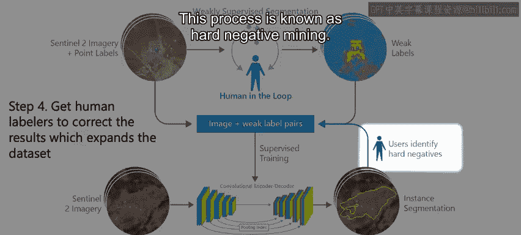
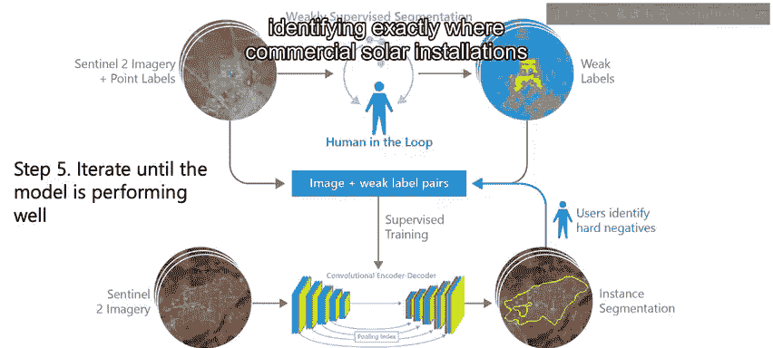
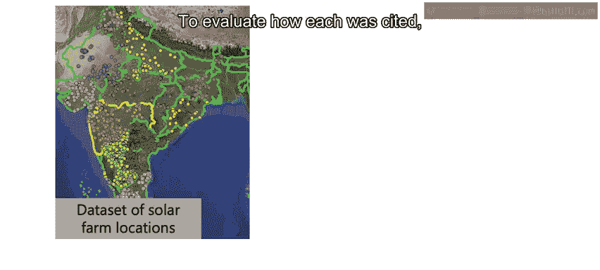

# 044：利用AI与卫星影像识别太阳能板

在本节课中，我们将学习如何利用深度学习与卫星影像技术，识别太阳能光伏（PV）系统的位置，并探讨这一技术对可持续能源规划与生态保护的重要意义。

---

我叫Caleb Robinson，是微软“AI for Good”研究实验室的研究科学家。机器学习与卫星影像技术在全球性问题解决中具有巨大潜力，这令我感到非常兴奋。我将介绍我们利用深度学习方法在卫星影像中识别太阳能板的研究项目，并解释为何这项工作至关重要。

## 🌞 太阳能光伏系统简介

太阳能光伏系统（简称PV系统）利用阳光发电。2019年，这类可再生能源满足了全球约2%的电力需求。它是实现可持续发展目标的关键技术，例如联合国可持续发展目标七——提高可再生能源在能源需求中的占比。

好消息是，太阳能成本低廉，且建设速度正在加快。根据国际能源署的《世界能源展望》报告，在阳光充足的地区，太阳能光伏已成为历史上最便宜的电力来源。因此，太阳能光伏装置正在快速扩张。2021年，全球新增太阳能发电容量约156吉瓦。

然而，太阳能板需要占用土地。以印度最大的太阳能电站为例，建设1吉瓦的太阳能容量大约需要15平方公里的土地。这意味着，仅2021年新增的太阳能容量就占用了约2400平方公里的土地。

## ⚖️ 选址的重要性与挑战

太阳能系统的建设地点至关重要。如果选址不当，可能引发当地社区冲突或破坏现有生态系统。

这是一个平衡问题。一方面，可再生能源对于替代化石燃料、减缓气候变化至关重要。另一方面，必须考虑多种需求。例如，将农田改建为太阳能电站可能影响粮食安全，而砍伐树木为太阳能板腾出空间则会损害生态系统、威胁生物多样性。

理解这一过程的第一步，是确定每个太阳能板当前的位置，以及它在建设时取代了何种土地利用或土地覆盖类型。目前，这类数据并不存在。我们仅有国家层面的太阳能容量汇总估算，而不知道每个具体太阳能农场的位置。

## 🛰️ 卫星影像与人工智能的解决方案

这正是卫星影像与人工智能可以发挥作用的地方。我们可以训练机器学习模型来识别卫星影像中的太阳能光伏装置，然后让这些模型处理覆盖整个国家、跨越不同时间段的影像，从而构建太阳能光伏装置及其建设位置的数据集。

例如，下图展示了在2016年至2020年间，某处农田被改建为大型太阳能电站的卫星影像。

现在的问题是，在初始数据匮乏的情况下，我们如何训练模型来完成这项任务？

## 🔄 “人在回路”与硬负样本挖掘方法

在我们的研究（发表于《自然·科学数据》的《印度太阳能位置的人工智能数据》）中，我们采用了“人在回路”的方法。

以下是具体步骤：

首先，在已知的少量太阳能位置数据集上，由人工生成粗略的标签。

其次，利用这些标签创建初始训练数据，其中卫星影像的每个像素都被标记为“太阳能光伏”或“背景”。

第三步，使用现有数据集训练一个深度学习模型，然后用该模型对大量卫星影像进行预测。

由于初始训练集质量不高，这些预测结果不会很理想。但我们可以再次引入人工标注员，来逐一判断模型的每个预测是否真的是一个太阳能装置，然后将这些新标记的样本添加回我们的数据集中。

这个过程被称为**硬负样本挖掘**。

现在，利用扩展后的数据，我们可以重复前两个步骤，并不断迭代，直到我们的模型能够准确识别卫星影像中商业太阳能装置的位置。

## 📊 研究成果与应用

利用上述方法，我们训练了一个模型，并将其应用于覆盖印度全国的影像，最终构建了一个包含1363个太阳能光伏农场的数据集。这些农场的位置如下图所示，每个彩色点代表一个太阳能农场。

为了评估每个农场的选址情况，我们将太阳能农场位置数据集与土地利用数据相结合。分析发现，印度超过74%的太阳能开发项目，建设在了具有自然生态系统保护价值或农业价值的土地覆盖类型上。

该数据集及其洞察，是自然保护协会为印度开发的“Siterite”工具的关键输入。Siterite帮助政策制定者、开发商和金融机构，通过为新的太阳能和风能项目选择影响更低的选址，来减少意外的社会生态影响及相关风险。

最后，我们正在将始于印度的这项工作扩展到全球。我们开发了一个名为“全球可再生能源观察”的工具，您可以通过访问 `globalrenewswatch.org` 来查看。

---

**总结**：本节课中，我们一起学习了如何结合卫星影像与深度学习技术来识别和定位太阳能光伏装置。我们探讨了可再生能源选址面临的平衡挑战，并介绍了通过“人在回路”和硬负样本挖掘方法构建高质量数据集的过程。最终，这些数据为可持续能源规划提供了关键支持，有助于在推进清洁能源的同时，保护生态环境与社区利益。