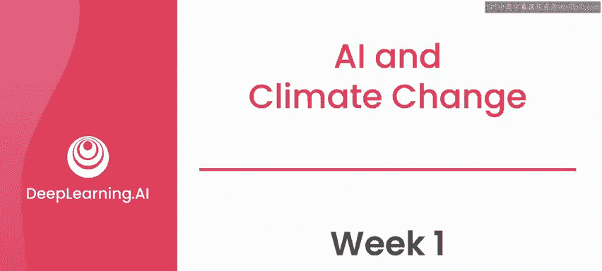
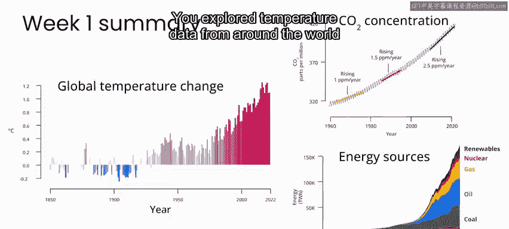
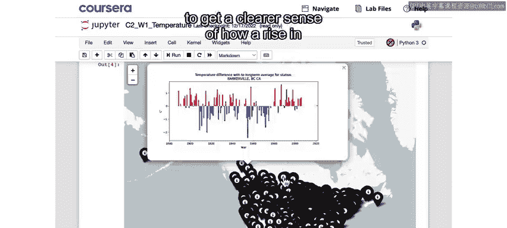
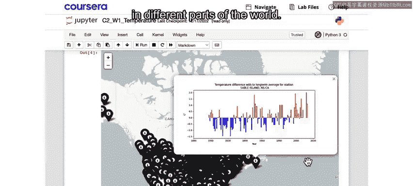
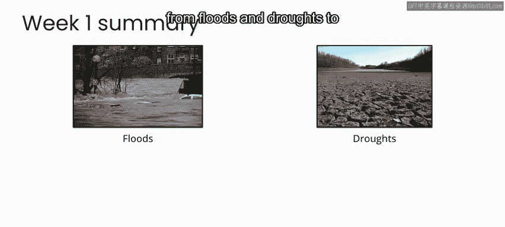
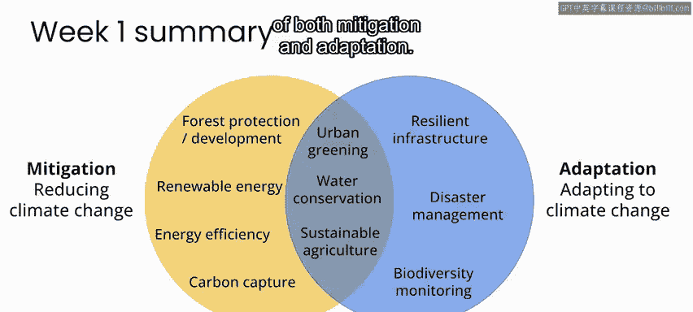
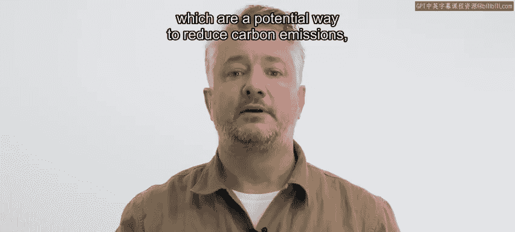
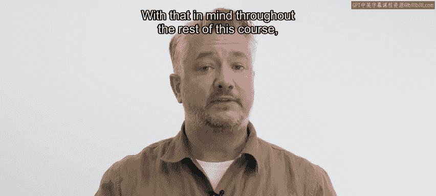

# 045：第1周总结 🌍

在本节课中，我们将回顾第一周的核心内容，包括气候变化的基本原理、其影响、应对措施，以及人工智能在其中的潜在作用。我们将以简洁明了的方式梳理关键概念，帮助初学者建立清晰的理解框架。

## 气候变化概述

气候变化主要由全球变暖驱动，而全球变暖则源于大气中温室气体的增加。温室气体增加的主要原因是化石燃料的燃烧。

**公式**：  
`全球变暖 ∝ 温室气体浓度增加`  
`温室气体增加 ∝ 化石燃料燃烧`

## 全球温度数据分析

上一节我们介绍了气候变化的驱动因素，本节中我们来看看全球温度的具体变化趋势。

通过分析世界各地的温度数据，我们可以更清晰地了解全球平均气温随时间上升的趋势，以及这种趋势在世界不同地区表现出的不同特征。

## 气候变化的影响

以下是气候变化带来的主要影响：

*   洪水与干旱
*   生物多样性丧失
*   疾病传播范围扩大

## 应对气候变化的行动

在了解了气候变化的影响后，我们来看看人类可以采取哪些行动来应对。

为了将全球变暖限制在1.5摄氏度以内，我们需要在2030年前实现每年约300亿吨二氧化碳当量的减排与碳清除总量。并且，我们需要在本世纪末之前实现净负排放。

我们明确了**减缓**和**适应**这两大行动类别，并识别了属于其中一类或同时具备两类特征的具体行动。

## 人工智能的潜在作用

当谈到人工智能如何提供帮助时，我们简要提及了一些示例，例如预测风能、灾害准备与响应以及生物多样性监测。这些只是人工智能可助力气候变化解决方案的部分领域。

在思考减缓与适应气候变化的潜在方法时，必须牢记，即使是潜在的解决方案也可能成为新问题的源头。

例如，正如你在上一个视频中Caleb Robinson的演示中所见，商业太阳能农场是一种潜在的减排方式，但如果其选址未经审慎考虑，也可能导致森林和农田的破坏。

从这个意义上说，你需要在项目的所有阶段始终将“不伤害”原则置于首位，以确保不会给人类或环境制造新的问题。

## 后续课程预告

考虑到这一点，在本课程的剩余部分，你将专注于两个案例研究：一个是风能预测，另一个是生物多样性监测。你在这些案例中将学习的技术并非这些应用所独有，而是可以适配于多种类型的解决方案。

因此，请随我一起进入课程的第二周，深入探讨风能预测。

---

本节课中我们一起学习了气候变化的基础知识、其广泛影响、人类所需的应对行动，并初步探讨了人工智能作为解决方案一部分的潜力。同时，我们强调了在应用技术时遵循“不伤害”原则的重要性。下一周，我们将通过具体案例开始实践之旅。