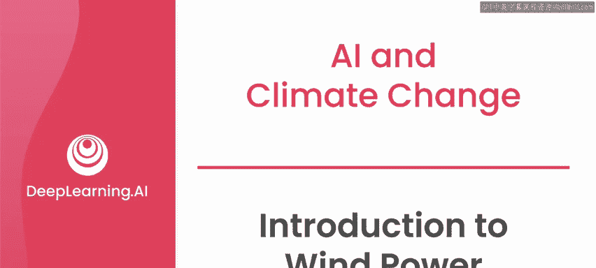
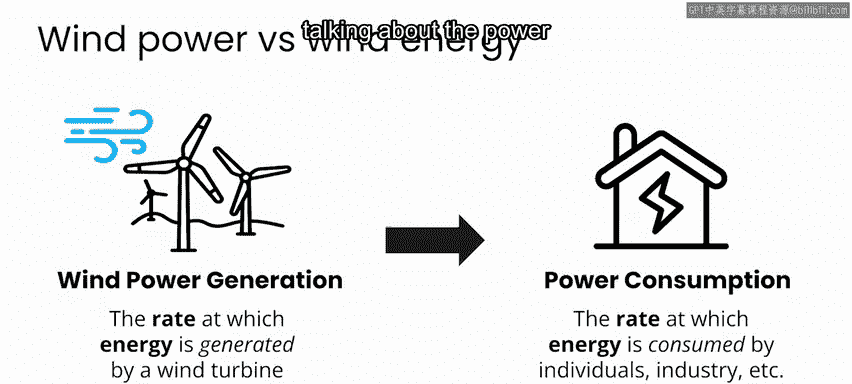
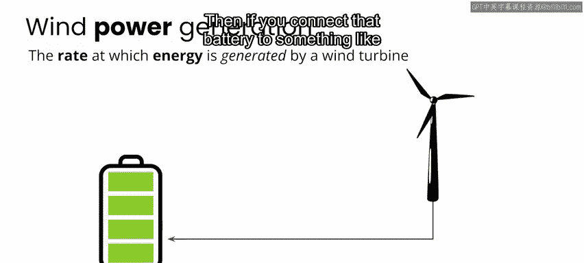
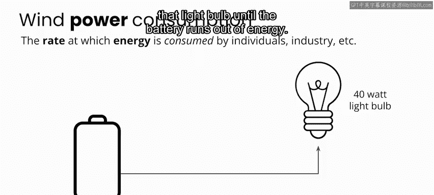
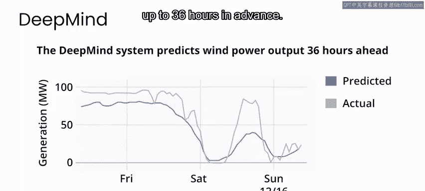
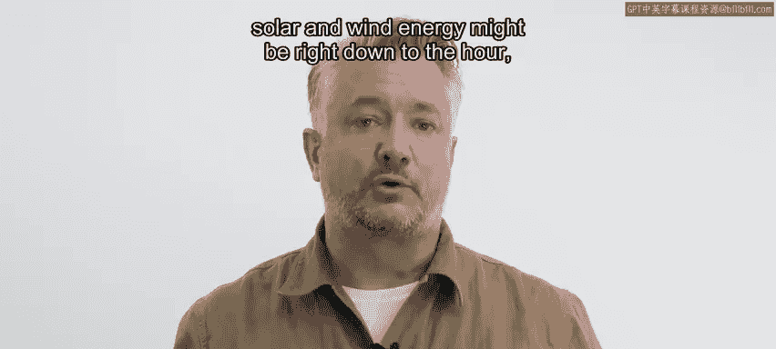
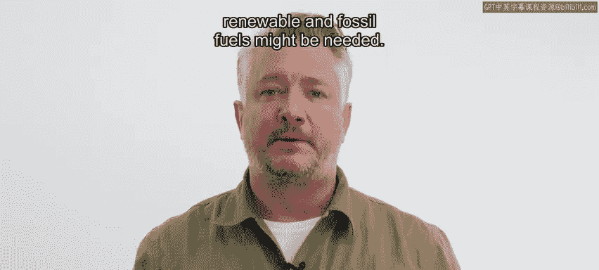
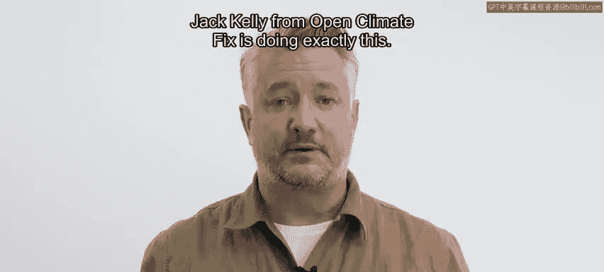
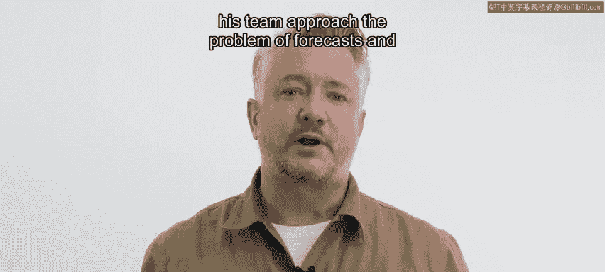
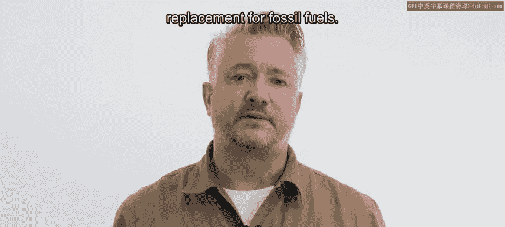

# 046：风力发电简介 🌬️⚡

在本节课中，我们将学习风力发电的基本概念，并探讨人工智能如何帮助预测风力发电量，以应对气候变化挑战。我们将了解风力发电的潜力、面临的独特挑战，以及预测技术对于构建可靠可再生能源电网的重要性。

## 概述：风力发电的潜力与挑战

风力能源作为化石燃料的替代品，具有巨大的潜力。然而，要使风力能源成为一种可靠的替代能源，存在一些独特的挑战。

最大的挑战之一是，预测明天甚至一小时后风力有多强本身就非常困难。此外，即使提前知道风力强度，要准确确定这如何转化为风电场中每台涡轮机的功率输出，也可能很复杂。

在深入探讨之前，需要快速说明一下。你可能已经听到我使用了“风力发电”和“风能”这两个词。在接下来的课程中，你还会听到我在描述这个项目时，从技术角度使用“功率”和“能量”这两个词。这两个词并不等同。

**功率**是能量产生或消耗的速率。能量的物理单位是**焦耳**。功率的单位是**焦耳每秒**，通常也称为**瓦特**。因此，在讨论发电时，你可能会听到千瓦或兆瓦。

为了通过一个简单的例子来理解两者的区别：如果你有一个像风力涡轮机这样的电源，你可以用它给电池充电，而电池可以储存一定量的能量。然后，如果你将电池连接到像灯泡这样的设备上，灯泡以特定的功率水平运行，例如40瓦，那么你的电池就能为灯泡供电，直到电池的能量耗尽。

这听起来可能有点令人困惑，但不必担心。功率和能量之间的区别对于你本周材料的学习并不关键。但对于那些热衷于物理单位术语的人来说，本周你将预测的是**风力发电功率**。不过，在讨论用可再生资源替代化石燃料的更大图景时，你可能会听到我说“风能”。

## 风力预测的重要性

提前一两天预测近期可用的风力发电量，对于使风力成为可靠的能源至关重要。为了向电网上的所有用户提供不间断的电力供应，风力发电必须与其他能源（包括化石燃料）保持平衡。这将确保在任何给定时刻，供应都足以满足需求。

这要求我们不仅要知道风的行为，还要知道在考虑其他气象因素以及风电场中每台涡轮机的具体特性后，这种行为将如何转化为功率输出。

事实上，能够可靠地预测风力发电是一个非常令人兴奋的潜在解决方案，世界各地的AI研究人员和可再生能源公司已经深入研究这个问题一段时间了。最近的一个例子是，谷歌DeepMind的一个团队发表了一篇论文，证明利用天气预报和风电场涡轮机的历史数据，他们能够有效地将风能的价值提高约20%，因为他们可以提前36小时更可靠地预测风电场的功率输出。

2022年，中国最大的可再生能源公司龙源电力集团与中国大型科技公司百度合作，发起了一项竞赛。他们发布了一个数据集，包含中国一个风电场的历史数据，挑战AI社区的个人利用这些数据开发模型来预测风力发电输出。参与原始提交的研究人员有机会赢得35，000美元的奖金。因此，世界各地的团队都参与了这项激动人心的挑战。在本周的实验中，你将使用相同的竞赛数据集来尝试预测风力发电。

## 从太阳能预测看风力预测

在更详细地讨论风力发电之前，我们先简要了解一下太阳能预测。这是我曾经工作过的一个领域，当时的方式非常手动。大约20年前，我为联合国以及在利比里亚和塞拉利昂运营的组织工作，我们主要在学校和卫生诊所安装太阳能系统。那时，我们很难预测能源消耗，因此不得不大量超额配置我们所安装的设备。事实上，我们在电池上的花费比太阳能电池板本身还要多，以确保即使出现连续多日阴天等情况，我们也有足够的发电能力。

令人兴奋的是，现在在预测太阳能和风能方面已经取得了许多进展，甚至可以精确到小时，这可以精确地确定需要何种可再生能源和化石燃料的组合。在下一个重点视频中，来自Open Climate Fix的Jack Kelly正在做这件事。他将谈论他和他的团队如何解决预测太阳能发电输出量的问题，以使太阳能成为更可预测、更有价值的化石燃料替代品。

## 总结

本节课中，我们一起学习了风力发电的基本原理及其在应对气候变化中的重要性。我们探讨了准确预测风力发电量对于电网稳定和整合可再生能源的关键作用，并了解了AI技术在此领域的应用潜力。我们还通过太阳能预测的例子，看到了类似挑战的解决思路。在接下来的课程中，我们将深入分析风力预测的数据集并着手设计解决方案。