# 047：使用机器学习预测太阳能发电 🌞⚡

在本节课中，我们将跟随杰克·凯利（Jack Kelly）了解他如何利用机器学习技术来预测太阳能发电，以及这项工作对于应对气候变化和优化电网运行的重要意义。

## 背景介绍

我是杰克·凯利，是“开放气候修复”（Open Climate Fix）的联合创始人。我是一名机器学习研究员，同时也对气候变化深感忧虑，并致力于为此做出贡献。

我的博士研究方向是电力分解，即尝试为用户提供按电器分类的详细电费账单。例如，用户可能会收到一封邮件，告知他们在冰箱上花费了10英镑电费，在电视上花费了2英镑。这项工作的初衷是希望人们能以更经济理性的方式使用能源。

博士毕业后，我进行了一段短暂的博士后研究，随后加入了谷歌DeepMind团队，从事风电功率预测工作。我非常热爱那份工作。之后，我离开了谷歌DeepMind，并于2019年初共同创立了“开放气候修复”。

## 创立“开放气候修复”的初衷

我们将“开放气候修复”设立为非营利组织，其中一个主要原因是，我们相信有许多人（可能就像正在观看课程的你们一样）热切地希望为解决气候变化贡献力量，但可能因为无法获取合适的数据或不清楚具体该解决哪些问题而受阻。

如果我们能够为这些人扫清障碍，至少能汇集大量的集体智慧和知识，共同致力于解决这些问题。

## 当前工作：太阳能发电临近预报

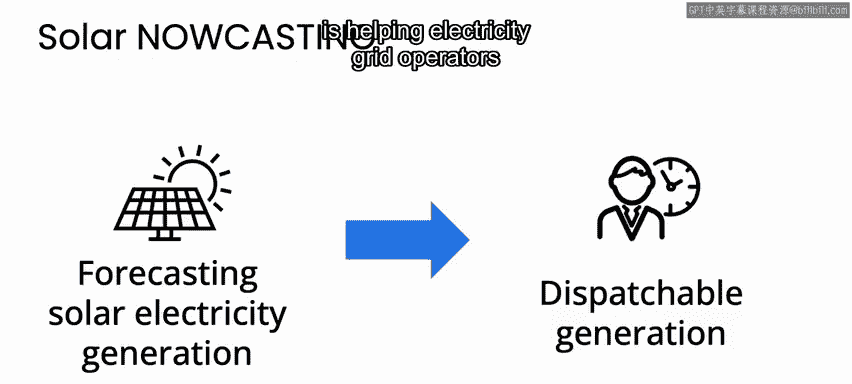

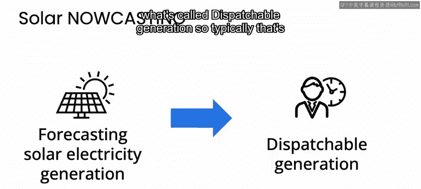

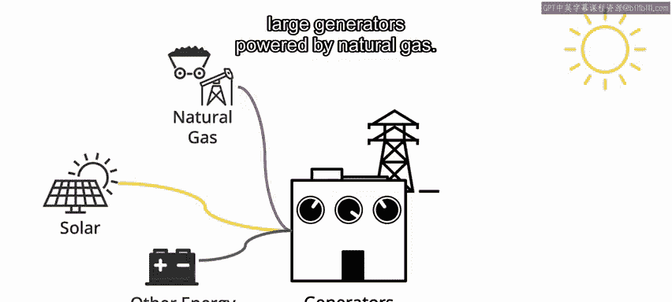

目前，我们专注于太阳能发电的临近预报。这意味着我们试图对未来几小时的太阳能发电量进行预测。

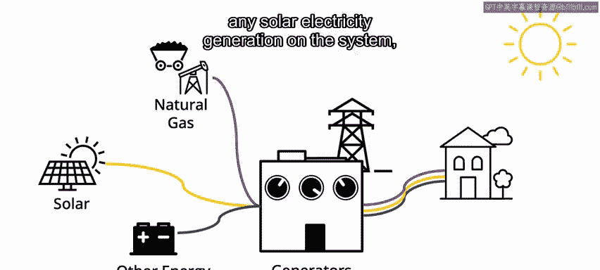

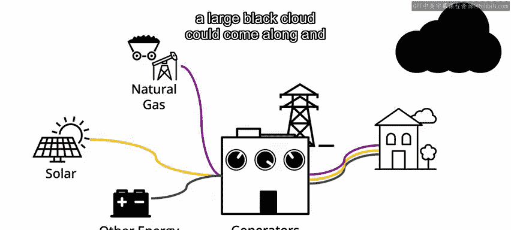

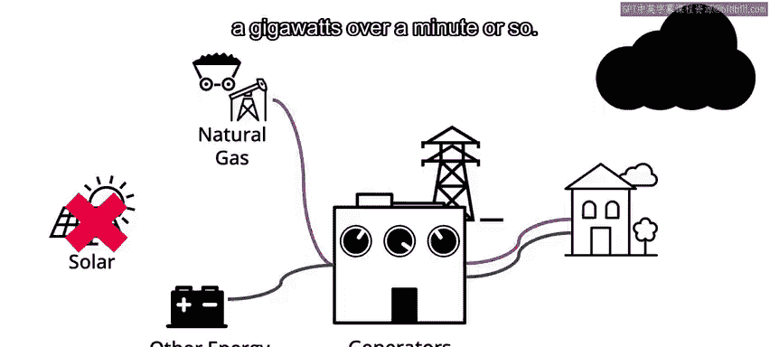

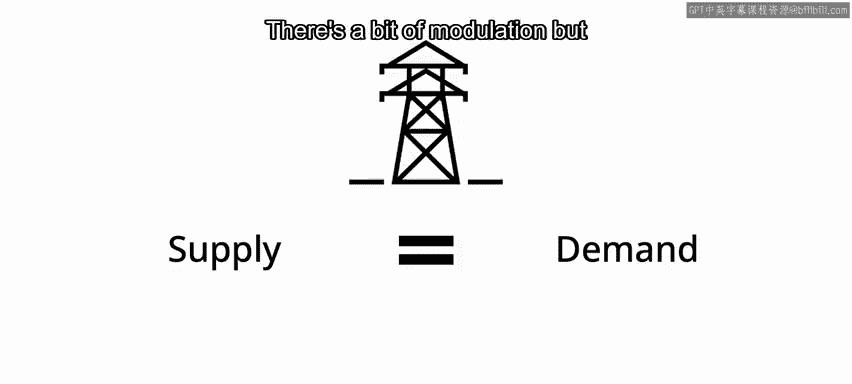

那么，为什么这很重要？为什么人们需要更精确的电力预测？原因有很多，但我们目前最关注的是帮助电网运营商更好地调度所谓的“可调度发电”。

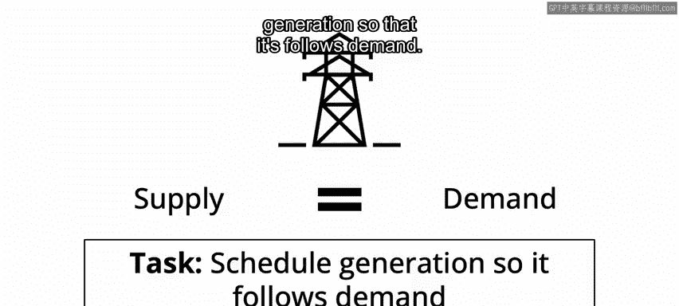

通常，这指的是由天然气驱动的大型发电机组。目前，只要电网中有太阳能发电，负责调度电网的人员就清楚地知道，随时可能有一大片乌云飘过，在短短一分钟左右的时间里导致巨大的发电量（例如千兆瓦级别）消失。

电网的物理特性要求，在任何时刻，电力供应必须与需求精确匹配。我们允许电力需求几乎自由变化（虽然有一些调节机制），因此，任务就是尝试调度发电，使其跟随需求变化。

## 电网调度的挑战与“旋转备用”

然而，许多大型可调度发电机组从冷启动到并网发电需要很长时间，有些甚至需要数小时。因此，当一大片乌云导致大量光伏发电（太阳能发电）突然消失时，你无法临时决定启动那个巨大的发电厂。

相反，你需要让这些大型发电机组保持低功率运行状态，例如以最大输出功率的50%运行。在这种状态下，机组处于热运行状态，控制室有人值守，并且可以在几分钟内快速提升功率。这种状态下的机组统称为“旋转备用”。

顾名思义，这就是与电网同步旋转、随时可以快速增加功率的备用发电能力。但事实证明，这些燃气发电机组在50%功率下运行时，其燃料效率只有满负荷运行时的约一半。

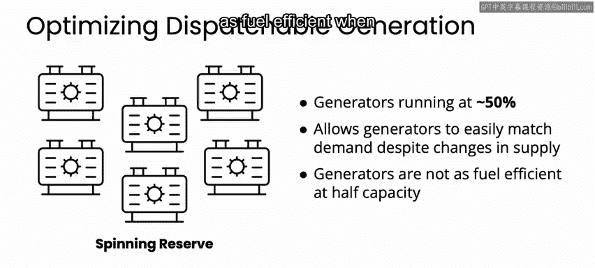

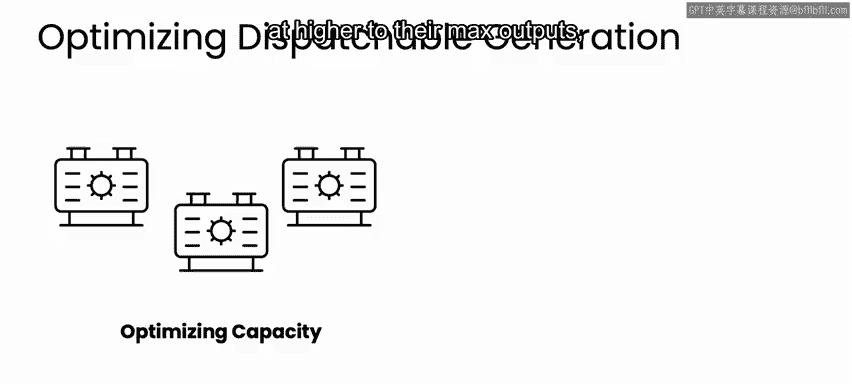

## 精确预测的价值

如果我们有更精确的预测，我们就可以让更少的燃气电厂以更高的负荷率（接近其最大输出）运行，因为我们对未来几小时的太阳能发电情况更有把握。这样，我们就可以优化掉系统中的一些冗余，即那些为旋转备用预留的巨大容量空间。

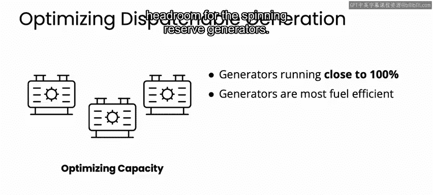

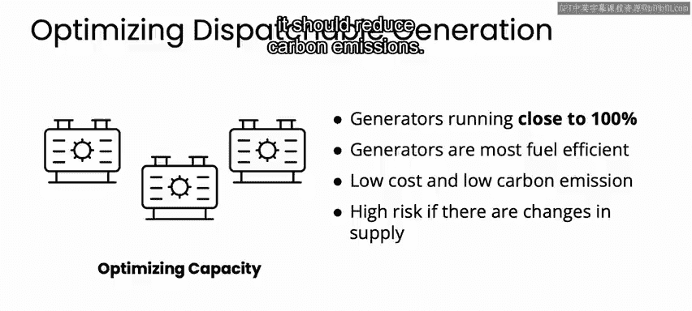

这不仅能降低终端用户的成本（因为平衡电网的成本最终由我们这些能源用户承担），更重要的是，它能减少碳排放。这正是我们专注于太阳能发电预测的核心原因。

## 技术方法：卫星图像与机器学习模型

具体来说，我们使用卫星图像进行预测，每五分钟就能获取一张新的卫星图像。我们正在试验一些相当新的机器学习模型。

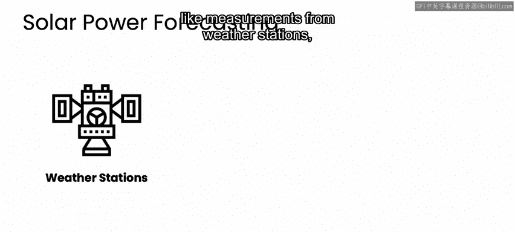

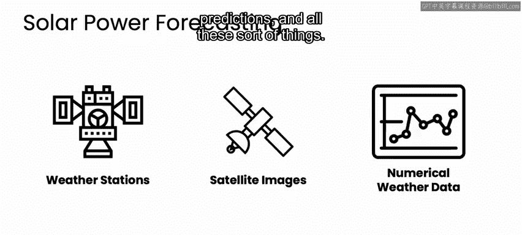

目前，我们正在试验DeepMind于2021年夏末发布的Perceiver IO模型。在Perceiver IO的论文中，他们讨论了结合视频和音频数据并取得优异成果的方法。

在能源预测领域，我们有一个直觉：你仍然希望使用这种多模态的理念。这里的“模态”可以包括气象站的测量数据、卫星图像、数值天气预报等。所有这些都可以被视为对同一物理系统的不同视角。

在人工智能领域，人们长期认为，要创造一个能在现实世界中导航的真正智能体，不能只训练它处理单一模态的数据。它需要能够处理图像、声音、触觉等，这样才能获得对物理世界更深层次的理解。

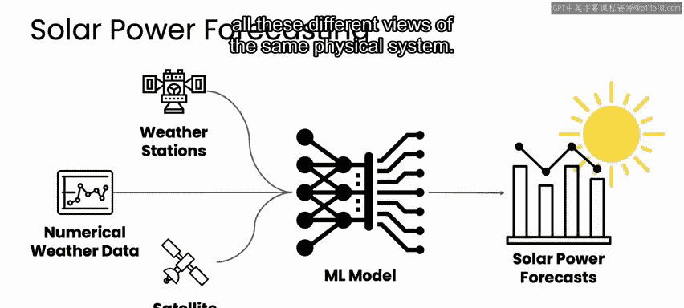

我们推测，能源预测可能也是如此，你可能需要所有这些对同一物理系统的不同视角。因此，我们对Perceiver IO模型感到非常兴奋，也非常感谢DeepMind发表了那篇论文并抽时间与我们交流。

## 开源与合作

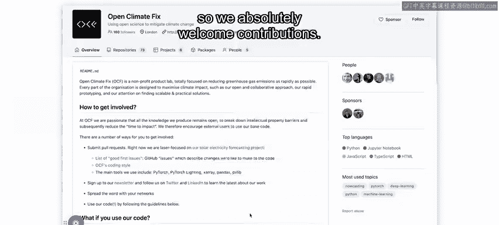

这就是我们正在从事的工作。我们所有的项目都是开源的，代码托管在GitHub上。我们非常欢迎大家的贡献。你只需要访问 `github.com/openclimatefix`（所有字母连在一起）就能找到我们的资料。

最后，我衷心感谢大家学习这门课程，感谢你们花费时间和精力思考如何利用机器学习——虽然听起来有点老套——让世界变得更美好。世界需要更多像你们这样的人。你们正在做的事情让我感到非常兴奋，非常感谢。希望以后能再见，谢谢，再见。