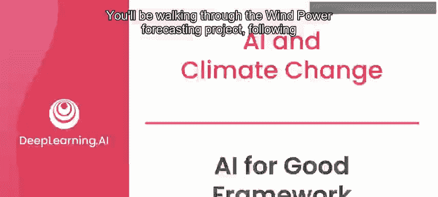
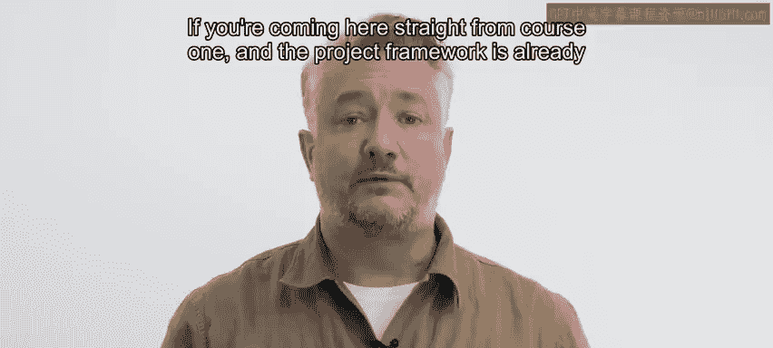
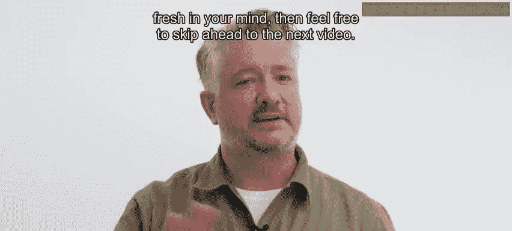
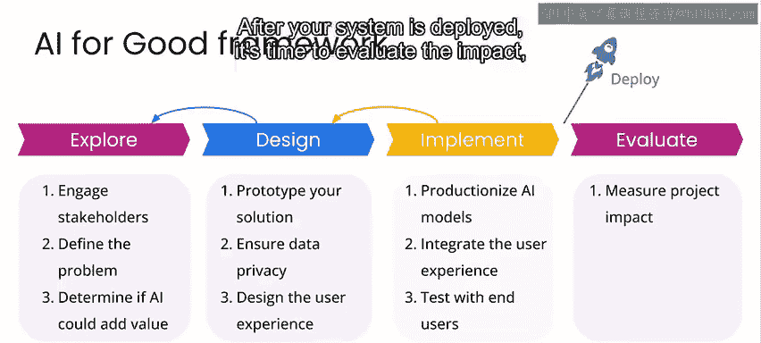

# 048：AI为善框架 🧭

在本节课中，我们将学习AI项目开发的通用框架。该框架包含四个阶段：探索、设计、实现与评估。我们将以风力发电预测项目为例，逐步讲解每个阶段的核心任务与注意事项。

---

## 项目框架概述

在开始具体项目前，我们先回顾本专业课程第一课中介绍的项目框架。该框架将项目开发分为四个阶段：探索、设计、实现与评估。每个阶段都有其特定目标与任务。

以下是框架的四个阶段：

1.  **探索阶段**：联系利益相关者，定义待解决问题，评估可行性，并判断AI是否能为核心解决方案增添价值。
2.  **设计阶段**：构建解决方案原型，制定模型策略，深入调查数据，并思考如何确保数据隐私及用户如何与系统交互。
3.  **实现阶段**：将模型“产品化”，即把测试环境中的设计部署到生产环境，并与用户界面集成，同时测试系统性能与可用性。
4.  **评估阶段**：评估系统影响，沟通研究发现，并决定后续步骤。

这个框架并非严格的线性流程。在后续阶段，你可能会发现需要返回之前的阶段进行迭代优化。

---

## 阶段详解与迭代过程

上一节我们介绍了框架的四个阶段，本节中我们来看看各阶段的具体工作内容以及它们之间如何迭代。

### 探索阶段

探索阶段是项目的起点。在此阶段，你需要与利益相关者沟通，明确要解决的核心问题，并评估使用AI技术的可行性与价值。

### 设计阶段

在确认项目前景后，便进入设计阶段。此阶段的核心是构建解决方案原型并规划技术细节。

以下是设计阶段的主要任务：
*   **原型设计**：创建解决方案的初步模型。
*   **模型策略制定**：规划将使用的AI模型与方法。
*   **数据深度调查**：进一步分析数据的可用性与质量。
*   **隐私与交互设计**：考虑数据隐私保护方案以及系统的用户交互方式。

在设计阶段，你可能会发现探索阶段的一些假设不成立。这时，你需要返回探索阶段，与利益相关者进行更多讨论，或重新定义问题陈述。这个过程是迭代的。

### 实现阶段

设计确定后，进入实现阶段。此阶段的目标是将设计“产品化”，并为部署做好准备。

以下是实现阶段的主要任务：
*   **模型产品化**：将测试环境中的模型部署到生产环境。
*   **系统集成**：将模型与用户界面等其他系统组件集成。
*   **性能与可用性测试**：全面测试系统的表现和用户体验。

在实现过程中，你可能会发现设计的某些部分不可行，需要返回设计阶段进行调整。这也是一个常见的迭代路径。

### 评估与部署阶段

系统实现并满意后，便可部署。部署远不止“按下一个按钮”那么简单，它涉及大量技术细节，但本课程不深入讨论这些。

部署后，便进入评估阶段。你需要评估系统产生的影响，沟通你的发现，并决定下一步行动。

此时，可能有几种常见情况：
*   你可能希望调整实现细节，于是返回**实现阶段**，最终重新发布产品的更新版本。
*   你可能发现设计未能达到预期，于是返回**设计阶段**，重新构思系统的某些组件。
*   你可能决定探索初始问题的新方向，或开始研究一个全新的问题。

实际项目开发过程可能比这个简化的框架图更为复杂。但时刻牢记这个框架，能大大提高项目成功的概率，或至少在你偏离轨道时，帮助你尽快识别问题并回归正轨。

---

## 总结

本节课中，我们一起学习了AI项目开发的四阶段框架：**探索**、**设计**、**实现**与**评估**。我们了解到各阶段的核心任务，并认识到阶段间的迭代是项目成功的常态。在接下来的课程中，我们将以风力发电预测项目为例，正式开始“探索阶段”的实践。