# 049：风力发电探索阶段 🌬️⚡

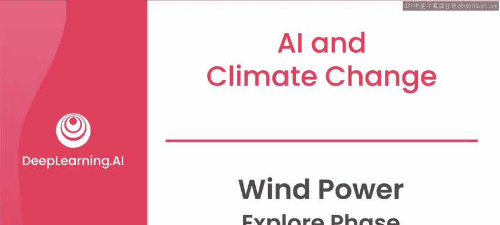

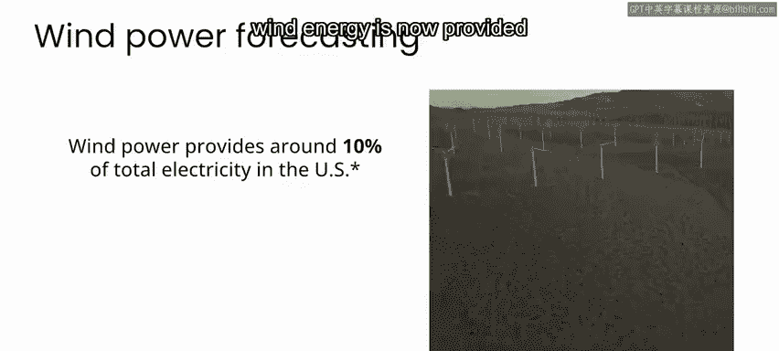

在本节课中，我们将学习风力发电如何融入现代电网，以及为何准确预测其发电量对于替代化石燃料至关重要。我们还将探讨在AI项目中，如何通过“探索阶段”来明确问题、识别关键利益相关者并制定清晰的问题陈述。

---

人类利用风能已有数千年历史，但将风能转化为电能仅有一个多世纪。近几十年来，风力发电已发展到相当规模，如今在许多国家的电网能源构成中占据了重要份额。例如在美国，风能目前提供了约10%的总电力。

然而，与化石燃料不同，我们无法选择在特定日期有多少风力可用。这使得完全用风能替代化石燃料变得困难。不过，我们现在可以利用天气预报和描述单个涡轮机在不同条件下行为的传感器测量数据，来预测可用的风力发电量。我们在这方面做得越好，风能作为化石燃料替代品的可行性就越高。

为了更好理解其工作原理，让我们来看一个简化版的电网如何为一座假设城市供电。

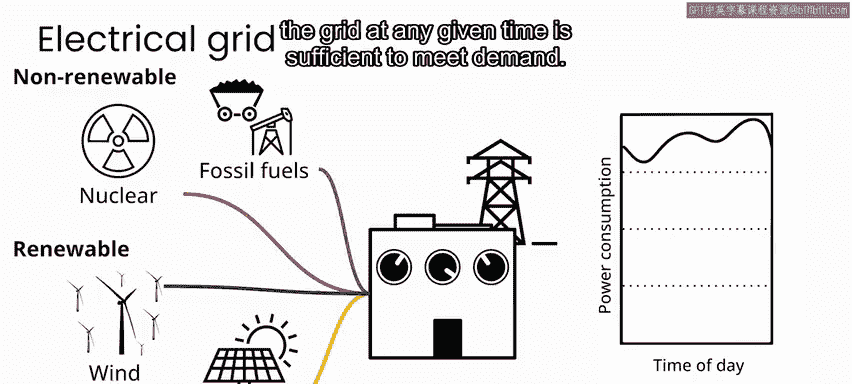

在任何一天，电力需求都会根据人们家中使用的电器种类、所需的供暖或制冷量，以及工业和其他基础设施的用电情况而上下波动。电力公司需要监控这种需求，并准备好根据需要增加或减少电力供应。

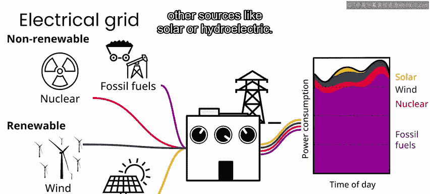

电网运营商实现这一目标的方式，是组合来自不同来源的电力输出。这些来源包括煤炭和天然气等化石燃料，以及核能、风能和太阳能等其他可再生能源。这样，电网在任何时刻提供的总电量都足以满足需求。

如今，大多数电力公司通过化石燃料满足绝大部分需求，核能可能占10%左右，风能可能占另一个10%，太阳能或水力发电等其他来源可能占一小部分。

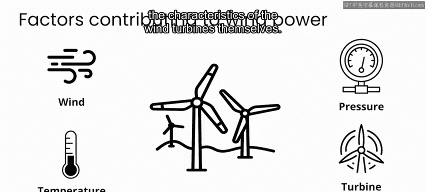

因此，电网上的能源供应组合在一天中不断变化。使可再生能源的预测更加准确，能让电力公司避免过度依赖化石燃料供应。

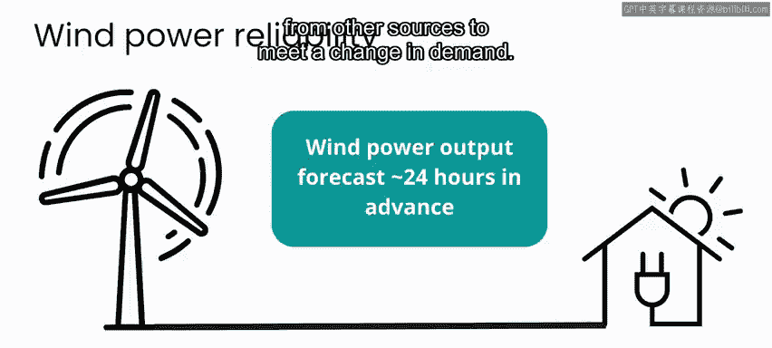

任何时刻可用的风力发电量，很大程度上取决于风力强度，但也取决于大气温度和压力等其他因素，以及风力涡轮机本身的特性。

要使风能被视作可靠的能源，电力公司需要提前许多小时（例如至少提前24小时）知道大约有多少风力发电可用。这样，他们就可以规划来自其他来源的足够输入，以满足需求变化。

这背后的原因是，至少目前，还没有地方可以储存足以供整个城市使用的大规模过剩能源。这意味着发电量需要不断调整以匹配需求。化石燃料和核电站通常需要几个小时才能启动。因此，如果最终可用的风力发电量少于预测，可能会导致电力公司匆忙弥补差额，或被迫让部分用户在一段时间内断电。另一方面，如果发电量超过预测，同样是个问题，因为过剩的能源可能使电网不稳定，而处理掉多余电力并非易事。我甚至见过电网付费请其他电网接收其多余电力的案例。

话虽如此，随着电池技术的改进和规模化，我们可以期待这样一个时代：将风能和太阳能发电场产生的电力储存在大型电池中供日后使用变得更加可行。要了解更多关于可再生能源时代平衡电网挑战的信息，请查看本周课程结束时的资源部分。

现在，让我们回到预测风力发电的问题上。

你现在正处于项目的探索阶段，并开始了解关键利益相关者是谁，例如运营风电场和其他能源生产设施的人员、电力公司的电网运营商，以及天气预报员等。

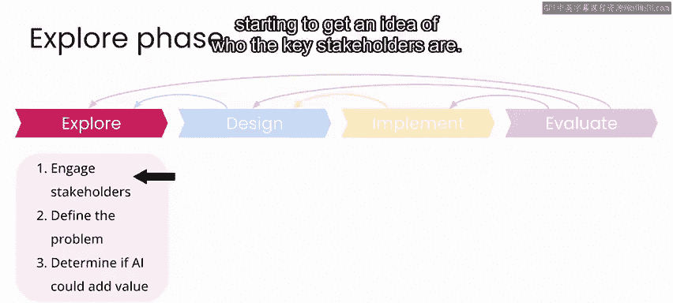

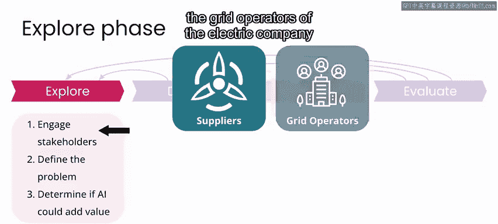

你也开始思考你的问题陈述可能是什么样子。一个好的问题陈述应该清晰、简洁且具体。它应表达你希望解决的实际世界状况或问题，以及涉及的关键人员或群体，但不应涉及你可能用来解决问题的具体技术。

你的问题陈述还应从具体细节上，清晰地说明项目成功的结果会是什么样子。

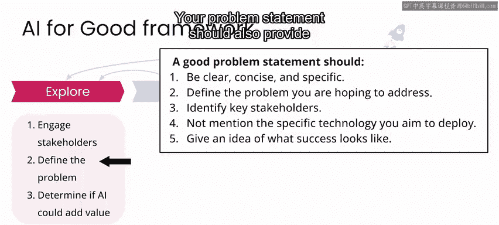

电网运营商需要提前若干小时或数天知道有多少风力发电可用。具体提前多久取决于你正在处理的场景，但在本周的实验中，我们选择提前24小时作为预测所需的时间范围。

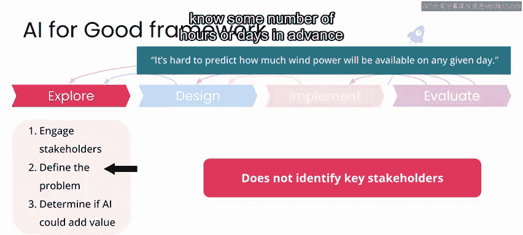

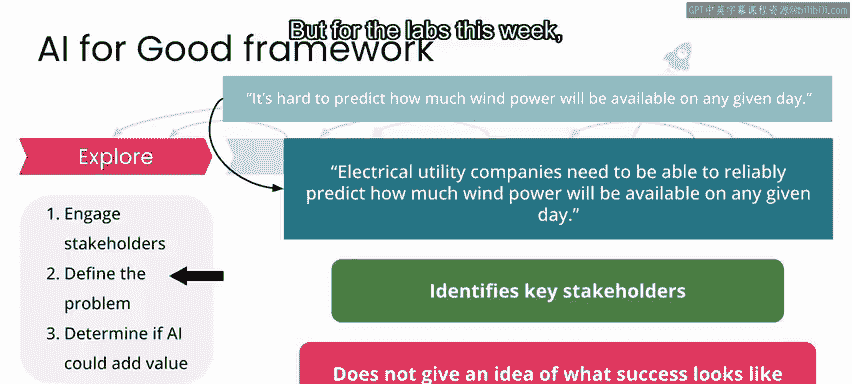

因此，结合你已识别的利益相关者以及目前所知，一个好的问题陈述可能是：**电力公司需要至少提前24小时对风力发电输出进行可靠预测，以便更好地规划电网中其他电力输入源的需求。**

撰写一个好的问题陈述是重要的早期步骤，因为如果你对自己试图解决的问题不够清晰，在项目开发的其余部分很容易偏离轨道。像这样清晰的问题陈述，能让你看到项目成功的结果是什么样子，并帮助你和你的团队专注于为相关利益相关者构建解决此问题的方案。

它还将帮助你在探索阶段的其余部分，识别能够评估你产品影响的其他领域专家。因此，在识别和接触利益相关者以及定义问题陈述的过程中，你已经完成了探索阶段的前两个步骤。

实际上，你无需将这两个步骤视为顺序进行。你可能首先关注可再生能源整体，并了解到风能是化石燃料有前景的替代品。合乎逻辑的下一步可能是联系过去研究过此问题的其他人。

然后，你可能联系了风力涡轮机专家、负责规划电网供应的人员以及专业天气预报员，以了解更多关于这些事物如何运作的信息。通过在探索阶段迭代这两个步骤，你完善了问题陈述，将其带回给相关利益相关者，并确保大家对目标达成一致。

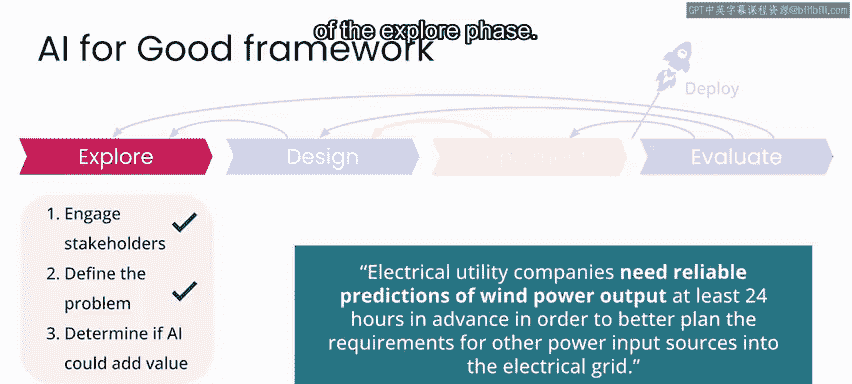

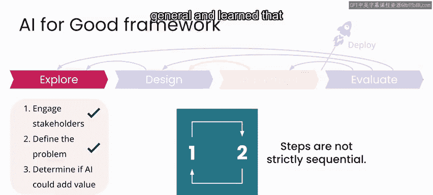

此时，你也将开始确定在项目结束时衡量哪些类型的成功指标是相关的。这些指标将包括你最终证明已成功解决在问题陈述中详述的问题的所有方式，以及这些方式如何与利益相关者相关。

至此，你已经完成了探索阶段的前两个步骤。在下一个视频中，与我一起思考AI是否以及如何能为你的项目增添价值。

---

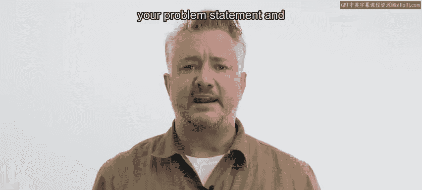

**本节课总结**：我们一起学习了风力发电在现代电网中的作用和挑战，理解了准确预测其发电量的重要性。同时，我们深入探讨了AI项目“探索阶段”的核心任务：识别利益相关者和制定清晰、具体的问题陈述，这是确保项目方向正确并最终成功的关键基础。