# 050：风力发电数据探索 🍃


在本节课中，我们将学习探索阶段的关键一步：如何通过分析现有数据，判断人工智能（AI）是否有助于解决我们关注的问题。我们将以风力发电预测为例，具体演示数据探索的流程。

## 概述：探索阶段的核心任务

探索阶段的最终步骤是确定AI能否帮助你解决希望处理的问题。实际上，在你从利益相关者那里了解更多信息并完善问题陈述的过程中，你应始终思考这一点。与其他现实世界的用例一样，这个过程可能需要数周甚至数月时间。

最终，AI能否作为解决方案的一部分增加价值，很大程度上取决于你能获取何种数据。尽管如此，无论有无数据，都存在许多AI无法增加价值的项目。因此，尽早认识到这一点至关重要，以避免浪费你的时间，更重要的是，避免浪费利益相关者的时间在一个最终不会成功的项目设计上。

## 评估AI的适用性

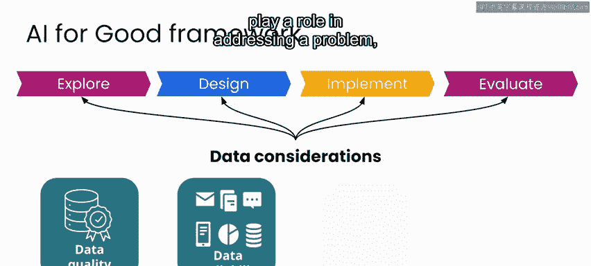

上一节我们介绍了探索阶段的目标，本节中我们来看看如何具体评估AI的潜力。

在风力发电预测的案例中，全球许多团队已经在应用AI并取得了有希望的结果。因此，可以安全地假设这里至少存在一些显著的潜力。在本专业课程的第一门课中你了解到，要让AI在解决问题中发挥作用，你需要能够获取数据。

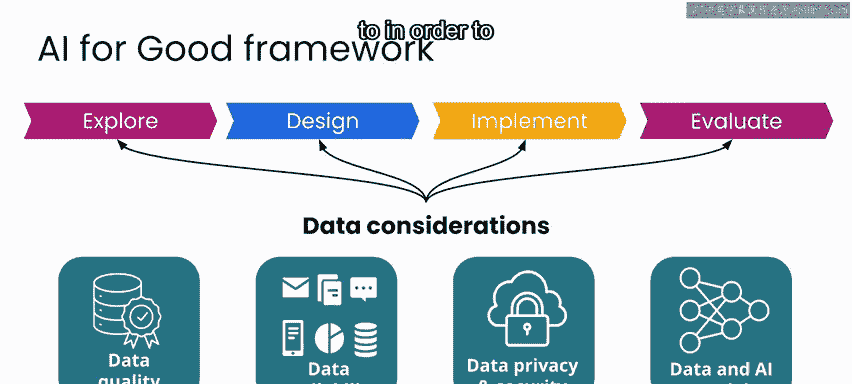

**公式：AI发挥作用的条件**
```
AI发挥作用 = 问题适合 + 数据可用 + 模型有效
```

这些数据将用于开发和测试潜在的模型。因此，无论其他团队是否已成功解决你希望处理的问题，你都需要仔细查看你能获取的数据，以确定是否拥有继续推进所需的资源。

## 风力发电预测的数据构成

以下是风力发电预测数据集可能包含的内容：

*   **历史风速预测记录**：对未来风速的预测数据。
*   **实际记录的风速**：真实测量的风速数据。
*   **其他气象数据**：如温度、气压、湿度等。
*   **风机控制系统传感器测量值**：来自每个风力涡轮机的运行数据。

这些数据将与每个涡轮机在任何给定时间产生的电量相结合，作为本项目的**目标函数**。

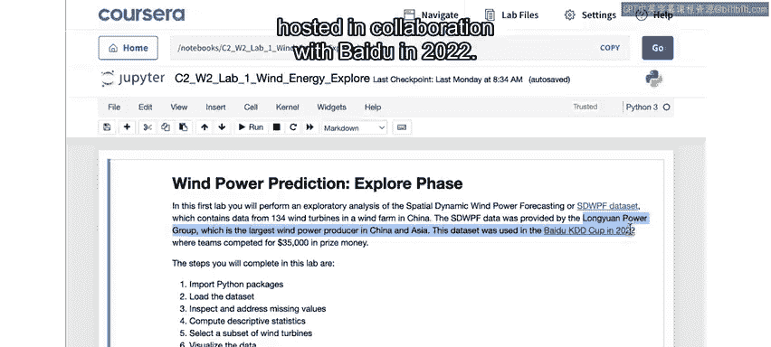

你将使用的竞赛数据集包含了风速、涡轮机控制系统传感器测量值和功率输出的历史数据。让我们进入实验环节，打开Jupyter笔记本来探索你将用于本案例研究的数据。


## 实验：开始探索数据


对于本项目，你将使用的数据被称为“特殊动态风力发电预测数据集”。通过[此链接](链接)，你可以找到详细描述数据集的论文。

数据本身由中国龙源电力集团提供，用于他们与百度在2022年合作举办的KDD Cup挑战赛。你可以通过[此链接](链接)找到关于比赛的更多信息。

### 1. 导入必要的Python包

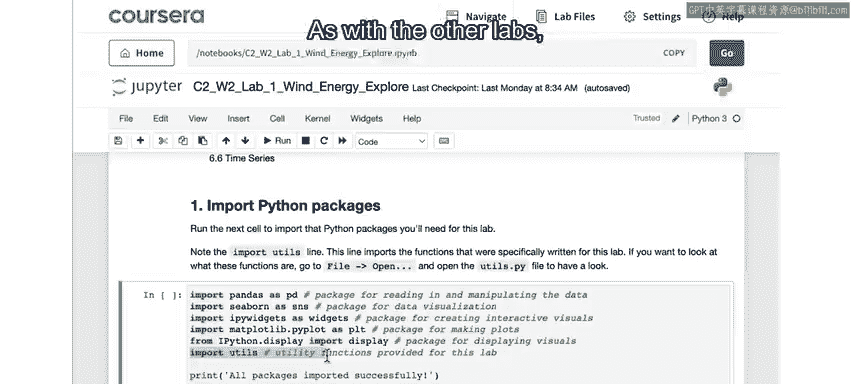

与所有实验一样，本实验的第一步是导入所需的Python包，这正是你在第一个代码单元格中所做的。

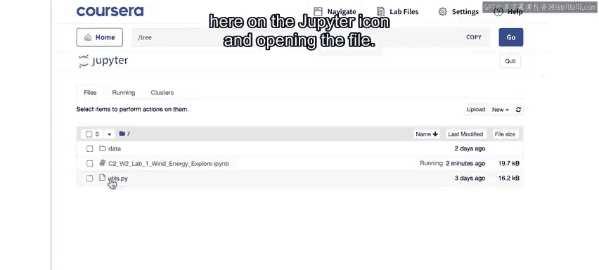

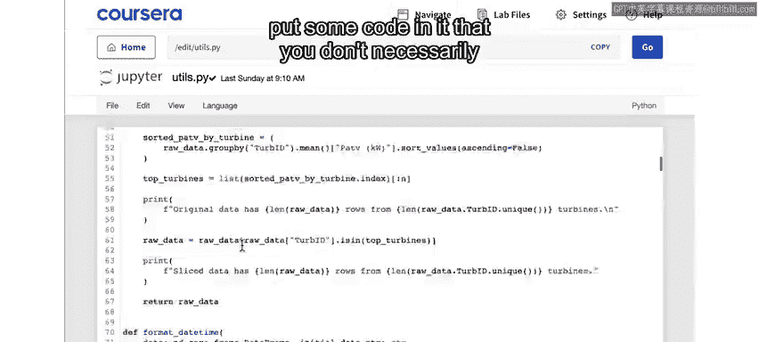

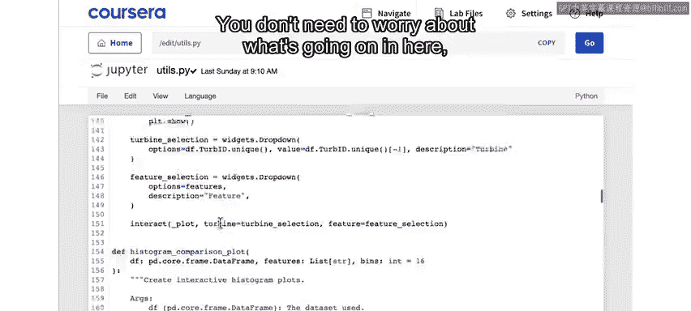

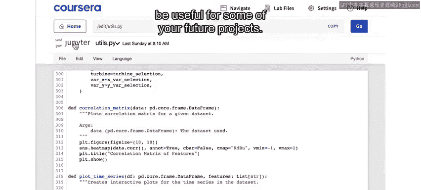

```python
# 示例：导入常用库
import pandas as pd
import numpy as np
import matplotlib.pyplot as plt
import seaborn as sns
```

在这里，你可以看到我们导入了一个名为`utils`的文件，这是我们为你创建的。与其他实验一样，你可以通过点击Jupyter图标并打开该文件来查看其内容。通常，我们在每个实验中都会提供这样的`utils`文件，其中包含一些你不一定需要在笔记本中查看的代码。因此，你无需了解其中的具体内容。但如果你是一名Python程序员，完全可以查看每个实验的`utils`文件，研究幕后运行的代码，你可能会发现一些对未来项目有用的东西。

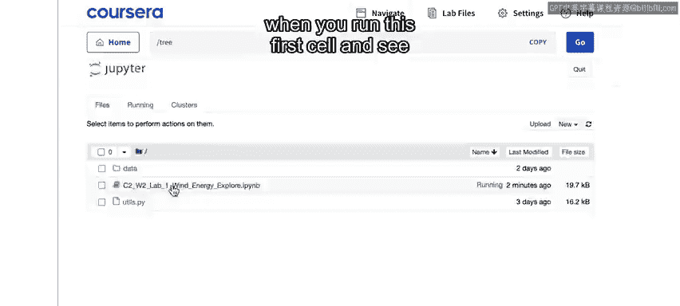

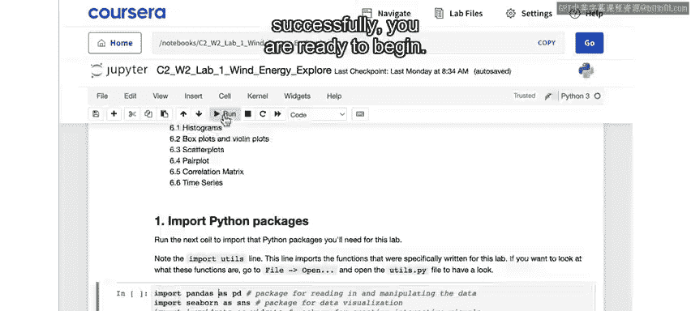

同样，与所有其他实验一样，你可以在此目录中找到数据，以及描述你将使用的数据集性质的数据表。

回到实验中，当你运行第一个单元格并看到所有包成功导入后，就可以开始了。

### 2. 读取并初步查看数据

通过这个Excel单元格，你将读入数据集并打印出该数据的前几行。需要牢记的是，无论你探索什么项目，即使数据是公开的，也并不意味着它一定包含敏感数据或可能被用于造成伤害的信息。

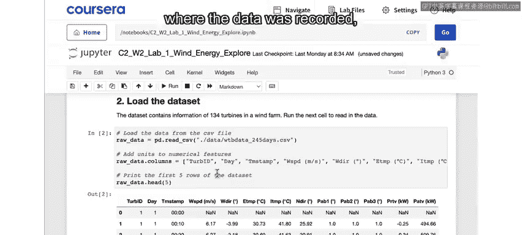

在这个特定案例中，龙源电力集团没有透露记录数据的风电场位置。因此，在某种意义上，泄露专有信息的风险已被最小化。但仍然值得考虑使用任何你正在处理的数据集可能造成的潜在风险。

深入研究数据，你会发现数据集中包含以下列：涡轮机ID、日期编号、风速、风向、一些温度和其他值，以及最后两列的功率输出。

在下方，你可以看到关于数据集中每一列包含内容的更多详细信息。同样，你可以查看[此论文](链接)以获取关于数据的更多细节。

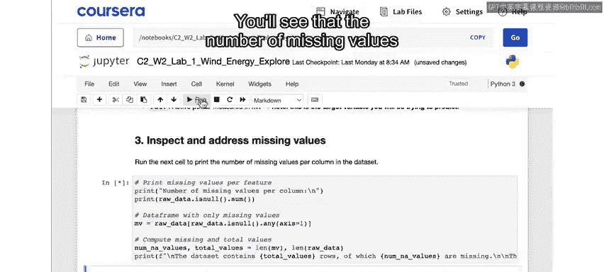

### 3. 处理缺失值

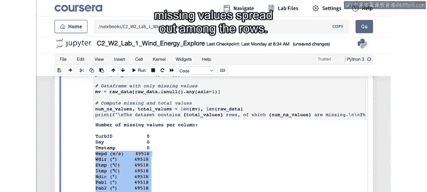

作为下一步，你将打印出数据每一列中缺失值的数量。你会看到所有列的缺失值数量是相同的。

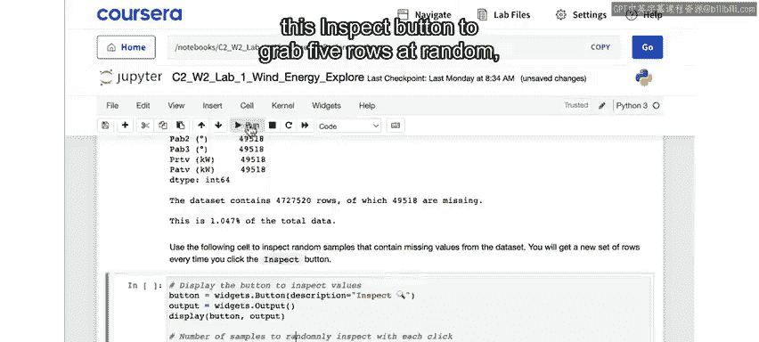

一个合乎逻辑的后续问题是：这表明确实存在整行数据完全缺失，还是缺失值分散在各行中？

通过下一个单元格，你可以使用“检查”按钮随机抓取五个存在缺失值的行。每次点击“检查”，你都会得到一组新的随机行来查看。这是一个非常好的抽查方法，这里的结论是：当一行包含缺失值时，所有值似乎都缺失了。因此，这些看起来是在分析中无用的行。

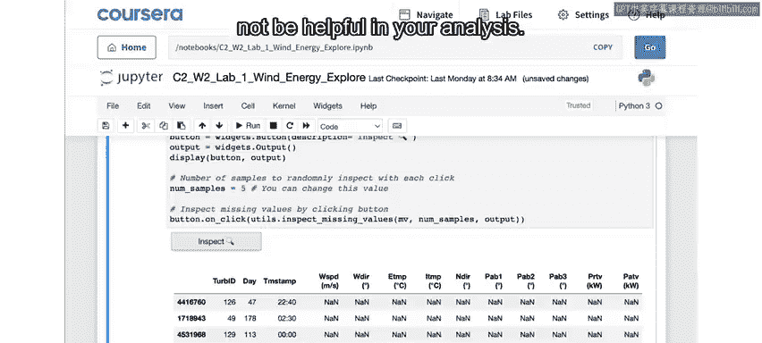

对于构建一个实时运行的应用程序，你需要进一步了解这些缺失值的来源，并开始考虑在设计中对它们进行处理。

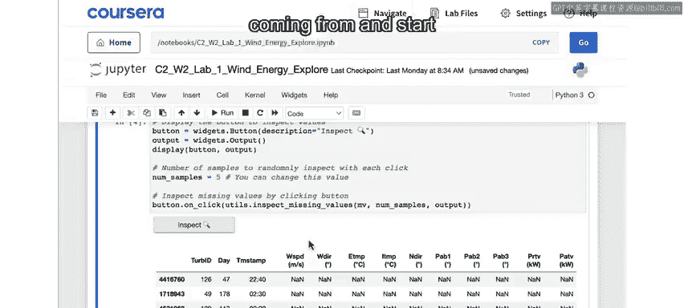

但现在，我们只是注意到缺失的数据行约占总数的1%。因此，在运行下一个单元格时，你将删除所有包含缺失值的行。

你应该能够在这里确认操作成功，再次打印出缺失值的数量，并发现所有列的缺失值都为零。

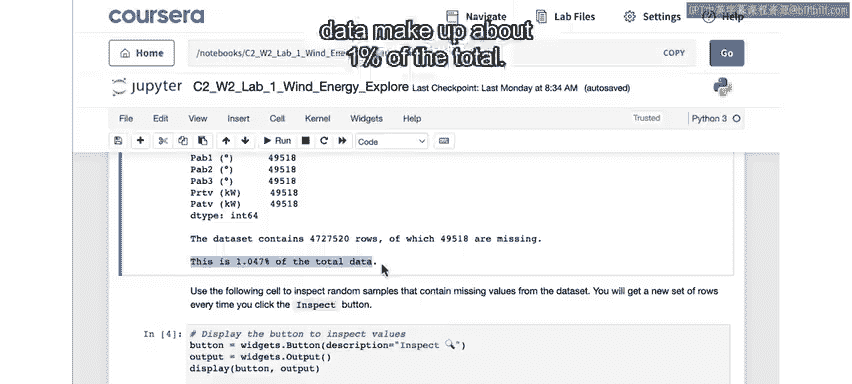

### 4. 计算描述性统计

运行此处的Excel单元格，计算数据集中所有数值列的描述性统计。描述性统计包括最小值、最大值、中位数、四分位数、平均值和标准差等。

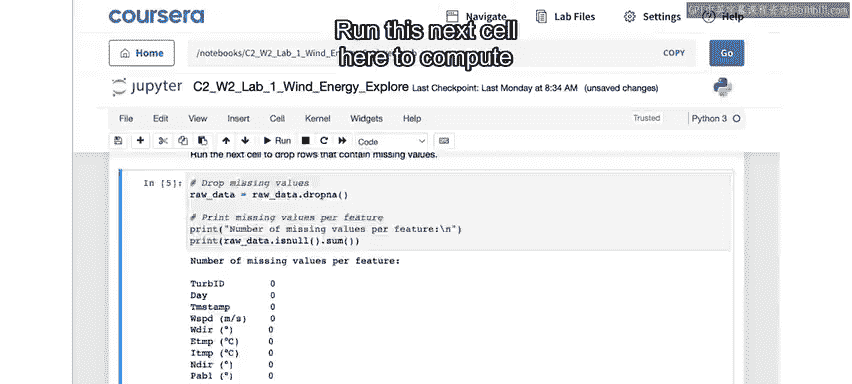

通过查看统计信息，你可以了解数据集的一些特征并寻找异常情况。例如，你可能会想知道为什么记录的最低温度约为零下273度，或者风向的范围为何从负3000到超过2000。我不确定那是什么情况。在某些情况下，这些可能只是你可以安全忽略的值，但为了开发模型，了解数据的特征和任何异常情况非常重要。

### 5. 选择数据子集

该数据集包含134台风力涡轮机的输出信息。如果你正在研究预测整个风电场的输出，你最终需要提出一个包含所有涡轮机的解决方案。

为了在本课程中探索数据，我们将只使用一个数据子集。这里的默认子集是选择功率输出方面表现最好的10台风力涡轮机。当然，你也可以通过更改此数字来选择更多或更少的涡轮机。

至此，你已准备好开始可视化数据。请加入下一个视频，继续完成本实验的其余部分，并可视化你的风力发电预测数据。

## 总结

本节课中我们一起学习了探索阶段的关键步骤：通过分析数据评估AI项目的可行性。我们以风力发电预测为例，具体操作了数据导入、初步检查、缺失值处理、描述性统计计算以及数据子集选择。这个过程帮助我们理解数据特征，为后续的模型开发奠定基础。记住，扎实的数据探索是任何成功AI项目的第一步。